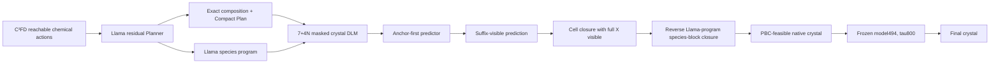

# Scientific Programmed Crystal DLM with Basin Closure

Current execution (2026-09-05): the single active extension is **state-conditioned,
dual-objective programmed paths**. Full MP20 warmup and frozen train-condition
preparation are complete; full-path collection/terminal labeling is in progress.
The path trainer has passed bounded real-model gradient/replay checks, but there
is no post-training SUN result yet. See the [current architecture and execution
record](docs/teacher_feedback_unified_v1/19_RESUMED_ARCHITECTURE_AND_EXECUTION.md).
The completed results below retain their historical model/cohort/protocol labels.

This branch contains the paper mainline for **Scientific Programmed
Anchor–Backfill Denoising (SPAD)** and its evaluated native-stability extension,
**Llama-Programmed Basin Closure**. A C³FD-supported Llama first chooses a
chemically reachable crystal Plan and then programs the denoising order of a
masked crystal language model. The same Plan state controls composition,
special-token placement, periodic feasibility and the final continuous
refinement. The DLM then uses the same species program to revisit the complete
crystal: it closes the lattice with all coordinates visible and closes species
coordinate blocks with the full future retained.

Teacher-feedback scope is explicit: the historical G2 periodic-residual route
is neither a current contribution nor a fallback.  It was replaced by the
coupled Llama-programmed DLM path in this branch.  If energy-shaped backfill is
negative, the fallback is the already demonstrated SPAD system with an open
stability limitation—not a return to G2. The previous instantaneous
Potential-Closure pilot is retained as negative evidence and is not the active
stability objective.

The central question is:

> How can a scientific LLM preserve exact chemistry while programming a
> diffusion language model to realize coupled periodic geometry from both
> earlier and later crystal context?

## One connected generation process



This is not a Planner followed by an unrelated generator. C³FD defines the
reachable action support; Llama selects within that support and emits an exact
permutation of the certified species; that permutation is compiled into
non-contiguous DLM position groups. The DLM can then re-mask an early anchor
while retaining its completed suffix—an operation an autoregressive model
cannot perform without regenerating the suffix.

Every request uses one Plan, one DLM trajectory and one fixed model494
trajectory. There is no retry, replacement, reranking or best-of-N.

The stability path does not introduce an inference-time energy oracle.
Full-MP20 geometry-recovery supervision first trains the exact closure states,
including `L | X`. A train-only headroom study then uses CHGNet
short-relaxation values supervise legal cell/XYZ closure actions offline. At
deployment the DLM emits one native trajectory; model494 is reported separately
as a fixed terminal transition.

## Modules and why each is necessary

### 1. C³FD–Llama scientific Planner

C³FD carries atom-count conservation, typed species/count state and
prefix-dependent chemical reachability. Llama supplies learned residual
preferences over those legal actions and predicts the Compact structural
regime. A Plan-conditioned pointer on the same Llama state emits the species
construction program but cannot change Plan composition.

Evidence:

- C³FD-v2.5 composition validity: `2000/2000`;
- fused C³FD–Llama composition validity: `256/256` prospective and
  `1200/1200` scale;
- Llama pointer validation: `73.50%` exact permutation, `80.41%` root and
  `82.63%` pairwise accuracy, versus `14.48%` canonical exact accuracy;
- on the current fixed ledger, `229/256` programs are noncanonical while Plan
  text and composition remain unchanged.

### 2. Programmed crystal DLM

The DLM realizes one exact `7+4N` body: atom count, six lattice tokens and `N`
element/X/Y/Z site tuples. Its 2,457 dynamic crystal tokens cover MP20 cells
with up to 20 sites. N and element multiplicities are prefilled from the Plan;
the remaining tokens are generated through three crystal-native transactions:

1. resolve the lattice;
2. construct one anchor for each species in Llama-programmed order;
3. complete future sites, then re-mask early anchors with the completed suffix
   still visible.

The checkpoint audit covers every MP20 `27136/9047` train/validation row with
no `7+4N` length clipping. A real-checkpoint intervention changes earlier
anchor X/Y/Z logits when a later Z token changes, directly demonstrating the
future-context channel used by backfill.

### 3. Periodic feasible support and continuous transition

Each candidate site is evaluated as a complete XYZ transaction under the
resolved lattice. Coordinate `0.00/1.00` aliases are aggregated, and a strict
triclinic 125-image minimum-distance calculation excludes sub-0.5 Å periodic
collisions. The frozen model494 transition then moves the complete raw crystal
within the continuous crystal basin at tau800.

The support and transition operate on the same crystal state that Llama
programs and the DLM realizes; they are not post-hoc sample selection.

## Current mechanism result

Raw Direct validity on one fixed 256-Plan, two-stream ledger:

| Arm | Meaning | Composition valid | Joint structure valid |
|---|---|---:|---:|
| B0 | retained exact-plan schedule | 98.05% | 80.27% |
| BC | canonical crystal transaction order | 100.00% | 99.22% |
| BP | Llama-programmed anchor order | 100.00% | 98.05% |
| BR | BP + suffix-visible backfill | 100.00% | 98.83% |
| BS | BR + schedule-matched DLM training | **100.00%** | **99.80% (511/512)** |

B0→BC adds `18.95` percentage points of raw joint validity. BC and BP retain
identical lattices for all 512 stream rows, isolating species order. The final
BS endpoint restores essentially complete raw execution while retaining the
learned Llama program and DLM-specific suffix revision.

Fresh prospective official results on the same fixed 256 requests and two
streams are:

| Arm | Endpoint | Direct | Strict S.U.N. | Meta S.U.N. |
|---|---|---:|---:|---:|
| B0 | refined | 508/512 | 38/512 (7.42%) | 245/512 (47.85%) |
| BC | refined | 512/512 | 33/512 (6.45%) | 238/512 (46.48%) |
| BS | raw | 504/512 | 16/512 (3.12%) | 107/512 (20.90%) |
| BS | refined | **512/512** | 35/512 (6.84%) | 234/512 (45.70%) |

SPAD therefore delivers essentially complete structural execution, while the
terminal stability targets remain open. A fixed model494-response development
follow-up retained 512/512 reconstructed outputs and moved refined Strict/Meta
S.U.N. to 36/512 (7.03%) and 237/512 (46.29%). Its paired refined CHGNet shift
was -0.00657 eV/atom, but NU fell from 441 to 437; the small gain is not enough.

The diagnosis is that high Direct validity does not imply physical
stationarity. Generated structures remain far above MP20 references in force,
stress and short-distance tails, including under same-composition teacher
Plans. The basin-posterior experiment therefore trains the non-causal closure
action itself rather than adding a test-time oracle. Full Direct remains
`DEFERRED_COST`; raw and common-relaxation stability are the primary endpoints.

### Native basin-closure result

The Llama-programmed closure now has a fixed prospective stream-17 result with
no Direct rerun, inference-time energy model, sample selection or model494:

| Endpoint | Composition | Fast structure | Strict S.U.N. | Meta S.U.N. |
|---|---:|---:|---:|---:|
| frozen BS raw | 256/256 | 255/256 | 7/256 (2.73%) | 54/256 (21.09%) |
| basin-closure CE raw | **256/256** | **256/256** | 7/256 (2.73%) | **56/256 (21.88%)** |

The mechanism changes the physical distribution substantially: before common
relaxation, paired CHGNet energy improves by median `-0.3244 eV/atom` with a
composition-cluster 95% interval `[-1.4508,-0.0956]`; after the frozen common
relaxation, the paired hull/energy shift remains `-0.02274 eV/atom` and favors
closure on 139 of 248 hull-known pairs. Structural validity is preserved, but
the strict/meta threshold counts move only `0/+2`. This identified the next
problem: convert an already learned low-energy direction into probability mass
at the stable tail. The completed K10 transaction-posterior experiment below
tests that hypothesis directly.

### Final K10 transaction-posterior result

The frozen train-only teacher contains 4,104 deployment-matched closure states
and 15,348 candidate transactions. Among them, 3,889 state exposures are
informative; median best-versus-no-op K10 headroom is 143.93 meV/atom. The DLM
was trained for one complete pass and one preregistered warm-start pass, each
interleaved with clean MP20 closure supervision. Only terminal checkpoints were
published.

Two independent prospective streams were evaluated without Direct, retries,
replacement, reranking or inference-time CHGNet:

| Stream / policy | Endpoint | Reconstructed | Novel-unique | Strict S.U.N. | Meta S.U.N. |
|---|---|---:|---:|---:|---:|
| stream19 / first pass | raw | 256/256 | 256/256 | 12/256 (4.69%) | 61/256 (23.83%) |
| stream19 / first pass | tau800 | 256/256 | 229/256 | 14/256 (5.47%) | 107/256 (41.80%) |
| stream21 / second pass | raw | 256/256 | 254/256 | 5/256 (1.95%) | 49/256 (19.14%) |
| stream21 / second pass | tau800 | 256/256 | 230/256 | 14/256 (5.47%) | 123/256 (48.05%) |

Stream21 uses fresh official MP thermodynamics for 252/256 rows; the four
explicit unknowns count as non-stable. The second pass preserves complete
execution and raises refined Meta S.U.N. relative to stream19, but it does not
improve Strict S.U.N. and its raw stability is worse. The registered 26/128
success target and 23/125 paper-scale launch gate are therefore not met, so no
paper1000 run or further method iteration is selected. The supported conclusion
is precise: SPAD closes discrete chemical and geometric execution, while local
K10 transaction-posterior supervision is not sufficient to make the native DLM
sample the strict low-energy tail reliably.

The active next-cycle implementation is
[PMTR](docs/teacher_feedback_unified_v1/15_PMTR_SCIENTIFIC_METHOD_AND_EXECUTION.md):
a reward-free, MLIP-free-at-inference manifold-to-token repair mechanism for
the existing Llama-programmed SPAD closure. The earlier PCTP terminal-reward
proposal is explicitly superseded and will not be implemented.

## Reproduce and inspect

The current method, next-cycle design, ablations and run ledger are documented here:

1. [PMTR scientific method and execution plan](docs/teacher_feedback_unified_v1/15_PMTR_SCIENTIFIC_METHOD_AND_EXECUTION.md)
2. [PMTR code-grounded architecture audit](docs/teacher_feedback_unified_v1/16_PMTR_CODE_GROUNDED_ARCHITECTURE_AUDIT.md)
3. [Superseded PCTP reward design](docs/teacher_feedback_unified_v1/14_PCTP_SCIENTIFIC_ALIGNMENT_AND_EXECUTION.md)
4. [Active basin-closure design](docs/teacher_feedback_unified_v1/12_LLAMA_PROGRAMMED_BASIN_CLOSURE.md)
5. [Unified SPAD method](docs/teacher_feedback_unified_v1/00_UNIFIED_METHOD_PLAN.md)
6. [Pure-Llama Route A](docs/teacher_feedback_unified_v1/01_TRACK_A_PURE_LLM.md)
7. [Llama-programmed DLM Route B](docs/teacher_feedback_unified_v1/02_TRACK_B_LLM_GUIDED_DLM.md)
8. [Cross-representation contract](docs/teacher_feedback_unified_v1/03_CROSS_REPRESENTATION_AND_DIFFUSION.md)
9. [Active execution checklist](docs/teacher_feedback_unified_v1/04_EXECUTION_CHECKLIST.md)
10. [Decision log](docs/teacher_feedback_unified_v1/05_DECISION_LOG.md)
11. [Implementation audit](docs/teacher_feedback_unified_v1/06_MODULE_AUDIT_AND_B_FIRST_PIVOT.md)

Portable read-only checks remain available:

```bash
PYTHONPATH=src python -m crystal_dlm.paper_pipeline validate
PYTHONPATH=src python -m crystal_dlm.paper_pipeline show
```

Route A remains the pure-LLM comparison. Route B is the paper-priority method
because arbitrary-position prediction and suffix-preserving revision expose a
capability specific to diffusion language modeling.
