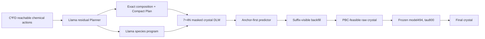

# Scientific Programmed Crystal Diffusion Language Model

This branch contains the paper mainline for **Scientific Programmed
Anchor–Backfill Denoising (SPAD)**: a C³FD-supported Llama first chooses a
chemically reachable crystal Plan and then programs the denoising order of a
masked crystal language model. The same Plan state controls composition,
special-token placement, periodic feasibility and the final continuous
refinement.

Teacher-feedback scope is explicit: the historical G2 periodic-residual route
is neither a current contribution nor a fallback.  It was replaced by the
coupled Llama-programmed DLM path in this branch.  If energy-shaped backfill is
negative, the fallback is the already demonstrated SPAD system with an open
stability limitation—not a return to G2.

The central question is:

> How can a scientific LLM preserve exact chemistry while programming a
> diffusion language model to realize coupled periodic geometry from both
> earlier and later crystal context?

## One connected generation process



This is not a Planner followed by an unrelated generator. C³FD defines the
reachable action support; Llama selects within that support and emits an exact
permutation of the certified species; that permutation is compiled into
non-contiguous DLM position groups. The DLM can then re-mask an early anchor
while retaining its completed suffix—an operation an autoregressive model
cannot perform without regenerating the suffix.

Every request uses one Plan, one DLM trajectory and one fixed model494
trajectory. There is no retry, replacement, reranking or best-of-N.

The accepted SPAD-E training extension does not introduce an inference-time
energy oracle.  On MP20-train only, model494/CHGNet label four legal actions at
one Llama-programmed suffix-visible backfill state.  At deployment, the DLM
first completes the future canvas, then re-masks and rewrites the earlier XYZ
from its learned parameters; model494 runs once only after discrete generation
is complete.

## Modules and why each is necessary

### 1. C³FD–Llama scientific Planner

C³FD carries atom-count conservation, typed species/count state and
prefix-dependent chemical reachability. Llama supplies learned residual
preferences over those legal actions and predicts the Compact structural
regime. A Plan-conditioned pointer on the same Llama state emits the species
construction program but cannot change Plan composition.

Evidence:

- C³FD-v2.5 composition validity: `2000/2000`;
- fused C³FD–Llama composition validity: `256/256` prospective and
  `1200/1200` scale;
- Llama pointer validation: `73.50%` exact permutation, `80.41%` root and
  `82.63%` pairwise accuracy, versus `14.48%` canonical exact accuracy;
- on the current fixed ledger, `229/256` programs are noncanonical while Plan
  text and composition remain unchanged.

### 2. Programmed crystal DLM

The DLM realizes one exact `7+4N` body: atom count, six lattice tokens and `N`
element/X/Y/Z site tuples. Its 2,457 dynamic crystal tokens cover MP20 cells
with up to 20 sites. N and element multiplicities are prefilled from the Plan;
the remaining tokens are generated through three crystal-native transactions:

1. resolve the lattice;
2. construct one anchor for each species in Llama-programmed order;
3. complete future sites, then re-mask early anchors with the completed suffix
   still visible.

The checkpoint audit covers every MP20 `27136/9047` train/validation row with
no `7+4N` length clipping. A real-checkpoint intervention changes earlier
anchor X/Y/Z logits when a later Z token changes, directly demonstrating the
future-context channel used by backfill.

### 3. Periodic feasible support and continuous transition

Each candidate site is evaluated as a complete XYZ transaction under the
resolved lattice. Coordinate `0.00/1.00` aliases are aggregated, and a strict
triclinic 125-image minimum-distance calculation excludes sub-0.5 Å periodic
collisions. The frozen model494 transition then moves the complete raw crystal
within the continuous crystal basin at tau800.

The support and transition operate on the same crystal state that Llama
programs and the DLM realizes; they are not post-hoc sample selection.

## Current mechanism result

Raw Direct validity on one fixed 256-Plan, two-stream ledger:

| Arm | Meaning | Composition valid | Joint structure valid |
|---|---|---:|---:|
| B0 | retained exact-plan schedule | 98.05% | 80.27% |
| BC | canonical crystal transaction order | 100.00% | 99.22% |
| BP | Llama-programmed anchor order | 100.00% | 98.05% |
| BR | BP + suffix-visible backfill | 100.00% | 98.83% |
| BS | BR + schedule-matched DLM training | **100.00%** | **99.80% (511/512)** |

B0→BC adds `18.95` percentage points of raw joint validity. BC and BP retain
identical lattices for all 512 stream rows, isolating species order. The final
BS endpoint restores essentially complete raw execution while retaining the
learned Llama program and DLM-specific suffix revision.

Fresh prospective official results on the same fixed 256 requests and two
streams are:

| Arm | Endpoint | Direct | Strict S.U.N. | Meta S.U.N. |
|---|---|---:|---:|---:|
| B0 | refined | 508/512 | 38/512 (7.42%) | 245/512 (47.85%) |
| BC | refined | 512/512 | 33/512 (6.45%) | 238/512 (46.48%) |
| BS | raw | 504/512 | 16/512 (3.12%) | 107/512 (20.90%) |
| BS | refined | **512/512** | 35/512 (6.84%) | 234/512 (45.70%) |

SPAD therefore delivers essentially complete structural execution, while the
terminal stability targets remain open. A fixed model494-response development
follow-up retained 512/512 reconstructed outputs and moved refined Strict/Meta
S.U.N. to 36/512 (7.03%) and 237/512 (46.29%). Its paired refined CHGNet shift
was -0.00657 eV/atom, but NU fell from 441 to 437; the small gain is not enough.

The active SPAD-E training path treats validity lexicographically and learns
terminal preference only among legal suffix-visible XYZ actions. Its 2,048
MP20-train groups are frozen and the four-A800 teacher run is active. Full
Direct remains `DEFERRED_COST`; the initial screen uses complete accounting,
fast validity, CHGNet and reused development phase diagrams.

## Reproduce and inspect

The current method, ablations and run ledger are documented here:

1. [Unified SPAD method](docs/teacher_feedback_unified_v1/00_UNIFIED_METHOD_PLAN.md)
2. [Pure-Llama Route A](docs/teacher_feedback_unified_v1/01_TRACK_A_PURE_LLM.md)
3. [Llama-programmed DLM Route B](docs/teacher_feedback_unified_v1/02_TRACK_B_LLM_GUIDED_DLM.md)
4. [Cross-representation contract](docs/teacher_feedback_unified_v1/03_CROSS_REPRESENTATION_AND_DIFFUSION.md)
5. [Execution checklist](docs/teacher_feedback_unified_v1/04_EXECUTION_CHECKLIST.md)
6. [Decision log](docs/teacher_feedback_unified_v1/05_DECISION_LOG.md)
7. [Implementation audit](docs/teacher_feedback_unified_v1/06_MODULE_AUDIT_AND_B_FIRST_PIVOT.md)

Portable read-only checks remain available:

```bash
PYTHONPATH=src python -m crystal_dlm.paper_pipeline validate
PYTHONPATH=src python -m crystal_dlm.paper_pipeline show
```

Route A remains the pure-LLM comparison. Route B is the paper-priority method
because arbitrary-position prediction and suffix-preserving revision expose a
capability specific to diffusion language modeling.
