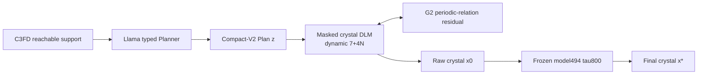

# Science-Constrained Hierarchical Crystal Language Model

This repository contains the paper mainline for a crystal generator that moves
scientific information across three resolutions:

1. a **C3FD-supported Llama Planner** chooses chemically reachable global Plans;
2. a **Plan-conditioned masked DLM** realizes each Plan in an exact `7+4N`
   crystal language;
3. a **periodic-relation residual and frozen model494 transition** turn that
   language state into a physically evaluated crystal.

The central question is:

> How can a language generator preserve chemical feasibility while moving from
> discrete composition decisions to coupled periodic geometry—without relying
> on post-hoc sample selection?

## Method overview



The modules are trained separately but connected by one exact Plan state. At
inference each request produces one Plan, one DLM trajectory and one terminal
diffusion trajectory. There is no retry, replacement, reranking or best-of-N.

## Main reported result

The paper headline is:

| Denominator | Strict S.U.N. | Meta S.U.N. |
|---:|---:|---:|
| 1,000 | **105/1000 = 10.50%** | **488/1000 = 48.80%** |

This is the main reported result. New experiments answer robustness and
mechanism questions without changing its denominator. The fresh G2 prospective
profile gives `24/117` on 256, and the independent Plan1200 scale profile gives
`81/486` on main1000. The scale profile is treated as an independent sampling
realization rather than a replacement headline.

## Modules, roles and evidence

### 1. Science-Constrained LLM Planner

**Role.** Select the atom count, elements/counts and compact structural regime
before coordinate generation.

**Why it is needed.** An unconstrained LLM can spend probability mass on
unreachable charge/count prefixes. A rules-only Planner is valid but cannot use
a learned materials prior to choose among legal paths.

**Mechanism.** C3FD defines prefix-dependent reachable actions. Llama scores
those actions and predicts Compact-V2 soft fields inside the same decoding
process. The legal support is never weakened and only one trajectory is sampled.

**Evidence.** C3FD-v2.5 improves composition validity from `1724/2000` to
`2000/2000`. The fused Planner remains composition-valid on `256/256` fresh
requests and `1200/1200` scale requests. Mean fused-vs-C3FD action KL is
`0.06819`, with `87.05%` of typed decisions changed, showing that Llama is an
active generator rather than a formatter.

### 2. Plan-Conditioned Crystal Diffusion Language

**Role.** Convert the global Plan into one lattice and exactly `N` ordered
element/fractional-coordinate tuples by parallel masked denoising.

**Why it is needed.** Direct crystal text entangles chemistry, sequence length
and geometry. The Plan makes exact chemistry visible so the DLM can spend its
capacity on structural realization.

**Mechanism.** A body contains seven global tokens followed by `N` element/X/Y/Z
tuples. N and element multiplicities remain visible; lattice and coordinates are
denoised under the exact-axis schedule. MP20 training and inference use the same
`C3FD_NATIVE_PLAN_V2` serializer.

**Evidence.** The DLM uses the full MP20 `27136/9047` train/validation split. A
strict round-trip audit gives `248/248` exact body/schema matches with zero
species-order or validity flips. On the scale profile it produces `1139/1159 =
98.27%` valid CIFs before terminal diffusion.

### 3. G2 Periodic-Relational Denoising

**Role.** Make lattice-conditioned, species-aware periodic relations salient
inside the DLM rather than repairing a finished CIF.

**Why it is needed.** Global attention makes coordinate tokens visible, but it
does not explicitly compute triclinic minimum-image distance or guarantee that a
single catastrophic pair receives enough gradient priority.

**Mechanism.** G2 reconstructs a strict-PBC relation graph from soft DLM states,
aggregates metric, pair-distance, RDF, overlap and coordination information, and
returns a zero-initialized residual to geometry-token logits.

**Evidence.** On the fresh prospective cohort, G2 moves refined Strict/Meta
S.U.N. from `19/111` to `24/117` and lowers paired official hull by
`16.43 meV/atom`. The full-epoch mechanism study raises raw Direct from
`118/256` to `128/256`. The uncertainty-gated alternative does not improve
energy and is not part of the method.

### 4. Frozen model494 Terminal Diffusion

**Role.** Provide the fixed fine-scale basin transition after the learned DLM
has produced a raw exact-composition structure.

**Why it is needed.** Raw language realization and final physical conversion are
different mechanisms. Reporting both separates what the DLM learned from what
the inherited refiner contributes.

**Mechanism.** model494 applies one sample-index-seeded tau800 transition while
preserving atom identity and attempt accounting. It is frozen and is not a
result-selection stage.

**Evidence.** In the matched L6 mechanism run, raw→tau800 changes Direct
`188→457/512`, Strict S.U.N. `10→48` and Meta S.U.N. `66→230`. The independent
Plan1200 tau800 profile reaches `81/486` on main1000, supporting the fixed
terminal transition at scale.

## Main evidence profiles

| Profile | Question | Result |
|---|---|---|
| Main reported H1-A2 | What is the paper headline? | Strict/Meta `105/488` per 1000 |
| Fresh prospective, 256 | Does G2 improve the complete system? | BASE→G2 refined Strict/Meta `19/111→24/117`; paired hull `−16.43 meV/atom` |
| Full-epoch mechanism, 256 | Does strict periodic feedback improve raw realization? | BASE→G2-PBC-R raw Direct `118→128` |
| Plan1200 scale, main1000 | Does the complete pipeline scale? | tau800 Strict/Meta `81/486` |
| Planner scale | Does scientific support remain valid at scale? | fused Planner composition-valid `1200/1200` |

The Plan1200 profile combines the first 861 valid rows of the main block with
all 139 valid remainder rows. The 20 CIF construction failures remain disclosed.
See [`PLAN1200_TAU800_FINAL_20260902.md`](docs/PLAN1200_TAU800_FINAL_20260902.md).

## Validate the portable paper pipeline

```bash
PYTHONPATH=src python -m crystal_dlm.paper_pipeline validate
PYTHONPATH=src python -m crystal_dlm.paper_pipeline show
PYTHONPATH=src python -m crystal_dlm.paper_pipeline stage sample-plan
```

These commands are read-only. They validate the stage order, component configs,
repository paths and scientific invariants without submitting a job.

## Reading path

1. [Paper-method index](docs/paper/README.md)
2. [Method at a glance](docs/paper/METHOD_AT_A_GLANCE.md)
3. [Scientific question and contributions](docs/paper/SCIENTIFIC_QUESTION_AND_CONTRIBUTIONS.md)
4. [Full method](docs/paper/METHOD_MAINLINE.md)
5. [Experiment and evidence matrix](docs/paper/EXPERIMENT_MATRIX.md)
6. [Paper story](docs/paper/PAPER_STORY.md)
7. [Reproducibility contract](docs/paper/REPRODUCIBILITY.md)

The executable stage map is in [PAPER_PIPELINE.md](PAPER_PIPELINE.md). Retired
negative methods are summarized once in [FAILED_METHODS.md](docs/FAILED_METHODS.md);
their retired checkpoints and duplicate implementation artifacts are not part of
this branch.

## Claim boundary

The main reported result is `10.50%/48.80%`. The supporting evidence establishes
composition correctness, exact Plan-to-body conditioning, improved periodic
realization and a measurable end-to-end G2 stability gain. The independent
scale profile reaches `8.10%/48.60%` and demonstrates that the complete pipeline
remains operational at scale; its Strict difference is treated as sampling
variation in the paper narrative.
