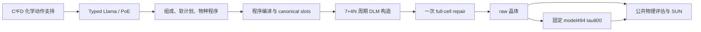

# 当前架构与论文主张边界

状态：2026-09-06 的冻结 V2 实现与正在进行的科学审计。V3 尚未定案。

## 真实执行链

C³FD 约束化学动作的可达支持，不直接预测几何。Llama 输出物种程序；compiler 固定晶格、anchor 与坐标访问规则。软 lattice/spacegroup bucket/volume 提示不是完整空间群或 Wyckoff 约束。

V2 保留精确 N 与元素计数，DLM 负责晶格和坐标。模型从原始 LLaDA 初始化，训练新增 crystal token rows、LoRA、数值与周期状态模块。当前形式是程序指定的条件采样与一次全胞修订；不能沿用旧 K4/K8 的 cooperative + reverse species closure 描述。

## 训练与推理

每个原始 MP20 source 每 epoch 有 construction 与 repair 两个 view。训练混合 exact prefix CE 与 dense denoising，使用 log-SPD 晶格扰动和周期坐标扰动。修订读取旧几何，DLM 逐步填充新 canvas。V2 的周期 attention bias 为各 head 独立、跨层共享。

训练与推理共用程序次序和合法数值支持，但训练的 clean prefix / 合成 old state 与部署的自行生成 prefix / old state 不完全相同。冻结预测的软计划替换条件而保留 clean target，也不自动证明模型能实现每个预测计划的几何意图。这些属于正在核验的科学问题。

## 当前可以和不可以声称的内容

| 证据 | 支持的结论 | 尚不支持的结论 |
|---|---|---|
| exact composition 与事务执行历史结果 | 化学保留和结构执行已有明显改善 | 已稳定生成低能晶体 |
| 真实早期梯度与零增量检查 | 初始化/连接的相应工程性质可验证 | 几何模块在每阶段有效、SUN 会上升 |
| 周期几何表示与 attention | 模型可利用已提供的周期几何信息 | 已实现 DiffCSP++ 的反向 score 与空间群保证 |
| suffix / old-state 条件修订 | 可表达双向条件的晶体更新 | 任意反复去噪都保持数据分布或降低能量 |
| 固定 refiner 改善稳定数 | 后处理具有实际贡献 | raw DLM 已学到同样的稳定性 |

所有组件、这些初步边界与现有论文主线继续接受 [全面审计](v3_scientific_audit_20260906/README.md)。研究将比较几何 diffusion/flow、离散 DLM、GNN 融合、最小修复与 V3 的成立条件及反例；采用决定以可比 SUN 结果为依据。
