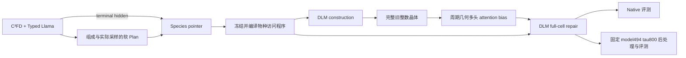

# LLM 程序驱动的离散周期 DLM：审查结论与 V2 执行设计

更新：2026-09-06。用户最新授权是完成实现和论证后，将新版训练、推理排在当前全部任务之后，待项目六张 A800 额度全部释放再启动。本文件替代此前“只分析、交给 GPT5.6 后暂停”的草稿；当前可否提交作业，以 [V2_LAUNCH_MANIFEST.json](V2_LAUNCH_MANIFEST.json) 的 ready、固定实现版本和前置完成检查为准。

## 1. 结论与论文主线

旧版 **Llama 对 DLM 解码顺序的控制是真实执行的**。它根据化学状态及本次选择的软计划，预测独特物种的排列；compiler 将排列变成 canonical native slots 上的访问程序。DLM 负责每一步离散数值动作，运行时提供相同的合法支持。Llama 没有逐 token 重新运行，也没有学习六晶格参数或 XYZ 内部轴顺序。

V2 保留这条分工：**化学可达性与软计划 → 冻结 Llama 物种程序 → 程序条件下的离散构造 → 读取完整旧整数晶体的周期几何修复**。本轮从原始 LLaDA 全新初始化，不继承旧 K4/K8 权重、路径或 teacher，也不从正在训练的 raw-v1 最终点续训。raw-v1 最终模型用于比较。

论文可以提出的机制是：程序把语义规划接到离散动作顺序，几何交互为修复提供真实的周期关系，训练状态和损失明确对应其离散条件分布。**机制成立、实现通过检查，并不证明 SUN 或物理双目标已经改善**；这些结论必须来自随后固定评测。

## 2. 旧流程的完整衔接

[逐函数追踪报告](review_notes/OLD_LLM_DLM_ORDER_TRACE.md) 给出了代码位置与旧、新文件对照：

1. C³FD typed ledger 定义可达化学动作；Typed Llama 在同一支持内提供 residual PoE，生成组成及软计划。
2. 组成确定后，Planner terminal hidden、元素/计数和实际软字段 IDs 进入 species pointer，得到一次物种排列。
3. 冻结器检查物种排列完整性及 learned-pointer 来源。compiler 将排列映射到 canonical 存储位置，预填 N/元素，保留精确 7+4N 数值表示。
4. 构造顺序固定为六晶格参数，随后按程序访问各物种 anchor，再访问 remaining sites；每个 site 内固定 X→Y→Z。程序 rank 同时进入状态 conditioner。
5. 旧主线再执行 program-rooted cooperative region transaction、reverse-species closure。后者让先前 anchor 获得更多已生成上下文；区域选择含几何规则，不能全部归为 Llama 学习。
6. 当前 raw-v1 和本次 V2 采用 construction→full-cell repair，明确替换旧 cooperative/closure。full-cell repair 仍使用同一个程序编译顺序，并通过完整 old snapshot 接入已有全胞信息。

例如 canonical slots 为 O0、O1、Na2，程序 Na→O 会产生 lattice→Na2→O0→O1 的访问顺序；它不会把存储数组重新排列。旧 reverse closure 的顺序则是 O1→O0→Na2。V2 不能沿用“仍执行旧反向闭合”的描述。

程序、硬组成、token ABI、canonical alias、合法支持、温度、轨迹回放、固定 model494 tau800 和正式 N/U/hull/terminal 评测接口均保留。新版 K4/K8、自生成能量 teacher、连续联合 diffusion 训练不在本轮执行范围。

## 3. 当前结果对设计的约束

以下均为同一开发集 256 次请求，不用于独立主评测的筛选或调参。

| 原流程阶段 | 参考 | K4 | K8 |
|---|---:|---:|---:|
| Native Strict / Meta SUN | 6 / 55 | 7 / 57 | 11 / 66 |
| Tau800 Strict / Meta SUN | 19 / 121 | 19 / 126 | 17 / 123 |

K8 native 有 252 次可重建、76 次终态通过验证；参考为 255、63。双方通过终态验证的 34 对中，A 的平均变化为 +0.165684 eV/atom，B 的平均变化为 −0.018626 eV/atom。

K8 tau800 有 252 次可重建、82 次终态通过验证；参考为 255、99。双方通过终态验证的 59 对中，A 为 +2.931 meV/atom，B 为 −6.489 meV/atom。Strict SUN 丢失 4 个、增加 2 个；Meta SUN 丢失 15 个、增加 17 个。N/U 从 221 降到 214。全部 252 个有限能量交集的均值与共同 verified 交集不同，不能混用分母得出“双目标共同改善”。

因此，本轮没有“继续扩大候选数便能解决问题”的证据。旧 K4 teacher 972 条 verified 路径覆盖 526 个条件，组内重加权对 A 的改善仅约 0.34%，说明候选几何支持本身是限制之一。旧 canonical/native 排序修正也曾提高有效结构数，却没有保证原生能量改善。V2 针对有代码证据的状态、条件和几何监督问题，不将这些相关现象直接当作因果证明。

## 4. 纠正此前对 loss 的解释

此前“晶格与坐标按 2:1 加权有物理理由”的解释不充分。原实现平均 length、angle、coordinate 三个 family：当三者都有监督时，前两项合起来名义占 2/3；随机 mask 后空 family 为零且仍除以 3，实际权重还依赖 mask 与 N。不能把它称为经实验证明的物理最优比例。

原来的 length log/RBF 与 coordinate Fourier 是表示/输出适配器，不是 log-metric 几何损失。原数值目标为 90% exact CE + 10% Gaussian soft CE；Gaussian 距离分别用线性长度 bin、角度 bin、周期 fractional bin。它不是前向扩散过程推导出的后验。sigma 从 0.75 bin 变为 0.25 bin 时，目标熵底约从 0.233 nat 变为 0.000758 nat；跨 epoch 总 loss 的下降不能直接解释成几何改善。

还有三项实际问题：

- 每 source、每 epoch 仅一个 repair scalar，且三 family 均匀选择。两 epoch 后，约 4/9 的 source 没有 coordinate repair 监督；这不意味着 construction 的密集标签也不存在。
- construction 主要训练独立 random mask，部署却执行物种程序前缀；训练程序多为 contact-tree teacher，部署程序来自 Llama。
- 旧几何 bias 要求晶格和两站点坐标完整。在 construction 的随机 mask 下，目标 site 被 mask 时没有该目标的直接几何边；不能凭 bias 模块存在便断言 active query 已得到足够几何监督。

原验证循环还把 batch mean 再除以样本数，microbatch=2 时记录值少一半。这影响报告，不影响 optimizer。V2 已修正计数；不为该报告问题重启正在运行的 raw-v1。

## 5. 三篇工作的可迁移部分与边界

| 工作 | 本轮采用的思想 | 不直接移植的部分 |
|---|---|---|
| [DiffCSP++](https://arxiv.org/html/2402.03992v2) | 以 log-SPD 区分体积和晶胞形状，构造物理含义明确的扰动 | 空间群/Wyckoff 硬约束需要真实可用的条件；当前软 SG 不能充当已知真值 |
| [MaskGXT](https://arxiv.org/html/2606.22866)；[官方训练代码](https://github.com/kiyoung98/MaskGXT) | 明确离散字段、周期坐标、mask 状态和监督归一化 | 不照搬其 loss 权重、64-bin codec 或 continuous sub-bin offset；后者会改变本方法的离散输出测度 |
| [Crystalite](https://arxiv.org/html/2604.02270v2)；[官方实现](https://github.com/joshrosie/crystalite) | 周期距离/位移作为 attention bias，按 head 学习交互并结合噪声元数据 | 原工作是连续几何扩散；不能给初始全 MASK 晶体伪造几何。新增 lattice-slot↔site 交互是本设计假设，不冒充原论文已有模块 |

这些方法各有不同任务、结构表示、模型规模和 SUN/弛豫协议。这里比较机制，不直接比较其论文分数，也不把一个工作的经验系数当成另一模型的理论常数。

## 6. 明确的 V2 目标分布

设 z 为某次 scalar forward 的 logits，先执行 typed schema、在原 logits dtype 内合并 coordinate 000/100 alias，再施加该状态下的几何支持 S。实际动作概率为：

$$
p_\theta(a\mid s)=
\frac{\mathbf 1[a\in S(s)]\exp(g_\theta(a,s)/0.7)}
{\sum_{b\in S(s)}\exp(g_\theta(b,s)/0.7)}.
$$

保持“先合并物理类别、再温度化”的现有语义。它与“先温度化 101 个 token，再相加”不同，训练、采样、回放必须一致。主目标采用 exact CE，ordinal smoothing 为零，也不再叠加另一温度下的 schema/legal 双重目标。

声明的对象风险为：

$$
R_{\mathrm{field}}
=\frac12\frac1{6}\sum_{j\in\mathrm{lattice}}\ell_j
+\frac12\frac1{3N}\sum_{j\in\mathrm{coord}}\ell_j.
$$

这给晶胞和原子布置相同的对象权重，是透明的初始设计选择，并非已证明的物理最优比例。length/angle 与 X/Y/Z 仍分别报告，以便发现某一项被均值掩盖。

每 source/epoch 恰有 construction、repair 两个 view；每个 view 以 3/4 选择 prefix、1/4 选择 dense，不额外物化四个 view，不重复乘分支权重。

**Prefix：** 先以 1/2 选择 lattice/coord，再在其中均匀采一个 scalar，直接用一次 CE。令 Z 为截至该目标的所有 teacher 前序动作均可达，且 repair 的 old 完整晶体满足入场支持。只有 Z=1 才计算 legal CE；否则保留该 source/state 和原分母，记录冲突、置零这次 legal 风险。不计算无穷后再乘零，也不强行把非法 teacher token 填进支持。

**Dense：** 每状态 p~Uniform(0.1,1)，各 numeric token 独立 Bernoulli mask，保留空 mask。对同一对象权重使用逆包含概率：

$$
L_{\mathrm{dense}}=
\frac12\sum_{j\in\mathrm{lattice}}\frac{M_j\ell_j(s_M)}{6p}
+\frac12\sum_{j\in\mathrm{coord}}\frac{M_j\ell_j(s_M)}{3Np}.
$$

这里的 CE 在 canonical typed 类别内归一化，同样 T=0.7。这是 dense 条件去噪风险，不是 prefix 风险的另一种无偏计算，更不是宣称已推导出 diffusion ELBO。所有 source 仍可参与 typed 去噪，即使其 legal prefix 不可达。

Prefix 风险的 proper scoring 解释限于所声明训练状态、支持和 admission 下的条件后验，不是全部原始 MP20 的无条件合法似然。实际 trace 的 log probability 仍为逐动作 log p 之和，不带上述 family 权重；多个带回滚的 attempted traces 可以到达同一结构，不能把单条 trace 概率当成终态结构的边缘概率。

## 7. 四种状态与完整旧晶体的定义

| 状态 | current | old | active |
|---|---|---|---|
| Construction prefix | 程序 π 前序为 clean teacher，其余 numeric MASK，N/E 预填 | current 本身 | 全部尚 MASK 的 numeric |
| Construction dense | 独立 mask 的原始结构 | current 本身 | 实际 mask 集合 |
| Repair prefix | 程序 π 前序为 teacher，其余 numeric MASK | 完整、扰动后已量化的整数晶体 | 整个 full-cell transaction |
| Repair dense | M 内 MASK，M 外仍为同一个受扰 old 的数值 | 同一完整受扰整数晶体 | 实际 mask 集合 |

Prefix 是程序顺序的前后缀，不是 native 数组的连续切片。Dense 使用 structured_denoise task；prefix 使用 construct/full_cell_repair。噪声三分量整体提供或整体隐藏，不读取相对 clean 的真实误差、changed-position mask 或未量化坐标作为条件。

这种训练匹配了动作顺序和可见信息接口，**仍有 teacher prefix→self prefix、synthetic old→generated old 的分布差异**。本轮不通过任意同组成多晶型的逐原子配对伪造修复 teacher，也不恢复已暂停的自生成能量训练路线。

## 8. 周期几何确实进入 Transformer 交互

保留旧 scalar bias 的路径，新 head-specific residual 初始为零，gate 初始为一，避免“零 gate × 零投影”造成整条分支死梯度。新的 bias 形状为 B×H×L×L，在真实 LLaDA 的 32 个 attention heads 上保留，并传入全部 32 层；本实现跨层共享，**没有声称 layer-specific 参数或路由**。

新分支包括：

- site→site：绝对 Å 距离 RBF、log(1+d)、相对 cell scale 距离、周期 Fourier 位移、元素、程序 rank、active/known、晶胞体积/形状、task 与三类噪声。
- 六 lattice slots→site 及反方向：先保留每个 site 的邻居环境，再使用六类 slot embedding 和独立方向的 head 投影。没有先全局 pool 成一个对所有 key 相同的常数。
- 晶胞描述保留 log(V/N) 与去迹 log-Gram 形状，避免只使用归一化距离后看不到整体缩胞。

所有几何均从 old 整数 token 解码；未知晶格、未知 site、padding 严格遮蔽。N=1 的邻居池为零，仍允许真实已知晶胞/站点信息。有限周期 image shell 为 [-2,2]^3，不声称对任意极端未规约三斜基都穷尽最近像。

修复事务内部 old 不变，但当前 mask/task gate 会变化，所以本实现每次 forward 重新构造特征和 bias；没有 mutable hook，也没有缓存整个动态 bias。构造早期确实没有几何，主要由化学/程序/已生成 token 驱动；几何修复负责读取完整旧结构后纠错，不夸大其对最初晶胞采样的直接作用。

## 9. log-SPD 扰动与量化边界

本代码使用行向量晶格 L，G=LLᵀ，以 l0=1 Å 使对数无量纲：

$$
S=\tfrac12\log(G/l_0^2),\quad v=\mathrm{tr}(S)=\log(V/l_0^3),\quad
S_{\rm dev}=S-\tfrac v3 I.
$$

独立标准 Gaussian 扰动体积与五个 Frobenius 正交无迹形状分量：

$$
v_t=v+\sigma_v\eta,\qquad
S_{{\rm dev},t}=S_{\rm dev}+\sigma_s\sum_{r=1}^5\xi_r B_r,\qquad
G_t=l_0^2\exp(2S_t),\quad L_t=\mathrm{chol}_{lower}(G_t).
$$

先保持 F0，让晶体随新晶胞仿射变化，再加 Cartesian 分量噪声 ΔR：

$$
F_t=\mathrm{wrap}(F_0+\Delta R L_t^{-1}),\quad
\Delta R_{ia}\sim \mathcal N(0,\sigma_F^2).
$$

因此 sigma_F 控制的是相对仿射参考的位移，而非相对原始 Cartesian 结构的总位移。初始设计 grid 是 (sigma_v,sigma_s,sigma_F/Å)：
(0.03,0.01,0.05)、(0.10,0.03,0.15)、(0.20,0.06,0.30)。这组强度是冻结的设计先验，不假称已经过 train-only 优选或能够覆盖所有真实生成错误。

每次先回到原 native codec，再检查运行时完整支持；最多尝试 8 个 proposal，失败回退 clean 并明确记录。量化未变、边界/支持拒绝、fallback 均单列；正定连续 G 不保证量化后仍合法。同一 old/target 始终保持相同基与站点身份，不分别做 Niggli 或原子重排。

sigma 是拒绝前的提议分布参数。支持拒绝会改变最终接受的扰动分布，不能把接受后样本的实际标准差继续等同于 sigma。

## 10. 完整来源和 Llama 条件覆盖

远端原始数据已逐行计数：

| Split | 原始 MP20 source | 有 typed pointer 元数据 | 缺元数据 |
|---|---:|---:|---:|
| Train | 27,136 | 24,558 | 2,578 |
| Validation | 9,047 | 8,158 | 889 |

新版 frozen preprocessor 对全部 source 保留 clean answer 原字符串/hash，只更新 conditioning。合法 PoE 分布先 T=0.9、top-p=0.95，再按 source/split/field 独立 seed 采软字段；pointer 接收这些实际 sampled IDs。旧 224 的 MAP 选择差异会被记录。浮点 kernel roundoff 仍可能随 batch/world 略变，不能把独立 RNG 说成全部 bitwise 相同。

直接元数据、受严格条件约束的同 split metadata reuse、canonical + teacher soft fallback 分别记账。缺显式 stability goal 时不默认，不借验证集补训练，不将 contact-tree 或 teacher soft labels 送进 Planner forward。缺元数据部分使“全部 source 已与部署预测条件对齐”的说法不成立；报告预测覆盖和 fallback 子集表现。

预测的软标签也不保证与原晶体的软注释一致。这里拟合的是原结构在可部署预测条件下的分布，不宣称已经实现空间群或体积目标的严格遵循。preprocessor 在预测完成后记录每个软字段及程序与原注释的相符率；这些事后诊断不会作为 Planner/pointer 的输入。

## 11. 预算、验证与论文证据

正式训练是原始 LLaDA、原 MP20，2 epochs×2 views=108,544 个有效状态。六卡 microbatch2×accumulation2，global24；每 epoch 54,272 个有效状态，补 16 个零权重 slot 至 54,288，2,262 次更新；两 epoch 共 4,524 次更新。padding 的均值按 padded/real 比例校正，保留不可达和空 mask 的零贡献。完整 source/view/epoch coverage 必须逐项等于 2。

这与 raw-v1 是相同来源与 view 数，不是相同更新数、计算成本或单机制消融。本轮不自动追加 A/B/C 多组试验。论文若需要单独归因程序、loss、GEM，各组必须从相同起点并冻结同样预算另行验证。

已有检查覆盖真实多头 active-logit 梯度、零增量等价、重计算梯度、周期/缩放/未知几何、log-SPD/仿射恒等式、程序与合法 prefix、alias/温度/支持、密集风险与空 mask、分布式覆盖和 source 身份。完整检查的最后结果写入 launch manifest；真实六卡 forward/gradient/preflight 只在未来正式 allocation 内执行，不把 CPU 检查说成已经跑过 8B GPU 训练。

只消费正式 step4524；epoch1 checkpoint 被 loader 和 wrapper 拒绝作为推理政策。验证固定 100 source/200 states，按 batchmean×batchsize 汇总，不按它择优选择 checkpoint。

评测使用原冻结 256 条 Planner 条件、相同采样种子和支持。六卡执行前先重建原两 worker 的固定 batch layout，再分配完整 batch，以保留配对所需的实际 batch membership。分别比较 native 与固定 model494 tau800，对照原参考与 raw-v1 final。额外从同一次 trace 提取 construction endpoint，只增加共同物理评估，不额外采样，用来分析 full-cell repair 的净作用。每项均保留 256 次请求和失败。

## 12. 调度与效果不佳时的诊断

前置必须全部完成：raw-v1 train→native→tau800；旧 K8 train→native→tau800→独立 Planner→独立 1200 请求 raw/tau 主评测。之后还必须确认本项目六卡额度全部释放。检查同时使用完成 marker、正式报告、完整分母和 Slurm 作业；未提交的后续阶段不能被空队列掩盖。

新版由独立 249 训练入口（包含 frozen Planner preparation）和 250 推理/评测入口执行，各为六 A800、24 CPU。只提交一次；不抢占健康任务，不启动新版 K4/K8。具体实现 commit、前置路径、调用与验收以 manifest 和执行清单为准。

若结果不及预期，报告必须先区分：

1. 来源/程序/slot 编译、condition fallback、真实支持和逐步概率回放是否一致。
2. 有效状态/目标覆盖、eligible 分母、三种噪声、量化未变/fallback、每个几何分支对 active query 的梯度是否正常。
3. Construction 与 repair 的体积、周期距离、能量、force、stress、入场/回滚及逐请求变化。
4. 共同 verified、全部有限交集、全部请求三种分母；均值、中位数、尾部贡献、生成失败、终态验证丢失以及 N/U/hull 缺失。
5. 候选支持、teacher、学生、公共连续后处理、阈值附近变化和统计波动分别能解释什么。

先写事实、排除项和可验证假设，再决定必要修复；不凭总 loss、teacher 变好或少数 SUN 个数变化宣布成功，也不盲目加权、重训或更换评测标准。
