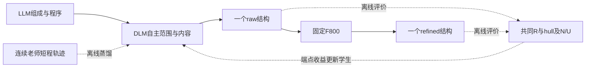

# 专家监督 DLM 修订：逐条讨论与决策记录

创建日期：2026-09-07。更新日期：2026-09-09。状态：G1回归失败后，用户已授权§0.14修复重跑；失败权重已清理，大batch和并行实测进行中。本次仅TRAIN，12小时、4—6张A800，固定基座初始化，训练侧允许CHGNet指导；最新质量顺序为SUN＞严格Stable＞Meta Stable＞普通更稳定＞不稳定。轨迹按可复用数据集保留；GPU开始时间与绝对截止时间以正式运行回执为准。§0.11／§0.12为此前讨论与诊断，与最新计划冲突时以§0.14及未被覆盖的§0.13为准。

本文件单独记录用户与 Codex 对 GPT Pro 方案的讨论。后续逐条更新同一文件，不为每轮对话另建一份计划。只有用户明确确认的内容才记为“已确认”；GPT Pro 的建议和 Codex 的建议均不能自动转成执行决定。

讨论方式更新：用户明确欢迎质疑、反对及更多候选。后续按问题展开比较与推演，说明推荐理由、数据和计算预算；不以连续询问“是否同意”代替研究。条目仍用于记录决定，不限制讨论只围绕一个既定方案。

上一轮已完成执行的授权（历史）：完成最后审计后开始执行；最多16小时累计训练，最多3个同时运行或等待的Slurm任务，GPU数量按实际可用资源缩减，至少每20分钟汇报。只计算comp_valid、Struct_valid、SUN和MSUN，raw/refined任一端点相对同协议H1A2有前景即可；不再计算Direct套件。当时固定原H1A2 rich Plan的1200请求面板，主面板组成及其后代不进入新编辑训练。本轮以v0.8待批计划及用户最新要求为准。

历史讨论阶段曾要求“先讨论好再做”；后续已收到明确启动授权。当前分支codex/expert-self-edit-20260908，执行清单和不可变源码/运行回执位于execution/expert_self_edit。已完成2048个新训练请求的P0/B0/teacher494构造；物理标签与模型短验证不等于学生有效性结果。

**v0.4/v0.5旧推理边界（历史）：当时要求DLM自主定位、选择范围、产生mask并重生成；专家用于离线监督和事后评价，固定tau800作为单独下游端点，不回流决定本次编辑。本轮用户已明确refine后回到token，再进入少步KEEP／EDIT，因此旧边界不覆盖v0.8。MLIP/hull在线选优仍不属于当前计划。**

<a id="final-module-plan"></a>

## 0.14 G1失败后的修复重跑（2026-09-09，用户已授权）

用户要求：记录失败，修复，清理本次失败checkpoints并重新执行；后续任务应主动增大batch size和并行度。用户进一步强调：DLM始终接收对应Plan/prompt，目标是该条件下完整生成流程更偏向SUN，而非脱离prompt的结构模仿。此节覆盖§0.13中已被失败证据否定的训练强度和资源设置；固定TRAIN256、基座、物理口径和GPU/作业上限继续保留。

失败运行已于11:08:29 UTC停止。G1执行695步后，几何构造成功229→157、失败27→99；G+F可靠SUN27→18、严格稳定30→21、独占亚稳态97→74。两轮Plan文件逐字节相同，包含相同prompt、G种子、F种子。99条失败全部为Z补全阶段`pbc_no_legal_completion`。原27个SUN保住15个、失去12个、新增3个；失去的12个中5个因G失败、7个在G成功后仍失去SUN。失败G1的权重/优化器文件已按用户要求删除，释放2,298,212,239字节；元数据、训练日志、生成/物理轨迹和指标保留。详情见[rsi/ranked_execution/diagnose_g1_regression.py](rsi/ranked_execution/diagnose_g1_regression.py)，远端报告`analysis/G1_REGRESSION_AUDIT.json`与`FAILED_CHECKPOINT_CLEANUP.json`。

已发现的训练风险：185条记录中只有3条严格稳定，却被分配8/29组采样概率；34条SUN占16/29，导致少量prompt过度重复。695步的时长主要按资源预算分配，缺少数据遍历上限。目标前缀下局部条件偏好也不能保证从自身前缀出发可完整生成。以上为有实现证据的风险；未做因果干预前不声称它们已解释全部下降。X/Y同列原子数增加与Z补全失败相吻合，是描述性机制证据。

修复实施：

- 每轮按打乱后的完整数据遍历限制更新，取消按类别独立高概率抽样；质量优先级仍用于同prompt候选的物理胜负。记录各条训练样本的实际访问次数。
- G样本显式携带完整Plan；条件视图按原生语义分组顺序遮盖，覆盖组内不同揭示子集。偏好目标仍为该prompt下的实际RAW候选，使用后续F的可靠评价赋值，绝不把别的prompt的SUN结构当作当前目标。
- 使用上一轮冻结策略的显式条件KL约束、较小G学习率和数据遍历次数上限；不能以更大batch为理由增加总样本曝光量。局部代理损失仍有局限，最终收益必须在同Plan/种子的实际G→F→E链路上确认。
- 默认试测每卡8个训练样本、每卡16个E推理请求；G每卡3个独立构造进程，F每卡4个独立请求进程，CHGNet每卡4个worker。以实测吞吐量、显存峰值和请求一致性确定最终值；批量化不得改变硬约束、逐请求随机数、失败记录或评测分母。
- 新实验从原始G和固定种子新E开始；失败G1不可加载或回流。默认仍遵守原绝对截止时间19:31:10 UTC，不因重跑静默延长预算。重跑先检查第一轮完整链路，再推进后续更新；严重可行性退化应停止后续训练并保留诊断。

本项目后续工作持续遵循用户的资源偏好：主动增大真实batch和独立并行，避免长期每卡单请求；记录实际吞吐量与显存，不能用梯度累积冒充batch提速，也不能只凭显存百分比宣称GPU利用率。

## 0.13 已批准执行：CHGNet指导与分级稳定性偏好的模块计划（2026-09-09）

**当前状态：用户已明确回复“批准计划，开始执行”；执行分支为`codex/train-rsi-ranked-20260909`。** 用户本次允许训练阶段接入CHGNet，由助手安排具体方式；先提出SUN优先、没有时回退Stable，随后进一步明确“严格Stable＞Meta Stable＞普通更稳定＞不稳定”。结合SUN优先，完整顺序为SUN＞严格Stable＞Meta Stable＞普通更稳定＞不稳定。本节已经批准，替代§0.11／§0.12中与之冲突的起点、目标、动作范围及时间安排。此前诊断保留作为依据。实现使用原有G/E与四动作模块；新增分级反馈、同条件数据编译、CHGNet量化教师复评、固定种子E初始化和完整轨迹归档。CPU回归通过不代表GPU实验效果，效果以S0—S3完整256请求的真实输出和参数更新回执为准。

### 0.13.1 本次审批范围和成功口径

执行登记：北京时间2026-09-09 15:31:10，正式作业41361（S0生成，4张A800）和41362（固定第二份RAW，2张A800）开始运行；绝对截止时间为2026-09-10 03:31:10。源码固定为`d3ab952334573c6c237a83946cde1f404145d5b1`。41项CPU回归通过，包括ASE 3.28实际优化循环中的联合力／应力停止测试。独立历史TRAIN教师通路测试保留256条、产生229个量化目标，仅用于代码检查，不进入正式训练。启动身份与预算见[rsi/ranked_execution/S0_LAUNCH.json](rsi/ranked_execution/S0_LAUNCH.json)。当前仍在执行，不能把启动或测试通过计作三轮更新完成。

固定256个TRAIN Plan，按原顺序保留全部请求，进行S0起点记录和三次真实G/E更新S1—S3；MAIN不参与新评测，也不进入训练。总额度按正式GPU实验开始后12小时、4—6张A800安排，最多3个本轮Slurm作业同时运行或等待。不安排消融、独立验证面板、seed搜索或额外OPD实验。训练时长根据数据供应、拟合进展和剩余必要工作动态分配，不恢复每轮35／45分钟限制。

完整质量顺序按用户最新要求执行：**SUN＞严格Stable＞Meta Stable＞普通更稳定＞不稳定**。可靠性先于排序，只有可比较的物理记录才提供质量胜负；无效与未知不是任意指定的最低能量等级。

| 优先级 | 含义 | 训练解释 |
|---|---|---|
| SUN | 严格稳定且N/U满足，标签可靠 | 最高优先级，获得与保留优先 |
| 严格Stable | 凸包差≤0，但尚不能记为SUN | 没有更高目标时的首选；N/U false与unknown分别保留 |
| Meta Stable | 尚未严格稳定，凸包差在(0,0.1] eV/atom | 作为向严格稳定推进的次一级目标 |
| 普通更稳定 | 尚未达到前述等级，但相对同条件当前／对照结构出现可靠能量改善 | 是关系标签，不是某个结构永久拥有的绝对等级 |
| 不稳定 | 尚未达到上述稳定等级，且该次比较没有可信改善 | 保留为普通失败／反向比较数据，不与计算失败混为一类 |

分级首先使用同协议松弛后的凸包差和SUN信息，不使用未经一致性检查的即时能量排序。普通改善须超过预先固定的最小差值；建议沿用现有0.01 eV/atom差值作为起始判据，并明确它是工程分辨阈值，非统计置信区间。双方在同一非SUN等级时，可信能量差可形成低优先级细分偏好；都已是SUN或差值不足时优先保持／平局，不强造编辑理由。

跨等级优先于等级内能量差：失去SUN不能靠更低能量补偿，失去严格Stable不能靠其他普通改进补偿。MSUN可作为Meta Stable中的N/U诊断字段，但不单列成高于严格Stable的新等级。N/U不可判定时保留SUN=unknown，可采用已知S等级；SUN已明确false时保留false，不把未命中写成缺失。候选没有SUN仍可提供严格Stable、Meta Stable或可靠普通改善的监督，但这些不能计作SUN新增。

回放和报告分别记录目标等级、晋级／降级和回退原因，优先覆盖SUN及严格Stable正例，再利用低等级改善提供学习信号，避免数量占优的普通降能对淹没高等级目标。已知物理无效的候选可以提供明确失败／拒绝监督；只有其token仍在合法生成支持内且反馈可比较时才进入相应偏好训练。未知或未完成评价不能编造胜负。

### 0.13.2 模块总览

| 模块 | 输入 | 具体改变 | 训练或冻结 | 交付 |
|---|---|---|---|---|
| 起点与表示 | 固定B0、TRAIN Plan、种子 | E从同一基座按固定种子初始化；统一元素槽位和几何表示 | 冻结B0输入／输出表，初始化已有编辑模块 | S0检查点与可重建清单 |
| G生成器 | Plan及同Plan候选轨迹 | 用后端SUN／Stable反馈评价对应raw，更新生成策略 | 训练现有G适配参数 | 新G及本轮raw |
| F精修 | 本轮raw | 保留model494 F800；精修前后的好坏提供训练反馈 | F冻结 | 浮点F与token-F |
| CHGNet与标签 | 实际结构及教师候选 | 联合力／应力停止条件、最大1000步，产生分级质量标签和教师轨迹 | CHGNet冻结 | 物理标签、停止原因、轨迹 |
| E动作与内容 | Plan＋本轮token-F当前状态 | 学习KEEP、局部／较大范围／协同胞参数变化；生成候选 | 训练已有动作、site/count、内容模块 | 学生候选与动作轨迹 |
| E接受决策 | 同一当前状态＋具体候选 | 按完整质量等级学习接受、保持或拒绝退化 | 训练现有质量／接受头 | 实际KEEP/EDIT结果 |
| 自动偏好与回放 | 有绑定关系的候选及标签 | 按同条件构造胜负、平局、KEEP、失败和未知记录 | 无模型参数，生成训练数据 | G/E偏好集及辅助监督 |
| 保存与复用 | 全部模型、数据和执行信息 | 永久保存版本化轨迹与训练视图 | 不增加独立训练分支 | 可复现数据包及未来蒸馏接口 |

### 0.13.3 起点、表示与复现

G使用固定B0检查点及R03生成协议；E基于同一B0初始化现有编辑模块，使用固定主种子20260909，初始化顺序、配置和依赖版本登记。G/E均不加载旧θ1／θ2／θ3权重，也不默认加载旧step-000800编辑器。新增初始化路径应显式保存完整E配置和必要模块，不能绕过已有检查点身份检查。

所有结构保留同一Plan的N和元素计数。教师／历史端点按Plan元素顺序排列；同元素原子匹配尽量消除纯排列导致的虚假大改动，允许的排列与周期包装必须有几何等价性记录。量化会改变实际结构，因此量化后端点需要自己的标签；不将几何等价重排与有损量化混为一谈。

G、F和正式E输出采用预固定seed，额外教师和训练提案使用固定主种子派生并登记，不按结果选择seed。若复用历史TRAIN结构，它们作为固定离线数据快照交付，包括Plan、结构、标签来源和哈希；复现使用这个数据包，不需要先运行上一轮三次自提升。历史数据不能标为当前模型的on-policy采样。

### 0.13.4 CHGNet具体怎样指导训练

本轮采用冻结物理专家提供目标与反馈的方式，不对离散token采样或1000步松弛链做端到端反向传播。DLM通过内容监督、条件偏好损失和动作／接受监督更新参数。

1. 对学生当前结构与候选运行统一物理流程，得到SUN、严格Stable、Meta Stable、相对改善及标签可信度。
2. 优先查找同Plan已保存的可信SUN目标；依次回退到严格Stable、Meta Stable及可靠普通改善。已有结构仍是教师候选，放入本轮表示和评价上下文后才能形成新监督。
3. 对缺少成功目标的状态，利用CHGNet力、应力和优化轨迹提出定向结构变化。接近阈值时优先局部改动；需要更大变化时允许更多原子或晶胞协同调整。力大只是教师选择线索，真实胜负由最终物理结果确定。
4. 将候选编码为学生可生成的token，检查动作支持并按实际端点评分。达到目标的候选作为正例，可信的目标损失作为反例；数值失稳、结构无效和未知结果分别记录。
5. 若保留到达SUN／Stable的短轨迹，中间步骤可提供动作或内容监督；未经逐端点评价不能把终点成功标签贴给每一步，也不能编造中间DPO胜负。

**建议本次统一采用新的物理协议。** 模型仍为固定CHGNet版本，最大1000步；实际收敛条件同时检查原子最大力≤0.1 eV/Å与最大应力≤0.5 GPa，记录优化器自身判据、物理判据和真正停止原因。新停止逻辑要在实际最终几何上检查，明确应力单位及观测时刻；几何崩溃、非有限值、能量协议或表示一致性异常不能提供成功奖励。达到步数上限但未满足条件的记录保留，不升级为高置信成功。

S0—S3及训练对两端采用同一协议。旧缓存只有在结构身份、物理模型、参数与新停止规则均能证明兼容时复用，其余重算或不作为可靠监督。1000是上限，不要求每个样本跑满；这个修正旨在解决提前停止与验收条件不一致的问题，不能承诺自动增加SUN。

CHGNet直接指导发生在训练数据构造侧。正式学生E输出由学生自行选择动作、生成候选和决定KEEP/EDIT；不让CHGNet从多个候选中替学生挑选最终结果。既定SUN健康门控与用于记录结果的物理评分单独登记，不隐藏为学生自身能力。

### 0.13.5 G和F分别怎样改进

G的主要偏好对是同Plan、同条件下的两条raw。它们各自经过相同F/token流程后的目标等级决定raw胜负：SUN优先，随后严格Stable、Meta Stable及可靠普通改善。不能把一次F端点的好成绩无条件贴给另一条raw，也不能仅因新模型较新就认为它更好。

固定成功轨迹与本轮新轨迹共同提供训练对。跨等级胜负优先使用条件偏好训练；同一非SUN等级内超过最小差值的改善可提供较低优先级偏好，微小差异则保持／平局。双方均未达到稳定等级时，可靠降能可按“普通更稳定”记录，但不能伪装成SUN、严格Stable或Meta Stable成功。参考策略为本次更新前的冻结G。

F继续使用model494 F800，不训练F权重。可靠raw SUN按登记的门控保留；仅Stable而未达到SUN的状态仍保留经F寻找SUN的机会。E当前状态明确绑定本轮token-F。F变好或变坏分别提供G训练的正反反馈，不把教师优选结果偷偷替换成学生输出。

### 0.13.6 KEEP/EDIT的训练内容与接受规则

可靠SUN优先KEEP，并保留健康先验与保持监督。非SUN状态应允许生成候选，不再由一个尚未看到候选的mode头一票否决全部编辑机会。模型选择合适的动作范围：局部坐标、较大原子范围、必要的全局／胞参数动作；不使用统一0.2Å或统一只改1—2个原子的限制。动作类型、site/count及内容均由目标数据提供监督，并满足原有硬几何支持。

候选接受针对完整等级顺序训练：SUN得到／丢失优先，其次是严格Stable、Meta Stable和可靠普通改善。跨等级退化不能由低等级收益抵消；目标保持可选择KEEP，可靠的同等级改善可以选择EDIT。未知不伪装成可信物理负例。不可生成或不合法的候选按执行规则回退，并保留失败原因。

E内容偏好必须共享同一个Plan、同一个当前结构、同一个动作条件和mask定义。不同范围的候选可以训练动作／接受决策，但不能不加区分地拼成同条件的内容DPO对。必要时在匹配动作范围内比较教师候选与合法的保持当前状态候选；两端完全相同则是保持／平局数据，不能构造虚假DPO差值。

训练时保留原始当前状态并使用多个masked位置或编辑块监督，既学习改哪里和改什么，也学习未选择部分的保持。内容目标、胜负目标和动作标签分别保存；它们不能互相代替。更新后E必须重新生成自己的候选并交付实际输出，不能复用更新前或CHGNet的教师答案作为成绩。

### 0.13.7 每轮顺序与动态资源分配

先保存可重建的新S0及实际起点结果。然后对r=1、2、3依次执行：

| 顺序 | 本轮动作 |
|---|---|
| 1 | 用截至上一轮的可靠同Plan目标偏好更新G_r |
| 2 | G_r在固定256 TRAIN生成raw，完成F/token流程与统一物理标签 |
| 3 | E_(r−1)在新G产生的当前状态上形成训练提案；CHGNet补充SUN／Stable目标 |
| 4 | 用这些新状态与兼容历史数据更新E_r |
| 5 | E_r在本轮当前状态上重新实际推理并作KEEP/EDIT |
| 6 | 记录完整输出的SUN、Stable及损失，刷新目标池和数据快照 |

G训练、E训练和教师构造的时间根据有效目标供应、样本／mask覆盖、拟合进展和剩余预算安排。SUN正例不足时先补教师，并按严格Stable、Meta Stable、普通改善的顺序利用可用数据；低等级数据提供持续学习信号，但不能淹没高等级目标。训练损失下降不等于SUN提升，每轮实际结果仍完整记录。

4卡为规划基础，6卡时提高就绪生成与物理阶段吞吐，不增加样本或实验分支。总12小时内优先完成三轮和实际结果评分，动态预留必要收尾时间；不以固定每轮分钟数切割，也不因为某一瞬间结果好看而截取报告。若出现无法满足三轮预算的实际阻塞，应如实说明，不能把未完成阶段计为成功。

### 0.13.8 自动偏好轨迹必须长期保存

保存原始轨迹、物理标签和由其导出的训练视图，不能只留chosen/rejected文本。项目工件目录保存压缩数据与检查点，源码仓库保存轻量配置、schema、版本清单与哈希。每次导出不可变版本，错误标签通过新增更正记录处理，不覆盖历史来源。

| 数据类别 | 必须保存的内容 |
|---|---|
| 条件与来源 | 完整Plan、TRAIN身份、当前状态、父结构、同条件分组、cohort及N/U参考版本 |
| 模型与采样 | 基座／策略／参考检查点哈希、轮次、seed、代码、采样设置、动作和mask轨迹 |
| 实际结构 | raw、浮点F、token-F、编辑前后结构、原子匹配／排列映射、量化参数 |
| 物理反馈 | CHGNet版本、完整协议、实际步数、力／应力、终点能量、几何有效性、SUN／Stable及unknown原因 |
| 偏好 | chosen、rejected、objective_level、fallback_reason、胜负理由、可靠性、两端与条件绑定 |
| 行为与费用 | 自由学生提案／受约束学生提案／物理教师的来源区别、KEEP/EDIT、实际采纳、失败、调用量和GPU成本 |

建议导出`TRAJECTORIES.jsonl.gz`、`PHYSICS_LABELS.jsonl.gz`、`G_PAIRS.jsonl`、`E_PAIRS.jsonl`、`EDIT_TARGETS.jsonl`、`KEEP_ANCHORS.jsonl`及`DATASET_MANIFEST.json`。动作与目标类型使用明确schema；合法保持、平局、未知及失败都保留，只有满足训练条件的子集进入DPO视图。检查点、父子关系和必要的优化器／随机状态一同归档。

每轮数据标明采集时的行为模型。当前学生新采集的数据与历史回放分开；历史数据在后续模型下不自动仍是on-policy。若保存log-probability，必须说明是真实采样条件概率还是masked条件替代分数，不能把后者称为完整扩散轨迹似然。本次不保存每步全词表logits；足够的状态、mask和冻结模型版本用于后续重新打分，缺少的教师分布字段明确为空。

### 0.13.9 DPO、自提升与OPD如何使用这些数据

DPO是利用同条件偏好对进行训练的方法；自提升是“当前模型产生数据—专家反馈—权重更新—新模型再产生数据”的循环，两者可以同时成立。本轮适合称为CHGNet指导的在线偏好迭代／专家辅助自训练。由于DLM采用条件mask去噪与硬支持，损失应明确为带冻结参考的masked条件偏好目标，不冒充完整扩散序列的精确DPO概率。[DPO原论文](https://arxiv.org/abs/2305.18290)

这里按OPD指on-policy distillation理解。当前学生访问的状态上接受专家纠正，符合在线专家蒸馏的思路；但CHGNet提供的是结构目标、能量、力和应力，没有与DLM同词表的教师token概率。因此当前物理轨迹和偏好对不能直接等同于已经准备好的token级OPD数据。[On-policy distillation／GKD原论文](https://arxiv.org/abs/2306.13649)

后续有两条复用路径：一是直接使用保存的目标与偏好做SFT、DPO或继续闭环；二是让一个冻结的强G/E教师在新学生实际访问的相同mask状态上提供动作／token分布，再做相应的蒸馏损失。也可以构造有限合法动作集合上的物理教师分布，但必须明确其支持范围，不能冒充全词表分布。仅重放旧数据是离线回放；标准on-policy阶段仍需随当前学生刷新状态。本次只保留接口与必要数据，不在最后额度中另开OPD训练分支。

### 0.13.10 本次批准后执行的清单

批准本节后，执行范围为：实现固定初始化与表示绑定；实现统一CHGNet停止／标签协议；实现SUN＞严格Stable＞Meta Stable＞普通更稳定＞不稳定的自动偏好构造；更新G及E的训练／决策；保存可复用轨迹；在12小时、4—6张A800内完成仅TRAIN的三轮闭环并报告实际结果。SUN、严格Stable、Meta Stable、相对改善、目标回退比例及反馈可信度分别报告。

当前只完成模块计划与资料核对，未修改训练算法实现，未启动GPU作业。用户要求“看完并批准计划后开始执行”，因此本版计划须由用户批准后再进入实现和作业阶段。

<a id="sun-only-diagnosis"></a>

## 0.14 后续提案：复用已有MP20扰动数据训练KEEP／EDIT基础能力（2026-09-09）

用户在本轮运行中询问：后续能否先在MP20上训练KEEP／EDIT，为它提供基础能力；随后指出之前已经通过MP20扰动构造过好／坏偏好数据。核对后确认用户指出的是已有资产，不能再把整项工作表述为尚未开展。修正建议是先复用、适配已有数据，补齐当前动作与KEEP监督，再考虑确有必要的新数据。本轮仍按已经启动的§0.13完成S0和三次更新。

**已存在且旧版E确实使用过的数据：** `training_controls_refresh/geometry_auxiliary`保留2048个MP20来源、10228条记录。训练部分8883条，其中7104条四类扰动恢复、1779条clean状态；开发部分1345条。来源及文件SHA已与旧版stage2训练清单核对一致，旧训练状态为complete。旧训练器还会生成“把恢复对反转”的拒绝样本，因此已包含几何意义上的好／坏判断，不只是重填token。完整核对结果见[rsi/ranked_execution/EXISTING_MP20_DATA_AUDIT.json](rsi/ranked_execution/EXISTING_MP20_DATA_AUDIT.json)。

**现有标签的实际边界：** 清单明确记录`content_task=G_only`、`physical_energy_supervision=false`、`identity_teaches_S_stop=false`。这里G是旧编辑器的几何任务名，不是本轮生成器G。8883条TRAIN记录的物理标签ID均为空；1779条clean状态的`old_reliable`均未设为true，因此不能把它们说成已经完整监督了稳定性KEEP。旧版E另有真实B0／教师物理配对参与训练，不能把“这批MP20辅助数据没有物理能量标签”扩展成“之前全部数据没有物理监督”。旧训练的允许动作是几何任务四种、稳定性任务仅full_cell，与当前四动作稳定性编辑协议也不完全相同。

**本轮使用情况：** 重新初始化的E没有加载该MP20辅助数据，也没有继承旧E的训练权重。数据存在、旧模型训练过、当前新模型是否加载，是三件不同的事。不继承旧权重并不妨碍用已有数据重新建立新E的基础能力；刚才只提出新增预训练而未先盘点复用已有资产，属于说明与方案梳理的遗漏。

当前E并非一个孤立的二分类器。它共享DLM，包含：四动作模式头（保留／局部坐标／全部坐标／晶胞与坐标联合修改）、局部原子位置头、局部数量头、读取当前状态与候选的接受头，以及把旧结构、当前数值和可编辑位置输入DLM的状态条件模块。模式决定范围后，只mask该范围内的数值token，再生成一个候选并执行一次接受判断。已可靠测得SUN的输入有额外KEEP先验。B0已有晶体token生成能力，但本轮新建E的状态条件模块和预测头从固定种子初始化，并没有先经过MP20编辑预训练。

修正后的训练顺序为：**复用现有MP20扰动恢复／正反判别数据建立基础能力 → 补齐当前四动作及合格KEEP标签 → 用已有可靠物理配对和实际G＋F状态校准 → 分级偏好RSI**。基础恢复提供较多、明确的编辑监督，降低只用256个在线Plan同时学习动作语义、定位、内容和物理偏好的负担；收益仍需后续运行验证。下表是复用后拟形成的课程，不是声称当前已有文件已完整包含每一种监督。

| 预训练例子 | 监督内容 | 标签边界 |
|---|---|---|
| 合格且未扰动的原结构 | KEEP与恒等保持，避免无必要修改 | 首先是“无需恢复”的几何任务标签，不等于已经证明全局最优 |
| 扰动部分原子坐标 | 局部模式、位置、数量、被mask数值恢复 | 固定N／元素，目标和输入在同一原子槽位下对齐 |
| 扰动多数原子坐标 | 全坐标模式与恢复内容 | 扰动强度、原子比例逐步覆盖不同难度，不能只训练很小扰动 |
| 同时扰动晶胞和坐标 | 联合模式与恢复内容 | 不用一个固定原子数或位移上限限制全部编辑 |
| 经同协议物理评估的改进／退步候选 | 接受头和物理偏好，包含拒绝错误候选 | 量化后的实际端点重新评估，未知不伪造为负例 |

前四类主要训练定位、范围和恢复能力，可大量利用廉价合成监督；接受头的“物理改善”标签必须来自可靠物理结果。“回到MP20原结构”不能自动标成能量改善；平移、周期等价表示和同元素置换应保持等价，不应被当作缺陷。对于存在多个合理构型的成分，几何恢复目标只描述其来源样本，不能声称唯一正确。所有KEEP锚点和EDIT任务需保持足够覆盖，防止模型只学会总是KEEP或总是大范围修改。

随后将预训练E放到真实G＋F生成的当前状态上采集候选，由CHGNet给出量化端点的标签与教师修复，补足合成扰动和真实生成错误之间的差异。继续使用已约定的SUN＞严格Stable＞MetaStable＞普通更稳定＞不稳定顺序。MP20中的已知材料不能全部标SUN；N/U仍按实际参考集、成分与端点重新计算。预训练仅使用MP20训练划分，并沿用现有对评测面板及相关成分／后代的排除规则。

验收重点应包含：合格结构的保持率；被扰动位置的定位和修复成功率；不同动作范围下的内容恢复；实际物理改进候选的接受与退步候选的拒绝。较低恢复loss本身不代表稳定性判断已经合格。通过后把该固定预训练E检查点登记为下一轮的E起点，再进入RSI。

研究依据：[CDVAE](https://arxiv.org/abs/2110.06197)通过晶体数据学习结构分布并采用扩散解码；[DiffCSP](https://arxiv.org/abs/2309.04475)联合对晶胞与分数坐标建模，支持从晶体数据学习去噪能力。二者支持基础去噪／恢复方向；上面的四动作KEEP／EDIT课程、接受头物理校准及其在本项目中的预期收益，是本项目的设计建议，并非这些论文已直接证明的结果。

### 0.14.1 用户指定的后续工作指南：全量MP20计算与扰动

用户进一步要求：后续考虑对MP20全集进行计算和扰动，CHGNet并行度由助手按实际资源与吞吐量提高；本文件作为后续工作的指南。以下据此登记为后续执行方向。当前已运行的§0.13三轮任务继续完成，新的全量数据工作按后续批次登记，不偷偷改变本轮起点或扩展本轮资源额度。

1. **冻结全集及拆分。** 读取实际MP20版本的全量来源清单，登记结构ID、split、祖先ID、组成、文件SHA及与现有数据的对应关系。全量离线计算可覆盖train／dev／test；用于梯度训练和偏好训练的只有train。开发／测试数据及其扰动后代单独存储，现有MAIN组成及后代排除规则继续执行。以实际读取的来源数报告规模，不把状态数、正反配对数和独立材料数混用。
2. **先复用，再补全。** 优先接入已存在的10228条MP20辅助记录及旧真实B0／教师物理配对。保持原记录和来源身份；几何配对可在表示与动作核验后复用，旧物理标签须与新协议核对，一致才复用，否则重新计算。对全集中未覆盖的来源补充clean和扰动，不重复制造已有同一端点。
3. **生成多难度、多动作的扰动。** 每个来源先安排1个clean状态及4—8个扰动状态，覆盖局部、协同、全坐标、晶胞与坐标联合修改，跨越轻微、中等和严重程度。不能只增加显而易见的严重碰撞；要有足够多几何合法、但物理质量不同的难例。固定N／元素，保留站点身份及周期等价映射，扰动量与实际token变化均记录。量化后未发生改变的样本归为identity，不能充当EDIT。此为数据课程，不给推理E附加统一的原子数或位移上限。
4. **计算原结构、扰动及恢复目标的实际物理结果。** 针对实际量化端点执行同一CHGNet协议，保存单点能量、力／应力、最多1000步的联合物理停止松弛、实际步数与完整轨迹。几何不允许评估的输入保留明确几何错误及可恢复目标，不强行送入势函数补造能量。稳定性分级使用绑定的hull参考及可靠标签；MP20 clean不自动等于SUN。协议／模型／端点一致时才按物理端点去重复用。
5. **分别编译恢复、判断与物理偏好。** 已知扰动恢复监督位置、范围和数值内容；可信合格状态提供相应任务的KEEP，正向修复和反向破坏提供接受／拒绝监督。几何合法候选之间再依据可靠物理结果产生分级偏好。Plan、当前状态、动作及mask必须一致才能形成内容DPO对；跨动作比较用于动作／接受头。超出硬支持的拒绝体不能硬塞入有限log-prob内容DPO，未知物理状态不当负例。
6. **用已有量加净新增量确定预训练规模。** 对M个实际来源，初始状态规模约为5M—9M，之后报告成功率、去重数和可用训练记录数。该规模预计足以支持有意义的基础编辑预训练，最终是否足够看各动作／难度／原子数的覆盖及训练后能力，不只看总条数。基础训练后继续用真实G＋F访问状态校准；以保持、定位修复、物理改进接受和退步拒绝的结果决定是否补数据。

### 0.14.2 CHGNet并行与可恢复批处理

- 在当次已登记的GPU、CPU、内存、Slurm作业数和截止时间内提高吞吐量，不默认扩充GPU数量。优先增加每GPU独立worker；建议先检查当前2 worker/GPU的瓶颈，再尝试4，只有吞吐量继续提高且显存、CPU与超时率允许时才到6。
- 每个worker独立模型和ASE优化器，Torch／BLAS线程保持1；CPU额度随实际worker数协调。记录结构／分钟、实际CHGNet步骤／秒、GPU利用率、峰值显存、CPU占用、超时和失败率，避免仅靠增加进程数判断更快。
- 调度使用可恢复小批次和有界任务队列，完成即追加记录，按端点与协议身份去重。保留失败和重试回执；OOM、worker异常和超时属于工程问题，降并行或调整隔离后重跑同一端点，不通过丢弃难例提高表面产率。
- 并行策略与科学标签协议分别版本化。提高worker数不改变势函数、松弛阈值、固定种子或质量等级。物理协议变更后重新建立缓存身份，不把旧终态无条件当作新协议结果。
- 保留原始结构／扰动参数、逐步物理轨迹、量化前后结构、动作／mask、好坏依据、模型／参考／源码SHA和split血缘。派生基础训练、KEEP、接受／拒绝、DPO视图，后续自提升或OPD可以重建条件；数据量增加后仍保留未知与失败，不能只归档获胜对。

## 0.12 SUN唯一目标：专项诊断与方案修正（2026-09-09）

用户最新决定：不以θ2的G/E作为新实验起点，避免复现依赖上一轮的中间权重；所有阶段的最终目标统一为提升SUN；训练时间不按每轮固定分钟数机械分配。本次仍仅TRAIN、三次真实更新、总计12小时／4—6张A800，不安排新的验证实验或消融。以下专项诊断仅读取既有TRAIN记录，新增GPU计算为0。

### 0.12.1 各阶段的SUN瓶颈

| 旧版本／固定256 TRAIN | raw SUN | F后SUN | token后SUN | E后SUN |
|---|---:|---:|---:|---:|
| θ0 | 4 | 25 | 26 | 26 |
| θ1 | 7 | 29 | 31 | 32 |
| θ2 | 4 | 29 | 30 | 30 |
| θ3 | 4 | 32 | 32 | 32 |

G的raw可重建数从229达到256，但SUN仍为4—7，说明覆盖改善没有转换为稳定的SUN生成能力。过去608个“精修端更好”的G正向目标中，536个精修端仍非SUN；72个带来形式SUN新增，其中30个终点verified。大量训练信号在模仿一般质量改善，加上已确认的元素槽位错位，不能期待SUN自动成为主要学习方向。

F贡献了每轮21、22、25、28个SUN净增，但大多数近稳态结构仍没跨过严格稳定性阈值。例如θ3浮点F有138个meta-stable，只有35个strict-stable，最终SUN32；35到32只差3个，主要缺口在S而非N/U。固定model494精修没有在本轮按SUN更新权重；F800是既定扩散精修过程，不等于800步直接优化SUN。

token回写对SUN的净变化为+1、+2、+1、0；θ3为1个新增、1个损失。它有单样本量化风险，但不能解释整体SUN增益不足，不应把最后预算主要花在这一步。

### 0.12.2 KEEP/EDIT缺少的首先是可信SUN正例

| E训练数据来源 | “提案更好”的正例 | 提案仍非SUN | 形式上的新增SUN | 新增SUN终点状态 |
|---|---:|---:|---:|---|
| θ0 | 32 | 32 | 0 | 无 |
| θ1 | 26 | 23 | 3 | 3个invalid_terminal |
| θ2 | 40 | 37 | 3 | 2个invalid_terminal，1个not_converged |
| 合计 | 98 | 92 | 6 | 5个几何无效，1个未收敛，0个verified |

这里的98是现行mode/accept正例，不是98个能创造SUN的动作。旧质量排序允许非SUN的稳定等级、MSUN或同等级能量改善产生正例，模式头与接受头学习的是宽泛的“更好”。因此E在TRAIN上新增5个MSUN可说明存在局部改善行为，但按SUN唯一目标，它不能证明新增SUN机制成功。

θ1最终采纳的唯一新增SUN是LiMg3，终点几何无效。θ2唯一未被标为几何无效的新增SUN提案尚未收敛，被mode KEEP挡住，accept仅0.0142；这是一个可能漏选的候选，不足以支持“放开门控就会大幅增加SUN”。在已记录提案里，没有一批verified新增SUN藏在拒绝列表中。门控有召回问题，但更前面的提案供给与目标标签问题优先。

### 0.12.3 单纯小步降能为什么可能不改变SUN

[评分实现](../../scripts/evaluate_programmed_paths.py#L310)将CHGNet松弛的`terminal_energy`用于SUN的S判定；统一松弛协议最多500步。E结束时的即时能量或力下降，并不直接等于SUN上升。如果当前结构和编辑后结构经松弛落回同一局部极小，其最终S可能相同。这是评分定义所决定的机制风险，不是已对所有样本完成势能盆地识别的结论。

所以撤回把所有非SUN状态统一限制为固定晶胞、1—2个原子、0.2Å的做法。对接近SUN的状态，小改动可能有效；对远离SUN或处于非SUN局部极小的状态，需要允许更大原子范围或协同胞参数变化。动作范围要由成功目标与状态条件学习，不能把局部微调当作必然能增加SUN的机制，也不能退回所有状态一律整胞随机重生成。

TRAIN token-F中，满足现有N/U且凸包差在(0,0.03] eV/atom的样本按θ0—θ3分别为27、30、24、24个；其中终点verified分别为14、15、14、9个。这是离线教师值得优先尝试的训练状态，不是保证可转成SUN的数量，也不能把结果分母改成这些样本。另有仅因新颖性未进入SUN的strict-stable样本3—5个，需要改变结构的新颖性，而不是只继续降低能量；本面板该类记录的唯一性未构成缺口。

### 0.12.4 以SUN为中心重新组织最后一次实验

新起点采用固定B0/R03基座与明确的初始化配方，G/E不加载旧θ1／θ2／θ3权重。E新增模块由同一固定基座、固定随机种子初始化或按固定训练配方重建，不默认继承旧逐轮编辑器。历史TRAIN结构和标签若作为离线输入，必须发布为固定数据快照及哈希；复现不需要先重跑上一轮三次自提升。

唯一最终目标是SUN新增减去SUN损失。MSUN、原始能量、力和到严格阈值的距离仅用于诊断、课程安排或低权重的内容学习信号，不再和真实SUN新增同等记为成功。可靠SUN→非SUN的退化提供强拒绝／反向偏好；可靠非SUN→SUN的转换优先进入正例池。已有SUN保持不变是保留能力，不计作新增。

E正例池优先构造“当前TRAIN状态→可达到的可信SUN目标”。可先查找同Plan的历史可信SUN结构作为教师候选，再用CHGNet离线定向变化补充；候选必须经过当前token表示、动作范围和物理协议确认。历史SUN是教师候选，不直接替换本轮输出，也不直接套用旧cohort的SUN标记。若使用到达SUN的离线短轨迹，中间步骤只能提供有来源的内容／路径监督；未经单独评分不能把终点SUN标签贴给每个中间状态，不能编造逐步偏好胜负。

G继续比较同Plan两条raw在相同后端流程下的SUN表现，优先学习能通向可信SUN的生成起点；偏好与回放按SUN成功、SUN保持、SUN损失及普通失败分别组织，避免大量“非SUN但略微降能”淹没稀少SUN正例。E的候选判别也围绕SUN收益或可信的到达SUN路径学习，推理时不增加CHGNet实时选优。

训练与教师采集按可信SUN信号的供应量动态分配：没有新的可用SUN正例时，优先改善教师目标和数据，而不是单纯延长对大量KEEP／次级改善标签的拟合。取消G35分钟、E45分钟以及各轮固定结束时刻；保留12小时总上限和后续完整轮次、结果评分的必要预算。训练损失或偏好margin只能指导是否继续拟合，不能代替实际SUN结果。

完整专项证据见[SUN瓶颈诊断](execution/post_refine_v08/rsi/diagnostics/SUN_BOTTLENECKS.json)及其[来源清单](execution/post_refine_v08/rsi/diagnostics/SUN_BOTTLENECKS_MANIFEST.json)。本次分析没有启动新模型训练、生成或物理评分。

### 0.12.5 用户追问：CHGNet上限改为1000步是否有效

已检查四个旧TRAIN token-F面板的实际松弛步数和停止原因。`steps`是最大步数，优化器可以提前停止；不能把配置500步理解为每个结构都已运行500步。[CHGNet官方实现](https://github.com/CederGroupHub/chgnet/blob/main/chgnet/model/dynamics.py)

| 旧版本 | 请求数 | 实际达到500步 | 标记not_converged | 其中未达到500步就已停止 |
|---|---:|---:|---:|---:|
| θ0 | 256 | 0 | 146 | 146 |
| θ1 | 256 | 2 | 164 | 164 |
| θ2 | 256 | 1 | 178 | 177 |
| θ3 | 256 | 1 | 177 | 177 |

此前找到的27、30、24、24条N/U已满足、凸包差在(0,0.03]的近阈值记录全部在500步之前停止。四个面板共664条提前停止但未通过事后物理标准的记录，其中639条应力超过0.5 GPa，57条力超过0.1 eV/Å，两类有重叠；这些是跨版本记录次数，不是664种独立材料。优化器的收敛判据与事后检查的原子力／应力条件并不完全相同。因此大量`not_converged`不能直接解释为步数预算耗尽。

仅把上限500改1000、保留现有停止条件，预计对大多数记录没有作用，它们仍会提前停止。更有意义的建议是将实际继续／停止条件与需要的物理力、应力标准对齐，再以1000作为最大上限；同时对几何崩溃和异常能量保持失败处理。这样可能得到更充分且可靠的标签，但未测量1000步结果，不能承诺新增多少SUN；已处于非SUN局部极小的结构也不会因提高上限自动变为SUN。

如果将此修改用于最后一次实验，须作为新统一评分协议：S0—S3及用于偏好的两端遵循同一协议，不把旧500步结果与新1000步结果直接相减后称为自提升。旧缓存需按新停止规则判断兼容性；不满足新规则的记录不能无条件沿用。它仍属于用户当前询问下的方案建议，尚未实施或启动物理重算。证据和可重放的只读查询见[CHGNet停止记录诊断](execution/post_refine_v08/rsi/diagnostics/CHGNET_STOPPING_DIAGNOSTICS.json)。

<a id="rsi-final-run-recommendation"></a>

## 0.11 已认可方案：仅TRAIN的最后一次三轮闭环（2026-09-09）

**已确认的用户决定。** 用户认可上一版修正方向，要求记录到本文件，并明确“本次只在train上进行，main不用去验证了”。本轮仅使用TRAIN进行生成、物理评分、教师构造、偏好训练和迭代结果记录；不新建MAIN作业，不把MAIN样本转入TRAIN，不运行消融、额外验证面板或seed搜索。目标是研究固定训练分布内的保留、编辑与持续改善；本轮结果不作泛化结论。此前§0.10.6多组消融方案及上一版§0.11的MAIN评测安排均由本决定替代。

用户已补充额度“12小时的4~6卡A800”。本计划按正式GPU实验启动后12小时墙钟时间理解，4卡对应最多48 GPU小时，6卡对应最多72 GPU小时；两者是资源上限，不要求用满。以4卡作为三轮完整完成的规划基础，若有6卡则增加就绪阶段吞吐，不扩大样本量或新增实验分支。以下数值超参数为依据已认可方向细化的工程建议，不冒充用户逐项指定；当前工作是记录和说明计划，尚未启动新实验。

### 0.11.1 起点、数据与固定边界

沿用已固定的256个TRAIN Plan及其顺序，保留原训练来源身份，不另抽一批更容易成功的Plan。按用户最新要求，撤回从θ2继续的安排；新S0使用固定的偏好迭代前基座和可重建的E初始化配方，不加载旧θ1／θ2／θ3。G采用固定B0及R03采样协议；E基于同一固定基座初始化新增编辑模块，随机种子、代码和输入数据快照全部登记，不把旧逐轮训练隐藏为前置步骤。后续三次更新为S1、S2、S3。本次不追加MAIN评分。G、F、E各自的实验seed跨轮固定。

沿用B0输入／输出词表、原Plan元素计数、K8硬几何支持和model494 F800。每个版本的实际输出仍是256条，失败保留在分母。历史池仅来自TRAIN；模型输出与历史教师样本分别存储，历史最优结构不得直接覆盖本轮输出。

### 0.11.2 数据修复与可靠反馈

所有教师端点与历史回放按原Plan元素顺序排列，整体移动“元素＋三个坐标”原子块，保持胞参数和几何等价性，并保存原端点、新token、标签来源的绑定。训练入口检查N、元素槽位及动态数值支持。旧E记录只有在条件、动作范围、表示和SUN标签均匹配时才可回放，不能把整胞目标直接改名为局部目标，也不能把旧的一般降能正例直接改名为新增SUN正例。

正式SUN/MSUN继续按旧定义记录，另设反馈可信度字段。终点几何无效、能量协议冲突、表示能量不一致及明显异常记录被隔离，不产生健康正例或数值能量偏好；未知标签不填造成失败或成功。严格健康锚使用已有verified终点支持的SUN。仅未收敛的记录保留正式成绩，不能直接升级为高置信健康奖励；缺少可靠相对质量依据时不构造物理胜负。新CHGNet候选必须量化后重新评分，不能把浮点教师能量直接贴给学生token。

这会改变原先raw SUN跳过F及E健康先验中采用的健康标记，须登记为新流程规则；旧标签、旧作业结果不追溯修改。若某条历史F是由现在已判为不可靠的SUN门控跳过产生，则不能拿它冒充执行过F800的监督轨迹。

### 0.11.3 G：用精修后的质量评价raw生成起点

每个Plan保存若干历史raw候选及它们各自真实的F/token端点。新旧候选采用同一有效物理协议与F设置时，以后端可靠SUN胜负作为主要反馈，把胜负赋给对应的两条raw：`Plan → raw_A/raw_B → 各自F/token的SUN → raw偏好对`。新的raw丢失历史可获得的SUN时，历史raw仍是胜者；双方都非SUN时的能量距离只能提供有标识的辅助信号，不能冒充SUN胜负。质量未知或仅由批次去重代表变化造成的差异不提供物理胜负。

首轮优先复用既有TRAIN轨迹启动G训练，后续使用本实验新轨迹刷新。几何对齐的教师终点可保留少量辅助SFT；G的主要偏好对象是两个可生成的raw候选，其质量依据来自后端表现。这样把“下一轮生成什么更容易经F变好”作为目标，同时减少新增第二套raw/F候选的计算。

### 0.11.4 E：限制动作范围，再统一决定KEEP/EDIT

按§0.12的SUN专项诊断，撤回统一固定晶胞、1—2个原子与0.2Å的限制。N和元素组成保持固定；可靠SUN优先保留，非SUN允许模型根据当前状态选择局部、较大原子范围或协同胞参数动作，并使用与这些动作一致的SUN目标训练。局部动作适合接近阈值的状态，更大动作提供离开非SUN局部极小的可能；不能保证某一范围必然成功。复用已有模式、site/count与内容模块，动作支持和教师标签保持一致，不为扩大动作范围伪造物理奖励。

可靠已知SUN保留log(9)的KEEP先验与保留监督，仍由模型作KEEP决策；若提出修改，也须经过候选比较。其他状态不再用当前状态的mode提前否决，而是先提出一个局部候选，再由现有候选质量头读取当前／候选，给出最终KEEP或EDIT，沿用固定0.5决策阈值，不做阈值搜索。候选非法或未完整生成时回退当前状态；没有物理oracle替学生在候选之间选优。

训练输入显式包含同一当前结构与真实active mask。内容损失针对所选动作的数值位置，在多个mask位置或同一编辑块上提供监督，不再每次仅抽一个全局数值位置。模式和site/count标签来自可信SUN目标或有来源的SUN到达路径，不能把“力最大”直接当成必然能增加SUN的位置。最终候选选择学习的是`当前状态＋具体提案 → SUN相关收益与是否采用`；只有可靠健康保留监督用于提前KEEP，某次随机提案失败不再等价于这个状态永远不值得编辑。

### 0.11.5 离线教师与回放池

每轮首先用当前学生在新G的token-F状态上产生动作范围匹配的提案，并为TRAIN记录实际SUN成功、SUN损失及被拒提案的物理反馈。缺少可信SUN提案时，优先寻找同Plan历史SUN目标，再利用既有力／轨迹或CHGNet离线指导补充。教师范围与当前动作定义一致；新候选仍须量化并按实际协议评分，不能复用另一结构或另一个mask的奖励，也不能直接套用历史cohort的SUN标记。

教师候选只进入离线训练，不直接作为本轮E输出。采集围绕可信SUN正例缺口安排，优先同Plan已有SUN目标与近阈值TRAIN状态；预算按实际吞吐和剩余闭环工作动态分配，不以机械凑满某个候选数为目标。所有256条仍进入结果面板，不在S3完成后再为不存在的S4采集数据；留足实际输出评分与汇总时间。

按Plan维护可靠SUN成功池，保存通向SUN的raw→F轨迹、兼容动作范围的E SUN正例、SUN损失反例和KEEP锚。历史回放与新数据按可用SUN信号及覆盖情况安排，50%只作为初始化参考，不让普通非SUN样本淹没成功信号；不伪造正例或大量重复少数Plan。参考模型为本次更新前的冻结版本，训练使用现有可训练模块，B0输入／输出表保持冻结，不新开独立模型或超参数搜索。

### 0.11.6 每一轮的实际顺序

先得到新初始化及修正规则下的S0记录：能证明检查点、种子、输入和执行协议一致的G/F物理记录可以复用；门控或输入已改变的请求须执行相应阶段。新初始化E的实际行为必须运行，不能把旧编辑成绩直接填入S0。

| 顺序 | 本轮工作 | 输出及用途 |
|---|---|---|
| A | 用截至上一轮的可靠同Plan raw偏好更新G | 得到G_r，保留更新前参考与真实权重变化 |
| B | G_r在固定256 TRAIN生成raw，执行健康门控、F800、token回写和评分 | 得到本轮新当前结构x_r，刷新G历史轨迹 |
| C | E_(r−1)在x_r上产生训练提案，按SUN正例缺口补充离线教师 | 生成同一x_r条件下的SUN内容、位置、范围及KEEP/EDIT监督 |
| D | 用这些本轮新状态及兼容历史回放更新E | 得到E_r，使E训练状态跟上G的最新分布 |
| E | E_r重新在x_r上实际推理，重新生成自己的提案并作KEEP/EDIT | 得到本轮真实输出；不能直接交付C阶段的教师或更新前提案 |
| F | 评分本轮实际输出，记录增减、异常与成本，更新历史池 | 形成S_r完整结果，r=1、2、3依次执行 |

因此每一轮G更新后，E先接触新G产生的当前结构，再交付本轮结果，避免让E一直学习上一轮G的状态分布。每轮学习与最终记录均在TRAIN上，这是训练分布内的机制实验；即使结果变好，也不写成未见数据的泛化结果。

### 0.11.7 结果记录与额度安排

每个S0—S3版本记录raw、浮点F、token-F、实际E输出的comp_valid、Struct_valid、SUN、MSUN；同时记录E新增／损失、KEEP／EDIT与实际修改数、所选原子数和位移、标签异常及真实G/F/E/教师调用成本。阶段间结构不变且标签绑定一致时复用物理缓存；完整256输出的N/U按对应阶段重新计算，不把历史最优或反事实提案拼成结果。

唯一最终问题是：相对新S0，TRAIN实际SUN能否提高，尤其E是否带来可信的SUN新增并抑制SUN损失。MSUN、能量、力及覆盖率用于解释原因，不作为替代成功目标。正式SUN与反馈可信度一同解释，不把模型只学会KEEP、生成失败减少、MSUN增加或异常能量下降混为SUN机制成功。

按用户最新要求，取消每轮G35分钟、E45分钟与各轮固定结束时刻。保留12小时总上限、固定256 TRAIN和三次真实G/E更新；根据可信SUN正例供应、有效mask覆盖、训练拟合进展、实际吞吐及后续必要工作动态安排优化与数据采集时间。数据没有新增SUN信号时，不把继续拟合普通降能或KEEP标签等同于继续学习SUN。

4卡时按依赖关系安排训练和就绪生成／物理任务；6卡时增加可并行阶段吞吐，不自动扩展样本或分支。最多3个本轮Slurm作业同时运行或等待，没有独立工作就不占卡等待。实时保留完成后续轮次、必要物理评分和汇总的预算，不追加MAIN、消融、额外seed、全1000扩展或S4数据。实际优化步数、停止原因和成本全部登记，不回头挑选局部好看的训练时刻，也不删除失败或耗时样本。代码和数据一致性检查属于实现正确性工作，不新建一组验证实验。

<a id="rsi-mechanism-diagnosis"></a>

## 0.10 原因诊断与下一轮对照顺序（2026-09-09）

用户最新要求：逐轮分析成功和失败，先回答什么有效、收益从哪里来、为什么回退；允许用CHGNet在离线阶段指导变化和构造偏好对，推理阶段尽量不用物理模型指导。只有闭环效果得到验证后才扩大到固定1000 Plan的三轮实验。用户随后明确“先完成原因分析，再确定计算预算”。本节工作仅读取既有数据和代码、重放训练抽样以及做原子排列等价性检查，新增GPU训练、采样和物理评分均为0。

当前最明确的判断是：F800精修贡献了主要物理指标收益，G的第一轮更新主要恢复了可生成覆盖，E学到了保留却没有在MAIN上贡献SUN/MSUN净增。继续训练之前，应先解决训练目标的表示不一致和无效终点评分进入反馈的问题。后两项已有逐条数据和代码证据；它们分别造成多少性能损失，仍须修复后的对照才能确定，不能把回退全部归因于某一个因素。

### 0.10.1 每一轮究竟改善了什么

以下均为固定256 MAIN、固定Plan及对应seed，数值为SUN／MSUN；F表示含raw SUN跳过规则的浮点F800阶段。

| 版本 | raw | F后 | token回写后 | E后 | E实际修改数 |
|---|---:|---:|---:|---:|---:|
| θ0 | 5／32 | 17／102 | 18／101 | 18／101 | 0 |
| θ1 | 4／33 | 21／112 | 21／110 | 21／110 | 5 |
| θ2 | 8／35 | 23／119 | 23／114 | 23／114 | 0 |
| θ3 | 7／37 | 21／100 | 21／99 | 21／99 | 0 |

F阶段每个版本相对raw分别增加70、79、84、63个MSUN，是本次链路中最明确的收益来源。这是阶段净差，包含门控、模型精修及该阶段重新计算的N/U，不能称为G自身已经学会了对应的物理优化。G的raw MSUN始终仅32—37；硬几何合法也不意味着低能量或已收敛。

**第一轮θ0→θ1：主要是把原来无法生成的请求救回来。** raw可重建数223→254。按原请求配对，在两轮raw均可用的223条上，F后MSUN反而102→99；31条新恢复请求贡献13个F后MSUN，合计得到F阶段的净增10。SUN在原可用组17→20，恢复组再贡献1个，说明第一轮也有一些已有请求的SUN改善，但MSUN总量的改善主要来自覆盖。固定Plan的元素及计数未变，comp_valid上升不能解释为学会了选择更好的化学组成。

**第二轮θ1→θ2：观察到一些已有请求的改善，同时仍有遗忘。** 两轮raw均可用的254条上，F后MSUN112→118；新恢复的1条再贡献1个，得到119。token量化净损失5个MSUN，最终114。最终SUN新增5、损失3；MSUN新增24、损失20。它是这一固定面板的最佳观察版本，但单组seed与同面板选优不足以证明稳定自提升。

**第三轮θ2→θ3：回退发生在G输出接入F的阶段。** 两轮raw均可用的255条，F后MSUN119→99；唯一新恢复请求贡献1个，合计100。此时E尚未作用。F后MSUN有15个新增和34个损失：26个因能量稳定性失去资格，8个因新颖性失去资格；26个稳定性损失中仅6个距离0.1 eV/atom阈值不超过0.02，不能全部解释为极小阈值抖动。最终SUN新增7、损失9，MSUN新增14、损失29。θ3的token回写只净损失1个MSUN，比θ2损失5个更少，因此量化不是第三轮回退的主因。

一个需要检验的目标错位是：现有G用raw与F结果的偏好学习“哪个结构更好”，但部署时新的raw还要再经过F；“模仿一次精修的终点”和“产生下一次精修容易成功的起点”并非同一目标。raw MSUN35→37而F MSUN119→100与这种错位相容，但尚不能据此断言具体落入了哪种势能盆地，也不能排除固定随机样本的波动。

### 0.10.2 已确认：G偏好目标不符合推理时固定的元素槽位

G生成时，原Plan预填N和每个原子槽位的元素，只生成胞参数与坐标。[构造器](../../src/scripts/run_r03_integrated_body.py#L259)在生成后还检查这些预填值未改变。F输出的原子排序可能不同；[配对编译器](../../src/scripts/run_rsi_stages.py#L320)直接将前后两端token放入训练对，没有按原Plan槽位重新排列。[条件偏好损失](../../src/crystal_dlm/rsi_preference.py#L53)从目标本身复制元素槽位，仅mask数值位置，因此会在不同于部署时的固定元素上下文中训练。

| 产生训练对的版本 | G偏好对 | 至少一端元素顺序不符合原槽位 | 胜者不符合原槽位 |
|---|---:|---:|---:|
| θ0→训练θ1 | 211 | 189（89.57%） | 166（78.67%） |
| θ1→训练θ2 | 234 | 213（91.03%） | 197（84.19%） |
| θ2→训练θ3 | 235 | 213（90.64%） | 193（82.13%） |

例如Al2Tb6原槽位是Al、Al、Tb…，教师表示变成Tb…、Al、Al。物理组成相同，甚至可以表示同一个晶体，但后者这一完整token序列无法由当前固定元素顺序的G生成。当前损失本来就是条件去噪偏好替代目标，不是完整扩散序列的精确DPO；即便如此，也不应把模型训练在部署时不会出现的固定元素上下文中。

680对的化学组成多重集全部一致；已用CPU对1360个候选端点验证：整体搬移四元组“元素＋三个坐标”，可以恢复原Plan元素顺序，且胞参数与所有元素坐标四元组的多重集完全不变。这证明存在不改变晶体几何的表示修正。此处只做诊断，没有改写旧训练对；数值动态支持、同元素原子匹配及训练效果仍需在新实现中检查。下一轮应先按Plan排列，再生成偏好对，并保存原端点—新token的等价性和来源哈希，训练入口拒绝任何固定槽位不一致的样本。

原36行结果及权重更新仍是实际执行结果；本发现收窄的是“反馈目标与部署支持一致”的解释，不能把旧结果改写为已修复模型的结果。

### 0.10.3 已确认：部分无效弛豫终点被当成健康反馈

[正式SUN分类](../../scripts/evaluate_programmed_paths.py#L32)采用能量阈值与N/U；verified终点另有字段。因此旧SUN列并不承诺弛豫终点的几何有效与收敛。本次诊断发现，这个用于比较的宽口径指标又被直接用于SUN跳过精修、KEEP先验以及[偏好质量](../../src/crystal_dlm/post_refine_contract.py#L63)；虽有`preference_physics_consistent`入口，现有读取路径没有由无效终点状态自动设置拒绝信号。

具体例子是MAIN θ3请求553，Zn2Gd2Pt2：输入结构可重建，raw能量为4.4973 eV/atom，但500步弛豫后的能量为−203.1663 eV/atom，相对参考凸包为−195.1668 eV/atom。记录明确为`invalid_terminal`，终点最大力34.12 eV/Å，却被正式SUN记为成功，并作为已知SUN跳过F，随后原样保留。这是弛豫评分的异常，不能当成模型找到极稳定晶体。TRAIN θ1的O8Ba3Bi2也出现无效终点与异常低能量。

MAIN最终SUN中的无效终点计数按θ0—θ3为0、0、1、1；它们与仅未收敛的记录是不同类别。TRAIN θ1从token-F到E的SUN由31到32，同时无效终点SUN由2到3；逐请求检查确认唯一新增SUN是请求185、LiMg3，终点几何无效。因此这一点SUN收益不构成可靠物理改善证据。完整终点状态、异常样本、编辑前后记录和训练标签暴露见[反馈有效性诊断](execution/post_refine_v08/rsi/diagnostics/REWARD_VALIDITY.json)。

问题并不限于孤立样本：三组G训练清单中，至少一端弛豫终点无效的样本分别有99／215、125／241、111／239；E为72／224、106／248、95／251。这些不是“全部错误正例”的数量：无效端点可能是败者，其失败状态本身可用于单独监督；但其数值能量不应不加区分地参与物理优劣比较。θ1的G和E当前数据各有2条来自无效终点的已知SUN条件。此外θ0反事实提案中的Si4Ce8与Ga3Pd3Gd3即使状态仅为`not_converged`，也出现了−39.29、−129.62 eV/atom的异常凸包差；因此检查还应覆盖能量异常、单位和适用域，不能只根据一个终点状态字段放行。这里用小于−1的阈值查找异常案例，仅作诊断，不将它擅自设为训练过滤或指标截断规则。

下一轮应保留原正式SUN/MSUN以便同协议比较，同时把训练与健康门控的标签有效性单独定义：无效几何、能量协议矛盾等明确异常不能提供正偏好或健康锚；未知标签不伪造失败或成功。仅未收敛是否可提供带置信度的相对偏好，需要单独对照，不能与无效几何混为一谈。若更改推理门控，应作为新流程版本登记，而非追溯改写旧结果。使用CHGNet构造离线教师时也必须遵守这一检查，否则可能强化评分器的异常低能区域。

### 0.10.4 E学到了保留，但尚未学到可靠的增益编辑

MAIN的EDIT决策数211→8→2→1，实际修改数0→5→0→0，各版本E均未带来SUN/MSUN净增。θ3的21个已知SUN在去掉log(9)先验后的原始mode logits下也全部选择KEEP，说明保留行为确有学习成分；但其中包含上述标签异常，且对非SUN的有效改善尚未体现。

TRAIN保留了强制提案的离线评分，可区分“没有好提案”与“好提案被门控挡住”。这里的正例是现行偏好规则下提案更好，不等于新增SUN。

| 提案来源 | 有正偏好的提案／有决策标签的样本 | 实际采纳正例 | 正例主要被何处挡住 |
|---|---:|---:|---|
| θ0 | 32／224 | 0／32 | accept拒绝30，mode KEEP挡住2 |
| θ1 | 26／248 | 8／26 | mode KEEP挡住18 |
| θ2 | 40／251 | 7／40 | mode KEEP挡住31，accept拒绝2 |

这表明第二、三次提案来源中的召回受到了mode门控限制，但不能直接取消门控：提案本身破坏性很大。代码每次mask整胞6个参数及全部坐标；TRAIN θ0、θ1、θ2提案实际改变的token中位数为33、35、34.5，胞参数中位数均为5个。强制提案面板仅保留原26／31／30个SUN中的7／5／10个，并新增0／3／3个SUN。它并不是围绕高质量当前结构的小修正。

更根本地，mode在尚未看到随机提案时学习“这一条提案是否更好”，而accept看得到当前与提案。当前提案多数变差、KEEP标签占多数，mode趋向保守是可理解的训练结果；同一状态只有一个随机提案标签也会使监督噪声较大。推荐先改善提案分布和多尺度改动，再检验mode／accept分工与正例召回。TRAIN上用已知提案模拟移除某个门控，只能诊断选择错误，不能直接报成新的SUN：混合输出的N/U仍须重新计算，未生成的MAIN提案也没有可用反事实成绩。

### 0.10.5 训练信号与反馈目标的次要问题

已按真实seed、两张卡、microbatch累积、25%历史回放规则重放抽样，并与训练回执的rank0偏好／决策样本计数一致。每次G更新有1024次样本抽取、E有768次，多数当前样本确实被访问；但每次只监督一个数值位置，当前数据中不同“样本×位置”覆盖率为G的12.18%／7.92%／7.60%，E的8.93%／5.42%／5.44%。因此不能说根本没训练，也不能仅凭步数声称已充分学会物理变化。

目标包含0.2倍胜者SFT锚；在策略等于参考策略的起点，beta=0.1的DPO项对胜者与败者log-probability的系数绝对值各为0.05。胜者SFT的系数较大，但这不是参数梯度范数的实测比例，不能据此断言某项完全支配。应做等算量SFT-only与偏好＋SFT对照；先修正槽位，否则两种目标都在大量错误固定上下文上学习。

另外，S是端点能量性质，N依赖参考库，U依赖整组候选。跨轮更新会改变候选集合；一次SUN标签不等于脱离上下文的永久结构属性。后续建议将可信物理改善、参考库新颖性、批次去重分别保留监督和分析字段，再在完整候选集合上评价交集。不能仅用能量下降代替SUN，也不能把去重代表变化当成局部几何修改的效果。

### 0.10.6 下一轮的具体对照顺序，预算尚未确定

| 优先级 | 改动／对照 | 固定条件 | 回答的问题 |
|---|---|---|---|
| 1 | 修复Plan槽位排列；建立端点等价性、动态合法支持与无效物理标签检查 | 旧数据和结果保留，生成独立新训练视图 | 偏好对象是否可生成，奖励是否有可靠物理依据 |
| 2 | 冻结G、对齐后的SFT-only、对齐后的偏好＋SFT | 同一初始检查点、数据、优化算量、Plan、seed及F设置；E先固定 | 收益来自模仿教师还是偏好区分，能否改善已有可生成请求的F后结果 |
| 3 | G固定；E整胞提案与部分坐标／小范围胞参数提案对照，再检验门控 | 同一token-F输入、提案调用预算及独立开发来源 | 有益提案不足还是选择器漏选，保留与改善能否兼得 |
| 4 | 对最佳基础方案增加CHGNet离线教师对照 | 同一TRAIN来源与学生训练算量；原方案为对照 | 定向物理变化是否比现有自提案提供更有效的可学习监督 |
| 5 | 胜出方案进行三轮闭环，每轮逐阶段配对评估并分析失败 | 预先冻结多seed开发面板和晋级规则 | 改善能否跨seed、跨更新重现，然后再安排固定1000规模复验 |

CHGNet官方接口提供能量、力、应力和结构弛豫，适合在TRAIN端离线提出少步位移／胞参数调整候选；将候选量化回实际学生token后，按同一物理协议重新评估，再组成当前状态条件下的偏好对。力降低本身不等价于SUN改善，量化前的教师能量也不能直接贴给量化后的结构。这是下一轮建议，并未执行。[CHGNet官方实现](https://github.com/CederGroupHub/chgnet/blob/main/chgnet/model/dynamics.py)

多seed建议先预固定至少3个共同seed，并分别登记生成、精修和训练随机性；初筛固定其余随机源，再对候选重复独立训练。可以在开发来源选择方案和checkpoint，但报告保留全部seed、全部尝试及配对增减，不能只留下改善的seed。如果固定1000中包含本次已查看的256，它应称为规模复验，并分别报告已用于开发与未查看部分，不能称整个1000都是全新留出测试。

期望是每个阶段提供可复现的增益；不能保证任一次梯度更新都单调提高SUN。建议把“训练尝试”与“正式晋级版本”分开：开发配对收益、健康保留和物理标签检查共同支持后才晋级，失败尝试也留下原因及成本。预算讨论应围绕上表前两项的最小可区分对照展开，而不是立即重跑三轮大实验。

本节证据来自[完整机制诊断](execution/post_refine_v08/rsi/diagnostics/MECHANISM_DIAGNOSTICS.json)、[反馈有效性诊断](execution/post_refine_v08/rsi/diagnostics/REWARD_VALIDITY.json)和[诊断工件清单](execution/post_refine_v08/rsi/diagnostics/DIAGNOSTIC_MANIFEST.json)。分析覆盖35个阶段面板（含3个TRAIN反事实提案）、24个相邻版本对照及6次真实训练抽样；固定槽位检查覆盖680对与1360个端点。所有新诊断均为CPU读取和计算，未启动新GPU对照。

<a id="preference-rsi-v09"></a>

## 0.9 已授权：三轮偏好训练—生成闭环

用户本次明确纠正：同Plan三轮意味着构造稳定性对比、进行双向偏好训练、更新权重后重新生成评测；不是固定权重反复处理同一结构。“step小”意味着已知SUN的状态偏向KEEP，目标是保留已获得的SUN并改善其他状态。其余K8硬约束、SUN跳过diffusion、Meta仍refine、token分界、双向偏好及逐阶段SUN/MSUN报告保持。

执行顺序为：初始模型θ0运行完整流程并构造训练来源的偏好对→训练得到θ1→同样Plan重新生成并评价→刷新偏好对训练θ2→再次评价→训练θ3并评价。目标3次权重更新；时间不足时至少完成2次完整训练—评测循环，不能把未训练的重复采样算作一次自提升。

- draft与编辑器分别保留同条件的比较：draft条件为Plan；编辑条件为Plan＋当前token。refine／编辑变坏时较早状态是偏好项。
- 初始draft仍采用R03/B0 D2，K8仅作为固定硬合法支持。本轮不训练几何合法性。
- 解除统一16次编辑调用及必须局部编辑的要求；非SUN可使用已有整胞S编辑。已知SUN增加KEEP先验及保留监督，并对丢失SUN的编辑施加更强拒绝／偏好信号；实际选择和修改量如实报告。
- 本轮进入偏好训练：复用现有共享mask偏好损失原语和去噪SFT锚，新增R03／编辑器及动态合法支持的适配；旧D3PO训练器绑定其他checkpoint和数据，不能直接绕过其身份检查运行。该masked偏好目标不冒充精确生成序列概率。
- 每轮参考策略为上一轮冻结模型，保留历史训练对以减轻遗忘；评测Plan及其生成对不回灌梯度。固定训练Plan和固定评测Plan分别跨轮保持，保证同Plan比较，同时避免把训练集记忆称为泛化。
- 同一Plan的主要生成／refiner随机种子跨模型版本保持，变化主要来自模型更新。报告θ0及θ1／θ2／θ3各自raw、diffusion后、token回写、KEEP／EDIT后的SUN与MSUN，以及新增／损失和调用量；不运行Direct。
- 当前剩余时间内先用原Plan预先固定哈希的256条共同子集完成训练闭环，保留1186全量清单；不按成功或耗时挑选子集。训练来源继续与原全量MAIN组成隔离。
- “迭代偏好自训练流程已实现”与“实测自提升／RSI成立”分开报告。只有更新后在固定评测来源上有可信增益，才描述效果；固定model494和物理评价仍是外部监督来源，不把教师辅助闭环称为无外部反馈的自主提升。

已重新获准开始实现和作业。原04:00 UTC截止和最多6GPU／3个本轮Slurm任务的约束不变；只为就绪计算阶段申请GPU，不占卡做方案讨论。

<!-- RSI_FINAL_SUMMARY_BEGIN -->
### 0.9.1 最终结果（2026-09-09）

本轮已完成3次G更新、3次E更新，以及θ0—θ3在同一套256个MAIN Plan和256个TRAIN Plan上的完整四阶段评测。工件中的FIT即TRAIN；训练来源排除了原全量MAIN的1159种约分组成。Plan、种子、K8硬约束及F800设置保持固定，未运行Direct套件。

固定MAIN面板的最终SUN计数为18→21→23→21，MSUN为101→110→114→99。θ2是本面板SUN/MSUN的最佳观察点，θ3出现回退；这次实验未建立稳定自提升的证据。θ3相对θ0最终SUN增加3，MSUN减少2；相对θ2最终SUN减少2，MSUN减少15。三轮真实训练已执行，但不能据此宣称稳定RSI成立。教师model494与物理评分仍是外部反馈来源。

**MAIN：所有分母均为256。** 基线采用固定F800；新流程还包含硬约束生成、raw SUN门控、token回写与编辑。跨基线比较包含流程差异，权重迭代效果应看同流程θ0—θ3的配对。

| 模型／流程 | 阶段 | comp_valid | Struct_valid | SUN | MSUN |
|---|---|---:|---:|---:|---:|
| H1A2 | raw | 223（87.11%） | 107（41.80%） | 3（1.17%） | 23（8.98%） |
| H1A2 | F800 | 223（87.11%） | 253（98.83%） | 14（5.47%） | 114（44.53%） |
| R03 | raw | 222（86.72%） | 115（44.92%） | 6（2.34%） | 31（12.11%） |
| R03 | F800 | 222（86.72%） | 252（98.44%） | 18（7.03%） | 112（43.75%） |
| θ0 | raw | 199（77.73%） | 223（87.11%） | 5（1.95%） | 32（12.50%） |
| θ0 | 浮点 F800 | 199（77.73%） | 223（87.11%） | 17（6.64%） | 102（39.84%） |
| θ0 | token-F | 199（77.73%） | 223（87.11%） | 18（7.03%） | 101（39.45%） |
| θ0 | KEEP/EDIT 后 | 199（77.73%） | 223（87.11%） | 18（7.03%） | 101（39.45%） |
| θ1 | raw | 224（87.50%） | 254（99.22%） | 4（1.56%） | 33（12.89%） |
| θ1 | 浮点 F800 | 224（87.50%） | 254（99.22%） | 21（8.20%） | 112（43.75%） |
| θ1 | token-F | 224（87.50%） | 254（99.22%） | 21（8.20%） | 110（42.97%） |
| θ1 | KEEP/EDIT 后 | 224（87.50%） | 254（99.22%） | 21（8.20%） | 110（42.97%） |
| θ2 | raw | 225（87.89%） | 255（99.61%） | 8（3.13%） | 35（13.67%） |
| θ2 | 浮点 F800 | 225（87.89%） | 255（99.61%） | 23（8.98%） | 119（46.48%） |
| θ2 | token-F | 225（87.89%） | 255（99.61%） | 23（8.98%） | 114（44.53%） |
| θ2 | KEEP/EDIT 后 | 225（87.89%） | 255（99.61%） | 23（8.98%） | 114（44.53%） |
| θ3 | raw | 225（87.89%） | 256（100.00%） | 7（2.73%） | 37（14.45%） |
| θ3 | 浮点 F800 | 225（87.89%） | 255（99.61%） | 21（8.20%） | 100（39.06%） |
| θ3 | token-F | 225（87.89%） | 256（100.00%） | 21（8.20%） | 99（38.67%） |
| θ3 | KEEP/EDIT 后 | 225（87.89%） | 256（100.00%） | 21（8.20%） | 99（38.67%） |

| MAIN 最终输出变化 | SUN 新增／损失 | MSUN 新增／损失 |
|---|---:|---:|
| θ0 → θ1 | 8／5 | 31／22 |
| θ1 → θ2 | 5／3 | 24／20 |
| θ2 → θ3 | 7／9 | 14／29 |

第三轮MSUN回落已出现在浮点F阶段（θ2的119降至θ3的100），随后token回写为99。E3在MAIN作出255次KEEP和1次EDIT决策，最终未提交结构修改，保持21个已知SUN，使用269次前向调用。本轮MAIN编辑器未带来额外SUN/MSUN收益。θ3有1条token回写因硬合法性检查回退raw，已计入真实输出与完整分母。

**TRAIN：所有分母均为256，只作为训练反馈，不作为MAIN泛化证据。**

| 模型／流程 | 阶段 | comp_valid | Struct_valid | SUN | MSUN |
|---|---|---:|---:|---:|---:|
| θ0 | raw | 184（71.88%） | 229（89.45%） | 4（1.56%） | 36（14.06%） |
| θ0 | 浮点 F800 | 184（71.88%） | 229（89.45%） | 25（9.77%） | 110（42.97%） |
| θ0 | token-F | 184（71.88%） | 229（89.45%） | 26（10.16%） | 106（41.41%） |
| θ0 | KEEP/EDIT 后 | 184（71.88%） | 229（89.45%） | 26（10.16%） | 106（41.41%） |
| θ1 | raw | 201（78.52%） | 253（98.83%） | 7（2.73%） | 32（12.50%） |
| θ1 | 浮点 F800 | 201（78.52%） | 253（98.83%） | 29（11.33%） | 120（46.88%） |
| θ1 | token-F | 201（78.52%） | 253（98.83%） | 31（12.11%） | 119（46.48%） |
| θ1 | KEEP/EDIT 后 | 201（78.52%） | 253（98.83%） | 32（12.50%） | 121（47.27%） |
| θ2 | raw | 204（79.69%） | 256（100.00%） | 4（1.56%） | 29（11.33%） |
| θ2 | 浮点 F800 | 204（79.69%） | 256（100.00%） | 29（11.33%） | 117（45.70%） |
| θ2 | token-F | 204（79.69%） | 256（100.00%） | 30（11.72%） | 114（44.53%） |
| θ2 | KEEP/EDIT 后 | 204（79.69%） | 256（100.00%） | 30（11.72%） | 119（46.48%） |
| θ3 | raw | 204（79.69%） | 256（100.00%） | 4（1.56%） | 33（12.89%） |
| θ3 | 浮点 F800 | 204（79.69%） | 256（100.00%） | 32（12.50%） | 117（45.70%） |
| θ3 | token-F | 204（79.69%） | 256（100.00%） | 32（12.50%） | 114（44.53%） |
| θ3 | KEEP/EDIT 后 | 204（79.69%） | 256（100.00%） | 32（12.50%） | 116（45.31%） |

E3在TRAIN实际编辑7条，32个已知SUN的token均保持不变；最终SUN为32、MSUN为116。训练条件上的结果不能替代留出MAIN结果。全部相邻版本、逐阶段新增／损失及原始请求ID见[配对变化](execution/post_refine_v08/rsi/RSI_FINAL_PAIRED_CHANGES.json)。本试验只有一组预固定Plan/seed面板，θ2的最佳观察值也来自该同一面板。

**真实权重更新与计算记录。** G每轮完成128步，E按1200秒优化预算在步边界收尾，每轮实际完成96步；六份检查点均有非零参数变化与完整文件哈希。冻结输入／输出表校验通过。

| 更新 | 分支 | 实际优化步数 | 参数变化平方和 |
|---|---|---:|---:|
| 1 | G | 128 | 0.080874146 |
| 1 | E | 96 | 2.069147352 |
| 2 | G | 128 | 0.073600057 |
| 2 | E | 96 | 1.587135760 |
| 3 | G | 128 | 0.043871669 |
| 3 | E | 96 | 1.521177926 |

| 来源 | 版本 | G 前向调用 | 保存的 F800 结果 | SUN 跳过 F | token 回退 raw | E 前向调用 | 实际编辑数 |
|---|---|---:|---:|---:|---:|---:|---:|
| MAIN | θ0 | 10374 | 218 | 5 | 0 | 8372 | 0 |
| TRAIN | θ0 | 9946 | 225 | 4 | 0 | 8573 | 1 |
| MAIN | θ1 | 10172 | 250 | 4 | 0 | 442 | 5 |
| TRAIN | θ1 | 9741 | 246 | 7 | 0 | 10148 | 15 |
| MAIN | θ2 | 10168 | 247 | 8 | 0 | 287 | 0 |
| TRAIN | θ2 | 9714 | 252 | 4 | 0 | 10226 | 12 |
| MAIN | θ3 | 10129 | 249 | 7 | 1 | 269 | 0 |
| TRAIN | θ3 | 9728 | 252 | 4 | 0 | 10226 | 7 |

调用量来自已保存请求记录；F800列是成功保存结果数。TRAIN的E调用包含反事实提案，MAIN列对应实际推理流程。失败或中断但未保存的额外尝试由分配账目单独统计。已登记的本RSI运行共有125个作业，含120个完成、4个失败和1个超时分配；最终必要阶段均已得到完整成功结果。六次新训练合计3.742 GPU小时，本RSI目录下全部登记作业合计45.753 GPU小时，历史缓存资产和前序运行准备成本不在该账目中。当前没有遗留的本轮运行作业。

**最终核对与工件。** 已核对36个完整指标结果、9216条阶段记录绑定、2446个F800结果的原种子与800步、2048个SUN门控请求、2048条编辑输出来源及1982个实际编辑条件的健康标记。各版本Plan字节、实际E检查点、token输入权威及冻结IO表均通过检查。后续训练回执的两个描述性轮次字段存在继承首轮值的问题，已保留原回执并给出[更正记录](execution/post_refine_v08/rsi/ROUND_METADATA_ERRATUM.json)；实际父检查点、数据和输出路径均正确。配置生成问题已修复，6项轮次身份测试通过。本轮实验仍使用原冻结源码，模型和评测未因该修复重跑。

[完整36行CSV](execution/post_refine_v08/rsi/RSI_METRICS.csv) · [完整指标与来源哈希](execution/post_refine_v08/rsi/RSI_FINAL_RESULTS.json) · [最终核对](execution/post_refine_v08/rsi/RSI_FINAL_AUDIT.json) · [调用量](execution/post_refine_v08/rsi/RSI_FINAL_CALL_COUNTS.json) · [作业账目](execution/post_refine_v08/rsi/RSI_FINAL_GPU_ACCOUNTING.json) · [工件校验清单](execution/post_refine_v08/rsi/RSI_FINAL_ARTIFACTS.json)
<!-- RSI_FINAL_SUMMARY_END -->

### 0.9.2 执行过程记录（保留阶段性观察）

以下保留执行中的阶段快照；最终结果以§0.9.1及最终工件为准。

MAIN与TRAIN分别固定256个Plan。TRAIN来自已有训练池，排除原全量MAIN的1159种约分组成；两套Plan及种子的哈希已登记，后续模型更新继续使用同一套条件。训练相图缓存完成242个体系的核对，其中237个有可用官方参考、5个明确未解决。未解决项不填造稳定性奖励。

| θ0来源／阶段 | 分母 | comp_valid | Struct_valid | SUN | MSUN |
|---|---:|---:|---:|---:|---:|
| MAIN原始生成 | 256 | 199（77.73%） | 223（87.11%） | 5（1.95%） | 32（12.50%） |
| MAIN浮点F800后 | 256 | 199（77.73%） | 223（87.11%） | 17（6.64%） | 102（39.84%） |
| MAIN token-F后 | 256 | 199（77.73%） | 223（87.11%） | 18（7.03%） | 101（39.45%） |
| MAIN KEEP／EDIT后 | 256 | 199（77.73%） | 223（87.11%） | 18（7.03%） | 101（39.45%） |
| TRAIN原始生成 | 256 | 184（71.88%） | 229（89.45%） | 4（1.56%） | 36（14.06%） |
| TRAIN浮点F后 | 256 | 184（71.88%） | 229（89.45%） | 25（9.77%） | 110（42.97%） |
| TRAIN token-F后 | 256 | 184（71.88%） | 229（89.45%） | 26（10.16%） | 106（41.41%） |
| TRAIN最终KEEP/EDIT后 | 256 | 184（71.88%） | 229（89.45%） | 26（10.16%） | 106（41.41%） |

MAIN的5个SUN跳过F800，218个可用非SUN结构进入F800，33个构造失败保留在分母。raw→浮点F的SUN新增12、损失0，MSUN新增76、损失6；浮点F→token-F的SUN新增1、损失0，MSUN新增0、损失1。每个阶段均重新计算完整cohort的N/U。TRAIN同样按完整raw cohort的SUN评分门控。上表均来自θ0，说明初始链路的精修收益；不能作为训练后增益。

初始MAIN编辑已完成256个请求：211个产生EDIT提案、12个选择KEEP、33个上游失败；接受头未提交任何提案，最终token全部与token-F相同。最终阶段完整N/U评分已确认SUN18、MSUN101，新增与损失均为0。见[θ0 MAIN完整四阶段与配对变化](execution/post_refine_v08/rsi/THETA0_COMPLETE_MAIN.json)。TRAIN反事实提案已完成评分，SUN7、MSUN36；这些提案用于训练比较，不作为部署输出。E训练清单含211个物理偏好对（179个偏好保留当前状态、32个偏好EDIT提案）及13条额外保留决策监督；26个已知SUN均给出KEEP监督。

G的第一次真实训练已完成128个优化步，参数变化平方和0.0808741463，冻结输入／输出表哈希保持一致。训练数据为211个物理偏好对（181个偏好token-F、30个偏好raw）及4个健康锚；相同、平局与unknown未伪造偏好。更新后的G已完成两套相同Plan的256条重新生成。MAIN与TRAIN raw均已完成评分并进入F。见[首轮G训练回执及同Plan生成登记](execution/post_refine_v08/rsi/G1_FIRST_UPDATE.json)。

θ1 TRAIN raw的comp_valid为201/256（78.52%）、Struct_valid为253/256（98.83%）、SUN为7/256（2.73%）、MSUN为32/256（12.50%）。相比θ0 raw，SUN新增4、损失1，MSUN新增19、损失23，均无unknown配对。这是SUN小幅增加、MSUN下降的混合结果，且属于训练条件重生成，不能据此宣称留出集自改进。见[首次更新后TRAIN raw、完整初始阶段与配对来源](execution/post_refine_v08/rsi/FIRST_UPDATED_TRAIN_RAW.json)。

θ1 TRAIN token-F已完整评分：comp_valid 201/256（78.52%）、Struct_valid 253/256（98.83%）、SUN 31/256（12.11%）、MSUN 119/256（46.48%）。相对θ0同阶段，SUN新增8、损失3，MSUN新增33、损失20，均无unknown配对；这是训练条件上的改善，仍不作为MAIN泛化证据。由本轮raw/token-F构造的G2数据含234个物理偏好对（215个偏好token-F、19个偏好raw）及7个SUN健康锚；见[第二次G训练的数据、阶段指标和配对来源](execution/post_refine_v08/rsi/FIT1_G2_PREFERENCES_READY.json)。TRAIN浮点F也已独立评分，SUN29/256、MSUN120/256；量化回token后SUN新增2、损失0，MSUN新增0、损失1。

G2已从G1继续训练并回放θ0数据，实际完成128个优化步，参数变化平方和0.0736000571，训练及保存耗时863秒，检查点与冻结输入／输出表校验通过。两套原Plan及seed已逐字节登记到θ2，MAIN与TRAIN各256条重生成均已完成。E2也已按1200秒优化预算完成96步，参数变化平方和1.5871357604，优化耗时1201.6秒，含保存共1213.1秒；检查点与冻结输入／输出表校验通过。完整G/E联合权重更新计2次，第二轮完整评测仍在进行。两套EDIT_SPEC已锁定实际E2回执。见[第二组联合更新、实际步数及同Plan编辑配置](execution/post_refine_v08/rsi/JOINT_UPDATE_2.json)。

θ2 TRAIN raw评分为comp_valid204/256（79.69%）、Struct_valid256/256（100%）、SUN4/256（1.56%）、MSUN29/256（11.33%）。相对θ1 TRAIN raw的7/32，SUN新增3、损失6，MSUN新增18、损失21，均无unknown配对。有效性继续提高，raw稳定性并未单调改善；后续F800已按该完整SUN评分门控启动。此阶段仍为训练条件，MAIN结果单独报告。

θ2 TRAIN精修及token评分已完成，comp_valid/Struct_valid仍为204/256与256/256。浮点F的SUN29、MSUN117；token-F的SUN30（11.72%）、MSUN114（44.53%）。raw→浮点F的SUN新增25、损失0，MSUN新增94、损失6；浮点F→token的SUN新增1、损失0，MSUN新增1、损失4。token阶段较θ1的31/119略降。G3使用本轮235个物理偏好对、4个SUN保留锚及前两轮数据回放，更新结果见下文。见[第二轮TRAIN三个阶段及G3数据登记](execution/post_refine_v08/rsi/FIT2_G3_PREFERENCES_READY.json)。

E2在TRAIN作出242次KEEP、14次EDIT决策，实际提交12次修改，30个已知SUN均保留，总计10226次前向调用（含用于训练比较的反事实提案）。完整编辑后评分为SUN30/256（11.72%）、MSUN119/256（46.48%）；相对token-F，SUN新增与损失均为0，MSUN新增5、损失0。E3的251条本轮样本包含234个物理偏好对，决策监督为211条KEEP与40条EDIT，并回放前两轮数据；实际训练已启动。第二轮MAIN和TRAIN四阶段评测至此全部完成。见[θ2 TRAIN完整结果及E3数据配置](execution/post_refine_v08/rsi/THETA2_COMPLETE_TRAIN_E3_READY.json)。

θ2 MAIN raw已完成：comp_valid225/256（87.89%）、Struct_valid255/256（99.61%）、SUN8/256（3.13%）、MSUN35/256（13.67%）。相对θ1 raw的4/33，SUN新增4、损失0，MSUN新增18、损失16，均无unknown配对。两版结果呈现TRAIN下降、MAIN上升，不能合并成单调改善的说法。见[第二次更新后两套raw指标和逐请求配对](execution/post_refine_v08/rsi/THETA2_RAW_BOTH.json)。

θ2 MAIN四阶段已完整评分；各阶段comp_valid均为225/256、Struct_valid均为255/256。

| θ2 MAIN阶段 | SUN | MSUN | 相对上一阶段SUN新增／损失 | 相对上一阶段MSUN新增／损失 |
|---|---:|---:|---:|---:|
| 原始生成 | 8（3.13%） | 35（13.67%） | — | — |
| 浮点F800后 | 23（8.98%） | 119（46.48%） | 15／0 | 90／6 |
| token-F后 | 23（8.98%） | 114（44.53%） | 0／0 | 1／6 |
| KEEP／EDIT后 | 23（8.98%） | 114（44.53%） | 0／0 | 0／0 |

E2在MAIN作出253次KEEP、2次EDIT决策，另有1个上游失败；最终未提交结构修改，总计287次DLM前向调用，23个已知SUN均保留。最终相对θ1的SUN新增5、损失3，MSUN新增24、损失20；相对θ0的SUN新增10、损失5，MSUN新增35、损失22，均无unknown配对。相对R03 F800，最终SUN新增8、损失3，MSUN新增29、损失27；相对H1A2 F800，最终SUN新增13、损失4，MSUN新增27、损失27。这是本固定面板上的计数增益，仍需与单次种子、流程差异及多项比较的限制一起解释。见[θ2 MAIN完整结果、基线配对及第三次G更新](execution/post_refine_v08/rsi/THETA2_COMPLETE_MAIN_G3_UPDATE.json)。

G3已实际完成128个优化步，参数变化平方和0.0438716692，优化耗时843.7秒，训练与保存共854.1秒，检查点与冻结输入／输出表校验通过。E3也已按1200秒优化预算完成96步，参数变化平方和1.5211779262，优化耗时1202.6秒，训练与保存共1213.6秒。三组G/E真实权重更新全部完成；两套θ3编辑配置已锁定实际E3检查点，原Plan、seed与生成配置字节保持不变。见[第三组联合更新、六次训练回执及第三版raw结果](execution/post_refine_v08/rsi/JOINT_UPDATE_3.json)。

θ3 MAIN raw评分为comp_valid225/256（87.89%）、Struct_valid256/256（100%）、SUN7/256（2.73%）、MSUN37/256（14.45%）。相对θ2 raw的8/35，SUN新增4、损失5，MSUN新增20、损失18，均无unknown配对。θ3 TRAIN raw为comp_valid204/256（79.69%）、Struct_valid256/256（100%）、SUN4/256（1.56%）、MSUN33/256（12.89%）；相对θ2 raw的4/29，SUN新增2、损失2，MSUN新增23、损失19。raw SUN仍非单调改善。

最后一轮F800正在运行：MAIN使用2张GPU，TRAIN使用空出的4张GPU按请求分片，总量保持6张；每个请求仍保留原Plan、原seed、batch=1和800步，冻结源码不变。第三轮浮点F、token与编辑后完整结果尚待评分。

本轮TRAIN F800原45分钟作业在246/256时触及时限。已登记并校验这246对float/token结果的配置、原seed与文件哈希，仅补跑剩余10个请求；补跑完成后512个输出文件全部校验通过，再构造完整256条评分输入。未重抽或筛选请求。见[精修续跑与完整输出回执](execution/post_refine_v08/rsi/FIT1_REFINEMENT_RESUME.json)。

θ1 MAIN raw也已完成：comp_valid为224/256（87.50%，θ0为199）、Struct_valid为254/256（99.22%，θ0为223）、SUN为4/256（1.56%，θ0为5）、MSUN为33/256（12.89%，θ0为32）。同Plan配对SUN新增2、损失3，MSUN新增21、损失20，均无unknown配对。有效性提高，但MAIN raw的SUN没有提升。见[首次更新后MAIN raw与配对来源](execution/post_refine_v08/rsi/FIRST_UPDATED_MAIN_RAW.json)。

θ1 MAIN已完成全部四阶段同协议评分，分母均为256；四阶段comp_valid均为224（87.50%）、Struct_valid均为254（99.22%）。

| θ1 MAIN阶段 | SUN | MSUN | 相对上一阶段SUN新增／损失 | 相对上一阶段MSUN新增／损失 |
|---|---:|---:|---:|---:|
| 原始生成 | 4（1.56%） | 33（12.89%） | — | — |
| 浮点F800后 | 21（8.20%） | 112（43.75%） | 17／0 | 87／8 |
| token-F后 | 21（8.20%） | 110（42.97%） | 0／0 | 2／4 |
| KEEP／EDIT后 | 21（8.20%） | 110（42.97%） | 0／0 | 0／0 |

E1在MAIN作出246次KEEP、8次EDIT决策，另有2个上游失败；实际提交5次修改，总计442次DLM前向调用，21个已知SUN均保留。编辑后重新计算完整N/U，五次修改未改变任一请求的SUN/MSUN判定。相对θ0最终输出的SUN18、MSUN101，θ1最终SUN新增8、损失5，MSUN新增31、损失22，均无unknown配对。此为固定MAIN上的小幅观测增益；探索性配对精确检验p分别为0.581、0.272，尚不足以确认稳定提升。见[θ1 MAIN完整四阶段、实际修改及配对证据](execution/post_refine_v08/rsi/THETA1_COMPLETE_MAIN.json)。

调用量也随有效性变化：MAIN θ0→θ1的原始生成失败从33降至2，SUN直接跳过F从5变为4，因此实际执行F800的请求从218增至250；TRAIN对应从225增至246。每个进入F的请求仍使用相同800步，但不能将更多可用结构接受教师精修后的增益解释成raw稳定性已经提高。MAIN生成器前向调用为10374→10172，TRAIN为9946→9741。见[前两版本生成、精修与TRAIN修改计数](execution/post_refine_v08/rsi/FIRST_TWO_VERSIONS_CALL_COUNTS.json)。

TRAIN E1实际提交15次编辑，31个已知SUN均选择KEEP。编辑后完整评分为comp_valid201/256、Struct_valid253/256、SUN32/256（12.50%）、MSUN121/256（47.27%）；相对token-F的SUN新增1、损失0，MSUN新增3、损失1。此为训练集上的编辑收益，不能作为MAIN编辑增益。E2本轮数据含248条样本，其中229个物理偏好对；决策监督222条KEEP、26条EDIT，并回放θ0数据。E2训练配置与数据哈希见[θ1 TRAIN完整阶段和第二次编辑训练登记](execution/post_refine_v08/rsi/THETA1_COMPLETE_TRAIN_E2_READY.json)。

E的第一次真实训练按预先登记的1200秒优化预算在步边界收尾，实际优化1210秒、完成96步（128为目标上限，未将其写成实际步数），参数变化平方和2.0691473523，冻结输入／输出表哈希保持一致。第一轮G/E联合更新及两套Plan四阶段评测均已完成。MAIN与TRAIN的EDIT_SPEC锁定实际E1检查点，已使用的生成配置保持原字节。见[首组G/E实际更新、数据哈希与编辑配置登记](execution/post_refine_v08/rsi/JOINT_UPDATE_1.json)。

编辑输入始终采用token-F；“raw优于refine”决定训练偏好方向，不在部署时另加逐条物理选优。已知SUN的KEEP先验与模式／接受头监督分开保存。完全相同端点可复用已核验的物理标签；结构发生变化后重新计算N/U。

回执说明更正：第二、三次G/E训练配置与回执中的`source_round`、`update_index`两个描述字段继承了首轮的0、1。逐项核对确认，实际父检查点、训练数据、输出目录及其哈希均对应正确轮次，这两个字段未用于训练计算或轮次验证。已保留原配置和模型回执的全部字节，在运行目录及本地保存[独立更正记录](execution/post_refine_v08/rsi/ROUND_METADATA_ERRATUM.json)。后续配置生成已修复；旧注册配置只返回明确的有效轮次说明，不自动改写。6项轮次身份测试通过。本轮推理继续使用原冻结源码6228f95343049cbb89884944c1af68e75e31d770，修复提交acb99cd用于后续配置生成，不改变本轮实验。

H1A2在同256个MAIN Plan、同seed和F800后的完整基线已完成同协议评分：comp_valid 223/256（87.11%）、Struct_valid 253/256（98.83%）、SUN 14/256（5.47%）、MSUN 114/256（44.53%）。与该基线相比，θ0浮点F的SUN新增8、损失5，MSUN新增23、损失35；θ0最终token输出的SUN新增9、损失5，MSUN新增23、损失36。因此θ0相比H1A2同样是SUN与MSUN方向不同的结果，不能写成全面超过基线。H1A2 raw也已完整评分：comp_valid 223/256（87.11%）、Struct_valid 107/256（41.80%）、SUN 3/256（1.17%）、MSUN 23/256（8.98%）；其raw→F800的完整配对记录见[H1A2两阶段完整结果](execution/post_refine_v08/rsi/H1A2_COMPLETE.json)。见[H1A2完整F800指标和配对来源](execution/post_refine_v08/rsi/H1A2_F800_COMPLETE.json)。

R03在同256个MAIN Plan、同seed和F800后的对照也已完成：comp_valid222/256（86.72%）、Struct_valid252/256（98.44%）、SUN18/256（7.03%）、MSUN112/256（43.75%）。相对R03 F800，θ1浮点F的SUN新增8、损失5，MSUN新增23、损失23；θ1最终token输出的SUN新增8、损失5，MSUN新增23、损失25。因此θ1最终为SUN净增3、MSUN净减2，仍是混合结果。见[R03 F800完整指标及两版配对比较](execution/post_refine_v08/rsi/R03_F800_COMPLETE.json)。

R03 raw也已完整评分：comp_valid222/256（86.72%）、Struct_valid115/256（44.92%）、SUN6/256（2.34%）、MSUN31/256（12.11%）。raw→固定F800的SUN新增16、损失4，MSUN新增90、损失9；因此该对照的精修并非总能保留原有SUN。本轮SUN门控链路与该固定F对照的比较同时包含流程差异，权重更新效应应另看θ0→θ1→θ2的同流程配对。见[R03两阶段完整结果及raw配对](execution/post_refine_v08/rsi/R03_COMPLETE.json)。

可复核证据：[初始阶段四项指标、门控及来源哈希](execution/post_refine_v08/rsi/INITIAL_PHASE.json)、[θ0三阶段四项指标与配对变化](execution/post_refine_v08/rsi/THETA0_PREFIT_PHASE.json)。相关CPU行为检查已覆盖token分界、TRAIN隔离、硬支持梯度、编辑模型、SUN评分及轮次身份；新增3项中断续跑校验也已通过。真实G/E的CUDA反向检查均通过；它们与后续优化器更新分别记账，不计作训练轮次。下一轮登记要求真实优化步数、非零参数变化、完整checkpoint文件哈希，并逐字节保留原Plan及种子。

---

<a id="token-boundary-v08"></a>

## 0.8 前一版方案及暂停复核记录（当前训练闭环以§0.9为准）

以下为历史决策与暂停记录；其中“当前暂停”、固定权重三轮和统一少步限制均已被§0.9及用户最新授权覆盖。

**当前状态：暂停，等待用户对逐步计划和证据重新同意。** 之前曾获开工批准，已按最新指示取消运行中的基线作业，保存完整结果。旧v0.7的浮点残差主输出、80次编辑forward预算、重复Strict SUN新增门槛、必须胜过H1A2／G的升级要求，以及本轮备用梯度消融，均不再适用。来源隔离、确定性运行、固定分母和真实标签等基础合同继续保留。

**开工后的最新补充：**

- 同一批固定Plan做3轮连续回访，后一轮raw继承前一轮KEEP／EDIT后的token；每轮最多一次少步编辑提案。不是每轮重新采Plan或从头抽一个draft。
- 每轮先对完整raw cohort计算SUN。确认Strict SUN的请求跳过diffusion；MSUN或只有Stable的请求仍进入diffusion。这个draft物理门控是用户本次明确授权的在线分支，覆盖旧的完全不读在线物理标签限制；共同R只用于打标签，不把其松弛结构偷偷写回raw。
- SUN的U依赖整批原始顺序，门控必须读取完整绑定评分；每轮最终输出重新计算N/U，不能把raw的U直接贴到变化后的结构。
- 偏好双向决定：SUN优于只有Stable；同等级有可比较的明确降能时据实排序。refine变坏则raw为preferred，不能固定将refine作为chosen。相同token、质量相同或unknown不造确定偏好。
- 偏好配对与实际状态转移分别保存。当前只将draft的SUN用于跳过diffusion；不因离线发现某个端点更好而逐请求改写已声明的输出。
- 每轮必须报告raw、diffusion refine后、KEEP／EDIT后三个阶段的SUN和MSUN，包含计数、比例、新增、损失与净变化；refine阶段保留跳过请求并单列跳过数。token回写前后另作一项分界诊断。
- 已检查：diffusion内部连续步和已提交token更新可累计；当前编辑器没有跨token回写保存亚网格位移的缓冲。用户明确没有就不新增，本轮不实现该缓冲。
- 执行计时从2026-09-08 16:12:05 UTC起；沿用较早的2026-09-09 04:00 UTC（北京时间中午12点）作为最晚收尾，包含排队，最多6GPU／3个同时运行或等待的本轮Slurm任务。

### 0.8.0 当前复核计划：硬几何约束，学习稳定性

**用户已要求先逐步说明计划并提供证据，重新同意后才能继续。当前计算已暂停。** 基线作业41165已取消，2张GPU已释放，152个H1A2 F800逐请求结果保留；这些尚未完成SUN评分。没有提交新的K8采样GPU作业、编辑训练或三轮实验。见[暂停、模型能力与已有指标证据](execution/post_refine_v08/PLAN_REVIEW_EVIDENCE.json)。

先纠正术语：K8几何层是在采样前限制合法token集合，并通过完整事务检查禁止非法提交。它不是通过构造几何训练样本、增加几何loss来学会合法性。本轮需要构造的是**合法结构之间的稳定性／SUN对比数据**；未来学习目标是在合法支持集合内增加能得到Stable／SUN完整结构的概率。源代码中construct_batch的construct指生成draft，不是构造几何监督数据。

| 步骤 | 拟执行内容 | 对应证据 | 证据覆盖与待验证部分 |
|---|---|---|---|
| 1. 固定输入与DLM起点 | 使用原1186条有效Plan，保留原ordinal、seed和组成；起点选择原R03/B0 D2 | [旧主结果CSV](execution/expert_self_edit/final_results/per_request_metrics.csv)；[原输入manifest](execution/expert_self_edit/ENDPOINT_PROTOCOL_MANIFEST.json) | R03保存结果raw SUN30、F800后101；H1A2为27、103。支持将R03作为接入起点，不证明它一定优于H1A2 |
| 2. K8硬约束采样 | 原DLM输出logits→schema／晶格／周期距离等硬支持→只从合法候选采样；编辑时也遵守相同合法边界 | [process_path_logits](../../src/crystal_dlm/programmed_path_runtime.py)、[_transaction_candidate_tokens](../../src/crystal_dlm/spad_generation.py)、[R03硬约束钩子](../../src/crystal_dlm/r03_geometry_bridge.py) | 代码明确先mask再sample。已有16条匹配检查中，R03接入同源支持后几何通过8→15，另1条空支持失败；这是历史机制证据，不是本轮SUN结果 |
| 3. 评价raw并决定是否refine | 完整raw cohort计算SUN／MSUN／Stable；Strict SUN跳过diffusion，Meta和只有Stable仍过diffusion | [正式稳定性定义](../../scripts/evaluate_programmed_paths.py)、[本轮门控规则](../../src/crystal_dlm/post_refine_contract.py)、[本地规则测试](../../tests/test_post_refine_contract.py) | 评分与规则有代码依据；新门控已通过本地逻辑测试，尚未完成整批GPU联调。N/U依赖cohort，不能只对单条随意判SUN |
| 4. model494修订并回到token | 非SUN输入使用model494；先沿用F800并保留可配置步数；量化得到下一步正式token状态 | [成熟F800调用](../../src/scripts/refine_dlm_with_crysllmgen.py)、[原生量化转换](../../src/crystal_dlm/expert_edit_data.py)、[原词表精度](../../src/crystal_dlm/fixed_slot.py) | 旧R03 SUN30→101、MSUN145→558证明原链有实际收益；新token分界损失必须单独测量，不能由旧F800结果推出 |
| 5. 构造稳定性对比与双向偏好 | 同一条件保存raw与refine tokens，按SUN优先于仅Stable；refine变差时优先raw；平局／unknown单列 | [旧逐请求结果](execution/expert_self_edit/final_results/per_request_metrics.csv)、[双向偏好实现与测试](../../src/crystal_dlm/post_refine_contract.py) | 旧R03有14个raw SUN在F800后丢失，支持不能固定把refine标chosen；丢失可能来自稳定性或N/U，要分开记录。代码测试不等于DPO已训练 |
| 6. 小步稳定性KEEP／EDIT | DLM读取refine后的token，选择KEEP或少量数值位置，在硬约束内生成完整提案并决定提交 | [旧编辑器实现](../../src/crystal_dlm/expert_edit.py)、[旧方法及训练记录](execution/expert_self_edit/METHOD_AND_EVIDENCE.md)、[保存模型能力文件的核验](execution/post_refine_v08/PLAN_REVIEW_EVIDENCE.json) | 这是明确缺口：保存模型的S能力为[3]，只登记整胞编辑；不能宣称小步局部S已经训练好。新小步范围需要验证及可能的稳定性短适配 |
| 7. 同Plan连续3轮 | 后轮raw等于前轮最终token，逐轮重算需要的SUN/N/U并执行门控；不是重采Plan或每轮新draft | [旧编辑器current状态更新](../../src/crystal_dlm/expert_edit.py)、[历史多轮诊断](execution/expert_self_edit/mechanism_study/ROOT_CAUSE_PROGRESS.md) | 已有状态更新和多轮接口经验；新G→gate→F→token→E的三轮总调度尚未运行，旧多轮也不保证稳定性单调提高 |
| 8. 逐阶段报告 | 每轮raw、diffusion后、KEEP／EDIT后都报SUN及MSUN的数目、比例、新增／损失；token回写单列；仅四项既定指标 | [正式评分入口](../../scripts/evaluate_programmed_paths.py)、[新分阶段汇总与配对变化代码](../../src/crystal_dlm/post_refine_contract.py) | 旧评分可复用，新SUN／MSUN汇总已做本地规则测试；本轮没有新SUN成绩，也不运行Direct套件 |

第2步只接入和核对既有硬约束。本轮不安排几何修复SFT、几何监督数据扩量或新的连续几何网络。新增的有限前缀恢复是处理空支持的工程候选，尚未GPU验证；不能把它说成K8原来已经验证的能力，更不能将它作为稳定性学习的贡献。

第6步需要用户看到真实差距：旧框架有KEEP／范围／内容／接受流程，但旧S权重只支持整胞，且历史接受头有放行恶化提案的记录。因此，小步S不是把max_calls改成16就自动得到的。拟先用**refine后token状态之间、实际执行并重新评价过的稳定性改善／恶化／保留数据**做有界适配；若数据不足，就报告不足，不改成训练几何来凑数据，也不把全部KEEP说成学到了稳定性改善。

当前建议的训练边界是：draft先冻结R03现有权重；只在需要时为小步稳定性编辑做短适配，且三轮测量之间冻结模型。未来对draft和编辑器分别采用SFT、DPO、RL或组合，是另一个需要论证的训练阶段。现有[DPO实现入口](../../src/scripts/llada_d3po.py)和[LLaDA 1.5论文](https://arxiv.org/abs/2505.19223)可作为方法审查入口，但不能据此宣称已解决当前动态合法支持下的偏好训练。

还必须明确两点：

- “raw更好则偏好raw”当前指训练配对的方向，不自动等于每条推理都用物理评价选raw/refine中较好的输出；当前明确的在线物理分支只有用户要求的draft SUN跳过diffusion。
- 本轮成功目标仍是流程真实可用、SUN与R03相近即可；不要求先有4个重复Strict SUN胜例、不要求DEV必须净增才能测MAIN，也不预先许诺三轮一定变好。

**接下来仅整理和讨论本复核计划；在用户再次明确同意前，不恢复GPU计算、不继续实现或训练。** 恢复时会按实际剩余时间重核资源，不自动重置已经花费的时间，也不重新计算已完整保存且协议一致的基线结果。

### 0.8.1 四步主线与分界线

~~~mermaid
flowchart TD
    P[固定Plan／proposal] --> G[DLM＋K8同源几何约束]
    G --> B0[draft tokens b0]
    B0 --> F[model494完整F800]
    F --> XF[refine浮点结果 xF]
    XF --> Q[原词表回写为tokens bF]
    Q --> K[DLM读取bF，执行少步KEEP／EDIT]
    K --> BO[最终tokens bOut]
    BO --> EV[解码后统一评价]
    B0 -.-> PAIR[保存同条件的前后token配对，后续DPO使用]
    Q -.-> PAIR
~~~

1. DLM拿到原Plan，使用K8同源的合法候选／几何事务规则生成draft。保留原B0/R03的Plan接口和构造权重，复用已核到的几何钩子。
2. draft进入model494，首次仍执行已有F800。refine后通过原有词表、量化和周期别名规则回到token；**这里是明确的表示分界线**。
3. DLM以这份refine后的token为当前状态，选择KEEP或一个短EDIT，生成更偏向稳定性的局部／小范围修改。最后输出仍是token。
4. 本轮先交付真实可运行的完整流程、配对数据和同协议SUN结果。**SUN接近R03即可接受，不再要求本轮必须出现净增或超过H1A2。** 后续自提升与更强稳定性学习由用户另行推进。

形式上，主输出为：
bOut = E_small(P, Q(F494(decode(G(P)))))。
共同评价对象是decode(bOut)。xF仅用于量化分界的对照和数据保存，不能在声称完成token回写后又用未量化xF作为主输出或KEEP回退结果。

### 0.8.2 token合同：回写造成的变化要单独量出来

refine后的bF是KEEP／EDIT的权威状态。旧编辑器的old_token_ids在本轮开始时指bF，current_token_ids从bF开始更新；不是仍指原draft b0。几何状态编码可由当前token解码得到晶格和坐标，但不能暗中保留未量化余数作为主状态。

- KEEP、零修改、拒绝提案都返回同一份bF；通过token哈希及其解码结果检查。
- EDIT直接产生词表中的数值token，不再使用v0.7的alpha=1/4虚拟token＋浮点残差合同。
- 原精度保持：长度0.1 Å、角度1°、分数坐标0.01。没有新增高精度词表的隐含任务。
- N、元素及顺序保持；周期000／100别名规范化，初次表示变换和站点对应留下记录。
- 不可编码或回写后几何无法提交时，记录分界失败；有合法b0时按整体规则回到b0，否则保留失败请求。不能静默clamp、悄悄输出xF或重采Plan。
- 正常bF、回退b0和最终bOut分别标记身份。无法形成有效bF或前后完全相同的配对，保存原因，不虚构新的DPO正例。

至少分别评价xF、decode(bF)和decode(bOut)。这样可以看清SUN变化来自refine→token回写，还是最后的DLM编辑。若回写损失明显，报告为表示分界问题；不把它归咎于KEEP／EDIT，也不擅自切回浮点主输出规避比较。

### 0.8.3 “step小一些”的拟定实现

这里暂将step理解为后续DLM编辑的调用预算和编辑范围；首次model494 F800保持原设置。具体起步值仍是实施建议：

| 项目 | 当前拟定 |
|---|---|
| 编辑轮数 | 1轮 |
| 完整提案数 | 最多1个；不在线生成多个再挑选 |
| 内容范围 | LOCAL1、LOCAL≤4，以及晶格＋1个位点的协同修改；没有训练支持的范围不强行启用 |
| 数值位置数 | 最多12个；晶格＋1个位点为6＋3个 |
| 编辑forward | 最多16次，包含检查、逐位置生成和提案判断；不把“16步”冒充已实现的并行去噪轮数 |
| token变化 | 从当前token的邻近数值候选中生成，拟最多±1个bin，允许原值即零修改 |
| 实际几何界限 | 同时约束周期位移、晶格和角度；过大的一格变化也可被合法支持排除 |
| 提案结束 | 完整检查后提交或KEEP；不能输出只完成一半的编辑 |

LOCAL≤4在小N时可能等于全部原子，按实际范围记录。旧full_cell会编辑全部坐标，不能直接把它改名为少步模式；实施时须明确活动位置和所需调用数。12个位置按现有标量采样，加检查／判断可放在16次预算内；真实forward逐项统计。

继续使用保守KEEP和提交判断。小范围与小步数只限制行为，不自动证明稳定性改善。自主策略若大量KEEP甚至全部KEEP，可以作为本轮持平结果交付，但必须同时展示编辑执行路径经过验证，不能把全KEEP描述为已经学会了有益稳定性修改。

### 0.8.4 分界线处保存未来DPO候选对

每条来源保存：
{Plan/proposal身份、原draft b0、refine后bF、xF、模型与seed身份、转换记录、前后共同质量、配对可用性}。

同条件下，可以把bF作为期望更偏好的候选、b0作为比较对象。但model494并非每次都改善结果，因此先保存完整候选对和质量标志；明确恶化、无法编码、无变化和unknown项不丢弃，后续训练时再决定是否用于正偏好。

两种后续用途保留区别：

| 后续要优化的模型行为 | 两条回答共享的条件 | 比较回答 |
|---|---|---|
| DLM直接生成更好的draft | 同一Plan／proposal | b0与bF |
| DLM学习从给定draft自修订 | 同一Plan＋给定b0 | KEEP对应的b0与修订后的bF |

本轮只保存数据，不训练这两种DPO目标，不启动旧v0.7的备用30分钟梯度分支，也不要求现在去掉model494。将来实现DLM偏好优化还需要合适的序列似然或估计方法；一个配对数据集不等于DPO训练已经实现。[DPO](https://arxiv.org/abs/2305.18290)、[LLaDA 1.5](https://arxiv.org/abs/2505.19223)

### 0.8.5 本轮KEEP／EDIT训练与工程目标

优先复用现有KEEP／EDIT模块完成接入，再在refine后token分布上做有界短适配；不让新的连续几何场或DPO成为本轮前置条件。已有第800步编辑权重可用于兼容性对照，是否能用于某个少步范围，要看实际能力标记和输入合同，不能盲目沿用旧接受分数。

训练来源继续采用原训练Plan池，FIT/CAL/DEV的192/64/64隔离可沿用；输入改为decode(bF)对应的token状态。来自旧浮点xF的物理标签不能直接贴到bF。离线候选若用短diffusion提供方向，必须投影到本轮真实的小步token动作，并重新评价实际完整结构。

学习信号允许来自hull改善、MSUN改善、明确恶化以及健康保留，不再要求先出现至少4个跨噪声Strict SUN新增来源。内容目标必须仍然可信且可执行；没有正内容目标时，不造标签或声称完成了新的稳定性学习，交付兼容模块、保留策略和数据状况。

本轮不使用DPO训练；可继续采用非负内容监督、KEEP／范围监督和完整提案的相对收益判断。旧v0.7的内容≤60分钟、FIT学生反馈校准≤30分钟可作为上限，实际按接入及数据情况缩减。推理不调用MLIP或hull选择候选。

修改后的阶段要求：

| 阶段 | 当前要求 |
|---|---|
| 接入 | Plan→合法draft→F800→token→KEEP／EDIT的真实路径成立 |
| 工程检查 | 身份、token回写、少步预算、合法提交／KEEP、固定分母与标签相符 |
| 短适配 | 有可比较监督就做有界训练；不以Strict SUN新增作为开训条件 |
| CAL／DEV | 检查实际编辑及误改，报告持平／改善／退化；删除“DEV必须净增1个SUN才可进入MAIN”的要求 |
| MAIN | 工程合同通过且时间允许即可运行同一面板，即使开发SUN持平 |
| 本轮验收 | 交付完整可运行流程和接近R03的结果及差值；不强求本轮证明自编辑增益 |

“差不多”目前不擅自变成一个用户尚未给出的严格非劣界限。报告实际成功数、百分点差、波动和SUN损失来源；若明显退化，定位分界回写或编辑分支的原因并如实交付，不根据MAIN逐条挑选较好结果。

### 0.8.6 缩小后的核心对照与资源

**后续研究议题（用户要求登记，不占用当前GPU做方案讨论）：** 目标是在既定合法支持集合内，提高生成完整Stable／SUN结构的概率质量。分别研究draft策略与编辑策略：质量筛选SFT能否先建立可靠内容分布；双向偏好对能否通过适合masked DLM的DPO／VRPO改善相对概率；是否还需要基于真实生成终态奖励的RL，或先SFT再偏好优化／RL。不能把一个token本身称为SUN，也不能忽略动态合法支持、masked似然估计和scope／位置选择的概率。后续需同时比较收益、保留已有SUN、N/U多样性和训练成本；当前只保留数据、接口、双向质量标签与实际三轮结果，具体训练组合另作决定。

同一1186条有效Plan、原ordinal／seed及原始相对顺序继续保留，14条Plan错误排除记录不变。所有构造、转换、refine和编辑失败仍在共同分母中。

| 端点 | 用途 |
|---|---|
| 保存的R03 draft＋同协议F800 | 本轮主要参照；SUN接近它即可 |
| 保存的H1A2 draft＋同协议F800 | 保留原始参照，不再作为必须胜出的门槛 |
| 新合法draft＋F800的xF | 检查前半段已有能力 |
| 同一xF回写得到的bF，全部KEEP | 精确测量token分界带来的影响 |
| 同一bF经过少步KEEP／EDIT得到bOut | 本轮最终模型输出 |

后面三个端点共享同一次F800，不额外重跑三个refine。各端点的N/U单独计算，稳定性仍按共同R后hull，正式SUN不额外乘R verified；只报告既定comp_valid、Struct_valid、SUN、MSUN及必要机制诊断。旧R03的101/1186和H1A2的103/1186仅作保存结果参考，以同协议实测为准。

资源优先给这五个端点、真实小步编辑和前后配对归档。取消本轮DPO／备用梯度训练，固定追加F100、接受器多组消融和多轮编辑不作为必须交付。原v0.7的10506条角色预算不再直接套用，批准后按本节小菜单与实际缓存重算。

时间仍以批准后12小时为初版预算，6张A800优先、最多3个同时运行或等待的Slurm任务；4GPU训练与2GPU基线可并行。资源不足时使用事先固定的256条共同子集，不挑成功或最快案例，也不重新采Plan。

最终交付：统一入口、固定配置、每请求b0／xF／bF／bOut及KEEP／EDIT记录、五端点四指标与SUN差值、未来DPO候选对、模型／代码／来源身份、实际调用量和耗时。**本轮先把这条可复用的链做好，并保住接近R03的水平；后续提升方向保留给用户。**

---

<a id="post-refine-keep-edit-v07"></a>

## 0.7 diffusion后返回DLM做KEEP／EDIT：历史方案，由v0.8修订

**历史状态：本节及§0.7.9–0.7.18没有执行，已由上方v0.8修订。** 来源、原代码和历史指标等核查事实仍可引用；浮点残差主输出、80次编辑预算、要求Strict SUN新增的升级门槛、必须胜过H1A2以及本轮备用梯度分支不再适用。下文保留为讨论记录，不能据此启动旧范围。

### 0.7.1 主线修正与预期

主输出拟为 E_theta(F494(G(P)))。其中G是具有K8同源合法候选机制的DLM构造，F494是一次完整的既有F800，E_theta是会实际修改坐标／晶格的DLM编辑器。**DLM承担“改哪里、怎样改、是否保留修改”，不是只有一个决定是否再调用F100的动作头。** v0.6的“F800后选择再做短diffusion”移为计算对照和离线候选来源，不再作为本轮DLM主动作。

~~~mermaid
flowchart TD
    P[冻结的有效Plan] --> G[几何约束DLM生成draft x0]
    G --> F[常驻model494执行F800]
    F --> S[当前浮点结构x1]
    S --> I[DLM读取当前结构和Plan]
    I -->|KEEP| O[输出当前结构]
    I -->|EDIT| A[DLM选择范围并生成数值增量]
    A --> C[得到完整提案y]
    C --> V[几何事务核验和学习的收益判断]
    V -->|保留旧态| O
    V -->|提交修改| S2[更新后的浮点结构]
    S2 --> B[回读当前结构及剩余预算]
    B --> O
    O --> R[统一事后R、hull、N/U与四指标评价]
~~~

首版最多一次完整EDIT提案，之后回读并因预算结束而输出；KEEP和拒绝提案都输出同一当前浮点结构。接口可以扩展多轮，但两轮仅作DEV上的后续诊断，不在12小时内同时增加主线轮数。主输出后不再追加F800；必须让最后这次DLM编辑的净收益可见。

这与旧的 F494(E_theta(G(P))) 有实质区别：编辑的输入变为refine后的结构，训练目标也变为refine后进一步改善。旧SUN64证明的是其固定候选经后续F800未带来Strict SUN新增，不能直接否定这个新顺序；同样，换顺序也不能保证改善。[旧SUN64结果](execution/expert_self_edit/sun_v05/RESULT.md)

**预期判断：流程和接口可以复用，稳定性增益尚无实测依据。** 新顺序有机会避免后续大范围F800覆盖DLM的有效修改，但输入已经经过较强修订，剩余可改善空间可能更小。小步编辑还可能在共同R后回到同一终态，原始能量变小而SUN不变。首要实验是检查这类当前状态上是否存在可执行、可学习的净收益，不再将提高几何通过率作为本轮主要贡献。

### 0.7.2 复用旧KEEP／EDIT的哪些能力

已直接复核[expert_edit.py](../../src/crystal_dlm/expert_edit.py)：已有old/current状态通道、mode/site/count头、按所选位置生成内容、完整提案后的quality头。范围包含none、local_xyz、all_xyz、full_cell；局部原子数原支持1/2/4/8。旧采样器按typed数值词表采样，**并未自动继承K8完整PBC事务**，需要把合法支持明确接到新的实际浮点提案上。

| 已有部分 | 本轮处理 |
|---|---|
| KEEP／编辑范围／位点选择／逐位置生成 | 保留工作分工，限定首版范围和预算 |
| 当前状态与旧状态编码 | 增加直接浮点输入，旧态指本次编辑前的x1，不能仍指draft x0 |
| G→S串行任务 | 首版只训练和运行refine后稳定性编辑；几何约束作为已有支持条件 |
| 接受头 | 用当前学生真实提案的相对结果重训；不直接继承旧阈值分数 |
| 原B0权重与生成接口 | 构造路径固定；编辑使用独立可切换LoRA／适配器，不改变draft分布 |
| 旧第800步编辑权重 | 仅保留对照用途；不默认它适用于refine后输入 |

历史限制不能忽略：FIT8能拟合训练来源，但S开发提案的R verified从OLD的124/128降至50/128，接受头提交了全部17次已确认恶化。这里的verified不是SUN，证据说明内容泛化和提案判断需要一起处理。[根因记录](execution/expert_self_edit/mechanism_study/ROOT_CAUSE_PROGRESS.md)

因此新增训练必须包含编辑内容。v0.6“冻结全部内容，只训练约3M动作头”的预算不再适用。详细核算后，优先复用已有14,680,064个LoRA参数和约7,798,797个状态／编辑模块参数，总计约22.48M；8B主干、B0嵌入／输出表和model494冻结。新增浮点接口与收益输出后的预算上限拟为24M，执行时逐模块核对；原先“状态和决策模块约1–3M”的粗估不足以覆盖完整旧编辑器，现予修正。[原参数记录](execution/expert_self_edit/SELECTED_POLICY.json)

### 0.7.3 保留浮点精度的有限增量编辑

已核到[FixedSlotConfig](../../src/crystal_dlm/fixed_slot.py)：长度网格0.1 Å、角度1°、分数坐标0.01。直接完整token回写可能破坏F800的小尺度结果；KEEP即使没有改变token，也必须保留原始浮点矩阵和坐标。

首版建议先做**以当前浮点结构为锚点、复用数值token词表的缩放增量**，避免同时从头学习新的连续几何场。令s为本轮锚点，b=Q(s)为其token视图，c为DLM在所选位置生成的虚拟数值token。拟固定缩放alpha=1/4：

- 坐标：f_new = wrap(f_old + alpha · wrap_delta(decode(c) − decode(b)))。
- 长度／角度参数：u_new = u_old + alpha · (decode(c) − decode(b))。
- 未选择的位置保持实际浮点值；c=b时直接保留原数组，不重新构造以制造舍入差异。
- 因而一格增量对应长度0.025 Å、角度0.25°、分数坐标0.0025。分数增量的实际Å位移取决于晶格，必须另外限制实际几何位移。

这是待验证的新解码合同，**不是现有checkpoint已经学会的能力**。alpha在DEV前固定，不能在MAIN选最有利的尺度。若该表示无法承载有收益的编辑，应报告表示或动作空间限制，再讨论连续残差头／更大动作，而不是把训练失败归咎于数据不足后盲目扩量。

建议首版菜单：KEEP、LOCAL_XYZ（1或最多4原子）、ALL_XYZ、CELL_XYZ。最后一种允许晶胞与坐标协同增量，避免假设所有稳定性问题都能靠局部移动解决。各菜单采用同一缩放合同，N、元素和站点身份不变；小N下LOCAL4实际覆盖全部站点时据实记录。

建议起步幅度界限：以本轮锚点L_old度量、经周期最小像计算的非仿射原子位移不超过0.15 Å、各长度变化不超过5%、角度变化不超过2°；晶格变化引起的仿射运动另作记录，完整评价使用实际L_new。这些是限制破坏与缩小学习空间的工程取舍，不是稳定性保证；不以这些界限删掉请求。整个提案上限80次DLM forward，可覆盖N≤20时最多66个数值位置加审查和提交；构造forward另计。

实施必须同时满足：

- 稳定site ID和首次图转换记录随状态保存；不在回访中无记录地Niggli化、重排或换整数晶格基底。
- 首次内部F800的等价检查针对几何提交／回退之前的算子原输出，使用共同图、seed与确定性数值设置；实际回退次数和影响另列，不能把回退收益算成DLM编辑收益。
- 晶格参数变化回写到完整3×3矩阵时保留原正交朝向；零更新直接保留矩阵原字节。KEEP／拒绝提案必须保持原几何哈希。
- 在每个部分提案上，根据同一个锚点和当前已填的c重新形成实际浮点状态，不能重复累计alpha。DLM的几何通道读取该实际状态；不能把虚拟c按绝对坐标解码后送进当前状态通道。
- 原token embedding作为程序视图，直接连续通道承载old/current；训练与部署对缩放、已知／待改标记及几何候选归一化使用相同语义。
- token支持作用于实际增量后的几何。待改站点的旧位置不能无条件充当永久固定障碍；完整提案仍需核验所有周期接触、晶格和身份。
- 无合法候选、表示越界、预算不足或提案无法完整提交时KEEP并记原因，不在线试第二个候选。无法形成无裁剪token锚点的x1保留浮点输出并记录编辑不可用，不悄悄clamp。
- 输入视图、原始提案和最终提交结构分别保存；教师、内容监督和judge标签必须绑定同一实际浮点解码结果。

该方案对几何的要求用于保持已有能力。本轮稳定性是否提高，由共同物理评价判断，不能由“修改较小”或“通过PBC”推出。

### 0.7.4 两类数据必须分开

| 路线 | 输入 | 目标／反馈 | 学习内容 |
|---|---|---|---|
| 主线：refine后KEEP／EDIT | P与x1=F800(G(P)) | 实际DLM可执行提案y相对x1的后果 | 在已经修订的结构上进一步改善，并保留好结构 |
| 备用：diffusion差分蒸馏 | P与x0=G(P)，必要时显式噪声条件 | 对应x1及坐标／晶格变化 | 预测diffusion会怎样修改draft，后续减少其调用 |

不能仅在x0→x1上训练，然后假设直接作用于x1也会更好。已经完成的x1可作为主线输入；备用部署分支只能见x0，不能读取作为目标的x1或其真实差分。

拟固定320个训练池来源：192 FIT、64 CAL、64 DEV。按reduced-composition隔离，每个cohort只保留每种reduced-composition的一个来源；继续排除原MAIN全部组成及其后代，且不使用1186评价Plan训练。只复用已有训练Plan，不重采主评价Plan。CAL只校准／诊断提交行为，DEV留作冻结后检查，不用其结果挑新动作或教师seed。

每来源用新合法生成器生成一次draft和一条F800前缀，得到真实x1。对同一个x1生成两条独立q100→0的model494尾段作为离线候选方向，核与seed按v0.6所列的实际训练VP晶格／wrapped-VE坐标协议。该q100仅用于候选构造和固定diffusion对照，不是主线在线EDIT。

每条尾段按固定的LOCAL1、LOCAL4、ALL_XYZ、CELL_XYZ四个范围形成DLM可执行增量目标。位点可按对齐后的位移大小生成固定候选菜单，但“移动大”只用于候选构造，**不自动成为重要位点或稳定性正标签**。先映射到实际受限token增量，再完整解码、检查和评价，不给超出学生动作范围的目标贴成功标签。

**局部截取／幅度限制会得到一个新的完整结构。** 必须重新计算这个实际结构的R/hull/N与结果，不能继承整胞尾段的标签；不能把部分教师坐标拼回宿主后冒充被教师验证的局部动作。受限动作没有改变结构时复用完全相同输入的评价，并报告动作塌缩率。

每来源先有1个KEEP＋2尾段×4菜单，共9个学生可执行端点；详细实验另评价2个未经增量限制的完整尾段，以分清教师方向与动作范围的限制。因此每来源最多11个refine后端点，320来源最多3520条；备用前后质量配对再需至多320个x0原生标签。两条尾段分别作为候选，不平均坐标。相同x1、相同菜单的回报可跨两条尾段平均，同时报告波动。不同来源不混成相同状态；另在固定32个DEV来源使用第二前缀seed及相同候选菜单检查输入分布，最多增加352个端点，按来源聚类。各阶段完整标签账见§0.7.16；后续FIT学生反馈、CAL／DEV学生提案与MAIN评价不包含在3520条中。

### 0.7.5 稳定性监督、KEEP与提交

稳定性按本项目共同R后的hull结果定义。正式SUN不额外乘R verified；comp_valid、Struct_valid、SUN、MSUN四项协议沿用，未知或互相矛盾的物理结果不造偏好。原始力／原始能量／R verified可作机制诊断，不能替换SUN。

拟采用分阶段的非负加权监督，先避免将旧masked CE直接称为策略优化：

1. **内容、范围与位点：** 只对实际可执行且有正收益的完整提案学习。优先Strict SUN新增，同时保留SUN、MSUN与Struct_valid不退、hull改善至少0.01 eV/atom的稠密稳定性样本。内容样本权重随有界收益增大，保持非负；所有正目标分别训练，不把多个模式取坐标平均。
2. **KEEP／是否编辑：** 根据同一x1的完整候选后果学习。KEEP是可执行零增量；“当前菜单未找到改善”只作为该菜单和预算下的保留标签，不解释为结构已经全局最稳定。
3. **提案收益判断：** 明确读本次x1与完整y，学习相对改善／损失，包括已稳定结构被破坏、明显恶化、无变化和正例。单独预测收益等级或有界hull差，可与原接受分类头共同训练，避免只知道一个超过阈值的布尔标签。
4. **学生反馈：** 内容初训后，在FIT来源生成一条真实学生提案并重新离线评价，再用这些结果更新接受头及有限内容反馈。若只学teacher好提案，不能认为它能筛掉学生坏提案。CAL和DEV提案不回灌FIT。

详细实验把物理效用固定为u=SUN+0.05·sigmoid(−h/0.05)，在来源内形成有界、非负内容权重；unknown项masked。原拟定的0.01固定动作扣分移出稳定性效用：h从0.01降到0时，这个辅助项只增加约0.00249，直接扣0.01会压过所需的小幅稳定性信号。计算成本单列，物理效果平局时优先KEEP或更短动作。训练cohort组成互异使U接近平凡，须明确这是监督简化。最终1186条不按组成去重，任何方法混合输出的U重新整批计算。跨组成不能直接比较绝对总能量。

损失拟分为内容CE、范围／位点监督、相对收益监督和保留约束。保持已修正的next-token位置监督，并报告各类型目标的有效覆盖。负收益样本用于KEEP／judge／相对排序，不能直接以负权重乘NLL造成无界目标。若后续使用DPO或策略梯度，须先定义与实际逐步采样一致的动作概率，本轮不靠名称代替该证明。

首版拟采用保守确定性部署：编辑机会分数≥0.8才产生提案；完整提案的正收益分数≥0.8且几何事务通过才提交，否则KEEP。阈值在查看CAL／DEV结果前固定，CAL用于报告假接受与漏接受，不在MAIN调阈值。新头偏向KEEP初始化。保留偏置和阈值都不构成稳定性保证；如果策略全KEEP或误改抵消收益，应如实报告没有学到有效编辑。

实际参数训练上限建议1.5小时，包含内容初训及一次FIT学生反馈后的短校准；不将旧累计训练时间自动变成本轮授权。先用固定32 FIT来源验证完整数据和调用链，再完成固定训练集的候选空间检查。CAL／DEV的质量结果在模型冻结后用于检查，不用来修改候选菜单或训练参数。

进入“有依据争取超过H1A2”的学生主实验前，建议至少有4个FIT独立来源在两条尾段的同一动作菜单中均出现Strict SUN新增，并同时检查保留样本。这个门槛只是避免在零信号上扩量的实用要求，不是统计功效或泛化证明。若仅有hull降能而无重复SUN新增，可交付稳定性代理探针，但不提前宣称存在SUN优势。

### 0.7.6 备用路线：有方向的差分蒸馏

用户提出的“对比前后变化”建议分成两层：先学习具体改变及其质量，再讨论去掉model494。仅把x0/x1的embedding拉近，未必学到从哪里向哪里修改；把所有x0作负样本、所有x1作正样本，也会把教师恶化当作成功。

本轮主线的数据收集自然产生(x0,x1)配对，拟一并保存：原Plan／split／祖先、完整浮点晶格与分数坐标、稳定site ID、转换与对齐证书、model494版本、完整seed／RNG身份、前后共同评价及差分。历史归档训练配对可作补充，但必须保留旧生成器来源和数值身份，不与新的合法draft分布混称。

差分应在相同晶格基底和站点对应中定义：

- 周期坐标处理跨边界与整体平移；实际比较使用晶格度量下的位移，同元素置换在需要时留证书。已知生成轨迹的站点ID优先，不每步任意重新匹配。
- 晶格变化同时记录长度／角度与Gram矩阵或应变表示，排除纯旋转造成的伪差异；不同整数基底先依据转换记录对齐。
- 位移大小不是稳定性贡献，更不是力标签。通过共同R/hull区分改善、无变化、恶化及未知项。
- 给定同一x0的多个随机refine结果可能属于不同结构模式；分别保留条件和目标，不以坐标MSE平均这些终态。后续真正做生成蒸馏时需要显式随机条件或分布学习。

**本轮必带：** 配对数据、差分定义、有效监督覆盖统计，以及“主线增量目标”和“draft→refine目标”可分别加载的任务接口设计。

**可选小型消融：** 主线已冻结且有余量时，从独立副本增加最多30分钟差分方向／幅度或配对质量辅助训练，主线与“主线＋辅助监督”在同一DEV输入对比；辅助任务权重拟0.1。该探针不自动改正式主模型，不与主线争抢全量评价预算。仅做表征辅助时不声称学生已经能复现F800。

**后续再做：** 独立评估x0→学生修订输出，检查共同SUN/MSUN、结构精度与每请求调用成本，再逐步减少F800调用／步数。当前细增量菜单不具备复现任意大范围F800变化的保证；完整移除需要专门的全范围生成／蒸馏任务及更充分的训练。Progressive Distillation和Consistency Models提供少步／单步蒸馏的机制参考，其图像结果不能作为本项目晶体SUN保留承诺。[Progressive Distillation](https://arxiv.org/abs/2202.00512)；[Consistency Models](https://arxiv.org/abs/2303.01469)

### 0.7.7 共同Plan、对照和归因

继续使用§0.6.2已经核到的同一1186条有效Plan、原编号和seed；14条Plan错误清单不变，源1200文件不改。不按结构／SUN进一步筛选，构造或diffusion失败保留在固定请求分母中。训练侧无有效x1的来源记录失败而不造KEEP／稳定性标签，仍单列完整来源覆盖。H1A2与R03保存的draft继续复用；历史投影H1A2+F800为103/1186，R03+F800为101/1186，正式以同协议重评为准。

| 实验臂 | 输出 | 回答的问题 |
|---|---|---|
| H | 保存H1A2 draft→共同F800 | 是否超过H1A2强基线 |
| D | 保存R03 draft→共同F800 | 相对已有R03链是否提高 |
| G | 新合法draft→内部F800，随后全部KEEP | 新初稿与迁入本身的作用；也是直接父输出 |
| M | 同G前缀→DLM的KEEP／范围／内容／提交 | 主线净增益，最终不再F800 |
| M的固定提交／随机保留诊断 | 保留M的提案触发、范围和内容，只对同一实际提案池改变提交判断 | 隔离接受头的价值；不改变实际DLM生成调用预算 |
| F短修订对照 | 同G前缀→固定q100及100步整胞diffusion | DLM编辑与额外diffusion的效果、成本分别比较，不冒称等计算 |
| 辅助消融（DEV可选） | M与M＋差分辅助训练 | 备用监督是否帮助主线，不提前声称能去掉diffusion |

主线推理每请求只有一条实际提案路径，不使用MLIP／hull在线挑选。为诊断KEEP可离线生成未走分支，但须标为反事实额外计算、冻结模型决策先于物理标签，并验证缓存复放与实际单路径一致。只改变提交规则的策略可复用同一候选几何及其有效标签，但每个最终cohort的U必须重算。

报告SUN新增、SUN丢失、净增，及其中稳定性变化与N/U变化；同时报告MSUN、Struct_valid、comp_valid，实际几何变化量、KEEP／提交比例、失败原因、DLM和diffusion分别的forward与GPU时间。直接对比M与G，才能判断DLM最后编辑的价值。hull配对统计只用已知可比结果，并单列unknown数。

按原来源／组成聚类给出配对不确定性。少量净增且区间跨零，只称初版信号；这批历史面板不重新包装成独立确认集。总体更好的判断要求SUN超过同次H，MSUN和Struct_valid不下降，不能用几何更好代替稳定性目标。

### 0.7.8 12小时预算、门槛与交付

与v0.6相比，新增了真正的内容适配和学生反馈，难度更高。**6张A800、排队短且接口检查顺利时，12小时完成有界初版和争取1186全量有可行性；不能保证同时得到显著优势或去除diffusion。** 最多3个同时运行或等待的作业；实际GPU数与期限按用户批准及资源情况登记，从批准起计时并包含排队。

已测F800约23.64 GPU秒／成功样本；1186条的一臂约7.79 GPU小时。H、D和共享G前缀三臂约23.4 GPU小时。320来源的1前缀＋2个F100尾段约2.63 GPU小时，32个DEV额外前缀及其尾段约0.26 GPU小时；这是按步数线性外推的估算，不含启动、构造、标签和DLM编辑。可选MAIN固定F100对照再约0.97 GPU小时。

历史SUN64的3GPU回执中，640项F800精修阶段为4885.62秒、15臂标签阶段合计约822秒；该吞吐只作估算依据，新的R尾部成本须实测。1.5小时梯度训练若使用6GPU至多9 GPU小时，不能把“1.5小时”误写成1.5 GPU小时。[运行回执](execution/expert_self_edit/sun_v05/GPU_COMPONENT_RESULT.json)

| 批准后的时间 | 主任务 | 必须回答的问题 |
|---|---|---|
| 0–2小时 | 冻结Plan／训练来源／合同；首次F800等价，浮点KEEP、增量解码与少量真实标签；H/D可并行开始 | 保留和回传是否丢精度？候选是否真由DLM可执行？ |
| 2–4小时 | 完成固定训练候选、收益与保留覆盖；记录备用差分 | refine后是否存在重复SUN改善空间？ |
| 4–6小时 | 内容初训、一次FIT学生反馈、短提交校准，总梯度≤1.5小时 | 学生能否生成好提案？judge是否筛掉实际坏提案？ |
| 6–9小时 | 冻结主模型，在共同有效Plan上运行G/M及必要对照 | 改进是否来自DLM最后编辑？ |
| 9–12小时 | 补齐物理评价、整批N/U、对照归因、时间与来源账、报告 | 净增是否超过H和直接父G？有哪些损失？ |

第2小时按实际吞吐复核可完成规模；若资源或剩余时间不足，拟降为预先按哈希固定的256条有效Plan配对子集，明确不是全量完成，不能挑快样本或成功样本。该降级仍属于待批取舍。备用训练探针首先让出预算，随后才收缩主面板；不自动超时续跑。

停止扩大的条件：F800迁入不一致；KEEP无法逐位保留原几何；增量合同／物理标签不对应；主候选没有稳定性正收益；学生自由提案破坏已有可靠性；接受器无区分力或全KEEP；DEV新增被损失抵消；或时间不够完成共同评价。若只获得接口或有益候选数据，就交付这些实际成果和失败结论，不用增加几何训练掩盖稳定性缺口。

批准后的交付应包含：统一G→F→E入口、有效Plan与训练隔离清单、浮点状态／增量／提交trace、冻结编辑权重及模型身份、四指标与新增／丢失表、必要对照和实际计算账、成对diffusion差分数据及备用任务说明。所有代码与实验仍等待批准；本次仅修改本讨论文件。

<a id="post-refine-experiment-v07"></a>

### 0.7.9 历史详细实验登记：目标、成功层级和固定配置（已由v0.8修订）

用户最新要求是“详细写个实验计划”。本节把前述方法展开为可执行实验；**这次仍只写计划，不代表已授权启动实现或作业。** §0.7.9–0.7.18规定具体实验口径，前文作为方法解释。所有拟定值在批准后写入一次性登记文件，后续修改留下新版本和原因。

本轮回答三个问题：

| 问题 | 必须比较的对象 | 可以形成的结论 |
|---|---|---|
| 系统能否超过H1A2？ | M与同协议H1A2＋F800，简称H | 完整系统在这批历史Plan上的配对结果 |
| 能否保住R03？ | M与同协议R03＋F800，简称D | 报告SUN、MSUN、Struct_valid、comp_valid逐项变化；点估计不下降不等于已证明总体非劣 |
| 最后一次DLM编辑是否有效？ | M与完全相同前缀、随后KEEP的G | DLM编辑带来的新增、损失和净变化；不能把G初稿改善归给编辑器 |

主要目标是M的SUN高于H；同时要求相对H的MSUN和Struct_valid不下降，才称本面板整体更好。DLM编辑本身的贡献另要求M相对G有SUN净增，并检查MSUN、Struct_valid是否受损。对R03的保持与否逐项报告，不以H的结果代替。只有系统比较有增益、M相对G没有增益时，成果归于前缀流程，不能宣称学会了有效自编辑。

固定初版配置：

| 项目 | 拟定值 |
|---|---|
| MAIN | 原1200请求清除14条Plan硬错误后的共同1186条；原编号、顺序与seed保留 |
| 构造 | 原B0/R03 D2权重及rich Plan接口；K8同源合法支持；最多一次有限前缀恢复、构造总预算≤原上限2倍 |
| 首次refine | 原model494、batch=1、F800；保持旧clean-draft直接进入t=800的语义 |
| DLM主编辑 | 最多1个完整提案、数值位置block=1、温度0.7、每请求最多80次编辑forward |
| 内容范围 | KEEP、LOCAL1／LOCAL≤4、ALL_XYZ、CELL_XYZ；训练中没有正内容来源的范围／原子数选项部署禁用 |
| 增量 | alpha=0.25；原子非仿射位移≤0.15 Å、长度变化≤5%、角度变化≤2° |
| 在线判断 | p_edit≥0.8才提出编辑；p_gain≥0.8且几何事务通过才提交；无在线MLIP／hull选优 |
| 主输出 | 完成内部F800和DLM编辑后的浮点结构；最终不再额外F800 |
| 训练资源 | 4 GPU或6 GPU、有效batch24；内容阶段≤60分钟、FIT反馈校准阶段≤30分钟 |
| 训练模型选择 | 固定最终完成步骤；不得以MAIN或最佳DEV SUN选择checkpoint |
| 主试验随机性 | 每请求一个预登记编辑seed；DEV上的重复另列，不择优 |
| 本轮时限 | 批准后12小时，含队列、实现、训练、标签与报告；最多3个运行或等待中的Slurm作业 |

“80次编辑forward”不包含G构造和model494调用；首次F800有1600次几何decoder调用。一次提案失败后不再生成第二个提案。若对第一次F800进行几何回退，记录它对父端点G的影响，所有M及提交诊断臂从同一G开始。

### 0.7.10 E00：冻结资产、来源和评价口径

批准后先冻结以下身份，登记本轮独立run ID；保留旧1200源数据及已完成实验目录。

| 资产 | 已有定位 | 本轮检查 |
|---|---|---|
| 评价Plan和保存的H/D draft | 原exactplan1200运行目录下cohort及control/candidate body文件 | 对照[原manifest](execution/expert_self_edit/ENDPOINT_PROTOCOL_MANIFEST.json)的三份SHA和1200行数，再生成1186索引视图 |
| B0及LLaDA基座 | [训练manifest](execution/expert_self_edit/mechanism_study/FIT8_MANIFEST.json)中的b0-checkpoint和model-path | 绑定checkpoint／tokenizer身份，编辑副本从B0初始化，构造副本保持固定 |
| model494 | 同训练与SUN64 manifest中已登记的model_494.pt | 绑定权重及实际模型源码SHA；新调用器单独记SHA，不改共享上游目录 |
| 训练来源池 | [归档索引](execution/expert_self_edit/sun_v05/DATA_ARCHIVE_INDEX.md)中的原始Plan、draft与prepared来源 | 只选training-use允许的来源；旧标签只能用于身份完全相同的输入 |
| 物理评价 | 现有label／SUN／comp_struct脚本和冻结运行环境 | 模型、包版本、源代码、数值设置、hull与N/U参考全部登记 |

Plan排除原ordinal：10、180、195、259、323、394、419、464、637、732、826、918、1167、1185。原因保留为原始planner:ValueError；旧可选语义字段的None不视为错误。若冻结parser发现额外硬错误，记录依据并在任何新输出评价前冻结最终集合，不按模型结果继续筛选。

训练池共320个独立来源，按固定哈希顺序选择：

| 集合 | 来源数 | 可查看／使用的内容 |
|---|---:|---|
| FIT | 192 | 候选评价、内容训练、真实学生提案反馈及提交头校准 |
| CAL | 64 | 参数和阈值冻结后评估接受器的假接受、漏接受与保留；不做梯度更新 |
| DEV | 64 | 冻结后端到端检查；其中预先固定32个做重复，不回灌训练 |
| MAIN | 1186 | 最后共同面板评价；完全不进入训练、候选空间选择或阈值选择 |

FIT/CAL/DEV之间按reduced-composition隔离，并继续排除原完整MAIN的全部组成祖先，不只排除清理后留下的行。每个训练集合内部每种reduced-composition只取一个来源。候选选择可依据事先已有的hull参考覆盖、Plan合法性和来源许可，不能根据新生成结构好坏补满320个。新生成失败的来源仍进入覆盖报告。

CAL/DEV优先使用没有参加旧模型调参的来源；若实际来源池无法满足，列明历史交集，不能称为新的独立确认。工程先导只使用FIT中固定的前32个来源；CAL/DEV质量输出在模型冻结后才用于判断。

新随机流以固定字符串“post_refine_keep_edit_v07”、原source ID、stage、replicate派生，完整seed表在运行前保存。MAIN已有构造／首次F的种子保留；新编辑种子绑定original_ordinal，不能用过滤后的行号。训练数据顺序、构造、F前缀、q100尾段、DLM编辑、随机提交诊断和统计重采样使用不同命名空间。每次恢复保存实际CPU/CUDA RNG与来源游标，资源分组变化不声称逐位续跑。

共同评分口径：

- 组成／结构有效率用现有冻结comp_struct实现；不把候选几何事务检查当成正式Struct_valid。
- R沿用CHGNet-0.3.0、FIRE、FrechetCellFilter，relax_cell=True、fmax=0.1 eV/Å、最多500步，dt=0.1、maxstep=0.2、外压0；记录完整实际步数与状态。stress检查阈值0.5 GPa保持。
- SUN稳定项按共同R保留终态能量相对同一hull：Strict阈值≤0，Meta阈值≤0.1 eV/atom。R verified单列，不额外乘进正式SUN。
- N/U作用于被评价方法输出、进入共同R之前的结构；沿用固定参考库、matcher和按原顺序取代表的规则，不改到松弛后计算。
- 确定性设置与已修复运行一致。完全相同结构及协议可复用物理标签，但新方法输出的N/U整批重算；标签用途与来源链接保留，不能改哈希冒充新评价。
- 工程缺失与物理失败分开。已知失败保留分母；未知N/U等不能静默变为0或通过删除行解决，必要时给出未知项导致的上下界。

依据：[共同R常量](../../src/crystal_dlm/terminal_energy_consistency.py)、[标签入口](../../scripts/label_programmed_paths.py)、[SUN入口](../../scripts/evaluate_programmed_paths.py)。

### 0.7.11 E01：接口、精度和可执行编辑的工程检查

这些检查在新代码完成后执行；本次计划撰写没有执行这些采样或测试。

| 检查 | 输入／操作 | 通过条件 |
|---|---|---|
| F800迁入 | FIT中按N分层固定8个有效输入，旧／新入口各2次重复 | 同输入图、权重、seed和数值设置下，提交前的原始L/X、RNG及输出哈希一致；差异先定位，不进入新策略实验 |
| KEEP与拒绝 | 同一浮点状态走KEEP、c=b、拒绝提案三条路径 | 完整3×3晶格与坐标哈希保持；不发生量化、重新排序或矩阵重建漂移 |
| 增量解码 | 固定坐标跨边界、晶格变化及不同部分填充顺序 | 同一锚点和同一最终c得到同一结构；不重复累计alpha；未选位点和固定身份正确 |
| 合法候选 | 完整XYZ事务、晶格依赖、待改宿主、周期自像、空支持 | 合法支持作用于实际浮点候选；空支持回退；不得从未经限制的logits继续采非法值 |
| 内容监督 | 同一目标逐步teacher forcing与部署解码回放 | 每个监督位置、候选支持和真实已填前缀一致；完整回放逐位重建被评价目标 |
| 参数隔离 | 原B0构造、编辑副本更新、重新载入 | 原构造LoRA／embedding／head和model494无变化；训练参数集合与优化器分组相符 |
| 数据隔离 | 输入张量、特征白名单与来源审计 | 在线只含Plan、当前／旧浮点结构、token程序视图、身份、活动位置和预算；没有物理标签或未来目标 |
| 评价复现 | 固定8个结构各2次独立R标签 | 数值身份一致，标签状态一致，能量差≤1e-6 eV/atom；不是改变正式hull阈值 |
| 单路径复放 | 固定若干KEEP／EDIT／拒绝案例 | 缓存中的选择结果与实际单路径几何、seed、调用次数一致 |

8个F输入按事先N分层规则选取，不按新SUN选例；不足的N层按冻结哈希顺序补位。至多32次技术F800调用另留约0.21 GPU小时预算。共同标签的表示一致性阈值仍为原0.001 eV/atom，不因技术重复检查而改评价。

新codec的目标构造需要一个确定的投影函数：从同基底、同site ID的教师变化开始，在选定范围上按一个共同系数缩小到所有幅度限制内，再转换成虚拟token、用正式decoder得到实际结构。量化后若超出幅度或词表范围，只按固定规则将投影系数减半重算，最多4次；仍不支持则该动作不可执行。这个过程不读能量，不增加按结果择优的候选。

几何不通过的提案不能成为正内容目标。另记录其未提交提案和实际回退后的KEEP端点；用于主动作收益的是实际可执行结果。编码、裁剪、投影或回退后的结构改变，都必须绑定到它自己的标签。

E01未通过时只修复已识别的接口错误。修复引起物理输入变化的旧缓存失效；不得带着已知接口差异开始判断模型有没有收益。

### 0.7.12 E02：先检验refine后的改善空间

每个来源的实验对象如下：

| 对象 | 每来源个数 | 作用 |
|---|---:|---|
| x0合法draft | 1 | 保存备用差分起点及其原生质量 |
| x1=F800(x0) | 1 | 主线KEEP基准 |
| 完整q100→0尾段t0、t1 | 2 | 判断model494本身在此状态附近是否提供改善方向 |
| LOCAL1／LOCAL≤4／ALL_XYZ／CELL_XYZ的可执行投影 | 8 | 判断DLM预定动作空间中是否还存在改善 |
| 完整来源合计 | 最多12 | 包含x0；重复相同结构可复用计算，但保留12个角色记录 |

q100晶格用原训练VP核，周期坐标用原wrapped-VE核，从绝对t=100去噪到0；两个尾段使用独立噪声流。不能把旧sample(diff_steps=100)直接命名成已经正确加噪的短修订。

局部候选按对齐后的位移选出1或min(4,N)个位点，平局按site ID；其标签只说明整个局部操作有效，不提供“这些原子是唯一原因”的因果结论。CELL_XYZ同时投影晶格及坐标。两个尾段分别形成完整目标；不平均坐标。

每个scope×tail×split单独构成一个评价cohort。不得把同一来源的多个候选拼进一个大cohort后计算U，再拿那个U训练单输出策略。训练来源组成互异的简化及失败覆盖同时报告。

先在32 FIT上排查管线，再完成192 FIT的预定候选检查；不以最初32个“看起来不错”挑选后续来源。CAL和DEV的同类数据可先生成并封存，质量结果不能用于改scope、alpha、位移界限或teacher seed。

E02必须输出三种分解：

1. 完整尾段相对KEEP的SUN／MSUN新增、丢失、净增。
2. 可执行投影相对KEEP的同样计数，及投影造成的零动作／几何回退／表示不可用比例。
3. 有效输入相同而共同R终态相近的比例、hull差分布；只作“编辑可能被共同松弛消除”的机制证据，不替换正式四指标。

进入主内容训练的拟定门槛：至少4个FIT独立来源，其同一菜单在两个尾段下都出现Strict SUN新增，并能提供非零、实际可执行的内容目标。另列每种菜单的来源数、应KEEP的来源和恶化样本覆盖。门槛只是有界实验的最低支持，不是成功概率或显著性检验。

| E02结果 | 后续决定 |
|---|---|
| 完整尾段和受限动作均无Strict SUN新增 | 停止主内容训练，交付候选结果；不能据此否定所有动作或来源 |
| 完整尾段有新增，受限动作没有 | 定位为本轮动作表示／幅度限制未保留收益；不把失败归于DLM学习能力 |
| 受限动作有稠密降能但达不到重复SUN门槛 | 可形成稳定性代理数据；本轮不自动扩大训练或在MAIN追分 |
| 通过重复SUN门槛 | 进入T01，仍需检验学生生成和保留能力 |

完整q100尾段仅是数据与计算对照，不能作为DLM的成功提案报成绩。所有模型／范围选择只用FIT，MAIN继续封存。

### 0.7.13 T01／T02：内容训练与真实学生反馈

训练初始化复用完整B0 LoRA，编辑副本与构造副本分开；原失败编辑checkpoint不作为默认起点。当前可复用训练入口是[train_r03_physics_transfer.py](../../src/scripts/train_r03_physics_transfer.py)的expert-edit分支，新增float／increment schema后才可运行；下面的设置不是现成命令已经支持的承诺。

**T01：训练实际编辑内容。**

| 参数 | 固定起步值 |
|---|---|
| 可训练部分 | 编辑副本LoRA、旧态／当前态／任务适配、mode/site/count、提案收益模块；总计预计约22.48M，新增后≤24M |
| 冻结部分 | 8B主干、B0嵌入／输出表、构造副本、model494 |
| 更新预算 | 最多1600步或60分钟，先到即停；不因DEV曲线追加步数 |
| 有效batch | 24：4GPU×microbatch2×accumulation3，或6GPU×2×2；分组写入运行身份 |
| 优化器 | AdamW，betas=(0.9,0.999)，eps=1e-8，weight_decay=0.01，梯度范数上限1 |
| 学习率 | LoRA 5e-5，状态／编辑模块1e-4；前50步warmup，cosine衰减到起始值的10% |
| 视图比例 | 内容70%、完整状态检查15%、完整提案判断15%；不加入旧G几何恢复数据凑数量 |
| 内容方式 | next_token、M2T=1、标量block=1；几何通道仍保留真实旧态及当前已填状态 |
| 精度／内存 | 沿用既有主干精度与非重入activation checkpointing；几何／新头FP32；序列上限1024，超长不截断 |
| 保存／选择 | 每200步保留可恢复记录；选择固定最后完成步骤，不选“最佳MAIN”或“最佳DEV SUN” |
| 诊断 | 每200步报告固定FIT检查视图、各字段CE、实际目标覆盖、各参数组梯度与变化量 |

对每个FIT状态，先按两个尾段的实际结果选一个有支持的菜单，最多保留该菜单下两个有益完整目标进入内容池；平局优先KEEP、较少修改位置、固定菜单顺序。不同尾段的目标分别训练。

内容视图按来源平衡，并在已选择目标的活动位置上循环安排监督，避免重复第一个晶格位置却漏掉后续坐标。1600×24×70%=26880个内容视图；N≤20、192来源、每来源最多两个目标时，最多25344个活动位置。若实际因时间提前停止，必须报告未覆盖位置，不把计划曝光量冒充已完成量。

稳定性效用u按§0.7.5定义。正内容目标必须满足Strict SUN新增，或SUN/MSUN/Struct_valid不退且hull至少降低0.01 eV/atom。若当前菜单全部已知但没有正动作，状态监督为KEEP；存在未知候选且未发现正动作时，不伪造“已经证明应KEEP”的标签。

非负内容权重拟为：
w=min(4, 1 + 2·I(Strict SUN新增) + min(1, max(h_old−h_new,0)/0.05))。
在来源内归一化目标权重。数值token CE先按实际活动位置平均，再按来源聚合，避免大scope仅凭位置多占据损失。

拟定组合损失：
L = L_content + 0.2 L_mode + 0.1 L_count + 0.2 L_site + 0.3 L_gain_class + 0.1 L_delta_h。
其中L_delta_h对clip((h_old−h_new)/0.1,−1,1)使用Huber损失；双方h已知且一致才计入。增益分类的正例对应上述完整动作正条件，明确恶化／无变化为非增益，unknown masked。内容负收益不以负NLL训练。

p_edit定义为1−p_mode(KEEP)；通过0.8后，在有训练支持的非KEEP菜单中选概率最高者，局部位点按site头选择。初始化mode末层偏向KEEP：KEEP概率0.9，其余有支持菜单合分0.1；收益分类初始概率0.1、hull差输出0。几何约束和增量预算提供行为边界，不能代替学生物理结果检查。

**T02：固定内容后，学习对学生提案的提交。**

- 冻结T01的LoRA、状态表征、mode/site/count及数值生成参数。
- 在192 FIT上各生成一个真实学生候选。为获得完整反馈，训练侧允许强制尝试一次有支持的非KEEP菜单，同时保留原本p_edit；这是离线反馈，不计成正式推理策略。
- 每个候选独立评价，并保留改善、恶化、无变化及unknown；拒绝原因与实际回退后的输出分开。
- 冻结表征下，可缓存真实judge视图的隐藏特征，绑定T01、输入结构与视图SHA；缓存不包含能量、hull、标签或teacher未来状态作为模型特征。
- 只校准收益分类和hull差读出的末层，预计约数百参数；不在这一步同时改内容。拟最多400步、batch24、学习率1e-3、AdamW，最长30分钟；按来源自然分布取样，不人为把正例比例改成50%后宣称概率校准。
- 拟用增益BCE＋0.1倍hull差Huber＋0.01倍对T01末层参数的L2约束。这个低维校准失败时，不自动解冻更多层扩大模型。
- CAL只检查校准结果；梯度更新全部来自FIT。没有可比较的真实学生正提案时，停止校准与MAIN推广，不能只学会拒绝所有修改便称成功。

T01/T02合计梯度时间≤90分钟；旧轮次已用训练时间另列。发生OOM时优先改变microbatch和accumulation以保持有效batch24，记录分组变化；NaN、梯度断开或数据身份错误先停下修复，不自动换学习率追结果。

### 0.7.14 V01：冻结后的CAL／DEV与升级条件

T02结束即冻结完整权重、代码、codec、菜单、温度、阈值、seed规则和输出协议，再打开CAL／DEV质量结果。其作用是判断本版是否值得进入完整面板，不用于反复调参。

| 验证集合／运行 | 规模 | 主要观察 |
|---|---:|---|
| CAL，实际M策略 | 64来源×1次 | 提交数、假接受、漏接受、概率分布与配对四指标 |
| DEV，实际M策略 | 64来源×1次 | M相对同前缀G的新增／丢失及完整指标 |
| 编辑噪声重复 | 固定32 DEV，同一x1、另一编辑seed | 区分内容采样波动；不重跑F800 |
| 前缀重复 | 同32 DEV，第二F800前缀及冻结编辑seed规则 | 检查输入变化；对应尾段候选池用于诊断，不用于重新选模型 |

为区分机会头与提交头的漏判，CAL／DEV每来源可离线形成一条学生提案：实际p_edit未触发者只补一个明确标记的反事实提案，M端点仍然KEEP；其额外forward单列，并已包含在每组学生提案数上限内。提交头漏接受仅针对实际产生的可比较提案；机会头漏判依据这个独立记录的反事实探针，不拿teacher的好结果冒充学生本来会生成的好结果。

每组噪声各自评价完整cohort，随后按来源汇总；不把64＋32＋32拼成128个独立来源，也不择优保留一次结果。重复组仅用于诊断稳定性，不能靠其中最好的seed替换MAIN seed。

升级到完整1186 MAIN的拟定条件：

1. E01通过，FIT候选空间有上述重复SUN支持，且真实FIT学生候选中出现可比较的Strict SUN新增。
2. 冻结M在CAL与DEV均无SUN净损失，MSUN和Struct_valid相对同组G不下降；DEV至少有1个SUN净新增。
3. 两个32来源重复检查没有出现净SUN为负的结果；没有未解释的标签／输入身份问题。
4. 实际策略不是全部KEEP，剩余时间足够完成共同评价。

这些是保守的开发升级条件，不是小样本上的显著性证明。若DEV只有持平或只改善hull，报告为“尚未建立SUN增益”；本轮不把它升级为已有效的主模型。若用户希望无论开发结果如何都运行1186条，应在批准时明确改变这一停止策略，不能执行中临时追分。

只要有主要工程或物理标签缺失，先解决或报告未完成；不能将unknown直接当作损失为0来通过门槛。对于完整已知指标，升级依据使用预登记的点计数，并附不确定性和样本量限制。

### 0.7.15 M01：MAIN对照、接受器分解和统计

正式必须完成的四个系统臂：

| ID | 流程 | 与其他臂共享的部分 |
|---|---|---|
| H | 保存H1A2 draft→共同F800 | 原Plan、原seed与统一评价 |
| D | 保存R03 draft→共同F800 | 原Plan、原seed与统一评价 |
| G | 新合法DLM draft→内部F800→KEEP | 与M完全相同的x0、x1和首次F随机流 |
| M | G前缀→冻结DLM KEEP／EDIT／提交 | 本轮待检验的主策略 |

保存的H/D draft不重新生成。原始模型结果103/101只是历史参考；新数值协议下的H/D实测结果才是比较对象。G也不能直接用保存D的draft改名，因为合法候选生成改变了前缀。

另由M的**同一实际提案池**构成两个接受器诊断：

- A：保留M的p_edit触发、scope、sites、token采样与几何检查，所有几何可提交提案都提交，忽略学习的收益判断。
- B：保留同样的实际提案池，在每个N组的几何可提交提案中，按固定独立哈希选择与M相同数量的提交，其余KEEP。随机选择不读物理标签。

A/B与M的提案生成计算相同，区别仅在提交规则；它们是固定提案池上的接受器诊断，不是独立的完整在线控制器。M没有触发编辑的请求在A/B中也KEEP。实际几何完全不变的零增量统一算KEEP，不计提交，也不进入B的可提交池。检查“机会头是否漏掉好编辑”的强制提案只放在FIT/CAL/DEV或明确标出的额外探针，不悄悄算进M的在线成本。

Q为优先级较低的固定追加diffusion对照：同G前缀，一次q100→0整胞修订、固定seed和同一几何提交规则。它与M分别报告实际计算量，不声称天然等计算；资源不够时先做固定256子集，若再不足则明确省略Q，四个主臂优先。

所有方法最终cohort分别重算N/U。缓存只复用同一完整结构在同一协议下的物理结果，不能直接拼接不同方法已算好的SUN标志。去重保持原请求顺序，不按能量重排代表。

主报告至少包含：

- H/D/G/M的四指标计数和百分比；A/B/Q另列，并标清其性质与覆盖。
- M相对H、D、G的SUN新增、丢失、净增；分开列出稳定项变化与N/U变化。
- 原本Strict SUN成功的G被M损失多少，以及G失败转成功多少；不能只报告新增。
- 各scope的尝试、完成、几何回退、收益拒绝和提交，及原子／晶胞实际改变量。
- KEEP和EDIT的分项耗时、DLM构造／编辑forward、model494 decoder调用、反事实诊断额外成本。
- unknown、工程失败、物理失败及标签不一致的数量；各策略完整请求分母始终相同。

不确定性以预先冻结的reduced-composition整组重采样2000次估计配对差的95%区间。每组内部先按真实输出和固定顺序计算U；重复抽到某组是统计权重，不作为新的重复晶体重新加入去重。明确这描述组成组重采样的不确定性，不是重新运行生成器得到的新试验。主比较预先指定为M−H和M−G，不依据最好看的比较作结论。

只有点估计略高而区间跨零时，称为初版配对信号。旧Plan面板已有历史探索，不重新命名为独立确认集；后续若要论文确认性主结果，需要另外批准新面板／重复方案。

### 0.7.16 资源账、优先级和12小时调度

完整320来源数据与开发过程的物理输入上限如下，完全相同输入可以去重计算，但保留角色记录：

| 项目 | 上限条数 |
|---|---:|
| 320来源的x0、x1、2完整尾段、8可执行投影 | 3840 |
| FIT真实学生提案反馈 | 192 |
| CAL最终学生提案 | 64 |
| DEV最终学生提案 | 64 |
| 同32 DEV固定前缀的第二编辑seed | 32 |
| 32 DEV第二前缀：11个refine后端点＋1个学生提案 | 384 |
| 训练／校准／开发合计 | 4576 |
| MAIN的H、D、G | 3558 |
| MAIN的M实际提案 | ≤1186 |
| MAIN可选Q | ≤1186 |

主面板和训练开发合计上限约10506条不同角色的物理输入，技术重复、表示精度小探针另计。实际提交拒绝／相同输入可显著减少重算，但不能先假定全部可缓存。A/B不新增几何，N/U仍需各自计算。

F800成本估算继续采用已测23.64 GPU秒／成功样本。H/D/G三个1186臂约23.36 GPU小时；320训练前缀加两尾段约2.63 GPU小时；32 DEV额外前缀与尾段约0.26 GPU小时；完整Q约0.97 GPU小时；工程F对照最多另预留0.21 GPU小时。

梯度预算按资源区分：T01若4GPU跑满1小时是4 GPU小时，若6GPU则6 GPU小时；T02缓存表征后的末层校准通常只需1GPU，最长另0.5 GPU小时。生成学生反馈、G draft和DLM编辑是额外推理成本，不能藏进这两个数字。N/U还有独立CPU时间与内存需求。

推荐调度保持最多3个Slurm作业，按已完成数据依赖交接，不提前排一长串任务：

| 时间 | GPU／CPU安排建议 | 完成物 |
|---|---|---|
| T0–T+1 | 实现／身份冻结；可用GPU先做8例接口检查 | 资产、来源、数值与codec检查记录 |
| T+1–T+4 | 2GPU跑H/D分片，4GPU跑FIT候选与标签；同源CAL/DEV数据可生成封存 | E02候选报告、真实吞吐、H/D部分结果 |
| T+4–T+5 | 4GPU进行T01，有效batch24；2GPU继续H/D | 固定T01内容模型 |
| T+5–T+6 | FIT学生反馈与短校准；释放资源后提前准备G前缀 | 冻结M、CAL/DEV与重复检查 |
| T+6–T+9 | 依据门槛进入G/M主面板，H/D完成后把GPU转给主链／标签 | 四个主臂完整几何；A/B可从同池导出 |
| T+9–T+11 | 补齐R与N/U、必要Q对照、检查分母与回执 | 同口径完整评分 |
| T+11–T+12 | 汇总差值、失误和计算账，整理可复用产物 | 最终报告与数据索引 |

这些时段可重叠，但GPU不重复分配。每GPU建议4–6 CPU，N/U使用余下明确分配的CPU。训练分组变动、队列和失败重试都计入12小时；如果T+4尚未通过候选门槛，不机械启动训练。

在T+2及T+6各做一次剩余时间预测，依据实际每阶段吞吐、待完成量、分配资源和至少1小时报告余量。资源或时间不够时：

1. 先取消备用梯度消融、第二轮编辑和Q全量；保留它们未执行的记录。
2. 如仍无法完成四个系统臂，使用**T0就已按固定哈希选定**的256条有效Plan子集，四臂同集合，评价时按原ordinal排序。它不是按最快、成功或近阈值样本选取。
3. 四臂仍不能完整完成时报告实际缺口，不把已完成前缀当作新的固定实验面板。

若只获得3–4GPU，仍可做有界原型，但默认以预登记256子集为主要交付规模，训练保持有效batch24且不延长总时间。1186全量是6GPU及阶段顺利时的目标，不是资源未知时的保证。

### 0.7.17 A01：备用差分路线本轮怎样保留

必做的数据产物随主线生成，不额外改变主模型：

- 同一来源的x0／x1浮点配对、原token视图、实际共同评价和完整模型／seed身份。
- 站点对应、晶格基底及朝向变换、周期对齐证书；原数据不覆盖。
- 坐标位移、晶格／Gram变化、量化误差、变化幅度与实际稳定性改善之间的统计。
- 旧归档配对和本轮新合法draft配对分别标记来源分布。
- “refine后编辑”和“draft→refine学习”的不同输入／标签schema，明确备用学生部署不能见真实x1。

无训练的必做分析回答：多少变化只是表示差异；现有token或本轮增量菜单能覆盖多少教师变化；教师改善／恶化／unknown各多少；收益是否集中在可被小步编辑表达的区域。统计不等于替代模型的生成能力。

备用梯度消融默认关闭。四个主臂评价已完成且仍有至少45分钟余量时，才按预登记配置从冻结M副本进行≤30分钟的配对质量／差分辅助训练，权重0.1，单列实验ID和预算；绝不自动替换M。若实现无法在剩余时间内验证输入无未来泄漏，则只交付数据和分析。

本轮不承诺完整去掉model494。真正的替代实验后续需定义覆盖大范围变化的生成输出、随机条件和训练数据量，再比较无model494时的四指标与成本；不能从差分预测损失降低推导出SUN已经保留。

### 0.7.18 实现入口、产物、停止结果与开工边界

批准后优先扩展已有模块：

| 责任 | 已有文件 | 拟定改动 |
|---|---|---|
| 合法draft | [r03_geometry_bridge.py](../../src/crystal_dlm/r03_geometry_bridge.py)、[run_r03_integrated_body.py](../../src/scripts/run_r03_integrated_body.py) | 固定构造配置、有限恢复和实际调用计数 |
| 浮点状态 | [periodic_state_conditioning.py](../../src/crystal_dlm/periodic_state_conditioning.py)、[expert_edit.py](../../src/crystal_dlm/expert_edit.py) | old/current直接浮点输入、增量提案、KEEP与完整提交 |
| 数据与codec | [expert_edit_data.py](../../src/crystal_dlm/expert_edit_data.py) | 新schema、确定投影、物理输入身份、teacher forcing回放 |
| 内部F800／候选尾段 | [refine_dlm_with_crysllmgen.py](../../src/scripts/refine_dlm_with_crysllmgen.py)、[generate_sun_feedback_candidates.py](../../src/scripts/generate_sun_feedback_candidates.py) | 复用成熟模型，增加直接状态入口及正确q100合同 |
| 训练 | [train_r03_physics_transfer.py](../../src/scripts/train_r03_physics_transfer.py) | FIT/CAL/DEV隔离、T01/T02参数分组、覆盖与时间账 |
| 评价 | 现有export、label、comp_struct、evaluate入口 | 新方法身份和真实浮点输出导出，不另写一套评分算法 |

统一状态与事务宜集中实现一个小模块，避免每个实验臂复制完整采样器。新开关默认不影响旧运行；需要新增的模块或参数在实现后才标记“已存在”。当前本地没有新增这些实验代码。

拟保存的产物类别（以下是批准后应生成的名称，不是当前已有文件）：

- REGISTRATION：版本、输入SHA、来源划分、seed、主假设、阈值、菜单、资源与时间边界。
- ENGINEERING_CHECKS：F800等价、KEEP精度、实际codec、参数隔离、R重复与标签一致性。
- HEADROOM：各完整尾段和可执行菜单的四指标、重复正例、损失、动作塌缩及升级决定。
- TRAINING：实际参数表、有效监督覆盖、曲线、T01模型、FIT反馈、T02冻结模型与身份。
- VALIDATION：CAL／DEV及重复结果、接受器诊断、是否进入MAIN的登记判断。
- MAIN_RESULTS：逐请求输入／提案／提交trace、各方法物理结果及独立N/U、配对汇总。
- BACKUP_PAIRS：diffusion差分配对、变换证书、来源覆盖与本轮备用路线分析。
- RUN_ACCOUNT：每阶段wall／GPU时间、forward、CPU评分量、缓存命中、失败与重试、资源及截止时间。
- REPORT：完整四指标表、SUN新增／丢失、方法贡献边界、实际完成范围和后续建议。

只保留必要模型：T01最终、T02正式模型，以及可选辅助副本；运行中可恢复快照采用有界保留策略，所有阶段参数和元数据保留。数据、代码快照、失败原因与标签保存为可核验压缩包／索引，远端控制回执保持小而有界，不复制大量重复日志到本地。

最终结果按实际完成情况命名：

| 结果 | 表述 |
|---|---|
| E01未通过 | 接口／实现未完成，尚未检验科学假设 |
| E02没有受限动作正收益 | 本轮候选空间不支持继续主训练，保留完整教师与动作限制分解 |
| 教师有收益，学生未生成好提案 | 内容学习或当前表示／数据覆盖未成立 |
| 学生有好提案，最终净增被损失抵消 | KEEP／提交判断或可泛化信号不足 |
| 四指标接近G／R03，编辑几乎全KEEP | 保留了已有能力，尚未证明编辑有效 |
| M超过H但不超过G | 完整流程有改善信号，不能归因最后一次DLM编辑 |
| M同时超过H及G，保护指标无退化 | 在声明面板上形成初版增益；统计区间和历史面板限制照常报告 |

本段记录当时的计划撰写边界；该版未获执行且已被v0.8修订。当前开工范围以v0.8及用户后续明确批准为准，不能从这份历史登记自动恢复旧任务。

---

<a id="internal-diffusion-v06"></a>

## 0.6 内置 model494 的连续自修订：历史候选方案（由v0.7修订）

**状态：本节未执行，已由上方v0.7替代。** Plan核查、K8机制和既有资产事实仍可引用；“DLM只判断是否追加F100”、仅训练动作头、相应菜单和预算不再是当前主线。上一轮v0.5及数据清理已经结束，不因这些计划重新启动。

依据：[用户提供的交接文档v2](DLM_DIFFUSION_REVISION_HANDOFF_20260908.md)。本轮用户已明确：保留model494；DLM产生draft后由diffusion整胞或局部修订，结果返回DLM继续判断；复用H1A2/R03保存的Plan、不重新采Plan；去掉有问题的Plan；检查K8对合法几何候选的实际调整；先详细讨论完整计划，批准后再工作。下文参数、主输出和首版范围均是**拟定值**，并未记为用户已批准。

### 0.6.1 可行性判断与建议范围

**判断：复用成熟几何场、把学习负担转为继续/停止等少量动作，是可实施的。若能获得6张A800，12小时内做出统一接口、完整有效Plan子集的同口径对照和一个小型控制器，是合理的初版目标；没有证据保证必然超过H1A2。**

本版的三项贡献分别核验：

1. **合法draft构造：** 保留原B0/R03 D2权重和Plan接口，复用K8同源的合法token限制与完整几何事务原则，提高可完成的合法初稿比例。
2. **成熟diffusion内置：** model494作为统一生成器的常驻组成部分执行真实数值修订；先证明一次完整内部调用保留原能力。
3. **DLM再决策：** DLM读取已经更新的状态，选择结束或追加修订。其新增价值必须超过同draft的固定修订流程及同动作菜单的小控制器。

仅把旧F800改名为模型内部raw，能完成接口迁入，但不构成性能或控制器增益。本轮主比较采用**有效Plan子集上的H1A2＋F800**，并同时保留R03＋F800。

12小时首版建议先支持**整胞修订**，第一轮固定完整F800，之后最多一次可选短修订。LOCAL和更多轮数写入扩展接口及后续计划，不同时作为首版成功前置条件。这样仍存在“修订完成→回读当前状态→决定是否再修订”的真实闭环；不会把第一版描述为已经学会复杂长程或局部控制。

### 0.6.2 先清理Plan，再冻结共同比较集合

只读核查已确认：原cohort为1200条，其中14条现有解析/生成接口验证失败，body_eligible=False，原记录原因均为planner:ValueError；其余1186条rich_field_valid和plan_end_marker_present均为True。

原始cohort_ordinal的14条失败记录为：

10、180、195、259、323、394、419、464、637、732、826、918、1167、1185。

拟采用的Plan准入规则：

- 通过原冻结parser及body接口；N在1–20内，元素、计数、formula和N一致，能形成完整rich prompt与固定物种槽。
- 使用Plan自身信息判断；保留旧的规范化来源记录，不生成替代Plan、不另采新组成。
- 旧rich Plan中未要求的arity/family/size一致性标记为None，不把None冒充错误而进一步过筛。
- 所有方法使用同一保留清单和原始相对顺序；保留original_ordinal及原噪声种子，不能按新行号重算seed。
- **Plan筛选只做一次。** 后续DLM构造失败、约束空支持、diffusion失败都保留在该固定分母中。

批准后才写新的有效子集manifest、删除原因表和输入SHA；不改写原1200条源文件。若冻结parser复核发现额外硬错误，先列明原因再冻结最终N，不能按模型输出或SUN继续删除。同步报告1186/1200的Plan通过率，将有效Plan条件下的比较与原始请求的全链路产率区分。

目前对保存结果作只读投影，14条在四项指标上均为0，因此暂按1186条计算时，保存计数不变：

| 保存的方法／端点 | SUN | MSUN | Struct_valid | comp_valid |
|---|---:|---:|---:|---:|
| H1A2 D1，diffusion前 | 27 | 156 | 497 | 1042 |
| H1A2 D1，F800后 | 103 | 553 | 1163 | 1024 |
| R03/B0 D2，diffusion前 | 30 | 145 | 547 | 1036 |
| R03/B0 D2，F800后 | 101 | 558 | 1159 | 1021 |

这不是新运行成绩。正式比较仍在新manifest上生成完整评测报告，并以同数值协议重评的基线为准；103/101是当前参考值，不是保证不变的常数。来源：[原评价合同](execution/expert_self_edit/ENDPOINT_PROTOCOL_MANIFEST.json)、[保存逐请求结果](execution/expert_self_edit/final_results/per_request_metrics.csv)。

若最终N=1186，原交接目标9%/45%/99%分别要求107个SUN、534个MSUN、1175个Struct_valid。用户最新“比H1A2好”建议作为主目标：**SUN高于同次H1A2＋F800，MSUN和Struct_valid同时报告，整体更好的判断要求这两项不下降。** 9%/45%/99%作为额外目标列出，不用45%代替H1A2当前更高的MSUN参考。少量净增但区间跨零，只称初版信号。

### 0.6.3 K8的合法几何机制：应当复用什么

这里修正初始讨论的侧重点：**合法集合、完整几何判定和事务恢复不依赖K8训练权重；不能以K8使用另一套Planner条件为理由，否定这些机制接到B0/R03的可行性。**

实际路径是：DLM产生logits → schema/几何支持处理 → 从剩余合法token中采样 → 暂存状态 → 完整检查 → 提交或恢复。已经核到以下机制：

| 机制 | 实际作用 | 可复用入口 |
|---|---|---|
| 类型、N/E与晶格支持 | 固定N和元素槽；禁止零长度；在依赖满足后限制不合法角度 | llada_generation中的schema、lattice masks |
| 周期别名 | 合并000/100的概率并保留唯一周期位置 | _aggregate_periodic_coordinate_alias_logits |
| 合法坐标候选 | 已知晶格和本原子XY后，枚举Z，去掉距完整可见位点不足0.5 Å的候选 | _apply_pbc_min_distance_mask |
| 完整几何 | 检查完整晶格、全部XYZ、原子间与周期自像距离 | complete_geometry_supported / geometry_support_report |
| 暂存与恢复 | 原子、元素块或“晶格＋区域”作为完整事务提交，失败恢复事务 | ProgrammedPathSampler及revise_spad_* |

原规则使用0.5 Å、image radius 2即125个有界周期像、min_lattice_rad=1e-4。首版继承这些值，不同时改成1 Å、空间群硬投影或VPA硬投影；有界周期像支持与最终benchmark判据分别登记，不声称是任意病态晶格的无条件保证。

更直接的资产是现有[ConstructionGeometryMonitor](../../src/crystal_dlm/r03_geometry_bridge.py)：它已将同源alias/PBC限制接到原B0 D2的候选logits钩子，保留原权重、rich prompt、N/E、日程和配对随机接口。构造器原有的晶格、重复坐标检查继续保留。[调用位置](../../src/scripts/run_r03_integrated_body.py)、[mask源码](../../src/crystal_dlm/llada_generation.py)、[完整事务源码](../../src/crystal_dlm/programmed_path_runtime.py)。

已保存的匹配batch1 canary中，I几何有效8/16，G构造15/16；说明接入已经成立。也必须保留另一半事实：接F800后，I为16/16、G为15/16，G失去的那条来自空Z支持。提高已完成draft的合法率，不自动提高整个系统的完成率。[原始对照](execution/GEOMETRY_CANARY_40457_COMPARISON.md)

**拟补的关键环节：有限前缀恢复。**

- 原K8初始构造遇到空支持会失败；它的修订回滚不等于已经实现初始构造恢复。
- 当前R03 bridge也会保存partial canvas后停止，不能让底层helper保留的原分布继续产生非法Z。
- 首版拟允许每请求**最多一次**恢复：坐标前缀陷入空支持时，保留已完成的有效部分，重新打开未完成位点的XYZ；晶格本身不支持时，重新打开晶格及其依赖坐标。
- 恢复仍调用同一DLM及合法候选规则，Plan、N和组成不变。总构造预算最多为原构造上限的2倍，实际新增forward逐项记录；仍失败则保留失败请求。
- 完整输出检查包含周期自像等单token检查遗漏。新增的恢复与补充检查单独标明，不能倒称为原K8已经验证的全部功能。

首版主线**不必换到K8 checkpoint**。完整K8权重与SPAD日程可作后续资产对照；本轮先把用户指出的合法候选机制完整接回当前B0/R03。

### 0.6.4 统一模型怎样形成连续回访

本计划按“修订完回来再判断”的表述，采用**状态连续的多回合生成**：同一个当前状态在DLM与内部diffusion之间更新。它不要求两种网络合成一套参数，也不要求每次决策发生在高噪声中间态。

~~~mermaid
flowchart TD
    P[冻结后的有效Plan子集] --> G[B0/R03 DLM＋合法候选支持＋有限恢复]
    G --> F[内部model494完整F800]
    F --> T[完整提案核验并提交或回退]
    T --> S[当前连续几何＋绑定token视图＋身份和预算]
    S --> C[DLM读取更新状态：结束或追加修订]
    C -->|结束| O[统一模型最终输出]
    C -->|有预算且选择修订| R[同一model494的短程整胞修订]
    R --> T
    O --> E[事后共同R／hull／N／U评价]
~~~

第一轮固定F800，先保住已知成熟能力。第一版最多追加一次短修订，随后预算结束；接口保留继续扩展多轮的状态机，但本轮不承诺已经学成多步规划。

**拟定短修订：tau=100的加噪—去噪操作。** 对已经完成的连续状态，按model494训练使用的核加少量噪声，再从100走到0：

- 晶格：sqrt(alpha_bar_tau)·L＋sqrt(1-alpha_bar_tau)·epsilon_L。
- 周期坐标：(X＋sigma_tau·epsilon_X) mod 1。
- N、元素及站点身份保持不变。

首次F800仍沿用旧调用“draft直接作为t=800输入、不加前向噪声”的合同。后续短修订是明确登记的新操作，不能悄悄等同于旧sample(diff_steps=100)。

model494每步包含corrector和predictor两次decoder调用。第一版上限为800＋100个反向步，即最多1800次几何decoder调用，外加构造和控制器的实际DLM forward。DLM和diffusion随机流分开，所有seed、噪声状态、次数与耗时入trace。

**另一种更严格的连续性可作为后续选项：** 若用户要求在同一条反向轨迹内交替，可实现800→200暂停、DLM干预后继续到0。仅暂停再继续应与F800完全一样；真正改变输出须有明确干预，例如一次前向噪声回跳。四次sample(diff_steps=200)会各自重新从200走到0，不是800步轨迹的分段。本轮建议先做干净状态上的回访，降低控制器的输入分布和状态接口风险。

### 0.6.5 状态和输出合同

连续状态为权威，至少保存完整3×3晶格、分数坐标、固定元素/站点ID、原Plan身份、当前token视图、上一状态和剩余预算。

- 首次图构造可能包含Niggli变化和排序；以实际初始图建立稳定内部站点ID，保留原draft及转换记录。后续轮次不再无记录地排序或改变基底。
- DLM通过现有PeriodicStateConditioner的直接lattice/fractional输入接口读取浮点状态，token只是绑定视图。不能只把浮点坐标量化后再伪称已读到连续精度。
- 不用量化token覆盖下一轮的浮点状态，不静默clamp无法编码的值；不可编码视图记录mask/状态，由连续通道承载真实数值。
- 完整提案的几何提交检查作用于**实际连续结构**，不能只检查其量化视图。旧有效状态可用于回退；没有有效旧状态时不能虚构保留保证。
- 首次F800等价检查针对**提交/回滚前的原始算子输出**，使用共同、明确的晶格/坐标读出。G1的最终结果若因几何回退改变，单列回退次数及其影响，不要求它同时无条件等于未经回退的旧外部端点。G1/G2/B/C/M共用同一提交规则。链内保留原3×3矩阵，不能反复经长度/角度重建。
- 主评测对象是统一模型的连续model_output。相同最终结果的token_roundtrip另作精度对照，至少在DEV完整报告，并在主结果中报告新方法对应的读出差异；确认前不切换主输出。
- 最终输出后不再额外串联一次未登记的F800。MLIP、hull和N/U仅用于离线标签或事后评价。

现有sample只接受batch初始化，需增加直接连续状态入口并复用同一采样步实现。网络定义及model494权重保持，原模型源码SHA与新采样器SHA分别绑定；不修改共享的第三方代码目录。零干预/零新增轮数必须先证明与原F800等价。

### 0.6.6 LOCAL为何不直接等于“取几个坐标”

全局sample有统一时间嵌入，没有传入局部已知区域的训练合同。把全胞输出的一部分直接拼回旧结构不能继承原标签；把干净宿主和带噪编辑区域混在同一全局t下，属于需要单独验证的启发式。

LOCAL后续可研究两条路线：

1. **RePaint式条件采样：** 保留区域也按当前t构造一致的前向噪声状态，完整宿主参与网络计算，按已知条件投影；最终严格保留非编辑区域和晶格。这可复用预训练先验，但周期坐标核与联合晶格过程必须正确处理。[RePaint原论文](https://arxiv.org/abs/2201.09865)
2. **逐站点时间适配：** 修改时间条件并训练不同站点噪声等级。XtalPaint采用了相应重训；其高成功率还包含多候选和MLIP处理，不能移作本项目单输出SUN承诺。[XtalPaint原论文](https://arxiv.org/html/2601.01959v2)

12小时主线不同时承担成熟LOCAL的训练与验证。若整胞接口、动作收益和时间余量都支持，可加一个训练侧LOCAL工程探针；不据它宣称本轮已实现可靠局部修订。如果LOCAL是用户对首版的硬要求，应在批准前调整范围和时间预期。

### 0.6.7 数据、学习内容与拟定损失

构造模型和model494冻结。首轮只训练DLM审查分支的连续状态适配器与动作头，参数目标不超过约3M，实际实现后逐模块统计；原B0 LoRA、晶体embedding/head不改。构造调用不启用审查适配器，确保学习控制器不会悄悄改变draft分布。暂不恢复已清理的失败checkpoint，也不直接拿旧G/S接受头判断新状态。

初始数据预算为128个fit来源、64个开发来源。每个来源使用两组F800前段seed，形成两个不同当前状态；**每个状态再用两组独立q100尾段seed生成追加结果，条件于同一个状态求均值**。不同前段状态分别产生动作目标，不跨状态平均后给相同标签。都从归档训练Plan池选取，fit/dev按reduced-composition分组隔离，且每个训练/开发cohort只取每种reduced-composition的一个来源；继续排除原MAIN全部组成祖先，不采新Plan。优先使用已有公共hull覆盖，选取不依赖新候选是否成功。参考：[可复用数据索引](execution/expert_self_edit/sun_v05/DATA_ARCHIVE_INDEX.md)。

每个来源按**同一新合法draft生成器**得到当前状态s=Commit(F800(draft))，再记录KEEP与短修订两个完整、经过相同提交规则的输出。KEEP标签对应固定s，追加回报只在该s的两个尾段噪声上求均值。不能把旧B0输出的物理标签直接贴到新G draft或新连续状态上；只有实际结构、用途、数值协议及哈希一致时复用。

监督针对动作的最终后果，而非66个数值token的精确答案。可采用非负归一权重的动作监督代理：

r(x)=SUN(x)＋0.05·sigmoid(-h/0.05)，追加动作再扣0.01的固定计算代价；
w_a(s)=softmax(mean_tail_seed(r_a | s)/0.1)；
L=−sum_a w_a log pi_theta(a|s)＋0.02 KL(pi_theta||pi_init)。

首轮训练cohort的组成互异，使臂内U接近平凡，此时SUN(x)才可直接作为该来源的贡献；这是监督简化，不能证明生产批次多样性。完整1186条有效Plan不会按组成去重，最终U仍逐cohort重算。若以后允许训练cohort内同组成重复，奖励必须改为固定cohort中替换一个端点造成的净SUN变化。

以上系数是待批的起步配置，主评价仍为纯SUN。未知或不一致物理结果不造偏好；正式SUN不额外乘R verified。动作头末层拟以零权重和log(0.9)/log(0.1)偏置初始化，使pi_init明确偏向结束，不继承旧接受头的高提交倾向。**部署拟采用固定阈值：pi(追加|s)≥0.8才追加，否则结束；不按动作概率随机采样，平局结束。** 阈值在DEV验证前固定，不能在MAIN上调整。初始化、KL和计算代价不构成保留保证，必须以实际决策的SUN损失检查。该损失是有限动作的加权监督，不冒称完整DLM输出概率或无偏策略梯度。

所有前段/尾段噪声按原来源聚类，不能当作独立来源数。若训练侧完全没有新增Strict SUN，或正例只来自未解决异常，则不启动控制器训练。拟定最低支持为至少4个不同训练来源在两组前段状态上，都有正的尾段平均Strict SUN增量；它只是防止无正例训练的实践门槛，不是泛化保证。开发侧要求相对同draft固定一次F800的净SUN在两组前段噪声均不下降、至少一组为正，并检查已贡献SUN的丢失；退化为全KEEP或全追加时，明确报告控制器没有建立选择增量。

每个DEV前段状态的两条尾段分别形成完整评价cohort，再报告均值与波动，不把两条尾段拼成一个更大分母。正式部署每次仍只生成一条尾段，不能平均坐标或择优。MAIN首次F800保留原请求refiner seed，追加seed用原seed和修订序号在独立命名空间中确定，并在manifest冻结。

优化器训练上限1小时；如无法形成可比较动作，不用更多CE或扩大参数硬凑控制器。先交付迁入和固定对照结果，再由用户决定后续方向。

### 0.6.8 最小对照与避免重复计算

| 臂 | 内容 | 解释目的 |
|---|---|---|
| H | 已存H1A2 D1 draft＋同协议F800 | 主要H1A2系统基线 |
| D | 已存R03/B0 D2 draft＋同协议F800 | 当前DLM日程基线 |
| G1 | 新合法候选draft＋内部固定F800 | 合法构造及能力迁入的贡献 |
| G2 | 与G1相同draft＋固定追加短修订 | 额外几何计算的贡献 |
| B | 不看物理结果、按固定hash随机选择追加，匹配M的追加次数及N分组 | 与DLM相近几何计算预算的控制 |
| C | 同样动作菜单的小型几何控制器 | 检查DLM是否提供额外价值 |
| M | DLM选择KEEP或追加修订 | 被检验的统一自修订模型 |

DLM和小控制器只读当前状态，决策不得读取候选未来结果或评价标签。可在离线评价中预计算G1/G2的确定性转移并共享端点与对应R标签，减少重复跑F；必须先固定控制器预测，再评价所选端点，并以真实单路径回放验证缓存与部署一致。离线反事实对照不变成推理best-of-K。

每个策略最终仍形成一份按共同顺序的一请求一结构cohort，并重新计算该cohort的U；不能把G1/G2每行SUN直接拼起来当成策略SUN。复用标签须有原标签和精确结构绑定、子集导出回执，不能手改输入哈希冒充重新完成标签。

比较分别回答：G1是否比D好；G2是否仅靠多算改善；M是否比G1/G2、预算控制B及小控制器C更好；M是否超过H。所有控制器的DLM/小网络开销也计入实际GPU时间，不能仅凭相同diffusion步数称为总计算量相同。若只达到前两项，就按对应贡献报告，不声称DLM审查已有效。

### 0.6.9 12小时资源与执行顺序

计时拟从用户批准启动开始，包含排队和评测。沿用最多6 GPU、最多3个自有Slurm作业、每GPU 4–6 CPU；新增控制器梯度最多1小时。原累计梯度约3.13小时不会重置。若原周三中午截止仍适用，实际截止取批准后12小时与2026-09-09 12:00北京时间的较早者；不自动延期。

只读资源快照显示node99共8张A800，当时已分配1张；因此目前存在取得6张的资源基础，但没有预约，批准后必须重新核实。

最近实测：3 GPU完成620个成功F800输出，精修阶段4885.62秒，约23.64 GPU秒/结构。1186条一次F800约7.79 GPU小时；本轮主对照所需H、D及共享G1/G2约为3.125次同规模F800，约24.3 GPU小时。fit/dev的192来源×两前段seed×（F800＋两次F100）另约3.2 GPU小时。以上不含DLM构造、代码实现、标签、NU及排队，是规划估算。

| 批准后窗口 | 主要工作与产物 | 决定点 |
|---|---|---|
| 0–1小时 | 冻结有效Plan清单、源身份、共同输出与评价合同；准备合法draft和连续状态接口 | Plan与seed不改变；原14条失败原因单列 |
| 1–3小时 | 合法候选/有限恢复canary、首次内部F800等价与回写检查；可并行准备H/D基线 | 空支持不能逃逸；零干预不应丢能力 |
| 2–4小时 | 同新生成器的128 fit＋64 dev来源与两组噪声，采集KEEP/短修订真实后果 | 无重复Strict SUN正例则停止控制器训练 |
| 4–5小时 | 最多1小时训练审查适配器/动作头；训练相同菜单小控制器 | 不改draft和model494；开发曲线决定是否保留 |
| 5–9小时 | 冻结策略，完成有效Plan全集的G draft及共享G1/G2端点；H/D同协议对照并行完成 | 提前按真实吞吐预测剩余时间，不继续扩模型 |
| 9–11小时 | 补齐R、comp/Struct、完整cohort SUN/MSUN、所选输出及token读出对照 | 未完成和未知项不得伪装失败分数 |
| 11–12小时 | 汇总新增/丢失、配对不确定性、实际计算量和可复用资产 | 交付初版或明确失败结论；不自动续跑 |

此表有重叠工作，并非将每项预算机械相加。优先复用保存的Plan、baseline draft和已验证缓存；不重新花约2.9小时重做两臂旧draft构造。新的合法G draft仍须实际生成、计时，不能把旧draft改名。

6 GPU时全1186条为目标。若资源不足或第2小时实测已预测无法完成，拟按预先冻结的256条有效Plan子集交付配对初筛，并明确不称为完成1186条主比较；不得临时选最快或最好样本。若用户要求无论资源如何都必须完成全1186条，应在批准前把该降级选项删除，并接受12小时不能保证的风险。

### 0.6.10 验证、停止条件与交付

实施后的必要验证：

- 关闭新约束/新控制分支时保留父构造行为；合法token、空支持及有限恢复有可回放记录。
- 内部首次F800与旧外部入口在相同图、权重、seed、数值设置下匹配；DLM读取/调用不扰动diffusion随机流。
- 任一回写都保持N、元素、稳定站点身份、连续/token绑定；全局晶格变化核验完整结构。
- 同一选择缓存与实际单路径推理输出一致；没有在线MLIP、hull或未来端点泄漏。
- 评测按固定有效Plan集和同一最终结构精度，独立核算各cohort的U和完整分母。
- 模型参数、optimizer实际更新范围及每种网络的调用成本均可核对。

停止或收缩：合法构造提高局部支持却降低最终完成率；首次迁入不等价；短修订没有可重复SUN正例；控制器只会退化成常量；开发净收益被SUN损失抵消；或剩余时间不足以完成已登记评价。若发生这些情况，保留可复用数据和已验证模块，不以改分母、换主输出、换seed或扩大离线候选搜索追分。

交付包括：统一生成入口与冻结配置、有效Plan及排除清单、构造/内部修订/决策完整trace、模型与源码身份、七臂四指标表、SUN新增/丢失与不确定性、网络调用和时间表、精度对照、权重和数据索引。12小时结果定位为复用面板的配对初版；这批Plan已有历史诊断使用，不能重新称作新的独立确认集。

### 0.6.11 拟修改入口与讨论事项

批准后的实现优先复用r03_geometry_bridge.py、run_r03_integrated_body.py、PeriodicStateConditioner、expert_edit.py、refine_dlm_with_crysllmgen.py以及现有label/SUN/comp_struct入口。连续状态、内部算子调用与循环集中到一个通用模块；数据、seed和资源差异走manifest，不为每个分支增加一套评分或运维脚本。旧接口默认行为保留。

当前建议讨论并批准的三个取舍：

1. **第一版采用完成状态上的回访闭环**，一次完整F800加最多一次短整胞修订；若要求同一条噪声轨迹内交替，另选分段干预版本。
2. **连续结构为主输出，token为绑定视图并另做round-trip对照**，以保留model494能力。
3. **6 GPU优先做全有效Plan集合；LOCAL与更多轮数后置**，并提前接受或拒绝资源不足时的256条配对子集降级。

Plan清理和K8合法候选机制已经按用户最新意见纳入，不再作为重复确认问题。**本节已由v0.7修订；执行范围须以上方当前方案和后续用户批准为准。**

---

<a id="sun-v05"></a>

## 0.5 以SUN为主目标的方法修订提案与必要条件检验（2026-09-08）

**执行前审计更新：** 已完成独立科学与代码复核，修正坐标基底、训练反馈用途与运行身份、精修导出绑定等问题。[最新审计及先导进阶条件](EXPERT_REPAIR_PLAN_AUDIT.md)批准有界canary和教师候选空间检查，未宣称提升概率已被确认。首个训练先导若获准将使用非负候选权重的奖励加权监督与参考正则；下方策略梯度式只在满足真实行为策略与有效概率条件后适用。最终F800不改，旧MAIN不改写。

**结果与收尾：** [完整结果](execution/expert_self_edit/sun_v05/RESULT.md)已完成独立逐来源复核。固定F800后，KEEP两组噪声均为SUN 5/64，每种非KEEP候选在同seed下均新增0个SUN；重复来源胜例为0，两个跨噪声方向都选64个KEEP、净增0，未通过预先登记门槛。原生全局候选SUN从2到3、MSUN最高从11到23，是有限的原生正信号；refined all_xyz的MSUN也有小幅提升，但Strict SUN下降，不能混用。没有进入新训练；91,296个文件已核验归档，24份失败或中间checkpoint的95个权重/优化器文件已清理，第800步正式参考权重保留。见[数据归档索引](execution/expert_self_edit/sun_v05/DATA_ARCHIVE_INDEX.md)和[执行记录](execution/expert_self_edit/sun_v05/EXECUTION_STATUS.json)，当前等待用户新idea。

所选64个旧结构全部来自`current_B0_full_rich`训练请求，按原几何32有效/32无效分层并限制公开参考覆盖。62个来源获得非零教师动作，2个无法构造native-frame教师初态，仍保留全部分母；local4在5个小结构上实际为全XYZ动作，局部结论按真实范围计数。这是教师候选空间检验，不是新DLM的学生性能，也不能证明其他方法或来源普遍无效。

**用户最新收尾要求（2026-09-08 10:46 UTC）：** 完成当前检验后，若效果仍一般，简要总结有用与未带来收益的做法，清理失败checkpoints，归档保留全部数据（包括本轮新生成数据），随后等待用户的新idea。清理范围为本轮实验权重；实际正式结果使用的`expert_full_stage2/train/checkpoints/step-000800`有raw SUN回溯增益，保留作对照。其余权重仅在完整数据归档及内容核验通过、相关作业结束后按明确清单移除，模型配置、tokenizer、验证数据和实验记录保留。

用户本轮要求：以提升SUN为根本目标，提出能够支撑既有论文故事的新方法；raw或refine端有效均可。补充要求解释大量raw/refine差异、DLM为何没有学到稳定性以及内容loss偏大。用户已再次确认推理不调用MLIP或外部几何筛选，每请求只输出一个候选。以下是Codex的方法建议，不能当成已验证提升。

**建议主线：把连续几何先验蒸馏成DLM可执行的短程修订，再用真实学生动作的最终SUN收益训练内容与决策。首轮优先优化固定F800后的SUN；raw作为单列副端点和后续直接生成方向。** 不继续以“降低teacher token CE”或“增加R verified”代替发现率，也不要求同一更新同时提高两个端点。

本轮新增只读证据见 [SUN目标审计](execution/expert_self_edit/sun_objective_audit_20260908/SUN_OBJECTIVE_AUDIT.json) 和 [DLM loss尺度审计](execution/expert_self_edit/sun_objective_audit_20260908/DLM_LOSS_SCALE_AUDIT.json)。前者校验了已冻结7200行CSV的SHA及全部六组四指标计数，没有重算或改写正式SUN。原MAIN已被用于提出假说，后续不得再称其为新的独立验证集。

### 0.5.1 目标错位比“loss大”更重要

冻结评分代码 `scripts/evaluate_programmed_paths.py::classify_stability` 定义：

\[
\mathrm{SUN}(\mathcal B)=\frac1{|\mathcal B|}\sum_i
\mathbf1[h_i\le0]\cdot N_i\cdot U_i(\mathcal B),\qquad
h_i=E_R(x_i)-E_{\rm hull}(c_i).
\]

这里重构/可评价性由既定输入流程处理；缺失必要结果仍保留请求分母。MSUN的能量阈值为0.1 eV/atom。N/U使用冻结参考和匹配器，评价所声明的raw或refined输入结构，不擅自换成R松弛终态。正式SUN没有额外乘上R verified，后者是单列的终态一致性诊断。

这揭示三种错位：

- **相对降能不等于跨过稳定阈值。** 例如h从0.40降到0.20满足旧S的0.01改善合同，却没有SUN；h从0.005降到-0.002能够跨阈值，却达不到旧0.01改善门槛。这只是说明定义差异的数值例子。
- **R verified不等于SUN。** B0 refined的101个SUN中只有45个R verified，另56个仍按冻结定义贡献SUN；编辑器refined为52/92。不能将其全部当作训练负例，也不能把未验证低能量直接视为可靠物理真值。新数据需按同一评分定义给出终点回报，并将标签置信度单独记录；数值不一致、缺失标签不伪造确定偏好。
- **原生目标不等于系统终点目标。** raw的评价对象是R(x)，refined是R(F800(x))。当前训练大部分在优化前者，论文却希望后者提高。两者的动作排序没有相同的保证。

### 0.5.2 raw与refine的实测差异说明什么

同一1200请求的现有结果如下，均为回溯描述，不是新的因果实验：

| 方法 | raw SUN | refined SUN | raw SUN被保留 | 新获SUN / 丢失SUN | refined中0<h≤0.05的数量 |
|---|---:|---:|---:|---:|---:|
| H1A2 | 27 | 103 | 17 | 86 / 10 | 268 |
| B0 | 30 | 101 | 16 | 85 / 14 | 282 |
| 当前编辑器 | 38 | 92 | 18 | 74 / 20 | 240 |

B0的101个refined SUN中，41个来自raw几何无效的请求，60个来自raw几何有效的请求。其raw仅有48个0<h≤0.05的可评价结构，而refined有282个。这支持优先研究refined终点的近阈值转化，但这些结构不是可保证的新增SUN，也不能从MAIN抽取它们训练。

F800不是单纯把原raw稳定集合保留下来：B0的30个raw SUN丢失了14个，编辑器38个丢失20个。原生能量改善也不能自动传递到下一次F800。已有16来源组成实验同样没有显示raw教师收益稳定传递到F800，但它受原数值重复性影响，不能将其作为所有来源都会退化的证明。

现有refiner的源码与DLM有实质差别：CSPNet使用周期相对坐标和晶格Gram特征，在多个噪声尺度上学习lattice噪声与wrapped-normal坐标score，并持续按当前完整几何更新。当前DLM虽已有OLD/current周期状态编码，却主要学习一份最终teacher token序列；它既没有接收到这个连续去噪场，也没有直接学习系统SUN回报。后续F800参数没有丢失，缺少的是DLM自身对该先验和目标的学习。

### 0.5.3 DLM的大loss到底意味着什么

核对实际checkpoint tokenizer和 `ExpertEditObjective.typed_vector` 后：

| 数值字段 | 有效类别数 | 均匀分布CE（nats） |
|---|---:|---:|
| 单个晶格长度 | 501 | 6.217 |
| 单个晶格角度 | 179 | 5.187 |
| 单个周期坐标 | 100（合并0/1别名） | 4.605 |

当前CE已经在字段类型支持内计算，训练和推理使用同样的0.7温度；不能把它解释为整个语言词表太大。FIT8的训练坐标CE为0.061，开发为4.958；对应目标概率的几何平均约94.1%与0.702%，不是top-1准确率。这说明在该开发面板上，精确坐标目标的拟合仍很弱。

还要避免混淆日志：FIT8开发总loss约3.360、content_ce约3.292、G/S内容CE约4.723/5.107。前两项按混合视图batch平均，后两项只在有内容监督的对应任务上平均。改变content/inspect/judge比例会改变总loss的尺度，不能直接跨配置比较总loss。

已知原因与证据强度分别是：

1. **已修复的位置偏差。** 旧随机prefix加suffix平均监督使66-token末/首期望系数达315倍；next-token修复后仍没有可靠物理收益，因此它不是全部根因。
2. **已测到的覆盖与泛化问题。** 原64来源400更新时S位置平均只直接监督2.48次，83个位置未覆盖；8来源充分覆盖后能达到低CE且训练S降能7/8，开发却仅28/128且丢失大量可靠性。这排除了“当前设置完全不能优化这类目标”的笼统判断。
3. **目标表示与多解性。** 严格token CE惩罚等价原点/排列和相邻bin，且单一随机F输出只是可能答案之一。等价对齐四种子未奏效，所以不能再次将换一种代表当成充分解法。
4. **长程映射与自采样误差。** 当前多数动作重写整个晶格和全部坐标；输入到任意F最终输出是难的跨结构映射。teacher-prefix训练看不到与部署一致的错误前缀及其后续修复任务。低训练CE也没有保证完整自由生成或正确拒绝坏提案。
5. **学习目标不表达物理后果。** 同样的正确token概率可以对应近邻误差或严重碰撞；布尔S gain也不区分距hull阈值的远近。周期特征已经存在，因此“再加一个周期adapter”本身没有针对这一缺口。

数值网格对Strict零阈值可能有影响，但现有证据不支持直接归咎于表示容量：旧512例审计的量化能量中位变化为+2.846 meV/atom、Meta proxy保留505/512；25/207的Strict proxy保留是极敏感的单点零阈值诊断，不能当作当前经过R后的SUN上限。新增可达性检查要评价实际量化后的完整候选及最终端点。

### 0.5.4 推荐方法：连续去噪过程蒸馏＋SUN终点策略学习

**第一步：将一个困难的最终答案，拆成学生能执行的短程几何动作。**

- 离线保留model494的稀疏中间状态、噪声尺度和完整后续结果。现有 `sample` 已返回 `all_frac_coords/all_lattices`，当前调用通常丢弃轨迹；这提供明确实现入口，旧未保存的轨迹不能假装已经存在。
- 优先在低、中噪声及真实学生状态上构建短程cell/局部XYZ候选，包含KEEP、1/2/4/8原子组以及必要的全局恢复。作用范围由离线老师提供训练标签，推理时由DLM自己选择。局部范围之外的状态保持不变。
- 可用连续老师的周期隐状态或去噪方向作**离线辅助监督**，教现有学生周期编码器几何关系；在线只保留学生模块，不调用老师提供位置或修正答案。它与V3从零学习整个连续生成场、以及已经做过的普通周期adapter不同。
- 候选是完整且相关的几何动作。量化后的完整结构必须重新评价；不能将教师全局终态的一部分拼回OLD后沿用原能量，也不能把800个相关时间点当成800个独立来源。
- 使用多个完整、可用的教师动作形成软目标或质量加权的动作集合，保留多解性；不把不同候选坐标求均值来制造“平均晶体”。连续去噪步骤不是逐步降能保证，是否值得执行仍由完整终点回报确定。

**第二步：从学生自己的完整轨迹学习SUN收益，直接更新内容logits。**

固定同一状态x、条件c、终点z及预算，离线收集K=4个学生动作/短轨迹，加一个KEEP对照。主臂z=refined，使用同一固定F800及共同R；raw臂以z=raw另训或另设adapter，不把两端回报随意混为一个平均目标。每请求的多个备选是互斥动作，不是四个同时输出的晶体。

令T_raw为恒等映射，T_ref为固定F800。使用相同refiner随机种子配对比较T_z(y)与T_z(x)，并在少数独立refiner种子上平均，减少单次随机去噪的偶然奖励。所有F/R运行采用已验证的确定性数值设置；采样随机性仍按声明种子保留。

主要反馈是把候选替换同一请求位置后，固定训练cohort的SUN净变化：

\[
A_i^{(z)}=|\mathcal B|\left[
\mathrm{SUN}(\mathcal B_{i\leftarrow T_z(y_i)})-
\mathrm{SUN}(\mathcal B_{i\leftarrow T_z(x_i)})\right].
\]

替换一个较早结构可能改变后续同组成样本的uniqueness，所以须重算受影响的同组成关系；不能只减两个独立行的U布尔值。训练可采用固定小cohort和独立回放集合近似规模化，但正式评价仍用原完整请求顺序及匹配器。未知项不伪造成确定偏好。

为缓解Strict SUN的稀疏性，添加较小、饱和的hull距离塑形项，例如rho(h)=sigmoid(-h/tau)。主奖励仍是SUN净增；塑形不能无限奖励已经很低的能量，也不能用降低组成/结构多样性换取虚假成功。rho的尺度在训练/校准集固定，不通过MAIN选取。

实际采样已经是依次条件揭示，因此可以为**执行轨迹**定义概率：

\[
\log\pi_\theta(a|x,c,z)=\log\pi_\theta(\text{scope,mode}|x,c,z)
+\sum_{j\in\text{executed reveals}}\log p_\theta(y_j|x,c,z,y_{<j})
+\log\pi_\theta(\text{commit}|x,y,c,z).
\]

KEEP、模型选择的scope和最终commit决策也必须计入；KEEP分支没有内容项，不重复计一次commit。scope可使用有明确概率的无放回顺序采样并记录整个顺序，不能把确定性top-k分数直接当log概率。训练不能只优化一个后验接受头。只有严格记录实际mask、已采样prefix和typed支持时，这才是所执行策略的概率；它不是一般并行LLaDA输出的精确likelihood。首版应使训练和执行使用同一概率策略；若另外采用确定性接受阈值，需要登记并直接评价该冻结策略，不能宣称上述无偏策略估计自动覆盖非随机门槛。若改成一般并行masked diffusion，必须使用有效ELBO/方差降低估计，不能把任意masked CE直接当log概率套PPO/DPO。

首版损失按职责分开：

\[
\mathcal L=
\lambda_{\rm tr}\mathcal L_{\rm transition}
-\mathbb E[A^{(z)}\log\pi_\theta(a|x,c,z)]
+\beta\,\mathcal L_{\rm KL}
+\lambda_{\rm keep}\mathcal L_{\rm preservation}
+\lambda_{\rm geom}\mathcal L_{\rm geometry}.
\]

- transition：匹配实际揭示位置的短程/多目标监督，保留next-token修正；几何隐状态蒸馏是独立辅助项，可消融。
- SUN策略项：在真实学生样本上进行受约束的小步策略/偏好更新，收益进入生成内容参数和范围选择；不只训练评分头。
- KL及preservation：保持参考生成分布和已经贡献SUN的状态，KEEP参与同状态比较。未找到老师不自动标成KEEP最优。
- geometry：用于表示物理错误严重度的离线辅助损失或完整采样风险。周期距离必须处理跨边界；多个边缘分布的平均坐标可能形成不存在的结构，不能只在这种均值结构上计算碰撞来声称约束了实际采样。

损失项按有监督样本/字段归一，记录各自梯度范数与方向；先保证内容与决策都有有效梯度，不用任意放大某个系数来制造总loss下降。终点和保留目标以开发SUN决定是否有效。接受器可保留，但需在最新学生完整提案上预测相对终点收益、在独立校准集选择保守提交规则；它只读学生内部状态，不接收在线物理量。

推理仍是：LLM产生组成/程序 → DLM自主选择范围并做有限次masked修订 → 输出一个结构；refined端再运行一次固定F800。没有在线K候选择优、没有MLIP反馈循环、没有外部几何veto。初始B0、tokenizer与参考权重按现有身份合同恢复；不从FIT8这个明显过拟合的checkpoint继续训练。



虚线只表示训练/评价阶段；推理没有从R或连续老师返回DLM的反馈路径。raw和refined两个端点各自对应声明的输出与评价方式。

### 0.5.5 为什么优先refined，以及保留哪些备选

主臂首先训练“怎样给现有F800提供更有利的输入”，因为现有refined端已有约8.5% SUN且近hull样本更多，能量转化空间比当前raw更直接。这是优先级判断，不是收益保证。蒸馏臂同时检验DLM能否独立学到一部分连续去噪能力；若raw已可靠提升，可以作为主结果，但两个端点都完整披露。

备选是对真实DLM输入分布学习refiner入口/条件化连续残差，作为明确的新refinement协议，并保留原F800对照。它需要与DLM反馈主臂分开，且收益不能全归给DLM。首轮不同时改连续模型，避免无法归因。

不优先做：单纯增加编辑次数、再次扫描更长CE训练、只改等价代表、只放宽接受阈值、直接训练全新连续场、普通target_stability提示、仅缩短tau。旧L6同面板tau0/200/500/800的SUN计数为10/29/39/48（均512请求），已经表明简单缩短精修不是已知解决方案。

### 0.5.6 最小可判定实验

1. **教师可达性与标签检查。** 在与MAIN隔离的训练来源中固定64个状态、K=4个完整动作加KEEP，先评价量化后raw及固定F800终点。覆盖几何恢复、近hull、远hull和已稳定保持；训练可有明确课程分层，开发必须保持自然请求分布。只在存在足够跨阈值或保留/损失的可比较动作时继续，不能拿0.01相对降能数量充当SUN教师空间。
2. **损失与自由生成检查。** 固定小训练集合验证短程动作监督、完整轨迹概率和内容梯度；要求训练与未见来源都评价真实SUN，并单列已稳定状态的破坏。极小训练集记忆成功只验证可优化性。
3. **三臂同预算比较。** A为同训练量的现有终态CE控制，B为短程连续过程蒸馏，C为B加refined-SUN终点反馈。相同初始化、来源、数据访问和DLM forward预算；A/B/C的额外物理标注成本分别记账。首轮冻结F800，只归因DLM学习。必要的raw-only反馈作为预先声明的目标消融，不临时按最优结果选端点。
4. **开发筛选。** 以相同256请求、两个生成种子作为初筛，完整报告四项正式指标及raw/refined；对正式SUN必须重算合并cohort的U。小幅正值或区间跨零只称promising，不作为论文确认。R verified与CE是解释量，不作为替代终点门槛。
5. **确认。** 固定方法和终点后，用新的outcome-blind Planner请求对照同协议H1A2/B0；旧1200 MAIN仅保留回溯结果。K8在原约束下的历史高分仍列强参照，关闭外部几何检查后的K8能力必须单独复测，不能直接搬用99.33%。

沿用最多6张A800、最多3个Slurm作业、累计梯度训练16小时的已确认资源边界；此前保守用时3.13小时。首轮建议给新方法不超过3小时梯度训练预算，先确认老师动作的SUN空间；标签和评价时间另行按实测速率核算。本段保留提案时的实验设计，后续已获准的canary与教师空间检查以上方当前执行及独立manifest为准。

### 0.5.7 对论文故事与相关工作的准确定位

现有三层故事可保持：C3FD处理组成可行性；LLM程序与DLM处理受条件的周期结构生成和重访；第三项改为**连续物理过程如何教会离散动作，并以最终发现收益训练这些动作**。不能把原来尚未成功的S分支直接写成已经实现稳定化。

“用物理奖励做RL”“LLM接连续refiner”均已有工作：

- [CrystalFormer-RL / Reinforcement Fine-Tuning for Materials Design](https://arxiv.org/abs/2504.02367) 使用hull等奖励微调生成器；其文中SUN稳定阈值为0.1 eV/atom，不可与本项目Strict SUN的0阈值直接比较。
- [Chemeleon2 / Guiding Generative Models to Uncover Diverse and Novel Crystals via Reinforcement Learning](https://arxiv.org/abs/2511.07158) 已联合考虑稳定性、新颖性和多样性，不能把多目标RL本身称作本项目首次创新。
- [FlowLLM](https://arxiv.org/abs/2410.23405) 已将语言模型输出作为连续flow的起始分布；串接两个模型并不足以构成新贡献。
- [LLaDA 1.5](https://arxiv.org/abs/2505.19223) 讨论masked diffusion偏好优化中ELBO估计的方差问题，支持对likelihood估计保持严格区分。
- [SDEdit](https://arxiv.org/abs/2108.01073) 提供先加噪再去噪的编辑范式，可作为新refiner入口的相关基线，不是针对晶体SUN已验证的修复。

旧项目文档也已经提出局部potential posterior、basin SFT和refiner反馈。新实验不能把这些名称重新包装；需要真正新增并验证的是：**短程连续教师信息进入学生的离散几何操作、同状态含KEEP的实际学生轨迹、端点特定且包含N/U关系的SUN净收益**。这些是否足以构成论文方法贡献，取决于三臂结果与必要替代对照，而非命名。

## 0. 历史执行计划 v0.4（16小时上限与几何/物理编辑分工，已完成）

本节将已经确认的约束和 Codex 的实施建议合成一份可评审计划。下面带“建议/拟”的设计尚不是完成结果；详细讨论和来源保留在后文。只维护这份当前计划，不复制多份平行版本。

本轮审计结论与完整科学链路见 [计划审计报告](EXPERT_REPAIR_PLAN_AUDIT.md)。结论为 **APPROVE WITH CONDITIONS：认可研究路线及有证据门槛的实施顺序，不预先认可性能。** 用户随后明确授权开始执行。技术设计和常规修复由Codex负责；长训练仍需先通过实际量化目标收益、内容学习和自主短测的证据门槛。

v0.4执行修订：首轮只验证已训练的全晶格/全坐标G、S类型。采用逐标量条件回填，以匹配训练中的已揭示前缀；4/8块作为后续速度对照，不假设独立边缘分布能保证联合几何。每次底层前向均计费，单G+单S最多136次（20原子、全晶格范围），不用隐含额外旧态前向。短训监控训练/开发集的G/S内容损失，并在同类独立来源自由生成上评价；训练差先查梯度/目标/LR/容量，训练好而开发差则扩大独立来源、调整正则，不靠重复少量正例填满16小时。

最新用户允许将训练上限扩展到16小时，并要求先说明几何与稳定性修订由谁完成、怎样改变logits及按何种证据扩大训练。下述双任务分工、分阶段训练与预算替代v0.2中未区分任务的两轮建议；它们是Codex修订后的设计，不冒充已验证能力。

### 0.1 已确认的预算、目标与阶段顺序

| 项目 | 当前约束 |
|---|---|
| 训练算力 | 6 张 A800；前 12 小时另有 1 张机动卡，任务同时占用最多 7 张 |
| CPU | 每张 A800 配 4–6 个 CPU 核；7 卡合计不超过 42 核，6 卡合计不超过 36 核 |
| 前 12 小时窗口 | 根据资源说明收到时间，约为北京时间 9 月 7 日 23:21 至 9 月 8 日 11:21；它是资源可用窗口，不是已经开始的训练计时 |
| 窗口结束后 | 用户已补充：到周三中午可继续用 6 张 A800 |
| 主训练预算 | 用户已扩展至最多16小时；先取得编辑能力与自主收益证据，再扩大训练，不为填满时长盲目重复数据 |
| 交付截止 | 北京时间 2026-09-09（周三）12:00，即 2026-09-09 04:00 UTC |
| 结果目标 | 与 H1A2 使用可比口径，原生或固定 tau800 任一端 SUN 超过基线可视为 promising；两端完整报告 |
| Planner/C3FD | 当前保留完整 rich Planner；化学内化实施排在专家修订能力完成之后 |
| 执行状态 | 先讨论完整计划；当前不改实现、不构造数据、不提交训练 |

### 0.2 拟采用的方法与保留的备选

建议采用“完整B0初始化的双任务编辑分支＋内部周期状态输入＋学习到的范围/接受决策”，保留冻结的B0/R03初稿。几何恢复G和物理终态改善S都由这个经过新训练的DLM修改晶格/坐标，只是任务条件、老师和损失不同。Edit/KEEP负责选择提议，不承担坐标生成。内部状态编码不接收外部错误清单或在线物理反馈。

拟分成三个相互关联的学习输出：

1. **编辑内容。** M2T/T2T联合训练，G模式直接学习错误几何→可用目标，S模式直接学习当前结构→已核验的更好终态目标；两种损失都更新内容生成的LoRA/状态编码。只训练评分头不算学会内容修订。
2. **局部编辑选择。** 模型对晶格组和各原子 XYZ 组预测纳入当前编辑范围的先验，由已核验的专家 scope 监督。采用可表达协同范围的选择方式；不把组分数当逐原子稳定性或可相加的真实能量收益。
3. **整体Edit/KEEP。** 对“旧结构、任务、范围、完整新提议”分别预测几何可用性/退化和可信物理改善。G任务以恢复几何为目标；S任务要求几何保持且有物理收益。KEEP不是稳定证明，也不能把一个整体分数等量加给所有token logits来声称引导了生成。

整体与局部模块首版推荐共享表征、使用小型头，不默认另训第二台 8B。整体接受器必须看具体完整提议，不能只对旧态给一个质量分数。若排除输入/标签问题后 B0 重填仍明显学不会，才考虑专门周期几何编辑器，并重新说明论文贡献归属。候选比较及评分语义已补入 D05 审计后的建议。

首版推荐：保存x0 → 学得几何判断决定是否进入G → 模型选范围、remask和重填 → 学得接受判断 → 几何被模型判断可用时进入S → S模式生成更好终态提议并决定是否接受。路由和具体位置由模型决定，事后物理评价不参与该次决策。几何仍未被模型判断可用时结束并记录状态，不强行执行稳定性阶段。

当前推荐最多2次G提议＋2次S提议，每个任务的第一/第二次联合重填上限8/4步，合计最多24次内容forward；各提议检视/评分最多8次，总目标上限约32次DLM forward。能跳过G、选择不编辑或拒绝时提前结束，不为用满预算强行修改。开发阶段同时检查约16次的较小预算；主预算在主面板前固定，不把更多推理计算的收益混称训练收益。该设计替代上一版未区分任务的“两轮约16次”，不是已实现速度。

各步联合重填采用分块揭示，使后续预测能看到已经提交的晶格/坐标；不能把所有数值独立采一次当成可靠联合几何。训练必须覆盖这些部分揭示状态。G和S都可选择局部、全XYZ或晶格＋全XYZ；局部编辑基数由模型在1/2/4/8/N中选择（按N去重裁定可用档位），不是硬编码错误位置。

### 0.3 专家目标与编辑标签的定义

训练目标分为几何恢复、物理终态改善和可靠保持，分别记账。

- **几何恢复目标：** 实际量化解码后的完整目标可构造、满足声明的几何要求，并修复了旧态的相关错误。旧态无法可靠计算物理量时，只标几何收益。
- **物理改善目标：** 固定组成，在同一公共弛豫与能量协议下，候选的可信终态优于旧态，且不破坏原本有效的几何。收益容忍度在训练数据的数值/量化检查后固定，不用主结果调阈值。
- **绝对稳定标签：** 另需可靠 hull 参考与既定阈值；相对更低能不自动等于稳定。未知参考不妨碍同组成相对排序，但不能补成稳定标签。
- **保持和拒绝：** 保留可靠 identity，记录会破坏几何或造成已核实退化的提议。物理失败、未收敛或未知不自动标成 KEEP。

已有原态、refiner 输出、弛豫终态与量化后的编辑目标是不同物理对象；各自绑定标签。专家目标优先复用已有数据及固定 model494 的训练用途结果，不能取用正式评测输出训练。

### 0.4 原子对齐与可执行性

| 情况 | 拟处理方式 |
|---|---|
| 同一可信物理轨迹 | 检查有序物种与原子数，沿原身份追踪坐标/晶格；提取少量量化后真正变化的宏观步骤 |
| MP20 受控扰动 | 保留 clean 与扰动的共同站点身份、坐标系和实际扰动记录；这是恢复序列，不冒称真实物理运动轨迹 |
| 不同候选或 model494 终点 | 核查物种置换、周期平移和晶胞表示对应；不能直接按数组下标相减 |
| 无可靠局部对应 | 可保留质量排序用途；若使用全胞重写需明确表示对应与完整目标，不能伪造局部因果标签 |

目标转换到 B0 的实际 token 空间后重新核验。局部编辑 M 的目标必须满足 target 在未编辑位置与 old 一致，或明确重建完整混合候选并验证；晶格与多原子协同变化不能被拆成未经验证的局部片段。

局部范围初步考虑少量候选，如局部组、全 XYZ、晶格＋全 XYZ，不枚举所有子集。可以先在约 128 个训练来源上检查最多 3 个范围，统计可执行性和改进产率；这些是拟议离线数据工作，当前未执行。

### 0.5 数据构造的初始规模与用途

| 来源 | 初始预算建议 | 用途 |
|---|---|---|
| MP20 训练来源 | 2048 个来源，每个 3 个扰动实例＋1 个 identity；编译前约 8192 条 | 几何恢复、可见错误纠正和保持 |
| K4/K8 | 清点现有资产，最多选约 2048 条合格编辑记录；排序对另计 | 同组成物理偏好及可可靠对齐的编辑 |
| 当前 full-rich B0 | 建议最多约 2048 个新训练请求，每个最多 2 条宏观编辑 | 当前生成分布中的真实错误和终态改善 |
| 独立开发验证 | 约 256 个来源组，按来源/组成祖先隔离 | 选点、编辑、评分及校准，不能拆同轨迹到训练和验证两边 |
| 一次学生態刷新 | 约 256–512 个训练来源请求 | 收集当前学生实际产生的状态，补充必要监督 |

这是上限/起点建议，不保证全部生成合格对。初始编辑池大致为 8k–14k 条；不能把旧候选数、排序对数和编辑对数混成同一种训练样本。来源权重单独控制，防止大量简单扰动淹没真实物理修订。

每条记录保留：source/split、实际条件、old/target、编辑组、量化和对齐信息、修改前后物理结果、未知/失败状态、模型/代码/协议身份。旧数据缺少实际 full-rich 条件时，可用于兼容的辅助任务，不能将专家目标的 SG/VPA 伪造成部署输入。

MP20 来源的 rich 字段可在接口兼容时由冻结 P0 对给定训练组成作条件续写，并登记为训练条件生成；否则仅用于几何辅助任务。自由生成的当前 B0 样本必须保留实际完整 rich Plan。保留同组成的多个好终态，不全部指向唯一教师模板；按来源祖先及 reduced-composition 隔离开发组，防止同轨迹或超胞变体跨组。新增教师目标与主输出的结构重合另做诊断，固定 benchmark 的 N/U 参考不暗改。

构造时优先抵扣已存在的物理标签、轨迹和官方参考缓存。只有结构或协议改变的部分重算；各 GPU 分片尽可能并行，但总资源始终受 7/6 卡与 CPU 上限约束。

### 0.6 训练 epoch、时长与学生态刷新

训练改为**先验证再扩大的最多16小时课程**。继承完整B0，冻结构造分支、backbone和已有晶体embedding/head，训练修订LoRA、实际接入forward的任务/周期状态编码，以及范围和决策头。两种任务使用共享编辑参数和不同任务条件；首版不另训两台8B。

全局 batch 初步取 24 个编辑视图；每卡 microbatch=1、累积4，或在显存允许时 microbatch=2、累积2。每个 epoch 的实际记录数、各来源采样量和揭示阶段分布单独记录。

用获准后的短批吞吐、真实batch和每个视图的活动token数固定阶段更新预算。六卡速度取决于实际DDP、批处理和多位置监督；不能将旧逐scalar循环的成本除以6就声称已估计新训练。诊断、主训和刷新续训的梯度时间累计不超过16小时。

| 累计梯度时间建议 | 内容与扩大条件 |
|---|---|
| 0–2小时 | 几何恢复/可见错误训练为主，兼有物理样本和保持；检查完整恢复、梯度路径、给定范围的重填能力 |
| 2–6小时 | 混合G/S训练，独立开发来源检查自主几何净恢复、可核验的终态改善、接受器的收益与破坏 |
| 6–12小时 | 前述能力成立后，增加经过核验的当前B0真实错误和一次学生态刷新，增加S任务覆盖 |
| 12–16小时 | 仅在开发证据仍支持继续时续训；保留最佳开发checkpoint，不默认最后一份最好 |

训练样本任务比例起步可用G/S/identity＝60/20/20，进入物理混合阶段后调整为35/45/20；比例是调度建议，实际物理正例不足时不重复少数对来伪装足额。负例用于范围/接受/对比任务，不把坏提议作为正向生成目标。各损失按活动位置归一化，分任务报告，防止全胞标签或identity数量掩盖某一能力。

初始仍约8k–14k编辑记录；证明有效后优先增加最多2048个真实B0来源和将一次刷新扩至512–1024请求，目标约16k–22k合格编辑记录，按实际产率收敛，不机械加倍简单MP20扰动。旧数据标签身份一致时复用。初始14336记录、每条每遍一个视图、batch24时约598更新/遍；16小时按每步12/15/20秒的纯更新上界为4800/3840/2880，开销与验证另计。epoch由实际视图数和更新数报告，不先承诺固定遍数。

一次学生态刷新在前段监督训练后进行；仅使用训练来源。混合原数据和新学生状态继续训练，避免只适应少数新样本。checkpoint 选择依赖预先声明的开发集表现及破坏率，不看主测试 SUN 挑版本。

刷新同时收集学生实际提议的正例、退化例和无法判断的例子，不能只刷新老师目标。机动卡已到期时，应暂停训练并保存完整续训状态后采集刷新，不能六卡DDP之外额外占卡。

### 0.7 必要验证与主结果

必要验证分清四个问题：父模型恢复是否完整；量化后的老师目标是否可达；给定正确范围时 DLM 能否重填；完全自主选范围后是否仍有实际改善。内部评分升高或 loss 下降不替代外部物理结果。

主面板建议事前冻结约 **1000 个完整 de novo 请求**，失败保留。不能收集 1000 个成功结果后再作为请求分母。

比较应区分：原 H1A2 的 D1 生成链、保留的 R03 父初稿，以及 R03＋新修订。新修订与 R03 使用同一份初稿；原 H1A2 作为用户要求的比较基线，不将 R03 重命名成 H1A2。具体是否复用已有合格基线或补同 Plan 对照，在核实来源后决定。

历史 H1A2 的两个数字只作分母边界提醒：新官方口径的旧 1000 成功输出为 Strict/Meta 96/478；完整 1200 请求的 H1A2 为 103/553。两者不能交叉使用。主比较必须使用相同端点、协议和可比请求口径。

同时报告 native 与 tau800 的 Strict/Meta SUN、Stable、N/U、几何有效率、未知与失败、编辑/KEEP及额外推理成本。按用户要求，任一端 SUN 比同口径 H1A2 高可作为 promising 信号；不额外将统计显著性设为用户未要求的硬门槛，也不把单独几何指标提升冒称 SUN 提升。

源码核实：N/U 使用传入结构，Stable 使用其公共 CHGNet 弛豫终态；Strict阈值0、Meta阈值0.1 eV/atom。主SUN不强制terminal verified，也不以comp_valid作为必要条件，verified子集和各有效率须另列。主分数保留现有定义；若论证新稳定多晶型发现，再核查可信终态的新颖性/重复情况。

建议三列采用同一新P0 Plan队列：H1A2 D1、冻结R03 D2、新修订；后两列共享初稿。保留相同请求顺序，Unique当前选匹配类别的首代表，不能按能量先排序，也不能相加各seed的Unique。超过基线一例/1000就是0.1个百分点，按用户标准可记初步信号，同时解释退化、未知和verified变化；不对整批去重依赖的SUN套独立逐行检验。

现有 SUN/标注/有效率脚本继续复用。原生 N/U 的已知阻塞需要作为工程问题解决，超时不能记成 novel、stable 或模型科学失败；指标定义保持明确且一致。

超时隔离也不能随意变成过滤规则：删除结构可能改变后续首代表及Unique。先把工程完成性解决，再给完整面板的正式SUN。

### 0.8 资源排程与交付

执行启动时间以讨论完成后的明确指令为准。届时先重算剩余窗口，不把已经过去的时间算成仍有 7 卡可用。

- 数据阶段：最多利用当时可用的 7 张或 6 张卡，分片生成、精修及标注；CPU 编译与 GPU 阶段适当重叠。
- 基线与参考：冻结主Plan队列后，H1A2/R03基线和相同组成的参考准备可提前与数据/训练分阶段重叠，不等学生权重出来后全部串行重跑。
- 训练阶段：6 卡 DDP，若机动卡窗口仍在，用于有限验证、数据收尾或学生态刷新；不超占用。
- 评测阶段：12 小时窗口后仍有 6 卡，按已冻结请求分片；参考查询在允许联网的登录位置，模型/MLIP 计算使用计算资源。
- 建议给周三中午前的主评测、原始结果回收与报告保留约 12–16 小时。若计划确认过晚，应先重算可交付规模，不能暗中减少分母或跳过核验。

交付包括：最终方法与配置、代码身份、数据/教师/对齐清单、checkpoint 及训练记录、逐请求对应结果、两端主表、评分和编辑行为分析。论文叙述对应已实测的科学编辑监督与自主修订效果，不预填收益。

16小时是允许的训练上限，周三中午截止仍有效。实际可用梯度预算还受剩余日历时间、数据准备/刷新和必要评测余量限制；基线和参考尽早重叠，不能靠延后最终评价或缩减请求分母来装作完成。原先20–30小时全链路估算在用满新预算时需要重算，不能直接沿用。

### 0.9 已收敛的建议与仍需实测的事项

1. **首版设计已有推荐。** 双任务编辑DLM直接改变G/S内容logits，局部范围先验和任务对应的完整提议接受器共享表征；最多2G＋2S、有较小预算对照。该建议不冒充用户逐项选择或已经获得实验证据。
2. **需先做的小规模验证。** 量化后老师改善产率、可信对齐与scope、B0给定范围时的编辑能力、自主范围和接受器的收益/破坏率、真实NFE及六卡吞吐。物理容忍度依据训练侧数值检查固定，不用主结果调整。
3. **批准边界。** 静态审计认可路线和验证顺序；只有前述证据成立才进入长训练。没有必须再问用户的偏好或资源问题，当前仍遵守先讨论好再实施。

当前代码已恢复，数据、训练和评价工作均未启动。复用和文件治理遵循已有 [资产主索引](REUSABLE_PIPELINE_ASSETS.md)，审计报告只记录证据与建议，不再维护另一份执行计划。

## 1. 讨论来源

- [用户提供的 GPT Pro 交流文本](C:/Users/admin/.codex/attachments/84a86491-016b-4870-9fb7-bd4daf406349/pasted-text.txt)。
- [GPT Pro 执行方案](C:/Users/admin/Downloads/crystal_dlm_expert_repair_execution_plan_20260907.md)。该文件以代码提交 `269d7dadc7c62443d89a2ceb0c15bd23fb163bc4` 为核查基准。
- [现有链路可复用资产与评测入口](REUSABLE_PIPELINE_ASSETS.md)。
- [上一轮 K4/K8 复用范围](K4_K8_REUSE_PLAN.md)。其中“不补采训练数据”是上一轮约束；用户现已将新数据构造交由 Codex 规划，并提供资源预算，但要求讨论定稿后再实施。

这里记录方案含义和项目内证据，不将外部文献引用或方案中的理论界视为本项目已获得的性能保证。

## 2. 用户已经明确的事项

| 编号 | 状态 | 决定及边界 |
|---|---|---|
| C01 | 已确认 | **原生和固定 tau800 任意一个端点效果 promising 都可以接受。** 用户后续明确同口径高于H1A2即可；两端读数完整报告。 |
| C02 | 已确认 | 将现有评测脚本正式定为可复用入口，后续优先使用参数、配置和 manifest，避免每个实验复制一套评测代码。 |
| C03 | 已确认 | 将这次讨论记入新的独立文档，逐条对齐。尚未确认的条目继续保持待确认。 |
| C04 | 已确认 | 用户同意保留现有 Planner。组成有效率的提升仍是后续目标，需要讨论如何将 C3FD 思想内化到 Planner；现在可以讨论思路，相关实施排在专家监督修订能力完成之后。此确认不自动覆盖 D01 中 B0/修订分支的全部设计。 |
| C05 | 已确认方向 | C3FD 属于 Planner 侧，采用保守三态科学动作空间；结合与当前 DLM 能力绑定的弱 realizability residual 和 chemistry family 覆盖约束。用户同意 D02 的校正：A/B 不直接给出组成与策略的因果归因，分数绑定条件/策略/预算/端点，硬过滤与额外 residual 的 KL 分开记账。具体训练、采样实现和数值配置尚未确定。 |
| C06 | 已确认 | 用户同意第一版以完整 B0 初始化，保留冻结的 B0/R03 构造，训练独立修订参数；先保存初稿再运行修订。用户随后要求讨论修改定位、有效性/稳定性如何学习，以及 K4/K8 是否足够。新增数据与具体编辑训练方案尚未确认。 |
| C07 | 已确认讨论范围 | 用户要求继续比较专家与编辑路线，同时考虑几何和稳定性，提出具体数据量和训练时长；可以讨论让 DLM 使用工具/代理评估以及在推理中插入 edit。当前为讨论，不表示已允许启动新计算，也不表示已选定在线物理工具或改动原构造阶段。 |
| C08 | 已确认推理边界，优先于先前工具候选 | 用户强调本项目是 de novo 生成：推理时模型自己判断哪里有问题、修哪些位置、哪些变成 mask、怎样重生成。撤回在线 MLIP 反馈及外部几何程序指定错误位置/编辑组作为主方案的推荐；专家和工具只承担离线训练目标、数据核验及事后评价。 |
| C09 | 已确认监督方向 | 用户同意学习“同一组成下哪些结构有更好的物理终态，以及哪些编辑实际改善终态”；继续质疑原 B0/DLM 是否适合编辑，要求讨论专门编辑器、模型整合及数据构造/可学习性证据。C06 的冻结初稿仍保留，但修订架构按此问题重新评估，尚未选定替代模型。 |
| C10 | 用户明确的科学边界 | 用户要求核查 LLaDA2.1，并提醒几何和稳定性需要外部验证，因此 Edit/KEEP 模型仍可能必要。此处保留为候选，不因语言 token 编辑成功就取消科学决策模块；外部验证仍在离线监督与事后评测，遵守 C08。 |
| C11 | 已明确的后续研究任务 | 用户将整体/局部评分模型、评分与 Edit/KEEP 的关系、DLM 修订位置和 mask 选择交给 Codex 后续进一步论证并补入本文件；现在转到下一项讨论。只确认研究任务，不表示已选定评分架构或授权训练。 |
| C12 | 已确认的资源与目标，训练时长已由C15更新 | 用户将数据规模/构造、专家目标/对齐、epoch及学生态刷新设置交由Codex规划。最初主训练6–8小时，现上限16小时；训练6 A800，前12小时最多7 A800，之后到周三中午6 A800；每卡4–6 CPU核。截止北京时间2026-09-09 12:00。原生或tau800同口径高于H1A2即可视为promising。 |
| C13 | 当前执行边界 | 用户明确“现在先不改……拟好计划以后再去做，现在先讨论好”。必须先完成计划讨论；不能因资源已给定就开始实施。提前进行的本地接口/测试修改已撤回，原分支恢复，没有提交 GPU 作业或启动训练。 |
| C14 | 当前审计任务 | 用户要求列出剩余必要澄清，对全链路可行性、预期结果、代码复用和仓库管理做严格审计，并详细解释科学问题、方法选择与解决链路。Codex给出有条件技术认可；该请求没有撤销C13的实施边界。 |
| C15 | 最新预算与机制要求 | 用户允许将训练上限扩展到16小时，要求明确几何/稳定性修正由谁完成、怎样做、做多少，以及怎样改变选择logits；若证明有效可扩大训练。预算更新不等于要求立即运行，先把机制想清楚的讨论边界继续有效。 |

C01 的修订过程：用户先选择“先证明 DLM 原生 Stable/SUN 提高，tau800 结果如实同步报告”，随后明确补充：

> 我认为原生和tau800任意一个效果promising都可以接受

以后一条为准，不再将原生提升设为唯一成功条件。

术语说明：本文“原生端点”指结构没有经过 model494；Stable/SUN 仍通过所声明的公共物理评价得到。“原生”不表示免去公共弛豫或直接把几何有效率当作稳定率。

## 3. 逐条讨论清单

**当前以第0节审计后的完整计划和D05的收敛建议为准。** 下文保留讨论历史，不把旧候选或“待讨论”原话当成仍必须向用户追问。数据、专家、对齐与训练技术设计由Codex负责；资源和推理约束已明确，实施仍遵守C08/C13。

| 编号 | 需要决定的内容 | 状态 |
|---|---|---|
| D01 | 总体路线与父模型保护方式 | 冻结初稿已确认；推荐B0编辑分支，能力失败后才考虑替代 |
| D02 | 主比较的组成输入，C3FD 如何内化到 Planner | 方向、定义修正与实施顺序已确认；具体实现以后确定 |
| D03 | 训练数据来源与初始规模 | Codex已提出来源/上限及用途隔离，待获准后的产率验证 |
| D04 | 专家目标、原子对齐与可执行编辑的定义 | 已有明确数据合同，实际对齐/量化可用性待验证 |
| D05 | EDIT/KEEP、整体/局部评分、修订位置与推理编辑 | 已补充候选比较、首版推荐和失败判据，未实现 |
| D06 | 训练规模、学生态刷新、资源与截止时间 | 训练上限更新为16小时；先验证G/S能力再扩大真实错误与刷新覆盖，按吞吐固定阶段更新数 |
| D07 | 两端评测与 promising 的具体判据 | 任一端同口径高于H1A2；建议1000完整请求、匹配D1基线及双端全部读数 |
| D08 | 论文贡献与完成后的表述边界 | 已给出当前科学主线和方法必要性边界，不预填效果或唯一性 |

### D01｜总体路线与父模型保护方式

**Codex 建议：** 保留完整 rich Planner 和原 B0/R03 构造，从完整 B0 晶体 checkpoint 初始化一个独立的修订分支，采用专家编辑监督续训。第一版先保存父模型初稿，再单独加载修订模型处理。

```text
冻结的完整 rich Planner
    → 冻结的 B0/R03 构造
    → 保存初稿 x0
    → 学习得到的 DLM 修订
    → 保存修订结果 xr
    → x0 / xr 各自进入原生及固定 tau800 评价
```

完整恢复包括原晶体 LoRA、训练过的 embedding/head、tokenizer 和 token ID。现有旧状态输入模块可以复用接口并重新适配，不直接继承另一条路线的整套模型权重。

这样可以保护父模型并精确配对。第一版暂不实现运行中 adapter 切换；修订分支先训练已有 LoRA 和新增小模块，构造继续使用不可变父模型。GPT Pro 建议本轮不更换 LLaDA、不重新初始化晶体生成器、不重训 Planner，也不把 RL 作为必要阶段，Codex 赞同这一范围。

**本轮提交讨论的具体选择：**

| 项目 | Codex 建议 |
|---|---|
| 构造起点 | 已有完整 R5-C B0 checkpoint，沿原 R03 构造路径生成初稿 |
| 修订初始化 | 从同一完整 B0 恢复，新增修订输入/控制模块；其具体结构在 D05 对齐 |
| 原 backbone、晶体 embedding/head | 第一版冻结并完整保留 |
| 可训练参数 | 修订分支的既有 LoRA，以及新接入的旧状态/编辑控制小模块 |
| 第一版运行方式 | 先保存 x0，再单独运行 repair 得到 xr，保留逐请求对应关系 |

上一轮 step-128 物理适配的目标是已有候选的加权重构；目前没有证据证明它比完整 B0 更适合这次“旧状态→专家修正目标”的新任务，因此不自动把最新 step-128 当作新修订的父模型。此处是起点选择建议，不宣称已经比较过两种初始化。

冻结构造可以保护初稿生成能力，但不保证修订后的能量或 SUN 不下降；新能力仍通过 x0/xr 的实际配对评测检验。未来需要联合更新构造与修订时再单独讨论，本条只决定第一版。

**本条状态：第一版模型起点与参数分工已确认。** 编辑任务、训练数据和资源仍按后续条目决定。

后续更新：用户再次提出 B0/DLM 是否适合编辑、是否训练专门编辑器的问题。保留原构造能力的决定继续有效；B0 初始化修订分支是优先检验的候选，不再把它当成无需验证的最终架构，详见后续“架构选择与可学习性”讨论。

用户结论：先同意保留 Planner，随后明确回复“我同意”完整 B0 起步、构造冻结、训练独立修订参数的方案。后续仍要提升 comp_valid，C3FD 内化的实施排在专家监督修订完成之后。

### D02｜主比较的组成输入与 C3FD 内化

**Codex 建议：** 本轮主比较沿用原 R 的 full-rich 条件和组成生成；parent 与 repair 使用同一份实际 Plan、同一份初稿。C3FD 规则修订单独登记，不同时改变主比较的组成分布。

依据：现有 `run_component.py` 把非 R 角色与 C3FD 绑定，把 G/P 与 repair 绑定。新方法需要将这两个开关拆开，不能直接沿用 P 角色就认为只改变了修订模型。

固定组成的 repair 本身不会改善 composition validity。C3FD 的混合价支持问题仍需解决，但不能仅凭单价态筛选误拒就认定它是本轮 SUN 下降的唯一或主要原因。

**用户已经明确的顺序：** 当前保留 Planner；C3FD 思想如何内化到 Planner、如何继续提升 comp_valid 是后续必须讨论的目标。先讨论思路，专家监督修订能力完成后再推进这部分实施。

用户原话：

> 我同意planner，但是后续对于comp_valid的提升还是要讨论的点（C3FD的思想如何内化到planner里面，先讨论一下，等专家监督的修订能力完成再说）

**Codex 的初步思路，尚未定案：**

1. 将“不依赖额外 C3FD 硬 mask 时是否改善”作为学习是否进入权重的诊断。根据用户后续提出的保守动作空间＋弱 residual 方案，不再将去掉所有外部控制作为 Planner 改造的唯一合格形式；外部控制与权重内化分别说明。
2. 先确定化学监督的适用范围。现有单价态域的拒绝不能全部直接作为绝对负标签；混合价支持、证据不足与已知规则违反需要分开处理。原始 comp_valid 与扩展化学判定分别记录，避免训练目标和宣称的指标混淆。
3. 利用经过核验的组成、当前 Planner 的组成错误及相应修正，构造组成生成和组成修正监督；也可研究用前缀可达性支持提供训练信号。具体采用哪种损失、是否预测化学见证，留待后续选择。
4. 从现有 full-rich Planner 续训或适配，优先把新增监督作用在组成决策上，同时检查完整 rich 输出的质量。仅把 loss 放在组成 token 上并不能保证共享权重对后续 rich 字段毫无影响。
5. 使用统一评测，记录实际启用的动作空间、残差评分及权重版本，观察原始 comp_valid、扩展化学诊断、组成覆盖与下游 Stable/SUN；不预设组成有效率提高就必然带来 SUN 提高。

固定组成的 DLM 修订与 Planner 化学学习分别形成验证对象，最终可以再组合。这里保留该方向，不实施新的 Planner 训练、C3FD 域修改或组成采样。

**后续需决定：** 化学判定语义、训练信号与方法、如何保持 rich 能力，以及何时满足进入此阶段的条件。当前不要求用户一次回答这些问题。

用户结论：用户回复“好的我同意，我们进入下一点的讨论”，同意三态支持＋当前 DLM 可实现性弱 residual＋化学覆盖约束的方向，以及下述定义修正。Planner 实施仍排在专家监督修订之后；具体损失、阈值、采样器和运行预算以后确定。

#### D02 补充讨论｜三态科学动作空间与 DLM 可实现性

**用户提出的两点：**

1. C3FD 只在 Planner 的 composition state 上提供科学动作空间；采用 `REJECT / UNKNOWN / PASS`，只有可靠拒绝才置零。Fe3O4 等混合价例子不能因单价态无解而被排除，C3FD 不承诺最终结构稳定。
2. 保留原 H1-A2 分布，用历史 rollout 学习当前 DLM 实现好结构的可能性，作很弱的概率修正；保持 KL 和不同 chemistry family 的覆盖。A/B 分开观察，避免只因少生成困难类别而提高汇总 Stable。Novel/Unique 很大程度取决于实际结构及多晶型。

**已确认的讨论结论：** 用户同意职责划分、保守调整方向及以下定义补充。公式作为后续设计依据，尚不是已经实现或实测的采样器。

**a. 三态结果需要明确证据范围。**

| 结果 | 建议语义 | 解码处理 |
|---|---|---|
| REJECT | 有可靠依据违反已声明的任务/化学规则，或已证明该前缀在相应范围没有可接受延伸 | 排除，并记录理由与规则版本 |
| UNKNOWN | 价态资料不足、模型适用范围不明、求解超时，或仅在不完备单价态模型中无解 | 保留；不等同低质量标签 |
| PASS | 在声明的规则模型内找到可核验的见证 | 允许；不等同结构存在或稳定证明 |

计数、元素标识、原子数范围等任务约束与化学判断分开记账。对前缀的硬拒绝要求考虑可能的后续补全，不因当前部分组成暂未中性就拒绝。混合价 Fe3O4 的一个电荷见证是 1 个 Fe2+、2 个 Fe3+ 与 4 个 O2−；该算式说明单价态要求过窄，不作为本项目稳定性结果。

**b. A/B 分开保留，但不能直接识别组成与策略的因果责任。**

令 R 为固定公共弛豫，能量与 hull 参考使用同一可比较协议：

$$
A(x)=e(x)-e(R(x)),\qquad B(x)=e(R(x))-h(c).
$$

A 是这份初稿按该弛豫协议释放的能量，不等于组成固有的生成难度，也不直接等于计算耗时。B 是这次找到的弛豫结构与参考凸包的差距，仍受具体盆地、生成策略和物理协议影响。A 小、B 大可能只是模型落在一个高能局部极小点，不能证明该组成不存在更好的结构。多个同组成初稿及不同初态/策略的结果可增加诊断证据；有限次失败仍不能证明组成无望。

因此不将一个 rollout 的 A/B 直接转换成永久的组成优劣标签。计数、几何失败、物理计算失败、未收敛与未知 hull 分开保存；缺失能量不补成任意巨大负分。成功概率可以把生成失败计为请求失败，但评价错误不伪造成已经确认的科学失败。

物理解释依据：[Materials Project 相图方法](https://docs.materialsproject.org/methodology/materials-methodology/thermodynamic-stability/phase-diagrams-pds)。这些量若来自 CHGNet，仍是该学习势协议下的结果，不能因用于训练另一个预测器就去掉专家偏差：[CHGNet 原始论文](https://arxiv.org/abs/2302.14231)。

**c. 可实现性必须绑定策略、条件、预算与端点。**

建议将概率写成：

$$
r_{v,b,t}(c,u)=\Pr(G_t=1\mid c,u,\mathrm{DLM}_v,b,\mathrm{protocol}),
$$

其中 u 为组成以外的实际 rich 条件，v 为构造/修订策略身份，b 为固定生成与修订预算，t 为 native 或 tau800 端点，G 为预先定义的成功事件。若预测器只接收 c，它估计的是对某个已声明 rich 条件分布平均后的结果，不是组成的普适属性。

如果要输出概率，应使用成功事件监督并检查校准；A/B 可以另作辅助预测或诊断，不把任意加权能量直接称为概率。新 repair 完成后应核对或更新该分数，旧 B0 的失败不能持续把新模型已经能处理的区域压低。样本少、分布外或 UNKNOWN 的区域优先缩小 residual 至中性，而非因不确定就认定无望。

**d. 弱 residual 的概率式要归一化，并区分两种分布变化。**

设 S 为没有被可靠 REJECT 的完整组成集合，且 Zchem=pR(S)>0。一个清楚的目标分布为：

$$
q(c)=\frac{p_R(c)\mathbf 1[c\in S]}{Z_{\rm chem}},\qquad
p_\eta(c)=\frac{q(c)\exp(\eta\tilde r(c))}{Z_\eta}.
$$

tilde r 是校准、适当缩放且对不确定区域不过度偏置的分数；eta 是引导强度。原用户的 log p 表达式还需要减去归一化常数。

对所有支持位于 S 的 p，可由定义直接推出：

$$
D_{\rm KL}(p\Vert p_R)=D_{\rm KL}(p\Vert q)-\log Z_{\rm chem}.
$$

这是本次讨论的数学推导。硬过滤本身已有至少 −log Zchem 的 KL 成本；若仍以原 pR 设置极小 epsilon，可能根本无可行解。建议分别报告原分布到化学过滤的变化，以及相对过滤后 q 的额外 residual KL；若要求总 KL 上限，必须包括过滤成本。

以上为完整组成层面的目标分布。逐 token 的支持 mask 和局部评分不自动实现它：局部重归一化会改变路径概率。实际 token/化学动作映射、组成多种序列化及前缀引导方式需后续明确，不把公式当作当前已有的可执行采样器。

**e. KL 不能替代 chemistry family 覆盖约束。**

建议为预先声明的化学类别记录原 pR、化学过滤后 q、最终 p 的占比，区分两步变化；对额外 residual 设覆盖容忍度，并报告各类别的请求数和成功率。类别可以重叠，但统计定义要固定。稀有家族在全局 KL 很小时仍可能被大幅相对压低。

在规定预算下提高实现概率本身可以是正当目标；问题是覆盖下降是否被隐藏，以及是否把组成选择的收益误归给 DLM。只有覆盖大致保持、同家族结果与全请求指标一起看，才能评估用户希望的改善。Novel/Unique 仍按实际结构和整体评价集合计算，不能给组成永久贴上“Unique”标签。

**f. 与“内化”的关系和实施顺序。**

保守 mask＋外部 residual 首先是可解释的 Planner 控制方案；如果之后把这种偏好蒸馏或适配进 Planner 权重，才进一步检验权重内化。两者可以分阶段，当前不预先锁定损失或新模型。

本轮先完成专家监督修订的方案与能力，再以实际完成后的 DLM 能力定义/更新可实现性分数。当前只记录该 Planner 方向，不新增化学端训练、rollout、物理标注或并行工程。

### D03｜训练数据来源与新增范围

**已知事实：** 旧 K4/K8 可提供已有结构、物理标签和部分轨迹，主要 teacher 来自原生结构的 CHGNet 反馈。它们不自动构成当前 full-rich B0 的真实错误分布，也不能假定已经包含足够的训练用途 model494 改进对。

本次针对用户疑问，进一步读取了已有准备与训练终态记录：

| 已有记录 | 候选/条件数量 | 对新任务的含义 |
|---|---|---|
| K4 consistent v2 | 972 条验证候选，526 个条件组；273 组有多个验证候选 | 可查找轨迹与同条件候选，不等于已编译编辑对 |
| K8 | 1843 条验证候选，662 个条件组；431 组有多个验证候选 | 有潜在的同条件更低能终态素材，需要配对与重新核验 |
| 上一轮实际合并取用 | 1942 条兼容候选记录、740 个确切组成；291 个条件仅有一条记录 | 这是旧加权重构视图的规模，不能称为 1942 条新修订监督；K4/K8 不能直接相加 |

直接来源：[PHYSICS_PREPARATION.json](execution/assets/canary_40403/PHYSICS_PREPARATION.json)、[PHYSICS_FINAL.json](execution/assets/canary_40403/PHYSICS_FINAL.json)、[K4/K8 保存的原训练元数据](../v3_scientific_audit_20260906/evidence_v3_failure_20260907/k4k8_prefix_inputs.json)。这次没有重新读取远端全部轨迹，也没有计算新修订对的产率。

旧准备文件明确将 physical_targets 记为不变的 native 几何，energy_objective 为离线质量加权 XYZ 条件重构。它能证明资产已用于原任务，不能证明已经教会“给定这个错误，执行那份修正”。新任务的可用数量可能因配对核验减少，也可能因可靠目标能覆盖原先未进入重构视图的错误起点而增加。

**Codex 建议：** 先核对并抵扣已有合格数据；缺少的部分，补充当前 B0 在独立训练来源上生成的初稿和固定预算专家目标。保留实际 rich 条件、来源和失败记录，不伪造终态 rich 条件。已查看的评价请求及其专家输出不进入新训练集。

先前的问题（现已得到资源与规划范围上的回答，执行仍待讨论定稿）：

> 是否接受为这条修订路线补充一批当前 B0 的训练初稿和专家标签？

用户现已允许 Codex 规划合适的新训练数据和并行构造规模，不再限定完全复用旧数据。具体请求数和数据产率需要在计划中登记；不是把 Pro 的任意建议数字自动当成已执行数量。

**本轮进入数据项的讨论提案：** 使用统一数据格式记录来源、实际可用条件、old/target、编辑范围、前后物理结果和未知状态，使其可以用于后续的 DLM 编辑、质量排序及评分模块，不先绑定某一种网络。

| 来源 | 建议职责 | 起步预算仍为提案 |
|---|---|---|
| K4/K8 旧资产 | 同组成排序；有可靠对应时编译编辑对 | 先清点实际产率，最多取约 2048 条合格编辑记录；旧候选数不是编辑对数 |
| MP20 训练切分的受控扰动 | 几何恢复、可见错误 token 纠正、KEEP | 约 2048 来源，每来源 3 个扰动及 1 个 identity，编译前约 8192 条 |
| 当前 full-rich B0 的真实初稿 | 部署分布中的错误及真实终态修订 | 约 1024 个训练请求，每个至多 2 条宏观编辑目标 |

组成/来源祖先级别独立的验证另外保留。旧样本缺少部署所需条件时，可用于兼容的几何/质量辅助任务，不能伪造由专家目标提取的 rich 字段作为实际推理输入。

本条由 Codex 规划“旧资产复用＋MP20 扰动＋有限真实初稿”的具体范围。先前 8k–12k 与第 0 节更新的约 8k–14k 均为讨论中的编辑记录量，不代表合格产物，也不包含全部候选核验成本；最终以定稿配置、实际产率和训练视图为准。

用户结论：已将数据设计交由Codex；本版规模与用途建议见第0节，未实施。

### D04｜什么才算可用的专家编辑监督

**Codex 建议：** 同时保留两种身份明确的目标：

- 几何修复：旧状态到可信弛豫轨迹中的较好几何状态。
- 更低能终态修订：旧状态到同组成的更好完整终态，经同协议比较确有改善。候选来源包括 K4/K8 同条件的已有更好终态，以及固定 model494＋共同弛豫的训练用途目标；不把 model494 作为唯一可能来源。

统一训练记录至少包含：实际完整 rich 条件、旧结构、下一目标结构、编辑组、专家来源、量化与核验报告。编辑标签来自对齐后的 old/next 差异，表示专家改了哪些块，不表示找到了唯一的致错原子。

保持原子身份、组成和晶胞表示对应；对实际量化解码后的目标重新检查，不能沿用浮点目标的旧能量。专家同时改晶格和多个原子时，将相关位置纳入完整事务，不能拼出未经核验的局部混合结构。

现有标注器会拒绝周期最短距离小于0.5 Å的raw结构。首版以身份保留的MP20扰动和可核验的专家目标补充这类几何恢复监督；旧态不可标物理量时不补造能量标签。不修改正式评测阈值，也不将物理失败或未知状态标成KEEP。

**本条已有推荐：两类目标分别记账，按第0节的对齐、量化和实际动作核验合同编译；产率由小规模数据检查确定。**

用户结论：已认可同组成终态比较与有效编辑监督，具体设计交由Codex。

### D05｜模型具体学什么、怎样执行

**当前方向：** 在同一 B0 初始化的修订模型内训练 EDIT/KEEP 或等价控制头，由模型读取自身生成的完整 rich 条件与当前旧结构，预测编辑范围，再用原 DLM 输出头重填。旧值通过模型内部状态编码保留。现有 B0 尚未证明具备这一能力，必须通过训练及自主 rollout 检验；更换 prompt 不构成能力证明。

曾提出由几何程序提供错误位置、或用在线单点MLIP辅助编辑；用户现已明确这些不符合本项目要求的自主修订，故不作为主方案。模型内部可以使用由晶格、元素和坐标形成的数值/周期表征，但不能把外部阈值输出的错误组冒称模型预测。本条末尾的审计后建议已给出控制头、范围和训练目标。

基础表示、计数和程序执行合同继续明确记录；不能用它们替代模型自主定位的证据。正式几何与物理评价在输出后执行，不反馈给该次 DLM 推理做选点或选优。停止可由模型 KEEP、无变化及固定预算共同控制，预算结束不等同稳定或收敛。

需要先统计真实目标的编辑密度。如果绝大多数目标改变整胞，模型可能主要学习全胞重写，不能提前声称学会了稀疏、精准的错误定位。

当前可复用 `StateConditionedDLM` 与联合事务模块；R03 现有 repair 仅使用组成条件和 XYZ 重构，还需改造。旧事务中的中间支持检查也不能未经审查直接当作新完整协同编辑协议。

**本条已有推荐：局部范围先验、完整提议接受器和有限步联合重填，详见本条末尾审计后的建议。**

用户结论：推理自主边界已确认，整体/局部评分与位置设计交由Codex论证；本版未训练。

#### D03–D05 联合答疑｜怎么知道哪里改、怎样改、数据够不够

用户在同意 B0 方案后提出：

1. 模型怎么知道这里需要修正？
2. 遇到几何有效性和不稳定问题，模型怎么知道怎样变得有效和稳定？
3. K4/K8 数据是否足够，能否让模型学到修正？

以下为 Codex 的解释和建议，尚未将新增数据采集或训练视为已经确认。

**定位来自监督学习。** 先取得一对可执行、经过对齐的 old/next 结构，用冻结 token 表编码，按六个晶格参数及各原子 XYZ 分组。两态中发生变化的组作为 EDIT 标签，不变组作为 KEEP 标签。模型读取完整实际 rich 条件、旧晶体和周期几何特征，由 DLM 表征上的小型分类头预测各组。

这训练的是“当前状态下这份可靠修订需要重写哪些组”。它不提供唯一的物理因果定位，遇到新状态仍可能预测错。WHERE 标签来自训练目标，推理时由模型自己预测，不从专家或目标结构读取。需要评价 learned mask 的真实修订结果，不能只展示 oracle mask 下的 token 准确率。

**修改内容来自明确的新目标。** 选定组在当前 token 画布中被遮盖，未选组保持旧值，旧状态通道保留被遮盖位置原来的值。用原 token 输出头预测专家下一态的对应 token，更新 repair LoRA 与新增模块。训练时已揭示前缀和剩余掩码应与部署规则一致，不暴露尚未预测的未来目标。几何模块有已有实现可复用，但连接新任务和学习效果还未完成。

**几何与稳定性需要不同的目标证据。** 对碰撞、晶胞失真等错误，要求实际量化后的完整目标可构造、几何改善；晶格与坐标共同变化时整组提交。对已经几何有效但不稳定的初态，要求找到同组成更低的可信终态。仅教 old→R(old)，若公共评价仍回到同一局部终态，就可能只降低 raw 非平衡负担，并不增加评价后的 Stable/SUN。

低能目标可来自同条件历史候选或固定 model494 专家，但跨候选不能仅因为组成相同就逐数组下标拼接。必须保持原子数、物种与表示对应，保留实际 rich 条件，并核验量化后的整个目标。同组成更低能只说明相对改善，是否跨过稳定阈值另行记录。对于现有候选无法提供低能目标的组成，保留未解决/未知，不能把失败当 KEEP 或许诺有限轮次必能稳定。

**对 K4/K8 的判断：有价值，旧视图不足以直接承担新任务，是否足够需看有效配对与覆盖。** 轨迹和多候选提供构造编辑监督的素材，但还缺以下实际统计：

- 保留可信旧态、目标态、站点/晶胞对应及实际条件的来源数。
- 量化后仍有有效变化的几何编辑对数；不能用同轨迹的大量近重复帧放大规模。
- 经共同协议确认终态改善的配对数，以及目标真正稳定的数量，分别统计。
- 晶格编辑、局部 XYZ 编辑、整胞编辑与可靠 identity 的分布。
- 对当前 full-rich B0 错误分布的覆盖，尤其旧标注几何门未覆盖的严重碰撞状态。

新修订数据应先在旧资产中编译。若同条件多候选能提供更好终态，就优先复用；只有同源局部弛豫时，不把它升级成跨盆地监督。缺少可信目标或缺少当前策略的错误类型时，再讨论定向补充，不以反复训练同一份重构数据代替。

小规模训练样本能否学会 WHERE/HOW/KEEP 可检验接口和学习是否生效；能否泛化需要保留来源独立的验证与真实 learned-mask rollout。这两件事都不能仅由“有 1942 条候选”或训练 loss 下降推定。

#### D03–D05 进一步讨论｜8B 能力边界、坐标碰撞与扰动数据

**历史讨论标记：本节有关确定性几何程序直接提供错误位置的推理建议，已由 C08 的用户要求取代。扰动数据、能力验证和几何表示的分析仍可用于后续设计。**

用户追问三点：B0 是否真的能靠改 prompt 获得定位能力、是否由“专家 DLM”决定；坐标过近由谁发现、由谁决定晶格怎样变化，尤其要考虑模型只有 8B；是否应加入 MP20 扰动数据，以及几何和稳定性是否需要硬约束。

**明确校正：** 当前 B0 没有经过本方案的错误定位与 old→corrected 监督。改 prompt 不是修复能力的证据。这里的“专家”是离线可信数据、物理标注/弛豫和固定连续精修协议，不是另一台被预设会修晶体的 DLM。新增旧状态数值输入、任务训练及实际恢复表现都需要落实；“有双向重填接口”和“会物理纠错”不能混为一谈。

**Codex 新建议，尚待用户确认：确定性几何诊断与学习编辑分工。**

- 明确的几何错误由程序计算：周期距离、碰撞涉及的位点、晶格可构造性、体积和局部邻域等。将碰撞涉及的组纳入可编辑候选范围，不由未训练的分类头决定是否忽略已知碰撞。
- DLM 接收这些可计算的几何信息、完整旧态和 rich 条件，学习修改内容及必要的编辑范围扩展。几何涉及的位点不是唯一正确的修改答案；邻居或整个晶格也可能需要协同调整。
- 对没有明显几何违规但仍可能有更好物理终态的结构，编辑/KEEP 仍需通过真实的低能修订目标学习。当前没有现成的稳定性判别或保证。
- 正式输出仍是 DLM 的离散修订提议，完成整个事务后用确定性几何协议检查；离线专家不直接替代推理时的学生输出。

MP20 范围内最多 20 个原子，数值动作至多为 6 个晶格 token 加 3N 个坐标 token。建议让 8B 模型在结构化输入与有限编辑任务上学习，不把自然语言解释或参数量当作数值几何推理能力证明。已有 [periodic_state_conditioning.py](../../src/crystal_dlm/periodic_state_conditioning.py) 能提供晶格、物种及周期邻域数值特征；其有限周期镜像范围也有适用边界，不能当成任意斜晶胞的精确近邻枚举。

**坐标过近的具体分工。** 示意：边长 5 Å 的立方晶胞中，两原子仅在一个分数坐标轴上分别位于 0.99 和 0.01，其他坐标相同，周期距离是 0.1 Å。该数值由几何程序计算，不要求 DLM 自行做周期算术。[pymatgen 周期距离接口](https://pymatgen.org/pymatgen.core.html#pymatgen.core.lattice.Lattice.get_all_distances)

发现过近不直接决定如何改晶格：局部错位可能通过移动局部原子处理；整体压缩可能需要 cell＋坐标协同修订；完全重合的两个分数坐标不会因只扩大晶格而分开。因此训练样本需要明确包含局部位移、晶胞压缩/应变及协同错误的不同恢复实例。离线可用核验后的物理轨迹确定改进目标；严重重叠处不能盲目信任势函数梯度，受控扰动的已知原结构可提供另一种明确目标。

**MP20 扰动数据：Codex 建议加入，但尚未授权生成。**

| 来源 | 拟承担的任务 | 边界 |
|---|---|---|
| MP20 训练切分的受控扰动 | 局部坐标错误、局部团簇错位、晶胞压缩/应变、cell＋坐标协同恢复 | 保持组成、站点与周期表示；目标量化后检查；MP20 不自动全部是本协议稳定正例 |
| K4/K8 与当前 B0 的真实错误 | 真实生成分布下的几何/物理修订 | 保留实际条件；不能只靠合成扰动证明部署修复能力 |
| 经同协议核验的更好终态对 | 几何已经有效时的低能终态修订 | 恢复原结构和进入更低能盆地分别记账；相对低能与稳定阈值分别统计 |
| 可靠 identity/KEEP | 保持已经合适的结构，抑制过修订 | 不将失败、未知或仅达到优化步数上限标为修好 |

这增加的是面向修订的训练样本，不意味着重新制作整个 MP20、重建词表或重训原构造模型。仅有扰动恢复通常仍主要支持几何去噪；原生评测后的 Stable/SUN 是否提高，仍取决于物理终态监督和实际 rollout。

已有晶体模型通过几何去噪学习结构分布，例如 [CDVAE](https://arxiv.org/abs/2110.06197) 和联合晶格/坐标去噪的 [DiffCSP](https://arxiv.org/abs/2309.04475)。这些是任务设计依据，不是本项目离散 8B DLM 能力的验证。

**本次源码发现：** [periodic_v2_corruption.py](../../src/crystal_dlm/periodic_v2_corruption.py) 已有体积、形状和坐标扰动及量化实现，但 `corrupt_periodic_v2_source` 会拒绝 `quantized_old_outside_complete_support`，最多重试后回退 clean。直接复用整段数据入口，可能屏蔽碰撞修复所需的错误状态。新任务应复用变换/编码函数，在独立版本化的数据模式中区分“可计算的错误输入”和“必须满足要求的目标”，保留错误与量化记录；不直接运行原 V2 fresh 初始化训练。

**硬约束的建议分层，尚待确认：**

| 位置/属性 | 建议处理 |
|---|---|
| 元素、计数、schema、可解析 token、有限数值、非退化晶格 | 保留明确任务合同与必要检查 |
| 训练的旧错误状态 | 允许数值可处理但违反几何阈值的状态进入修订；不因正是待修问题就全部过滤 |
| 训练目标与修订完整提议 | 保留声明的最终几何检查；在协同修改完成后验收，避免中间混合态提前否决正确事务 |
| SG、VPA、经验配位或价态推断出的几何偏好 | 保持适用边界，不能无证据升级为更强硬规则 |
| 热力学稳定性 | 用可信目标、辅助物理信号及固定评测检验；普通 token mask/距离门无法保证最终低 hull |

当前 0.5 Å 是既有几何评价/支持协议，不是所有化学键的普适物理下界。输入本来无效、修订又失败时保留未解决；不能靠回滚旧无效结构声称有效。几何有效率提升与最终 Stable/SUN 分别报告。

**建议接下来决定的范围：** 是否采用“显式几何诊断＋结构化旧态输入＋学习修订”的第一版分工，以及是否将 MP20 扰动恢复纳入修订数据。当前只是方案修订，未改代码、生成扰动或提交训练。

#### D03–D06 候选比较｜专家、工具反馈与推理时编辑

**历史讨论标记：用户随后明确主推理必须由模型自主完成定位和编辑。本节 A 中的外部选点，以及 B/C 的在线专家指导，不再是主方案候选；工具与教师来源可以转为离线监督用途。下述预算只是当时的讨论估计，需要按自主编辑训练重新核验。**

用户最新要求：讨论阶段可以反对并给出更多候选；同时考虑几何有效和稳定，认真寻找编辑轨迹及方法；给出数据量和训练时长；讨论模型使用工具/代理评估以及 mask→token→mask→token 中的 edit 介入。

**候选比较，不启动多路线实验：**

| 候选 | 推理时反馈 | 需要学习的内容 | 主要取舍 |
|---|---|---|---|
| A. 几何条件下的学习编辑 | 周期几何诊断、旧状态数值特征 | 编辑范围、目标 token、KEEP | 最容易隔离 DLM 学习，但对几何已有效的高能结构缺少即时物理线索 |
| B. 有限单点物理反馈的学习编辑 | A＋有限次数的 MLIP 能量/力/应力 | 利用反馈选择局部/晶格编辑并生成新 token | 物理线索更直接，需训练与推理输入一致，并验证 DLM 超过简单工具修正的价值 |
| C. DLM 调度完整连续修复器 | 每轮 CHGNet 弛豫或 model494 返回新结构 | 工具调用和流程选择 | 专家直接承担坐标优化；效果不能自动归为 DLM 编辑能力，先作为教师或参考更清楚 |
| D. 新训增益 critic，做候选搜索/策略优化 | 学习预测终态改进的代理模型 | critic、编辑策略及搜索 | 新增一个待校准模型；当前稀疏且有选择偏差的历史数据不适合将其立即作为主裁判 |

Codex 当时倾向 B；该推荐已撤回。当前主方案由 C08 和下面“自主 de novo 推理”部分约束。此表保留作为讨论过程，不是计划把四种全部跑一遍。

**B 的最小工具接口设想：**

- 几何诊断固定执行，返回实际周期距离、碰撞组和晶格特征；保持实现的适用范围明确。
- 初稿满足物理模型的数值使用条件时计算一次单点 e/f/stress；之后每个通过几何检查的完整提议最多再计算一次。两轮编辑上限共 3 次单点调用，复用当前态缓存，不对每个 token 调用。
- 严重碰撞状态先提供几何信息与“物理反馈不可用”标志；不将异常力输入成可靠方向。第一轮恢复可计算几何后再获得物理反馈。
- 第一版固定调用时机与预算，模型学习使用反馈和选择编辑动作；暂不要求自由文本推理生成工具调用 JSON。以后是否学习何时询问工具另行决定。
- 单点工具提供当前态信息，不直接返回最终结构。训练输入只能使用当前态可获得的量；目标态反馈用于监督或验证，不能提前喂给模型。若使用工具缺失模式，需要在训练中显式覆盖。
- 若启用此路线，原生结构仍可定义为未经过 model494，但必须标为“含在线 MLIP 反馈”，并报告调用次数、时间；不能与无物理反馈的 DLM-only 混写。

CHGNet 已有单点能量、力、应力接口，沿用固定 checkpoint/单位/协议，不因接口可用而默认换新模型：[CHGNet 官方说明](https://chgnet.lbl.gov/)。力和应力提供局部信息，不证明低 hull，也不保证跨盆地成功。每步强制能量下降可能排除需要先上升的路径，第一版不把它作为普遍硬规则。

若采用 B，需要一个等单点调用预算的简单几何/梯度修正对照，判断增益是否来自 DLM 的学习；这是工具归因所需的比较，不扩展为全消融网格。该对照的具体动作与接受规则尚待制定。

**编辑目标与轨迹的四种来源：**

1. **受控扰动的恢复序列。** 同一 MP20 训练来源构造局部坐标、晶胞应变及协同扰动，保留 clean 与原子对应。可以构造粗修→细修的少量阶段，但这是已知扰动的恢复序列，不冒称真实能量下降轨迹。
2. **已有物理弛豫轨迹。** 从 K4/K8 或新增训练来源的 cells/positions 中选取量化后有实际变化的宏观转移。FIRE 下一小步依赖优化器历史，不要求 DLM 模仿每一个积分步。未收敛/未知标签不能升级为可信目标。
3. **同组成更好终态。** 优先寻找 K4/K8 同条件多候选中已有的改进；其次使用固定 model494＋共同弛豫。在不同盆地之间只有两个终点时，可作为经核验的完整编辑目标，不能靠坐标插值伪造物理路径或局部因果标签。
4. **学生实际访问的状态。** 初训后在训练来源上做一次有限修订 rollout，由相同教师流程标注新错误。这样可覆盖工具反馈和 learned mask 导致的新分布，不只重复父模型或合成样本。

若上述来源缺少足够低能改进，短预算的扰动后淬火可作为额外离线教师候选，必须登记固定尝试次数及失败；当前不优先另建大规模搜索。变胞 minima hopping 提供跨局部极小值搜索的已有研究依据，但不是本项目已实现的低成本工具：[原始晶体 minima hopping 论文](https://arxiv.org/abs/1007.2003)。

所有来源都保存完整 old/next 结构和编辑范围；在训练时构造与部署一致的 reveal 状态。mask 后 old snapshot 继续可见，未选位置保持当前值。样本附带工具观测、剩余预算、编辑动作及结果来源；未来教师目标或终态能量不进入当前输入。

**编辑可以进入 DLM 推理循环，但有两种不同范围。**

```text
原 B0/R03 产生并保存完整 x0
    → 几何诊断／可用时的有限单点反馈
    → repair 策略选择 KEEP、局部编辑或晶格协同编辑
    → 保存当前完整旧态，remask 已提交的选中 token
    → 在保留后文与旧态的条件下重新生成
    → 完整事务检查／可用时更新反馈
    → 更新当前态，再做至多一轮，或结束
```

这已经是在推理中编辑已提交 token，同时保留原 x0 的配对。更早地在第一轮构造尚未完成时介入也可以研究，但它改变原构造分布，与 D01 当前冻结初稿的第一版不同。涉及完整几何/MLIP 的工具仅在结构信息足够时调用，不能用带 mask 的不完整坐标去计算真实物理量。

已有 [programmed_path_runtime.py](../../src/crystal_dlm/programmed_path_runtime.py) 的 `_begin/_draw/_restore` 提供保存、遮盖、重填及回滚基础；但它会先淘汰 `unsupported_predictor`，且包含原标量支持检查，不能原封不动承担坏初稿修复。需要复用模块并扩展执行模式，保留历史模式与结果。

[ReMDM](https://arxiv.org/abs/2503.00307) 研究已训练 masked diffusion 的推理时 remasking；[LLaDA2.1](https://arxiv.org/abs/2602.08676) 研究 M2T 与 T2T 编辑；[DLLM-Searcher](https://bubble65.github.io/dllm-searcher-pub/) 有工具使用的后训练与调度设计。这些支持机制可行性，不证明原 B0 零训练即可进行晶体修订，也不使本方案自动继承它们的理论或效果。

**用于讨论的首轮数据预算：数量是计划上限/目标，不是已存在的合格数据。**

| 数据部分 | 讨论中的起步数量 | 形成的训练记录 |
|---|---|---|
| MP20 训练来源 | 2048 个来源，每个 3 类/实例扰动＋1 个 identity | 编译前 8192 条；保持来源独立计数，检查量化变化和目标质量 |
| K4/K8 可编译编辑 | 最多取 2048 条可靠编辑记录 | 实际数量取决于配对，不把旧 1942 条候选直接当编辑对 |
| 当前 full-rich B0 真实初稿 | 1024 个训练请求，每个最多 2 条宏观编辑目标 | 上限 2048 条，失败不补成成功 |
| 独立开发验证 | 另留 256 个来源组 | 不参与训练，按来源/组成祖先划分，不能与训练轨迹拆帧混用 |
| 一次学生态刷新 | 最多 512 个训练请求 | 上限约 1024 条新增编辑记录，具体按教师有效产率登记 |

初始训练池目标约 8k–12k 记录，实际不足时以真实数量为准。这是面向一个 warm-start 编辑器的起步规模，不是足够性证明。合成数据与真实数据的采样权重须单独配置，避免条数较多的简单扰动淹没低能任务。正式主评估请求不进入上述训练/开发来源。

**训练量与时间的可计算提案：**

- 全局 batch 先按 24 个编辑视图估算；每条记录每遍随机抽取与部署对应的揭示阶段。双向画布不允许提前看到尚未预测的未来目标。
- 约 8k–12k 记录各两遍，约 667–1000 更新；根据实际最大 12288 条时为 1024 更新。一次学生态刷新后再预算约 200–400 更新，第一版总量约 900–1500 更新。
- 保留 B0 已确认的冻结参数分工。起步学习率可沿 Pro 后版的 LoRA 5e-6、新小模块 1e-4，作为待核验配置；不默认一定最优，不为训练不足直接重置模型。
- 每次更新包含多少 inspect/repair/保持 forward 必须明确，不能用原单 scalar 状态的速度冒充新任务速度。以 1300 更新为示意，实测每步 10/20/40 秒分别对应约 3.6/7.2/14.4 小时，未包含准备、评估与排队。这是敏感性估算，不是已测六卡吞吐。
- 既有记录中 model494 对 249 个结构耗时 33:04，约 8 秒/结构；按该吞吐 1024 次约 2.3 GPU 小时，仅覆盖这项精修，不包含 P0/B0、标签、量化核验或参考查询。[既有阶段记录](execution/CURRENT_EXECUTION.md)
- 若仍使用 Pro 材料中的约两天、最多六张 A800预算，建议事先给最终评价与整理留约 16 小时；其余用于接口、数据、主训练和一次刷新。资源/截止时间仍待当前实际确认，不承诺未测接口必能按时跑完。

在投入全量前，少量已知局部/晶格扰动要能实际被恢复，真实 B0 来源的验证也要看到改进；若只会合成任务，优先补真实分布与教师目标。不能仅因工具分数或训练 CE 下降就继续放大预算。

**本节推荐已被修订：** 在线工具反馈不进入当前 DLM 自主修订主方案，工具主要转为离线教师、数据核验和事后评测。没有新增训练、数据构造、工具调用实验或评测。

#### D05 最新约束｜自主 de novo 推理中的定位与编辑

用户明确指出：

> 推理阶段是模型只能自己去工作的，也就是说模型要能自己知道哪里有问题，然后怎么修，修哪些，哪些要变成mask，然后怎么重生成

这规定的是本项目的自主推理要求。推理输入只有自身 Planner 产生的条件、当前生成结构、模型参数及运行预算；没有给定目标晶体、专家错误位置或未来修正答案。

**重新收敛的行为规格，细节尚待设计：**

```text
自身 Planner 生成完整 rich 条件
    → 冻结 B0/R03 生成并保存 x0
    → 修订模型读取 Plan＋当前完整结构 xt
    → 模型预测各晶格/XYZ 组的 EDIT/KEEP 及编辑范围
    → 执行模型选定的 mask，内部保留旧态
    → DLM 利用旧态与未修改后文生成新 token
    → 更新结构，再次由模型判断是否继续
    → 输出 xr；之后独立评价 xr 及固定 tau800 端点
```

程序把模型输出的编辑组转换为 token 位置，是动作执行；程序先计算错误组并强制指定 mask，则是外部定位。当前要求前者。模型内部的周期/几何编码只处理当前可见结构，不直接产生外部专家的诊断结论。

如果以后讨论内部质量或编辑收益预测，它应是从离线数据学到的模型能力，不能通过在线调用 CHGNet 伪装成自主判断；是否需要这个头尚未确定。几何/物理未知、错误预测和有限预算结束必须保留，不把模型置信度当作稳定证书。

| 阶段 | 错误位置、编辑范围与目标从哪里来 |
|---|---|
| 训练数据构造 | MP20 扰动及其已知恢复目标、可信物理轨迹、同组成更好终态；专家和几何工具可参与标注 |
| 训练 | 用可靠配对监督模型的定位、重填和保持行为；定位头输入不含专家 mask/未来目标，重填训练可使用专家组构造遮盖视图；不把部署得不到的真实能量/力/应力作为模型输入 |
| 自主推理 | 编辑 mask 和新 token 均由模型预测；不输入老师目标、外部错误列表或在线物理反馈 |
| 事后评测 | 复用已有有效率、物理标注及 SUN 脚本；反馈不回流到该次推理选择输出 |

训练时为了学习 HOW 可以使用目标编辑组构造损失，但证明自主修复能力的验证必须使用模型自己预测的 mask。若只在 oracle mask 下有效、自主选点就失败，说明定位能力尚未学成，不能用外部几何选点补上后仍声称完成本目标。

K4/K8、MP20 扰动与学生态刷新仍可作为离线数据方向；此前 8k–12k 记录和 900–1500 更新仅是起步预算提案，不能保证此自主闭环已经学会。接下来要研究的是定位监督、编辑目标与自由运行训练如何真正匹配。

#### D05 具体候选｜内部几何表示、mask 策略与质量学习

用户继续问：模型具体怎样学会定位、选 mask、重生成；如何判断原子距离过近及稳定性。以下为可以实施验证的架构/监督提案，尚未确定所有模块，也没有实现或训练新能力。

**基本区别：** 周期距离是当前结构决定的几何量，可以在模型内部计算；热力学稳定性涉及结构能量与竞争相，只能通过离线物理标签学习估计。不能将两种判断都描述成 8B 模型凭 prompt 已经会做，也不能承诺同样的可靠性。

**a. 从 token 到模型内部可读的几何。**

用冻结的数值 token 表解码当前旧态的晶格 L、分数坐标 fi 与元素；模型内部几何层形成周期相对位置/距离的连续特征。周期最短距离的数学定义为：

$$
d_{ij}=\min_{n\in\mathbb Z^3}\|(f_i-f_j+n)L\|.
$$

把距离径向特征、元素、局部环境与晶格特征编码为 site/cell 表征，与 B0 的 token 表征融合。这个过程只使用当前结构，不调用物理专家，不直接输出规则指定的错误列表或 mask。

当前 [periodic_state_conditioning.py](../../src/crystal_dlm/periodic_state_conditioning.py) 已有周期镜像距离特征、species/site/cell 编码和零初始化投影；[state_conditioned_model.py](../../src/crystal_dlm/state_conditioned_model.py) 有对应旧态注入接口。这证明有可复用的数值编码基础，不证明已接入 B0 学会自主修订。现实现是有限 27/125 镜像求和，不能把上式全空间最短距离的精确性直接套到任意斜晶胞；适用范围与实现需要核验。

**b. 碰撞判断与编辑选择分别监督。**

可以添加小型局部几何辅助任务，用离线标注的原子对/站点碰撞标签训练模型识别几何风险，包含跨周期边界、不同晶格和不同原子数的例子。这个头处理连续几何表征，避免要求纯文本模型在 token 编号上从头学周期算术；部署时外部标签移除。

真正的 mask 策略由模型根据完整结构表征选择动作。例如 KEEP、局部 XYZ 编辑，以及晶格＋坐标联合编辑。动作选择所需的 mask 标签来自可靠修订，而非把碰撞标记直接等同于修改答案。局部位移扰动对应恢复相关坐标；晶胞压缩/应变对应联合恢复；多原子协同错误对应完整事务。

mask 表示一组允许重写的位置，组内某个本来合适的值也可以被模型保留。模型选择 cell 联合动作后，程序按固定动作语义映射到相关 token，是执行所选动作，不是外部诊断替模型选择动作。

对物理教师，old/target 的量化差异可以构成一个可执行完整编辑，但不一定是最小编辑，也不一定是唯一正确位置。若要把某个更小 scope 标为正确，需核验该 scope 下拼成的完整候选，不能仅依据位移排序截掉其他变化。候选 scope 的额外物理核验需计入数据预算，当前尚未授权或完成。

**c. 重生成的输入和损失必须明确。**

定位 forward 读取完整 old＋实际 rich Plan，不输入 teacher mask。重填训练可按 teacher 编辑组 M 构造 masked 画布，未选位置来自 old，old snapshot 保留被遮盖位置原来的数值。原 token 头学习：

$$
p_{\theta_R}(x^{\rm target}_M\mid x^{\rm old}_{\bar M},x^{\rm old},P).
$$

目标是 target 的新 token，区别于旧流程重构 native 原 token。阶段化揭示时仅使用相应训练前缀，未来目标不能提前可见。控制头的误差和重填误差分别记录；正式修订验证一定使用模型自己选择的 M。

**d. 稳定性采用内部学习的质量信号，但不把它当成精确裁判。**

可以研究共享结构表征上的小型全局质量头，监督来源为同协议的弛豫终态、已知 hull 标签，以及同组成好/坏结构配对。更低能终态的相对排序可作为辅助目标；若直接预测稳定概率，需明确阈值、端点与标签可用性，并在独立来源上检查校准。

优先使用同组成的结构对，使模型不能仅靠元素类别猜测高低分。几何已经有效却在不同盆地的例子必须进入训练；未知 hull、物理失败和不可信终态不填成稳定负例或 KEEP。稳定性属于整个结构及参考协议，不存在从一个全局能量标签自然得到的逐原子“不稳定”真值。

稳定性根据竞争相的相对能量定义：[Materials Project 术语](https://docs.materialsproject.org/frequently-asked-questions/glossary-of-terms)。神经模型可以从结构学习物理量，CHGNet 是已有例子，但其训练规模和几何设计不能等同于本方案一个未训练的头：[CHGNet 原始论文](https://arxiv.org/abs/2302.14231)。K4/K8 的 740 个已取用组成也不能作为足够训练通用稳定性预测器的证明。

因此内部质量任务建议首先帮助模型形成与物理改进相关的表征，而不是让模型大规模生成候选再按自己的分数挑优。自主修复可以直接学习经过核验的改进动作，不要求先拥有一个完美的通用稳定性分类器。是否加入独立质量头仍待决定，不改为在线调用 CHGNet。

**e. 联合训练与真正需要观察的结果。**

一种候选训练组合是：局部几何辅助监督、编辑范围监督、修正 token 监督、可靠 identity，以及可选的同组成质量排序。它们可共享 B0 修订分支和几何表征，不需要另训多个 8B 模型。各辅助项及权重需由实际数据决定，不能仅堆 loss 就声称具备物理能力。

先用有明确编辑答案的扰动实例建立定位和重填任务，再加入真实初稿与低能配对；学生态刷新覆盖模型自己预测 mask 后访问的状态。验证应依次区分：能否识别几何风险、能否自主选择有效编辑、是否在新来源上改善结构、共同物理评价后是否提高 Stable/SUN。

如果只会判断有碰撞却不会修，是 HOW/作用范围不足；如果 oracle mask 能修但自主 mask 不能修，是定位策略不足；如果 raw 几何改善但共同弛豫后不改善，需检查低能目标与模仿误差。它们对应不同问题，不能统一用加训练步数或让工具接管来解决。

#### D01/D03–D05｜架构选择与可学习性证据

用户的新疑问：原 DLM 能否预测所需修正，是否应由专门编辑器承担，是否需要整合到一个模型或训练其他模型。用户同意同组成终态比较和真实改进编辑的监督方向，但要求明确数据构造和模型学会的判断方式。

**Codex 的判断：** B0 有晶体 token 生成基础，不等于已具备编辑能力。自主 de novo 并不要求所有功能共用一套权重；单独训练的神经编辑器只读取自身生成的条件和结构，也可以自主运行。必须保留的是没有在线物理专家/真实目标指路，而不是形式上只有一个 checkpoint。将模块包装成一个模型也不能自动证明 DLM 的贡献。

| 架构候选 | 分工 | 判断与边界 |
|---|---|---|
| B0 初始化的专门 DLM 编辑器 | 内部几何表征/控制头选 mask，DLM token 头生成内容，修订参数联合适配 | 优先检验，可复用已有表示；需要证明 B0 学得会新条件任务 |
| 学得的几何控制器＋DLM 重填 | 神经控制器读取当前结构选择编辑动作，DLM 专门负责 HOW | 可分开训练/诊断 WHERE 与 HOW；控制器是模型，不由外部几何规则代替定位；仍要证明重填能力 |
| 独立周期几何编辑网络 | 专门网络预测坐标/晶格编辑或其离散分布 | 几何归纳偏置更直接，可作为备选；若它完成全部修复，贡献应归于该编辑器，不能直接称 DLM 自修复 |

CDVAE/DiffCSP 展示了几何模型学习晶体结构分布的研究基础，但不是现成的本任务局部编辑器，也不是当前数据足够训练它们的证明：[DiffCSP](https://arxiv.org/abs/2309.04475)。不因怀疑 B0 就默认从头训练另一个通用 LLM。

代码中已有 [manifold_repair_head.py](../../src/crystal_dlm/manifold_repair_head.py) 的晶格切向量和坐标增量模块可供研究；它直接输出连续编辑，若采用就需要明确方法身份与量化规则。代码存在不等于已有成功 checkpoint，不直接重启旧 V2 路线。

**推荐决策顺序：** 先统一编辑数据合同，再用少量有明确答案的数据检查 B0 编辑的 HOW；若 HOW 能学但自主定位弱，改进内部控制器；若排除输入/目标/量化错误后仍难学，再考虑专门几何编辑器。有限的架构比较使用同一批输入和目标，不用同时重做多个大系统。

**数据需要分成排序对与编辑对，不能混用。**

| 数据类型 | 必需字段/条件 | 能教什么 |
|---|---|---|
| 同组成质量排序对 | 两个完整结构、固定物理协议、可信终态能量及其差；按组成分组 | 哪个结构对应更好终态，不需要假定逐原子物理轨迹 |
| 可执行编辑对 | 实际 old/target、固定 N/物种、站点与晶胞表示对应、量化后完整目标、实际 rich 条件、编辑 scope、核验结果 | 给定这个状态，改哪些组以及生成什么 |

同组成比较有一个直接简化。若 R 是同一公共弛豫，h(c) 是共同参考：

$$
B(y)-B(x)=e(R(y))-e(R(x)).
$$

所以构造相对终态改善标签不要求为每个组成先获得新的 hull 参考；但绝对 Stable 标签仍需已知参考和原协议。此式只适用于相同组成、能量体系及可比较终态，不允许跨组成比较原始总能量。原始结构无法安全标注时，只记录可确认的几何恢复，不能补造相对能量改善。

**从旧资产构造数据的具体流程提案：**

1. 按确切组成、原子数、实际条件和来源策略分组。K4/K8 同条件多候选优先；保留不可信标签和 uniform-reference 特例，不把其异常能量当收益。每组限量/均衡权重，避免候选多的组成因组合配对数量支配训练。
2. 先构造可信质量排序对：比较同协议的弛豫终态。标签只声明相对改进；known hull 时另标绝对稳定。质量头输入不含真实能量答案。
3. 对适合编辑的来源建立表示对应：同轨迹优先；不同候选要处理同元素置换、周期平移和晶胞表示。无法可靠对应的对保留作排序素材，不伪造逐 token 编辑。
4. 将目标编码为 B0 实际可输出的 token，再解码检查几何和物理终态。用 Q 后的结构重新绑定标签；浮点专家更好、但 Q 后不再改善的条目不能提供“已确认改进”编辑标签。
5. 为编辑范围构造有限候选，例：局部组、全 XYZ、晶格＋全 XYZ。对每个 scope M，重建完整候选 x^M＝old 的未改部分＋target 的活动部分，再检查完整候选。只有实际通过所声明几何/终态改进条件的 scope 才是正例；无效/退化的 scope 可作为动作负例。不能仅因 target 的某几个坐标更好，就给局部拼接贴好标签。
6. 保存输入、scope、完整重建目标、作用前后结果及未知状态。定位训练只看 old 与实际条件，HOW 训练可用已标注 scope 构造 teacher-forced 画布，自主验证由模型自己选择 scope。

改进容忍度应根据同协议重算与量化误差事先确定。新增 scope 核验是额外物理工作，需纳入预算；不枚举全部原子子集。建议先研究 128 个训练来源、每个最多 3 个候选 scope 的数据原型，最多 384 个候选核验，确认配对能提供正负动作证据后再决定全量。

已有旧数据缺少原始 full-rich 条件时，可以考虑用于结构质量/几何辅助任务；主 full-rich 编辑任务不能伪造专家终态的 rich Plan。当前 B0 真实训练来源应保留其实际 P0 条件，这也决定是否需要补充数据。

**如何判断模型学会，按问题拆开而非只看 loss：**

- **目标可达性。** 老师目标在 B0 token 空间解码后仍有效、有相应改善；如果目标本身不可达，不把失败归于 B0 容量。
- **HOW 的小样本能力。** 例如 32 条覆盖局部、晶格协同、几何有效但高能、KEEP 的训练记录，在给定合法 scope 时检查实际重生成。可以设 100–200 更新的诊断预算，但这是接口/拟合检查，不是泛化证据；先排除输入错位、无梯度和标签问题。
- **自主 WHERE＋HOW。** 在同类任务上移除老师 scope，由模型自己选 mask。若 oracle scope 能修而自主 scope 不能修，问题在控制策略；不通过外部选点补救后宣称成功。
- **新来源泛化。** 按来源/组成祖先分开的验证集，固定预算运行自主修订，再事后共同评价几何与终态。观察有效改进、破坏已有好结构、KEEP、编辑规模和失败，不要求逐 token 复制唯一老师答案。
- **物理目标是否学到。** 对教师确有终态改善的配对，观察学生保留了多少改进；模型自己质量分数提高不算通过，主读数仍是冻结物理评价及最终 Stable/SUN。

这套判断允许模型选择不同于老师的有效 mask 或新多晶型。mask F1、token 准确率和质量排序准确率都是诊断，不能替代实际输出收益。若 B0 分支不能在这些数据上形成有效编辑，应允许更换编辑架构；当前尚未运行这些实验，也没有选定替代网络。

#### D05 文献与实现核查｜LLaDA2.1 的启发和科学 Edit/KEEP

用户要求查看 LLaDA2.1，随后补充：几何与稳定性需要外部验证，Edit/KEEP 仍可能需要。Codex 同意保留这个可能性；不能用语言模型的概率阈值直接替代科学验证。

**已查原始来源：**

- [LLaDA2.1 论文](https://arxiv.org/abs/2602.08676)：核查第 2、3.1、4.3 节及 PDF v3。
- [官方 Mini 推理源码](https://huggingface.co/inclusionAI/LLaDA2.1-mini/blob/20e64e2ad21644d0e5248586ed9c942cdd45de0f/modeling_llada2_moe.py)：HF revision `20e64e2ad21644d0e5248586ed9c942cdd45de0f`，`generate` 的源码第 1351–1418 行。
- [官方模型卡](https://huggingface.co/inclusionAI/LLaDA2.1-mini/blob/main/README.md)：Mini 为 16B MoE；不是当前晶体 B0 的直接替换权重。
- [dFactory README](https://github.com/inclusionAI/dFactory/blob/a385b14f91315cf43cf725fea1e3f45ef1b964bd/README.md) 与 [默认数据变换](https://github.com/inclusionAI/dFactory/blob/a385b14f91315cf43cf725fea1e3f45ef1b964bd/tasks/dataset/data_transform.py)：所读 main revision `a385b14f91315cf43cf725fea1e3f45ef1b964bd` 将 2.1 支持标为 Coming Soon，默认数据入口仍只给 mask 位置设监督。不能把它当已核实的完整 2.1 训练配方。

**论文的训练说明：** M2T 与 T2T 在 CPT/SFT 中共同训练，另有 MTF 和 RL。公开叙述不提供本项目可直接采用的晶体数据或完整噪声/损失配置。

**官方推理代码核查：** 同一 token head 产生候选；非 prompt、已填位置在候选不同且候选概率超过编辑阈值时直接替换。无需先 remask，也未调用独立定位器。停止受编辑变化和 `max_post_steps` 限制。所读 HF 实现修改当前 block，不能仅凭它声称已复现论文全部跨 block 机制。

代码通过读取而未执行；没有下载权重、运行推理、安装 dFactory 或启动训练。

**对本项目的推论与候选调整：**

1. 不应把单独 WHERE 头当作 DLM 能编辑的必要前提。可以研究用 B0 修订副本联合学习 masked 恢复与“可见错误 token→正确 token”，由自身输出差异形成编辑提议。它是需要新训练的能力，不能只修改 B0 采样器。
2. 我们的错误应包含保持组成/语法的坐标、晶格扰动及真实初稿；改善目标来自已经同意的科学编辑数据。任意语言词表随机替换不能原样承担晶体错误分布。
3. token 置信度不是几何正确率，也不是稳定概率。多个位置各自高置信的新值不保证形成有效联合晶格/坐标，更不能保证更低终态。
4. 因此保留两个候选：学习直接 token 编辑的 DLM；以及同样的 DLM 提议加一个学习到的科学 Edit/KEEP 模块。后者可以是共享内部表征的小头或几何网络，不默认增加第二台 8B。

**Edit/KEEP 的语义需要针对具体动作。** 在给定当前态 x、编辑组 M、完整提议 x' 时，学习“接受这次修改，还是保留当前态”。KEEP 表示当前提议没有值得接受的依据，不等同于宣称 x 已稳定。若要在提议前决定哪里编辑，那是另一个策略输出；两个职责可共享表征，但标签不能混用。

| 离线核验结果 | 对该编辑提议的监督含义 |
|---|---|
| 旧态几何错误，提议恢复声明的几何要求 | 几何修复正例；原态物理不可用时不补造能量改善 |
| 两态几何有效，提议的可信共同弛豫终态改善 | 物理编辑正例；相对改善与绝对稳定分别记账 |
| 提议破坏原本有效的几何或产生经核实的退化 | 拒绝该提议的监督 |
| 物理未知、协议不一致、量化核验失败 | 保留不可判定/失败状态，不自动当 KEEP 或稳定负例 |

这个模块在推理时只看模型自己的当前态、动作和提议，不能调用外部验证器。外部验证给训练标签及最终评价，不能反馈决定该次推理的修改。

若采用 T2T 直接替换，旧 token 本来就在输入中；若用提议选择范围后 remask 再生成，则仍要保留旧态，这属于我们的另一种编辑实现，不能称为原版 2.1 算法。二者均需在晶格/XYZ 联合动作上研究，不能照搬文本阈值。

**当前结论：** 借鉴 LLaDA2.1 的“训练可见错误纠正＋同模型提出编辑”，保留科学 Edit/KEEP 的候选地位；不承诺语言编辑机制已解决晶体有效性或稳定性，也不据此更换已训练晶体基座。具体采用哪个编辑接口和决策头仍待讨论。

#### D05 后续论证任务｜整体评分、局部评分与位置选择

用户要求 Codex 后续独立进一步思考并更新文档，现在先讨论数据。以下为研究任务登记，不宣称已完成论证：

1. **整体评分的对象。** 比较当前结构质量、共同弛豫终态质量估计，以及具体编辑前后增益预测。明确标签、端点和不确定性，不把 token 置信度当物理分数。
2. **局部评分的含义。** 区分局部几何风险与“编辑这个组的预期收益”。全局能量没有天然逐原子稳定标签；局部收益需要实际编辑或受控配对支持。
3. **与 DLM 的结合方式。** 研究共享几何表征的小头、专门的学习评分网络，以及由 DLM 输出变化提出候选再评分等方案。比较数据需求、额外 forward 和校准，不默认再训练一台 8B。
4. **修订位置和 mask。** 论证如何从局部评分形成联合作用范围，如何处理晶格/坐标耦合，如何保持未编辑部分；评分高不自动表示该位置可独立修改。
5. **Edit/KEEP 与停止。** 区分提议前是否编辑、提议后是否接受、何时停止，避免一个标签承担不同问题。KEEP 不等同于已稳定。
6. **证据与成本。** 给出统一数据合同、验证方式和额外标注预算，说明哪些证据会支持或否定该方案。评分网络自己的分数上涨不能代替自由运行后的外部物理评价。

部署依然只使用生成系统自己的状态和已训练模型；物理专家和外部诊断只用于离线标签和事后评测。完成后在本节补充候选比较、推荐和未解决问题，不另建平行计划文件。当前未启动模型训练或额外标注。

#### D05 审计后的建议｜局部范围先验、联合重填与完整提议接受

本节完成C11要求的方案论证；以下为Codex的首版推荐，实测能力仍待确认。

| 候选 | 优点 | 当前不足 | 本轮选择 |
|---|---|---|---|
| 只用token变化/置信度做直接T2T | 结构简单，可由同模型提出修改 | 不直接估计联合几何或终态后果，文本阈值无晶体校准依据 | 作为机制参考，暂不作为唯一接受依据 |
| B0编辑分支＋共享局部/整体小头 | 复用已有表示与生成能力，可分别学习范围和具体动作收益 | 需要真实动作标签、旧态与提议编码，以及自主验证 | 推荐首版 |
| 独立周期几何网络负责评分或编辑 | 几何归纳偏置明确 | 新增接口、训练与对齐成本；仍需相同的物理监督证据 | 共享头明显不够或HOW失败后再评估 |

**局部评分定义为范围先验。** 用核验后的专家编辑组做监督，让模型读取当前晶格、周期坐标、元素及实际rich条件，预测组是否值得纳入一个协同编辑。首版提供“局部XYZ组集合／全XYZ／晶格＋全XYZ”和不编辑四类范围模式；局部模式内由模型选择XYZ组。模式与组标签联合训练，不能逐组独立改完就默认整胞有效。选择晶格联合模式会同时开放坐标，属于声明的动作接口，不是外部程序诊断错误位置。

全局弛豫能量没有天然逐原子标签，因此不训练所谓“逐原子稳定概率”。局部几何风险可作有独立标签的辅助任务，但范围头不是几何规则替身，也不声称输出真实局部能量改善。不同有效老师可能对应不同scope；标签与目标成对保留，不把唯一老师scope视为所有可用编辑的全集。

**HOW使用M2T/T2T混合视图。** 同一old/target对同时支持隐藏活动位置的恢复，以及保留可见错误值的纠正。误差位置、部分揭示比例和局部/全胞模式应覆盖部署时的联合重填状态；损失不能仍只监督原native token。未编辑部分保留，mask后的旧值由内部旧态通道提供。旧模块中未实际生效的任务/噪声条件不能当成已实现的预算条件。

**整体接受器看具体old、scope和完整proposal。** 教师已经验证的几何恢复、可信终态改善给相应正监督，核实的破坏/退化给拒绝监督；失败、未知不补成负例。对几何恢复与终态改善分别记录标签原因及损失可用性，避免把两者训练成一个没有科学含义的混合能量标量。同组成质量排序可作为兼容辅助任务，但不直接代替动作标签。

模型选择不编辑时结束；接受提议后还有预算才进入下一轮；拒绝时保留旧态并结束首版循环。这样避免对同一坏提议反复重抽。接受阈值只在开发集校准，既看错误接受/破坏率，也看有效编辑召回和净改善；全KEEP即便准确率高，也不能判为学会。

完整旧态和提议的输入长度、联合mask训练、最多8＋4步内容预测，以及检视/接受器所需forward都必须在短检查中实测。首版共享表征不等于所有判断都能免费复用一次forward，报告实际调用数及每请求时间。

**支持或否定推荐的证据：** 老师量化后仍有收益；给定scope时B0能产生可用新结构；自主scope优于不编辑并能控制破坏；整体接受器在学生实际提议上有净收益；有限步版本保留足够质量。用相同提议离线比较“全部接受”和“学习接受”，用正确scope诊断HOW，避免为每个诊断另采主面板或偷偷向主方法提供老师答案。若这些证据缺失，技术认可不等于应直接长训。

#### D05 最新机制修订｜几何与稳定性都必须改变内容logits

用户将训练上限扩至16小时，并质疑“原始B0生成无效，重新修正为什么就会有效”。这个质疑成立：重复原权重、原输入条件和原采样方式不提供改善保证。上一版必须补足稳定性监督进入内容生成器的路径，不能让一个接受器独自承担所谓稳定修正。

**先区分可处理的错误。** 坐标碰撞、可表示但无效的晶格属于G任务；几何可用但共同弛豫终态较差属于S任务。两者都修改晶格/坐标，edit是共同操作，不是稳定性专属动作。固定组成的编辑不能修正化学组成检查失败；缺失物种/计数或无法解释为固定布局的输入也不能假装是数值编辑成功，这些失败独立保留。

| 职责 | G：几何恢复 | S：物理终态改善 |
|---|---|---|
| 内容执行者 | 同一编辑DLM，任务条件q＝G | 同一编辑DLM，任务条件q＝S |
| 直接目标 | 坏状态→量化后完整可用结构 | 当前可用结构→量化后可信终态更好的结构 |
| 允许修改 | 模型选定XYZ组、全XYZ或晶格＋全XYZ | 相同动作空间，可学习多原子/全胞变换 |
| 接受依据 | 学得几何恢复与破坏预测 | 学得几何保持＋具体终态收益预测 |
| 不能替代的证据 | token准确率不等于整胞有效 | 当前能量下降/力变小不等于弛豫终态改善 |

G允许从物理不可标的旧态恢复几何；S正例要求前后共同协议可比较。若R(x)与R(y)最终进入同一终态，单纯把原结构往该终态拉近一般不提供相对终态改善监督。更好盆地的目标来自经核验的不同候选或固定预算精修结果，不能仅把所有弛豫中间帧称作稳定学习。

**从输入到token logits的可检查路径。** 设x_t为当前部分重填画布，x_old为完整旧态，M为活动范围，q为G/S任务，b为剩余预算。首版不额外添加一个与生成器无关的手写能量偏置；复用并扩展旧状态数值通道，训练其与LoRA共同改变隐藏表示：

$$
\ell_{i,v}=\big[W_{\rm out}F_{\theta_{B0}+\Delta\theta}
\big(E(x_t)+H_\phi(x_{\rm old},x_t,M,q,b)\big)\big]_{i,v}.
$$

这里theta写法是参数增量的示意，实际按B0兼容LoRA实现；W_out和原embedding完整保留。即便输出矩阵冻结，LoRA和状态残差仍改变隐藏向量，从而改变每个token相对logit。H输入包含真实数值、周期sin/cos、元素环境、活动/已知标记以及实际生效的任务/预算条件；当前已提交画布与固定旧态分开编码，不伪造未生成坐标。

M2T/T2T正向监督必须以真实修正目标y为标签：

$$
L_{\rm edit}=-\frac{1}{|U|}\sum_{i\in U}\log p_\theta(y_i\mid x_t,x_{\rm old},M,q,b),
\qquad
\frac{\partial L_i}{\partial\ell_{i,v}}=p_{i,v}-\mathbf1[v=y_i].
$$

U为该训练视图实际监督的位置。错坐标概率过高时，交叉熵在该例中压低它、提高老师目标概率；S任务的老师目标由完整物理结果筛选，所以稳定性证据直接影响生成参数。这个梯度说明训练在改变什么，不保证泛化或每次采样有效。

已核实的好/坏完整提议可以再给小权重的同视图对比损失：同一old、范围和部分画布上，对y+和y−的活动token平均log概率作margin排序。必须同一可比动作范围、完整物理标签且先有正向重填能力；它是masked预测的辅助代理，不是完整DLM路径似然，不能冒称DPO或真实能量梯度。无法可靠配对的负例只训练接受器，不强行分配逐token责任。

**三种logits不能混为一谈。** 范围logits决定选G/S对应的何种范围及哪些组；内容logits决定新晶格/坐标token；接受logits决定是否提交完整修改。它们可以共享表征，但必须分别有监督与验证。只训练范围/接受头不会保证内容分布改善。

若把同一个结构分数Q(x)加到某位置所有候选logits，softmax完全不变；真实候选引导需要候选相关的值Q(x^{i←v})或其严格定义的近似。完整终态评分器通常只在完整结构上训练，不能直接拿去评价半mask状态、再冒称校准的token引导。因此首版通过编辑监督改变内容分布、通过完整提议接受器控制风险；不默认运行每token调用能量模型或连续soft坐标梯度。

**复用源码时还需修正三处实际接口问题。**

1. `CrystalStateContext`虽然保存task_ids/noise字段，但现有forward没有使用它们形成条件；G/S和预算条件必须真正接入并验证改变输出，不能只新增配置字段。[源码](../../src/crystal_dlm/state_conditioned_model.py)
2. 旧数值通道对无效晶格隐藏其物理度量，masked后可能缺少原始异常晶格信息。新输入要保留原始6个数值、已知/可计算标记与有效时的度量特征；安全占位矩阵不能冒充真实晶格。部分已提交新值和旧值也不能混用。[状态编码](../../src/crystal_dlm/periodic_state_conditioning.py)
3. 旧几何loss有概率加权坐标和clamp晶格的连续替代量。周期0.99与0.01的概率平均会落到0.5，多峰均值不一定是任何实际候选；不能拿这种均值上的几何/能量直接证明真实token选择有效。首版优先实际量化目标与完整负例，保留原codec/周期别名规则，不原样复用该loss为新方法的核心证据。[源码](../../src/crystal_dlm/periodic_geometry_objective.py)

另外，旧训练在原B0分布上施加reference KL。若在需要改错的位置强行保持旧概率，会与编辑监督冲突。冻结父构造已经保护父模型；修订分支的能力保持主要用干净/identity和未编辑上下文约束，不照搬强旧分布KL到纠错位置，也不为此每步必加载第二份8B参考forward。

**怎么改、改多少。** 模型先预测是否需要几何恢复；G可被跳过。每个任务最多2个完整提议：第一提议重填最多8步、第二最多4步，最多2G＋2S，内容24步、检视/评分合计最多约8步。任务内拒绝或选择不编辑即结束该任务；只有学得几何判断允许时才转S。预算用尽的坏结构保留为失败，不交给在线专家补答案。局部原子组数由模型在可用档位中选择，全胞最多改6＋3N个数值位置；输出物种、计数和非活动位置固定。

每次重填采取分块揭示与再条件化，让后续步看到已生成的新几何；同一步并行输出仍可能组合失效，完整提议检查头和学生态训练对此负责。当前32-forward上限是更完整任务分工的预算提案；开发检查16与32预算差异后冻结主运行配置，不把“多训”和“多算”混在一个解释里。

**为什么这次可能优于原B0。** 输入从构造前缀扩展到完整旧结构与新揭示上下文；训练对象从原native重构变成明确纠错及终态改善；LoRA/数值通道受到真实新目标的梯度；学生态刷新覆盖连续编辑后的分布。四项合起来提供可学习的变化，单独“再生成一次”没有这一依据。

**扩大训练的证据。** 在来源隔离的开发集检查：G挽回的原坏结构是否超过它破坏的原好结构；S在可比终态上是否产生超过固定容忍度的净改善，且没有用未知/失败增加掩盖退化；接受器在同一批提议上是否减少错误接受并保留有益编辑。全KEEP或只在MP20扰动上有效不构成真实B0修订的扩训依据。

保留有限的同输入诊断：不编辑、未训练B0按相同范围/步数重填、训练后DLM给定范围、训练后自主范围；正确范围仅用于开发诊断。另在同一批几何可用输入上比较训练后G/S任务条件的logits及物理结果，核查S确实学到不同目标。先定位是HOW、WHERE、接受器还是老师产率不足，再决定扩数据/训练或更换编辑机制，不对每种失败一律延长训练。

上述是本项目的拟议设计；LLaDA2.1提供可见token纠正机制参考，DiffCSP支持联合处理晶格与坐标的重要性，均不证明当前B0已具备该能力。[LLaDA2.1](https://arxiv.org/abs/2602.08676)、[DiffCSP](https://arxiv.org/abs/2309.04475)

### D06｜训练规模、学生态刷新和资源

GPT Pro 的交流中有两组不同建议：早版为修订数据约两遍；后版为最多约 3000 updates，示例拆为 2400＋600，并加入一次约 1024 训练请求的学生态刷新。学习率、microbatch 和 retention 表述也有变化。这些尚未形成一套冻结配置。

**Codex建议：** 根据真正可用的独立来源数、编辑对数量、编辑密度和实际每步成本确定训练预算。一次学生态刷新起步256–512请求，证明有效且预算允许时扩至512–1024请求，用于覆盖修订模型及接受器实际遇到的提议；按第0节管理。MP20保持项用于修订分支的能力保持，不将其表述为保护不可变构造模型所必需的训练。

现有 `train_r03_physics_transfer.py` 限单进程、最多 256 更新、固定学习率和长度；六卡或新任务需在既有代码基础上明确改造，不能直接套 `torchrun`。采用参数和版本化任务模式，避免新增一批实验专用脚本。

当前资源为前12小时最多7 A800，之后到周三中午6 A800；主训练6卡，每卡4–6 CPU核。用户最新将训练上限从6–8小时扩至16小时，先证明机制有效再扩大。详细课程和实际时间核算见第0节；资源窗口不重新起算。

**本条由 Codex 定稿：epoch、训练视图、一次学生态刷新的规模及阶段预算，遵守已明确资源与截止时间。**

用户结论：最新训练上限16小时，资源和截止时间继续有效，技术设置交由Codex；当前先完成机制讨论。

### D07｜评测与 promising 的判据

**用户已确认：原生或固定 tau800 任一端效果 promising 均可接受。**

**Codex 建议：** 两端都预先列入报告，用同一批完整请求、相同父模型初稿和同一评价协议比较。优先关注 Stable/SUN，并一起解释 N/U、几何有效率、未知比例、回滚及额外成本；不将单独的力、应力或几何指标改善直接改称稳定性提升。

主 DLM 自修订遵守 C08：不接收在线 MLIP 或外部选点反馈。固定 tau800 单独作为下游系统端点，结果不反向指导该次 DLM 编辑。历史工具辅助候选不能混入主方法结果。

| 结果模式 | 可以支持的解释 |
|---|---|
| 原生 Stable/SUN 提高，tau800 接近原水平 | DLM 吸收了部分此前依赖连续精修获得的能力 |
| 原生改善有限，tau800 后提高 | 修订提供了更适合后续精修的起点 |
| 两端都提高 | 原生修订与完整系统同时受益 |
| 仅几何、力或能量改善 | 有工程进展，稳定晶体发现能力仍需证据 |

复用 [已正式指定的评测入口](REUSABLE_PIPELINE_ASSETS.md)。原生 N/U 曾被坏结构阻塞，需在现有入口中解决运行问题并明确错误状态，保留科学口径；不另写一套 SUN 算法。

本版建议约1000个事前登记的完整新请求，开发集选checkpoint，native/tau800的Strict/Meta全部报告，任一同口径SUN超过H1A2记为promising。已有反复查看的256请求不能冒充独立确认。多seed的Unique不能直接相加代替合并cohort评价。

**本条已有推荐：主面板、匹配D1基线、N/U与Stable实际对象及选择规则见第0节；执行前登记具体清单，无需再向用户追问端点偏好。**

用户结论：端点原则与“高于H1A2即可”已确认；具体登记由Codex按推荐方案负责，未执行。

### D08｜论文贡献怎样表述

GPT Pro 提出两项贡献，Codex 认为可作为待验证的主线：

1. 将科学专家反馈对齐、量化并核验，编译为 DLM 可执行的协同编辑监督。
2. 用完整旧状态与未修改后文，学习有限预算的晶体 DLM 修订。

这些是实现和研究方向，尚未取得新模型的效果证据。若编辑位置由 DLM 的 EDIT/KEEP 头决定，LLM 主要提供 rich 条件，论文应据此说明各自职责，不默认继续声称 LLM 决定每次局部修订程序。没有组件消融时，不宣称已经分别证明两项组件的独立增益。

**本轮推荐的科学主线：** 离线科学后果如何转成自主、可执行的离散晶体编辑。LLM保留完整rich Plan及既有构造职责，修订位置由DLM及其学得控制头决定；不强行要求LLM决定每一步修订来维持旧叙事。后续C3FD仍在Planner侧处理化学可达性/覆盖，本轮冻结它以识别编辑收益。

方法选择依据和替代方法边界见[审计报告](EXPERT_REPAIR_PLAN_AUDIT.md)：DLM适合现有表示及上下文保留，但不是唯一能做编辑的模型。主实验先证明整体效用；如果要主张DLM独立必要性，须补同数据、同预算的替代编辑器对照。

## 4. 已核对的代码事实

| 事实 | 本地依据 |
|---|---|
| 当前 repair prompt 仅序列化组成 | [r03_physics_transfer.py](../../src/crystal_dlm/r03_physics_transfer.py)，`build_repair_prompt` |
| 当前 repair 以已有 native XYZ token 为重构目标 | 同文件的 `repair_scalar_example` |
| B0 完整 token 表有保存与身份检查；旧训练入口受单卡短训合同限制 | [train_r03_physics_transfer.py](../../src/scripts/train_r03_physics_transfer.py) |
| C3FD 与 R/I/G/P 角色、repair 选择绑定 | [run_component.py](../../operations/r03_c3fd_main_20260907/run_component.py) |
| 已有完整旧状态的数值输入接口 | [state_conditioned_model.py](../../src/crystal_dlm/state_conditioned_model.py) |
| 已有全晶格及 XYZ 事务基础，但不能不改就视为新执行协议 | [programmed_path_runtime.py](../../src/crystal_dlm/programmed_path_runtime.py) |
| 标注器有 raw 几何门；轨迹另存压缩文件，标签通过 trajectory_file 指向它 | [label_programmed_paths.py](../../scripts/label_programmed_paths.py) |

以上是源码与已有记录的核查，不代表重新读取了远端全部训练轨迹或完成了新方法验证。

## 5. 讨论变更记录

| 次序 | 用户输入或本轮动作 | 记录结果 |
|---|---|---|
| 1 | 提供 GPT Pro 交流和方案，要求参考后交互讨论 | 阅读材料，核对关键源码，保留方案为建议状态 |
| 2 | 选择先证明原生 Stable/SUN，提高后同步报告 tau800 | 记录当时的端点优先级 |
| 3 | 补充“原生和 tau800 任意一个效果 promising 都可以接受” | 更新 C01，取代原生为唯一优先成功条件的理解 |
| 4 | 要求新建独立文档，逐条对齐 | 建立本文件；当前进入 D01；D03 的新增训练数据问题仍未答 |
| 5 | 同意保留 Planner，要求后续讨论 comp_valid 与 C3FD 内化，实施排在专家监督修订完成之后 | 新增 C04；D01 标记部分确认；D02 记录后续方向与初步思路，未将 B0/修订设计或新增数据视为已获确认 |
| 6 | 用户提出 Planner 侧三态科学动作空间，以及基于历史 rollout 的弱可实现性 residual、KL 和 chemistry family 覆盖约束，询问评价 | 新增 C05 与 D02 补充讨论；记录 A/B 归因限制、策略/端点条件、归一化与硬过滤 KL 成本等建议；不将公式或资源视为实施授权 |
| 7 | 用户回复“好的我同意，我们进入下一点的讨论” | 将 C05/D02 方向与定义修正记为已确认；回到 D01 讨论完整 B0 初始化、冻结构造与独立修订分支；未启动实施 |
| 8 | 用户同意 B0 方案，并询问修改定位、有效/稳定如何学习及 K4/K8 是否足够 | 将 D01/C06 记为已确认；核对实际旧池 1942 记录/740 组成及 K4/K8 多候选支持；增加 D03–D05 答疑，配对产率与新增数据仍未确认 |
| 9 | 用户质疑换 prompt 和 8B 能力，要求解释坐标过近如何发现/修复，并提出 MP20 扰动与硬约束 | 明确当前能力未验证、专家不是 DLM；提出确定性几何诊断＋学习编辑、补充扰动数据和约束分层；发现旧扰动器会拒绝不支持的错误输入，记录需另定新任务数据模式；这些修订尚待确认 |
| 10 | 用户要求更开放的候选研究、专家与编辑轨迹来源、具体数据/训练预算，并询问工具/代理评估与推理中 edit | 更新讨论方式与 C07；记录 A/B/C/D 候选、有限单点 MLIP 反馈设想、四类教师来源、推理 remask 循环及约 8k–12k 编辑记录/900–1500 更新的初步预算；全部仍是讨论提案 |
| 11 | 用户强调 de novo 自主推理，要求模型自己定位、选 mask 并重生成 | 新增 C08；撤回在线 MLIP 和外部几何选点的主方案推荐，将旧候选标为历史讨论；更新 D05/D07，工具限定为离线监督与事后评价，固定 tau800 仍单列 |
| 12 | 用户继续追问自主定位、选 mask、重生成及距离/稳定性判断的具体学习机制 | 补充内部周期几何表示、局部辅助标签、编辑动作监督、重填条件分布及可选同组成质量任务；区分距离计算与稳定性估计，所有新模块仍未实现/确认 |
| 13 | 用户继续质疑 DLM 编辑适用性并询问专门编辑器/模型整合；同意同组成终态比较和有效编辑监督，但追问如何造数据与验证学会 | 新增 C09；重新讨论编辑架构；区分排序对和可执行编辑对，记录同组成 hull 抵消、量化/有限 scope 核验与分层可学习性检查；未训练或造新数据 |
| 14 | 用户要求查看 LLaDA2.1，并指出几何/稳定性仍可能需要 Edit/KEEP | 查论文与固定 revision 官方推理源码、dFactory 默认入口；新增 C10，保留科学 Edit/KEEP 候选，区分 token 置信度与物理验证；未运行模型 |
| 15 | 用户要求 Codex 后续论证整体/局部评分及 DLM 修订位置，补充文档，并进入下一项 | 新增 C11 与 D05 后续研究任务；当前进入 D03 数据来源组合与初始规模讨论，评分架构仍待定 |
| 16 | 用户给出 6–8 小时主训练、6 卡＋前 12 小时 1 卡机动、每卡 4–6 CPU、周三中午截止，构造细节交由 Codex；后续补充窗口后还有 6 卡 | 新增 C12，记录固定资源和目标；具体设置进入执行计划草案 |
| 17 | 用户明确先不改、先拟计划并讨论好 | 新增 C13；撤回提前进行的代码/测试改动并恢复原分支，保留只读回执；第 0 节形成可评审草案，未提交 GPU 作业 |
| 18 | 用户要求列出必要澄清并严格审计全链路、预期结果及复用/仓库管理，解释科学问题和方法选择 | 新增C14；无必须追问事项；补充评分/编辑论证、静态问题与有条件技术认可，更新唯一当前计划至v0.2及资产索引，未改实验代码或启动计算 |
| 19 | 用户允许训练扩展至16小时，要求明确几何/稳定性修订分工、logits作用机制与证明有效后的扩训 | 新增C15；当前计划v0.3明确双任务内容监督、实际条件/梯度路径、最多2G＋2S预算和分阶段扩训，补查旧状态条件失效/异常晶格信息/连续均值loss风险，仍只改文档 |

下一次确认后：直接更新对应 D 条目的状态和“用户结论”，在本表追加一行，再推进下一条。若用户修订先前决定，保留修改缘由，以最新明确意见为准。
