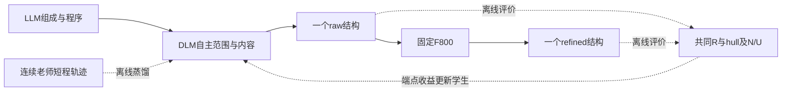

# 专家监督 DLM 修订：逐条讨论与决策记录

创建日期：2026-09-07。更新日期：2026-09-08。状态：v0.4及根因受控实验已完成；用户已要求审计v0.5并按证据执行，当前进入有界必要条件实验，新增梯度训练尚未启动。

本文件单独记录用户与 Codex 对 GPT Pro 方案的讨论。后续逐条更新同一文件，不为每轮对话另建一份计划。只有用户明确确认的内容才记为“已确认”；GPT Pro 的建议和 Codex 的建议均不能自动转成执行决定。

讨论方式更新：用户明确欢迎质疑、反对及更多候选。后续按问题展开比较与推演，说明推荐理由、数据和计算预算；不以连续询问“是否同意”代替研究。条目仍用于记录决定，不限制讨论只围绕一个既定方案。

2026-09-08 最新授权替代前一阶段的讨论限制：完成最后审计后开始执行；最多16小时累计训练，最多3个同时运行或等待的Slurm任务，GPU数量按实际可用资源缩减，至少每20分钟汇报。只计算comp_valid、Struct_valid、SUN和MSUN，raw/refined任一端点相对同协议H1A2有前景即可；不再计算Direct套件。固定原H1A2 rich Plan的1200请求面板，主面板组成及其后代不进入新编辑训练。

历史讨论阶段曾要求“先讨论好再做”；后续已收到明确启动授权。当前分支codex/expert-self-edit-20260908，执行清单和不可变源码/运行回执位于execution/expert_self_edit。已完成2048个新训练请求的P0/B0/teacher494构造；物理标签与模型短验证不等于学生有效性结果。

**当前推理边界（用户最新明确）：DLM 必须自主定位、选择编辑范围、产生 mask 并重生成。专家/工具用于离线监督和事后评价，不在 DLM 自修订推理中提供错误位置、能量/力/应力或修正答案。下面曾讨论的在线工具反馈和规则指定编辑位置的方案已不作为主方案。固定 tau800 保留为单独的下游系统端点，其结果不反馈给 DLM 决定本次编辑。**

<a id="sun-v05"></a>

## 0.5 以SUN为主目标的方法修订提案（2026-09-08，待验证）

**执行前审计更新：** 已完成独立科学与代码复核，修正坐标基底、训练反馈用途与运行身份、精修导出绑定等问题。[最新审计及先导进阶条件](EXPERT_REPAIR_PLAN_AUDIT.md)批准有界canary和教师候选空间检查，未宣称提升概率已被确认。首个训练先导若获准将使用非负候选权重的奖励加权监督与参考正则；下方策略梯度式只在满足真实行为策略与有效概率条件后适用。最终F800不改，旧MAIN不改写。

用户本轮要求：以提升SUN为根本目标，提出能够支撑既有论文故事的新方法；raw或refine端有效均可。补充要求解释大量raw/refine差异、DLM为何没有学到稳定性以及内容loss偏大。用户已再次确认推理不调用MLIP或外部几何筛选，每请求只输出一个候选。以下是Codex的方法建议，不能当成已验证提升。

**建议主线：把连续几何先验蒸馏成DLM可执行的短程修订，再用真实学生动作的最终SUN收益训练内容与决策。首轮优先优化固定F800后的SUN；raw作为单列副端点和后续直接生成方向。** 不继续以“降低teacher token CE”或“增加R verified”代替发现率，也不要求同一更新同时提高两个端点。

本轮新增只读证据见 [SUN目标审计](execution/expert_self_edit/sun_objective_audit_20260908/SUN_OBJECTIVE_AUDIT.json) 和 [DLM loss尺度审计](execution/expert_self_edit/sun_objective_audit_20260908/DLM_LOSS_SCALE_AUDIT.json)。前者校验了已冻结7200行CSV的SHA及全部六组四指标计数，没有重算或改写正式SUN。原MAIN已被用于提出假说，后续不得再称其为新的独立验证集。

### 0.5.1 目标错位比“loss大”更重要

冻结评分代码 `scripts/evaluate_programmed_paths.py::classify_stability` 定义：

\[
\mathrm{SUN}(\mathcal B)=\frac1{|\mathcal B|}\sum_i
\mathbf1[h_i\le0]\cdot N_i\cdot U_i(\mathcal B),\qquad
h_i=E_R(x_i)-E_{\rm hull}(c_i).
\]

这里重构/可评价性由既定输入流程处理；缺失必要结果仍保留请求分母。MSUN的能量阈值为0.1 eV/atom。N/U使用冻结参考和匹配器，评价所声明的raw或refined输入结构，不擅自换成R松弛终态。正式SUN没有额外乘上R verified，后者是单列的终态一致性诊断。

这揭示三种错位：

- **相对降能不等于跨过稳定阈值。** 例如h从0.40降到0.20满足旧S的0.01改善合同，却没有SUN；h从0.005降到-0.002能够跨阈值，却达不到旧0.01改善门槛。这只是说明定义差异的数值例子。
- **R verified不等于SUN。** B0 refined的101个SUN中只有45个R verified，另56个仍按冻结定义贡献SUN；编辑器refined为52/92。不能将其全部当作训练负例，也不能把未验证低能量直接视为可靠物理真值。新数据需按同一评分定义给出终点回报，并将标签置信度单独记录；数值不一致、缺失标签不伪造确定偏好。
- **原生目标不等于系统终点目标。** raw的评价对象是R(x)，refined是R(F800(x))。当前训练大部分在优化前者，论文却希望后者提高。两者的动作排序没有相同的保证。

### 0.5.2 raw与refine的实测差异说明什么

同一1200请求的现有结果如下，均为回溯描述，不是新的因果实验：

| 方法 | raw SUN | refined SUN | raw SUN被保留 | 新获SUN / 丢失SUN | refined中0<h≤0.05的数量 |
|---|---:|---:|---:|---:|---:|
| H1A2 | 27 | 103 | 17 | 86 / 10 | 268 |
| B0 | 30 | 101 | 16 | 85 / 14 | 282 |
| 当前编辑器 | 38 | 92 | 18 | 74 / 20 | 240 |

B0的101个refined SUN中，41个来自raw几何无效的请求，60个来自raw几何有效的请求。其raw仅有48个0<h≤0.05的可评价结构，而refined有282个。这支持优先研究refined终点的近阈值转化，但这些结构不是可保证的新增SUN，也不能从MAIN抽取它们训练。

F800不是单纯把原raw稳定集合保留下来：B0的30个raw SUN丢失了14个，编辑器38个丢失20个。原生能量改善也不能自动传递到下一次F800。已有16来源组成实验同样没有显示raw教师收益稳定传递到F800，但它受原数值重复性影响，不能将其作为所有来源都会退化的证明。

现有refiner的源码与DLM有实质差别：CSPNet使用周期相对坐标和晶格Gram特征，在多个噪声尺度上学习lattice噪声与wrapped-normal坐标score，并持续按当前完整几何更新。当前DLM虽已有OLD/current周期状态编码，却主要学习一份最终teacher token序列；它既没有接收到这个连续去噪场，也没有直接学习系统SUN回报。后续F800参数没有丢失，缺少的是DLM自身对该先验和目标的学习。

### 0.5.3 DLM的大loss到底意味着什么

核对实际checkpoint tokenizer和 `ExpertEditObjective.typed_vector` 后：

| 数值字段 | 有效类别数 | 均匀分布CE（nats） |
|---|---:|---:|
| 单个晶格长度 | 501 | 6.217 |
| 单个晶格角度 | 179 | 5.187 |
| 单个周期坐标 | 100（合并0/1别名） | 4.605 |

当前CE已经在字段类型支持内计算，训练和推理使用同样的0.7温度；不能把它解释为整个语言词表太大。FIT8的训练坐标CE为0.061，开发为4.958；对应目标概率的几何平均约94.1%与0.702%，不是top-1准确率。这说明在该开发面板上，精确坐标目标的拟合仍很弱。

还要避免混淆日志：FIT8开发总loss约3.360、content_ce约3.292、G/S内容CE约4.723/5.107。前两项按混合视图batch平均，后两项只在有内容监督的对应任务上平均。改变content/inspect/judge比例会改变总loss的尺度，不能直接跨配置比较总loss。

已知原因与证据强度分别是：

1. **已修复的位置偏差。** 旧随机prefix加suffix平均监督使66-token末/首期望系数达315倍；next-token修复后仍没有可靠物理收益，因此它不是全部根因。
2. **已测到的覆盖与泛化问题。** 原64来源400更新时S位置平均只直接监督2.48次，83个位置未覆盖；8来源充分覆盖后能达到低CE且训练S降能7/8，开发却仅28/128且丢失大量可靠性。这排除了“当前设置完全不能优化这类目标”的笼统判断。
3. **目标表示与多解性。** 严格token CE惩罚等价原点/排列和相邻bin，且单一随机F输出只是可能答案之一。等价对齐四种子未奏效，所以不能再次将换一种代表当成充分解法。
4. **长程映射与自采样误差。** 当前多数动作重写整个晶格和全部坐标；输入到任意F最终输出是难的跨结构映射。teacher-prefix训练看不到与部署一致的错误前缀及其后续修复任务。低训练CE也没有保证完整自由生成或正确拒绝坏提案。
5. **学习目标不表达物理后果。** 同样的正确token概率可以对应近邻误差或严重碰撞；布尔S gain也不区分距hull阈值的远近。周期特征已经存在，因此“再加一个周期adapter”本身没有针对这一缺口。

数值网格对Strict零阈值可能有影响，但现有证据不支持直接归咎于表示容量：旧512例审计的量化能量中位变化为+2.846 meV/atom、Meta proxy保留505/512；25/207的Strict proxy保留是极敏感的单点零阈值诊断，不能当作当前经过R后的SUN上限。新增可达性检查要评价实际量化后的完整候选及最终端点。

### 0.5.4 推荐方法：连续去噪过程蒸馏＋SUN终点策略学习

**第一步：将一个困难的最终答案，拆成学生能执行的短程几何动作。**

- 离线保留model494的稀疏中间状态、噪声尺度和完整后续结果。现有 `sample` 已返回 `all_frac_coords/all_lattices`，当前调用通常丢弃轨迹；这提供明确实现入口，旧未保存的轨迹不能假装已经存在。
- 优先在低、中噪声及真实学生状态上构建短程cell/局部XYZ候选，包含KEEP、1/2/4/8原子组以及必要的全局恢复。作用范围由离线老师提供训练标签，推理时由DLM自己选择。局部范围之外的状态保持不变。
- 可用连续老师的周期隐状态或去噪方向作**离线辅助监督**，教现有学生周期编码器几何关系；在线只保留学生模块，不调用老师提供位置或修正答案。它与V3从零学习整个连续生成场、以及已经做过的普通周期adapter不同。
- 候选是完整且相关的几何动作。量化后的完整结构必须重新评价；不能将教师全局终态的一部分拼回OLD后沿用原能量，也不能把800个相关时间点当成800个独立来源。
- 使用多个完整、可用的教师动作形成软目标或质量加权的动作集合，保留多解性；不把不同候选坐标求均值来制造“平均晶体”。连续去噪步骤不是逐步降能保证，是否值得执行仍由完整终点回报确定。

**第二步：从学生自己的完整轨迹学习SUN收益，直接更新内容logits。**

固定同一状态x、条件c、终点z及预算，离线收集K=4个学生动作/短轨迹，加一个KEEP对照。主臂z=refined，使用同一固定F800及共同R；raw臂以z=raw另训或另设adapter，不把两端回报随意混为一个平均目标。每请求的多个备选是互斥动作，不是四个同时输出的晶体。

令T_raw为恒等映射，T_ref为固定F800。使用相同refiner随机种子配对比较T_z(y)与T_z(x)，并在少数独立refiner种子上平均，减少单次随机去噪的偶然奖励。所有F/R运行采用已验证的确定性数值设置；采样随机性仍按声明种子保留。

主要反馈是把候选替换同一请求位置后，固定训练cohort的SUN净变化：

\[
A_i^{(z)}=|\mathcal B|\left[
\mathrm{SUN}(\mathcal B_{i\leftarrow T_z(y_i)})-
\mathrm{SUN}(\mathcal B_{i\leftarrow T_z(x_i)})\right].
\]

替换一个较早结构可能改变后续同组成样本的uniqueness，所以须重算受影响的同组成关系；不能只减两个独立行的U布尔值。训练可采用固定小cohort和独立回放集合近似规模化，但正式评价仍用原完整请求顺序及匹配器。未知项不伪造成确定偏好。

为缓解Strict SUN的稀疏性，添加较小、饱和的hull距离塑形项，例如rho(h)=sigmoid(-h/tau)。主奖励仍是SUN净增；塑形不能无限奖励已经很低的能量，也不能用降低组成/结构多样性换取虚假成功。rho的尺度在训练/校准集固定，不通过MAIN选取。

实际采样已经是依次条件揭示，因此可以为**执行轨迹**定义概率：

\[
\log\pi_\theta(a|x,c,z)=\log\pi_\theta(\text{scope,mode}|x,c,z)
+\sum_{j\in\text{executed reveals}}\log p_\theta(y_j|x,c,z,y_{<j})
+\log\pi_\theta(\text{commit}|x,y,c,z).
\]

KEEP、模型选择的scope和最终commit决策也必须计入；KEEP分支没有内容项，不重复计一次commit。scope可使用有明确概率的无放回顺序采样并记录整个顺序，不能把确定性top-k分数直接当log概率。训练不能只优化一个后验接受头。只有严格记录实际mask、已采样prefix和typed支持时，这才是所执行策略的概率；它不是一般并行LLaDA输出的精确likelihood。首版应使训练和执行使用同一概率策略；若另外采用确定性接受阈值，需要登记并直接评价该冻结策略，不能宣称上述无偏策略估计自动覆盖非随机门槛。若改成一般并行masked diffusion，必须使用有效ELBO/方差降低估计，不能把任意masked CE直接当log概率套PPO/DPO。

首版损失按职责分开：

\[
\mathcal L=
\lambda_{\rm tr}\mathcal L_{\rm transition}
-\mathbb E[A^{(z)}\log\pi_\theta(a|x,c,z)]
+\beta\,\mathcal L_{\rm KL}
+\lambda_{\rm keep}\mathcal L_{\rm preservation}
+\lambda_{\rm geom}\mathcal L_{\rm geometry}.
\]

- transition：匹配实际揭示位置的短程/多目标监督，保留next-token修正；几何隐状态蒸馏是独立辅助项，可消融。
- SUN策略项：在真实学生样本上进行受约束的小步策略/偏好更新，收益进入生成内容参数和范围选择；不只训练评分头。
- KL及preservation：保持参考生成分布和已经贡献SUN的状态，KEEP参与同状态比较。未找到老师不自动标成KEEP最优。
- geometry：用于表示物理错误严重度的离线辅助损失或完整采样风险。周期距离必须处理跨边界；多个边缘分布的平均坐标可能形成不存在的结构，不能只在这种均值结构上计算碰撞来声称约束了实际采样。

损失项按有监督样本/字段归一，记录各自梯度范数与方向；先保证内容与决策都有有效梯度，不用任意放大某个系数来制造总loss下降。终点和保留目标以开发SUN决定是否有效。接受器可保留，但需在最新学生完整提案上预测相对终点收益、在独立校准集选择保守提交规则；它只读学生内部状态，不接收在线物理量。

推理仍是：LLM产生组成/程序 → DLM自主选择范围并做有限次masked修订 → 输出一个结构；refined端再运行一次固定F800。没有在线K候选择优、没有MLIP反馈循环、没有外部几何veto。初始B0、tokenizer与参考权重按现有身份合同恢复；不从FIT8这个明显过拟合的checkpoint继续训练。



虚线只表示训练/评价阶段；推理没有从R或连续老师返回DLM的反馈路径。raw和refined两个端点各自对应声明的输出与评价方式。

### 0.5.5 为什么优先refined，以及保留哪些备选

主臂首先训练“怎样给现有F800提供更有利的输入”，因为现有refined端已有约8.5% SUN且近hull样本更多，能量转化空间比当前raw更直接。这是优先级判断，不是收益保证。蒸馏臂同时检验DLM能否独立学到一部分连续去噪能力；若raw已可靠提升，可以作为主结果，但两个端点都完整披露。

备选是对真实DLM输入分布学习refiner入口/条件化连续残差，作为明确的新refinement协议，并保留原F800对照。它需要与DLM反馈主臂分开，且收益不能全归给DLM。首轮不同时改连续模型，避免无法归因。

不优先做：单纯增加编辑次数、再次扫描更长CE训练、只改等价代表、只放宽接受阈值、直接训练全新连续场、普通target_stability提示、仅缩短tau。旧L6同面板tau0/200/500/800的SUN计数为10/29/39/48（均512请求），已经表明简单缩短精修不是已知解决方案。

### 0.5.6 最小可判定实验

1. **教师可达性与标签检查。** 在与MAIN隔离的训练来源中固定64个状态、K=4个完整动作加KEEP，先评价量化后raw及固定F800终点。覆盖几何恢复、近hull、远hull和已稳定保持；训练可有明确课程分层，开发必须保持自然请求分布。只在存在足够跨阈值或保留/损失的可比较动作时继续，不能拿0.01相对降能数量充当SUN教师空间。
2. **损失与自由生成检查。** 固定小训练集合验证短程动作监督、完整轨迹概率和内容梯度；要求训练与未见来源都评价真实SUN，并单列已稳定状态的破坏。极小训练集记忆成功只验证可优化性。
3. **三臂同预算比较。** A为同训练量的现有终态CE控制，B为短程连续过程蒸馏，C为B加refined-SUN终点反馈。相同初始化、来源、数据访问和DLM forward预算；A/B/C的额外物理标注成本分别记账。首轮冻结F800，只归因DLM学习。必要的raw-only反馈作为预先声明的目标消融，不临时按最优结果选端点。
4. **开发筛选。** 以相同256请求、两个生成种子作为初筛，完整报告四项正式指标及raw/refined；对正式SUN必须重算合并cohort的U。小幅正值或区间跨零只称promising，不作为论文确认。R verified与CE是解释量，不作为替代终点门槛。
5. **确认。** 固定方法和终点后，用新的outcome-blind Planner请求对照同协议H1A2/B0；旧1200 MAIN仅保留回溯结果。K8在原约束下的历史高分仍列强参照，关闭外部几何检查后的K8能力必须单独复测，不能直接搬用99.33%。

沿用最多6张A800、最多3个Slurm作业、累计梯度训练16小时的已确认资源边界；此前保守用时3.13小时。首轮建议给新方法不超过3小时梯度训练预算，先确认老师动作的SUN空间；标签和评价时间另行按实测速率核算。本段是实验设计，本轮没有提交新GPU作业。

### 0.5.7 对论文故事与相关工作的准确定位

现有三层故事可保持：C3FD处理组成可行性；LLM程序与DLM处理受条件的周期结构生成和重访；第三项改为**连续物理过程如何教会离散动作，并以最终发现收益训练这些动作**。不能把原来尚未成功的S分支直接写成已经实现稳定化。

“用物理奖励做RL”“LLM接连续refiner”均已有工作：

- [CrystalFormer-RL / Reinforcement Fine-Tuning for Materials Design](https://arxiv.org/abs/2504.02367) 使用hull等奖励微调生成器；其文中SUN稳定阈值为0.1 eV/atom，不可与本项目Strict SUN的0阈值直接比较。
- [Chemeleon2 / Guiding Generative Models to Uncover Diverse and Novel Crystals via Reinforcement Learning](https://arxiv.org/abs/2511.07158) 已联合考虑稳定性、新颖性和多样性，不能把多目标RL本身称作本项目首次创新。
- [FlowLLM](https://arxiv.org/abs/2410.23405) 已将语言模型输出作为连续flow的起始分布；串接两个模型并不足以构成新贡献。
- [LLaDA 1.5](https://arxiv.org/abs/2505.19223) 讨论masked diffusion偏好优化中ELBO估计的方差问题，支持对likelihood估计保持严格区分。
- [SDEdit](https://arxiv.org/abs/2108.01073) 提供先加噪再去噪的编辑范式，可作为新refiner入口的相关基线，不是针对晶体SUN已验证的修复。

旧项目文档也已经提出局部potential posterior、basin SFT和refiner反馈。新实验不能把这些名称重新包装；需要真正新增并验证的是：**短程连续教师信息进入学生的离散几何操作、同状态含KEEP的实际学生轨迹、端点特定且包含N/U关系的SUN净收益**。这些是否足以构成论文方法贡献，取决于三臂结果与必要替代对照，而非命名。

## 0. 历史执行计划 v0.4（16小时上限与几何/物理编辑分工，已完成）

本节将已经确认的约束和 Codex 的实施建议合成一份可评审计划。下面带“建议/拟”的设计尚不是完成结果；详细讨论和来源保留在后文。只维护这份当前计划，不复制多份平行版本。

本轮审计结论与完整科学链路见 [计划审计报告](EXPERT_REPAIR_PLAN_AUDIT.md)。结论为 **APPROVE WITH CONDITIONS：认可研究路线及有证据门槛的实施顺序，不预先认可性能。** 用户随后明确授权开始执行。技术设计和常规修复由Codex负责；长训练仍需先通过实际量化目标收益、内容学习和自主短测的证据门槛。

v0.4执行修订：首轮只验证已训练的全晶格/全坐标G、S类型。采用逐标量条件回填，以匹配训练中的已揭示前缀；4/8块作为后续速度对照，不假设独立边缘分布能保证联合几何。每次底层前向均计费，单G+单S最多136次（20原子、全晶格范围），不用隐含额外旧态前向。短训监控训练/开发集的G/S内容损失，并在同类独立来源自由生成上评价；训练差先查梯度/目标/LR/容量，训练好而开发差则扩大独立来源、调整正则，不靠重复少量正例填满16小时。

最新用户允许将训练上限扩展到16小时，并要求先说明几何与稳定性修订由谁完成、怎样改变logits及按何种证据扩大训练。下述双任务分工、分阶段训练与预算替代v0.2中未区分任务的两轮建议；它们是Codex修订后的设计，不冒充已验证能力。

### 0.1 已确认的预算、目标与阶段顺序

| 项目 | 当前约束 |
|---|---|
| 训练算力 | 6 张 A800；前 12 小时另有 1 张机动卡，任务同时占用最多 7 张 |
| CPU | 每张 A800 配 4–6 个 CPU 核；7 卡合计不超过 42 核，6 卡合计不超过 36 核 |
| 前 12 小时窗口 | 根据资源说明收到时间，约为北京时间 9 月 7 日 23:21 至 9 月 8 日 11:21；它是资源可用窗口，不是已经开始的训练计时 |
| 窗口结束后 | 用户已补充：到周三中午可继续用 6 张 A800 |
| 主训练预算 | 用户已扩展至最多16小时；先取得编辑能力与自主收益证据，再扩大训练，不为填满时长盲目重复数据 |
| 交付截止 | 北京时间 2026-09-09（周三）12:00，即 2026-09-09 04:00 UTC |
| 结果目标 | 与 H1A2 使用可比口径，原生或固定 tau800 任一端 SUN 超过基线可视为 promising；两端完整报告 |
| Planner/C3FD | 当前保留完整 rich Planner；化学内化实施排在专家修订能力完成之后 |
| 执行状态 | 先讨论完整计划；当前不改实现、不构造数据、不提交训练 |

### 0.2 拟采用的方法与保留的备选

建议采用“完整B0初始化的双任务编辑分支＋内部周期状态输入＋学习到的范围/接受决策”，保留冻结的B0/R03初稿。几何恢复G和物理终态改善S都由这个经过新训练的DLM修改晶格/坐标，只是任务条件、老师和损失不同。Edit/KEEP负责选择提议，不承担坐标生成。内部状态编码不接收外部错误清单或在线物理反馈。

拟分成三个相互关联的学习输出：

1. **编辑内容。** M2T/T2T联合训练，G模式直接学习错误几何→可用目标，S模式直接学习当前结构→已核验的更好终态目标；两种损失都更新内容生成的LoRA/状态编码。只训练评分头不算学会内容修订。
2. **局部编辑选择。** 模型对晶格组和各原子 XYZ 组预测纳入当前编辑范围的先验，由已核验的专家 scope 监督。采用可表达协同范围的选择方式；不把组分数当逐原子稳定性或可相加的真实能量收益。
3. **整体Edit/KEEP。** 对“旧结构、任务、范围、完整新提议”分别预测几何可用性/退化和可信物理改善。G任务以恢复几何为目标；S任务要求几何保持且有物理收益。KEEP不是稳定证明，也不能把一个整体分数等量加给所有token logits来声称引导了生成。

整体与局部模块首版推荐共享表征、使用小型头，不默认另训第二台 8B。整体接受器必须看具体完整提议，不能只对旧态给一个质量分数。若排除输入/标签问题后 B0 重填仍明显学不会，才考虑专门周期几何编辑器，并重新说明论文贡献归属。候选比较及评分语义已补入 D05 审计后的建议。

首版推荐：保存x0 → 学得几何判断决定是否进入G → 模型选范围、remask和重填 → 学得接受判断 → 几何被模型判断可用时进入S → S模式生成更好终态提议并决定是否接受。路由和具体位置由模型决定，事后物理评价不参与该次决策。几何仍未被模型判断可用时结束并记录状态，不强行执行稳定性阶段。

当前推荐最多2次G提议＋2次S提议，每个任务的第一/第二次联合重填上限8/4步，合计最多24次内容forward；各提议检视/评分最多8次，总目标上限约32次DLM forward。能跳过G、选择不编辑或拒绝时提前结束，不为用满预算强行修改。开发阶段同时检查约16次的较小预算；主预算在主面板前固定，不把更多推理计算的收益混称训练收益。该设计替代上一版未区分任务的“两轮约16次”，不是已实现速度。

各步联合重填采用分块揭示，使后续预测能看到已经提交的晶格/坐标；不能把所有数值独立采一次当成可靠联合几何。训练必须覆盖这些部分揭示状态。G和S都可选择局部、全XYZ或晶格＋全XYZ；局部编辑基数由模型在1/2/4/8/N中选择（按N去重裁定可用档位），不是硬编码错误位置。

### 0.3 专家目标与编辑标签的定义

训练目标分为几何恢复、物理终态改善和可靠保持，分别记账。

- **几何恢复目标：** 实际量化解码后的完整目标可构造、满足声明的几何要求，并修复了旧态的相关错误。旧态无法可靠计算物理量时，只标几何收益。
- **物理改善目标：** 固定组成，在同一公共弛豫与能量协议下，候选的可信终态优于旧态，且不破坏原本有效的几何。收益容忍度在训练数据的数值/量化检查后固定，不用主结果调阈值。
- **绝对稳定标签：** 另需可靠 hull 参考与既定阈值；相对更低能不自动等于稳定。未知参考不妨碍同组成相对排序，但不能补成稳定标签。
- **保持和拒绝：** 保留可靠 identity，记录会破坏几何或造成已核实退化的提议。物理失败、未收敛或未知不自动标成 KEEP。

已有原态、refiner 输出、弛豫终态与量化后的编辑目标是不同物理对象；各自绑定标签。专家目标优先复用已有数据及固定 model494 的训练用途结果，不能取用正式评测输出训练。

### 0.4 原子对齐与可执行性

| 情况 | 拟处理方式 |
|---|---|
| 同一可信物理轨迹 | 检查有序物种与原子数，沿原身份追踪坐标/晶格；提取少量量化后真正变化的宏观步骤 |
| MP20 受控扰动 | 保留 clean 与扰动的共同站点身份、坐标系和实际扰动记录；这是恢复序列，不冒称真实物理运动轨迹 |
| 不同候选或 model494 终点 | 核查物种置换、周期平移和晶胞表示对应；不能直接按数组下标相减 |
| 无可靠局部对应 | 可保留质量排序用途；若使用全胞重写需明确表示对应与完整目标，不能伪造局部因果标签 |

目标转换到 B0 的实际 token 空间后重新核验。局部编辑 M 的目标必须满足 target 在未编辑位置与 old 一致，或明确重建完整混合候选并验证；晶格与多原子协同变化不能被拆成未经验证的局部片段。

局部范围初步考虑少量候选，如局部组、全 XYZ、晶格＋全 XYZ，不枚举所有子集。可以先在约 128 个训练来源上检查最多 3 个范围，统计可执行性和改进产率；这些是拟议离线数据工作，当前未执行。

### 0.5 数据构造的初始规模与用途

| 来源 | 初始预算建议 | 用途 |
|---|---|---|
| MP20 训练来源 | 2048 个来源，每个 3 个扰动实例＋1 个 identity；编译前约 8192 条 | 几何恢复、可见错误纠正和保持 |
| K4/K8 | 清点现有资产，最多选约 2048 条合格编辑记录；排序对另计 | 同组成物理偏好及可可靠对齐的编辑 |
| 当前 full-rich B0 | 建议最多约 2048 个新训练请求，每个最多 2 条宏观编辑 | 当前生成分布中的真实错误和终态改善 |
| 独立开发验证 | 约 256 个来源组，按来源/组成祖先隔离 | 选点、编辑、评分及校准，不能拆同轨迹到训练和验证两边 |
| 一次学生態刷新 | 约 256–512 个训练来源请求 | 收集当前学生实际产生的状态，补充必要监督 |

这是上限/起点建议，不保证全部生成合格对。初始编辑池大致为 8k–14k 条；不能把旧候选数、排序对数和编辑对数混成同一种训练样本。来源权重单独控制，防止大量简单扰动淹没真实物理修订。

每条记录保留：source/split、实际条件、old/target、编辑组、量化和对齐信息、修改前后物理结果、未知/失败状态、模型/代码/协议身份。旧数据缺少实际 full-rich 条件时，可用于兼容的辅助任务，不能将专家目标的 SG/VPA 伪造成部署输入。

MP20 来源的 rich 字段可在接口兼容时由冻结 P0 对给定训练组成作条件续写，并登记为训练条件生成；否则仅用于几何辅助任务。自由生成的当前 B0 样本必须保留实际完整 rich Plan。保留同组成的多个好终态，不全部指向唯一教师模板；按来源祖先及 reduced-composition 隔离开发组，防止同轨迹或超胞变体跨组。新增教师目标与主输出的结构重合另做诊断，固定 benchmark 的 N/U 参考不暗改。

构造时优先抵扣已存在的物理标签、轨迹和官方参考缓存。只有结构或协议改变的部分重算；各 GPU 分片尽可能并行，但总资源始终受 7/6 卡与 CPU 上限约束。

### 0.6 训练 epoch、时长与学生态刷新

训练改为**先验证再扩大的最多16小时课程**。继承完整B0，冻结构造分支、backbone和已有晶体embedding/head，训练修订LoRA、实际接入forward的任务/周期状态编码，以及范围和决策头。两种任务使用共享编辑参数和不同任务条件；首版不另训两台8B。

全局 batch 初步取 24 个编辑视图；每卡 microbatch=1、累积4，或在显存允许时 microbatch=2、累积2。每个 epoch 的实际记录数、各来源采样量和揭示阶段分布单独记录。

用获准后的短批吞吐、真实batch和每个视图的活动token数固定阶段更新预算。六卡速度取决于实际DDP、批处理和多位置监督；不能将旧逐scalar循环的成本除以6就声称已估计新训练。诊断、主训和刷新续训的梯度时间累计不超过16小时。

| 累计梯度时间建议 | 内容与扩大条件 |
|---|---|
| 0–2小时 | 几何恢复/可见错误训练为主，兼有物理样本和保持；检查完整恢复、梯度路径、给定范围的重填能力 |
| 2–6小时 | 混合G/S训练，独立开发来源检查自主几何净恢复、可核验的终态改善、接受器的收益与破坏 |
| 6–12小时 | 前述能力成立后，增加经过核验的当前B0真实错误和一次学生态刷新，增加S任务覆盖 |
| 12–16小时 | 仅在开发证据仍支持继续时续训；保留最佳开发checkpoint，不默认最后一份最好 |

训练样本任务比例起步可用G/S/identity＝60/20/20，进入物理混合阶段后调整为35/45/20；比例是调度建议，实际物理正例不足时不重复少数对来伪装足额。负例用于范围/接受/对比任务，不把坏提议作为正向生成目标。各损失按活动位置归一化，分任务报告，防止全胞标签或identity数量掩盖某一能力。

初始仍约8k–14k编辑记录；证明有效后优先增加最多2048个真实B0来源和将一次刷新扩至512–1024请求，目标约16k–22k合格编辑记录，按实际产率收敛，不机械加倍简单MP20扰动。旧数据标签身份一致时复用。初始14336记录、每条每遍一个视图、batch24时约598更新/遍；16小时按每步12/15/20秒的纯更新上界为4800/3840/2880，开销与验证另计。epoch由实际视图数和更新数报告，不先承诺固定遍数。

一次学生态刷新在前段监督训练后进行；仅使用训练来源。混合原数据和新学生状态继续训练，避免只适应少数新样本。checkpoint 选择依赖预先声明的开发集表现及破坏率，不看主测试 SUN 挑版本。

刷新同时收集学生实际提议的正例、退化例和无法判断的例子，不能只刷新老师目标。机动卡已到期时，应暂停训练并保存完整续训状态后采集刷新，不能六卡DDP之外额外占卡。

### 0.7 必要验证与主结果

必要验证分清四个问题：父模型恢复是否完整；量化后的老师目标是否可达；给定正确范围时 DLM 能否重填；完全自主选范围后是否仍有实际改善。内部评分升高或 loss 下降不替代外部物理结果。

主面板建议事前冻结约 **1000 个完整 de novo 请求**，失败保留。不能收集 1000 个成功结果后再作为请求分母。

比较应区分：原 H1A2 的 D1 生成链、保留的 R03 父初稿，以及 R03＋新修订。新修订与 R03 使用同一份初稿；原 H1A2 作为用户要求的比较基线，不将 R03 重命名成 H1A2。具体是否复用已有合格基线或补同 Plan 对照，在核实来源后决定。

历史 H1A2 的两个数字只作分母边界提醒：新官方口径的旧 1000 成功输出为 Strict/Meta 96/478；完整 1200 请求的 H1A2 为 103/553。两者不能交叉使用。主比较必须使用相同端点、协议和可比请求口径。

同时报告 native 与 tau800 的 Strict/Meta SUN、Stable、N/U、几何有效率、未知与失败、编辑/KEEP及额外推理成本。按用户要求，任一端 SUN 比同口径 H1A2 高可作为 promising 信号；不额外将统计显著性设为用户未要求的硬门槛，也不把单独几何指标提升冒称 SUN 提升。

源码核实：N/U 使用传入结构，Stable 使用其公共 CHGNet 弛豫终态；Strict阈值0、Meta阈值0.1 eV/atom。主SUN不强制terminal verified，也不以comp_valid作为必要条件，verified子集和各有效率须另列。主分数保留现有定义；若论证新稳定多晶型发现，再核查可信终态的新颖性/重复情况。

建议三列采用同一新P0 Plan队列：H1A2 D1、冻结R03 D2、新修订；后两列共享初稿。保留相同请求顺序，Unique当前选匹配类别的首代表，不能按能量先排序，也不能相加各seed的Unique。超过基线一例/1000就是0.1个百分点，按用户标准可记初步信号，同时解释退化、未知和verified变化；不对整批去重依赖的SUN套独立逐行检验。

现有 SUN/标注/有效率脚本继续复用。原生 N/U 的已知阻塞需要作为工程问题解决，超时不能记成 novel、stable 或模型科学失败；指标定义保持明确且一致。

超时隔离也不能随意变成过滤规则：删除结构可能改变后续首代表及Unique。先把工程完成性解决，再给完整面板的正式SUN。

### 0.8 资源排程与交付

执行启动时间以讨论完成后的明确指令为准。届时先重算剩余窗口，不把已经过去的时间算成仍有 7 卡可用。

- 数据阶段：最多利用当时可用的 7 张或 6 张卡，分片生成、精修及标注；CPU 编译与 GPU 阶段适当重叠。
- 基线与参考：冻结主Plan队列后，H1A2/R03基线和相同组成的参考准备可提前与数据/训练分阶段重叠，不等学生权重出来后全部串行重跑。
- 训练阶段：6 卡 DDP，若机动卡窗口仍在，用于有限验证、数据收尾或学生态刷新；不超占用。
- 评测阶段：12 小时窗口后仍有 6 卡，按已冻结请求分片；参考查询在允许联网的登录位置，模型/MLIP 计算使用计算资源。
- 建议给周三中午前的主评测、原始结果回收与报告保留约 12–16 小时。若计划确认过晚，应先重算可交付规模，不能暗中减少分母或跳过核验。

交付包括：最终方法与配置、代码身份、数据/教师/对齐清单、checkpoint 及训练记录、逐请求对应结果、两端主表、评分和编辑行为分析。论文叙述对应已实测的科学编辑监督与自主修订效果，不预填收益。

16小时是允许的训练上限，周三中午截止仍有效。实际可用梯度预算还受剩余日历时间、数据准备/刷新和必要评测余量限制；基线和参考尽早重叠，不能靠延后最终评价或缩减请求分母来装作完成。原先20–30小时全链路估算在用满新预算时需要重算，不能直接沿用。

### 0.9 已收敛的建议与仍需实测的事项

1. **首版设计已有推荐。** 双任务编辑DLM直接改变G/S内容logits，局部范围先验和任务对应的完整提议接受器共享表征；最多2G＋2S、有较小预算对照。该建议不冒充用户逐项选择或已经获得实验证据。
2. **需先做的小规模验证。** 量化后老师改善产率、可信对齐与scope、B0给定范围时的编辑能力、自主范围和接受器的收益/破坏率、真实NFE及六卡吞吐。物理容忍度依据训练侧数值检查固定，不用主结果调整。
3. **批准边界。** 静态审计认可路线和验证顺序；只有前述证据成立才进入长训练。没有必须再问用户的偏好或资源问题，当前仍遵守先讨论好再实施。

当前代码已恢复，数据、训练和评价工作均未启动。复用和文件治理遵循已有 [资产主索引](REUSABLE_PIPELINE_ASSETS.md)，审计报告只记录证据与建议，不再维护另一份执行计划。

## 1. 讨论来源

- [用户提供的 GPT Pro 交流文本](C:/Users/admin/.codex/attachments/84a86491-016b-4870-9fb7-bd4daf406349/pasted-text.txt)。
- [GPT Pro 执行方案](C:/Users/admin/Downloads/crystal_dlm_expert_repair_execution_plan_20260907.md)。该文件以代码提交 `269d7dadc7c62443d89a2ceb0c15bd23fb163bc4` 为核查基准。
- [现有链路可复用资产与评测入口](REUSABLE_PIPELINE_ASSETS.md)。
- [上一轮 K4/K8 复用范围](K4_K8_REUSE_PLAN.md)。其中“不补采训练数据”是上一轮约束；用户现已将新数据构造交由 Codex 规划，并提供资源预算，但要求讨论定稿后再实施。

这里记录方案含义和项目内证据，不将外部文献引用或方案中的理论界视为本项目已获得的性能保证。

## 2. 用户已经明确的事项

| 编号 | 状态 | 决定及边界 |
|---|---|---|
| C01 | 已确认 | **原生和固定 tau800 任意一个端点效果 promising 都可以接受。** 用户后续明确同口径高于H1A2即可；两端读数完整报告。 |
| C02 | 已确认 | 将现有评测脚本正式定为可复用入口，后续优先使用参数、配置和 manifest，避免每个实验复制一套评测代码。 |
| C03 | 已确认 | 将这次讨论记入新的独立文档，逐条对齐。尚未确认的条目继续保持待确认。 |
| C04 | 已确认 | 用户同意保留现有 Planner。组成有效率的提升仍是后续目标，需要讨论如何将 C3FD 思想内化到 Planner；现在可以讨论思路，相关实施排在专家监督修订能力完成之后。此确认不自动覆盖 D01 中 B0/修订分支的全部设计。 |
| C05 | 已确认方向 | C3FD 属于 Planner 侧，采用保守三态科学动作空间；结合与当前 DLM 能力绑定的弱 realizability residual 和 chemistry family 覆盖约束。用户同意 D02 的校正：A/B 不直接给出组成与策略的因果归因，分数绑定条件/策略/预算/端点，硬过滤与额外 residual 的 KL 分开记账。具体训练、采样实现和数值配置尚未确定。 |
| C06 | 已确认 | 用户同意第一版以完整 B0 初始化，保留冻结的 B0/R03 构造，训练独立修订参数；先保存初稿再运行修订。用户随后要求讨论修改定位、有效性/稳定性如何学习，以及 K4/K8 是否足够。新增数据与具体编辑训练方案尚未确认。 |
| C07 | 已确认讨论范围 | 用户要求继续比较专家与编辑路线，同时考虑几何和稳定性，提出具体数据量和训练时长；可以讨论让 DLM 使用工具/代理评估以及在推理中插入 edit。当前为讨论，不表示已允许启动新计算，也不表示已选定在线物理工具或改动原构造阶段。 |
| C08 | 已确认推理边界，优先于先前工具候选 | 用户强调本项目是 de novo 生成：推理时模型自己判断哪里有问题、修哪些位置、哪些变成 mask、怎样重生成。撤回在线 MLIP 反馈及外部几何程序指定错误位置/编辑组作为主方案的推荐；专家和工具只承担离线训练目标、数据核验及事后评价。 |
| C09 | 已确认监督方向 | 用户同意学习“同一组成下哪些结构有更好的物理终态，以及哪些编辑实际改善终态”；继续质疑原 B0/DLM 是否适合编辑，要求讨论专门编辑器、模型整合及数据构造/可学习性证据。C06 的冻结初稿仍保留，但修订架构按此问题重新评估，尚未选定替代模型。 |
| C10 | 用户明确的科学边界 | 用户要求核查 LLaDA2.1，并提醒几何和稳定性需要外部验证，因此 Edit/KEEP 模型仍可能必要。此处保留为候选，不因语言 token 编辑成功就取消科学决策模块；外部验证仍在离线监督与事后评测，遵守 C08。 |
| C11 | 已明确的后续研究任务 | 用户将整体/局部评分模型、评分与 Edit/KEEP 的关系、DLM 修订位置和 mask 选择交给 Codex 后续进一步论证并补入本文件；现在转到下一项讨论。只确认研究任务，不表示已选定评分架构或授权训练。 |
| C12 | 已确认的资源与目标，训练时长已由C15更新 | 用户将数据规模/构造、专家目标/对齐、epoch及学生态刷新设置交由Codex规划。最初主训练6–8小时，现上限16小时；训练6 A800，前12小时最多7 A800，之后到周三中午6 A800；每卡4–6 CPU核。截止北京时间2026-09-09 12:00。原生或tau800同口径高于H1A2即可视为promising。 |
| C13 | 当前执行边界 | 用户明确“现在先不改……拟好计划以后再去做，现在先讨论好”。必须先完成计划讨论；不能因资源已给定就开始实施。提前进行的本地接口/测试修改已撤回，原分支恢复，没有提交 GPU 作业或启动训练。 |
| C14 | 当前审计任务 | 用户要求列出剩余必要澄清，对全链路可行性、预期结果、代码复用和仓库管理做严格审计，并详细解释科学问题、方法选择与解决链路。Codex给出有条件技术认可；该请求没有撤销C13的实施边界。 |
| C15 | 最新预算与机制要求 | 用户允许将训练上限扩展到16小时，要求明确几何/稳定性修正由谁完成、怎样做、做多少，以及怎样改变选择logits；若证明有效可扩大训练。预算更新不等于要求立即运行，先把机制想清楚的讨论边界继续有效。 |

C01 的修订过程：用户先选择“先证明 DLM 原生 Stable/SUN 提高，tau800 结果如实同步报告”，随后明确补充：

> 我认为原生和tau800任意一个效果promising都可以接受

以后一条为准，不再将原生提升设为唯一成功条件。

术语说明：本文“原生端点”指结构没有经过 model494；Stable/SUN 仍通过所声明的公共物理评价得到。“原生”不表示免去公共弛豫或直接把几何有效率当作稳定率。

## 3. 逐条讨论清单

**当前以第0节审计后的完整计划和D05的收敛建议为准。** 下文保留讨论历史，不把旧候选或“待讨论”原话当成仍必须向用户追问。数据、专家、对齐与训练技术设计由Codex负责；资源和推理约束已明确，实施仍遵守C08/C13。

| 编号 | 需要决定的内容 | 状态 |
|---|---|---|
| D01 | 总体路线与父模型保护方式 | 冻结初稿已确认；推荐B0编辑分支，能力失败后才考虑替代 |
| D02 | 主比较的组成输入，C3FD 如何内化到 Planner | 方向、定义修正与实施顺序已确认；具体实现以后确定 |
| D03 | 训练数据来源与初始规模 | Codex已提出来源/上限及用途隔离，待获准后的产率验证 |
| D04 | 专家目标、原子对齐与可执行编辑的定义 | 已有明确数据合同，实际对齐/量化可用性待验证 |
| D05 | EDIT/KEEP、整体/局部评分、修订位置与推理编辑 | 已补充候选比较、首版推荐和失败判据，未实现 |
| D06 | 训练规模、学生态刷新、资源与截止时间 | 训练上限更新为16小时；先验证G/S能力再扩大真实错误与刷新覆盖，按吞吐固定阶段更新数 |
| D07 | 两端评测与 promising 的具体判据 | 任一端同口径高于H1A2；建议1000完整请求、匹配D1基线及双端全部读数 |
| D08 | 论文贡献与完成后的表述边界 | 已给出当前科学主线和方法必要性边界，不预填效果或唯一性 |

### D01｜总体路线与父模型保护方式

**Codex 建议：** 保留完整 rich Planner 和原 B0/R03 构造，从完整 B0 晶体 checkpoint 初始化一个独立的修订分支，采用专家编辑监督续训。第一版先保存父模型初稿，再单独加载修订模型处理。

```text
冻结的完整 rich Planner
    → 冻结的 B0/R03 构造
    → 保存初稿 x0
    → 学习得到的 DLM 修订
    → 保存修订结果 xr
    → x0 / xr 各自进入原生及固定 tau800 评价
```

完整恢复包括原晶体 LoRA、训练过的 embedding/head、tokenizer 和 token ID。现有旧状态输入模块可以复用接口并重新适配，不直接继承另一条路线的整套模型权重。

这样可以保护父模型并精确配对。第一版暂不实现运行中 adapter 切换；修订分支先训练已有 LoRA 和新增小模块，构造继续使用不可变父模型。GPT Pro 建议本轮不更换 LLaDA、不重新初始化晶体生成器、不重训 Planner，也不把 RL 作为必要阶段，Codex 赞同这一范围。

**本轮提交讨论的具体选择：**

| 项目 | Codex 建议 |
|---|---|
| 构造起点 | 已有完整 R5-C B0 checkpoint，沿原 R03 构造路径生成初稿 |
| 修订初始化 | 从同一完整 B0 恢复，新增修订输入/控制模块；其具体结构在 D05 对齐 |
| 原 backbone、晶体 embedding/head | 第一版冻结并完整保留 |
| 可训练参数 | 修订分支的既有 LoRA，以及新接入的旧状态/编辑控制小模块 |
| 第一版运行方式 | 先保存 x0，再单独运行 repair 得到 xr，保留逐请求对应关系 |

上一轮 step-128 物理适配的目标是已有候选的加权重构；目前没有证据证明它比完整 B0 更适合这次“旧状态→专家修正目标”的新任务，因此不自动把最新 step-128 当作新修订的父模型。此处是起点选择建议，不宣称已经比较过两种初始化。

冻结构造可以保护初稿生成能力，但不保证修订后的能量或 SUN 不下降；新能力仍通过 x0/xr 的实际配对评测检验。未来需要联合更新构造与修订时再单独讨论，本条只决定第一版。

**本条状态：第一版模型起点与参数分工已确认。** 编辑任务、训练数据和资源仍按后续条目决定。

后续更新：用户再次提出 B0/DLM 是否适合编辑、是否训练专门编辑器的问题。保留原构造能力的决定继续有效；B0 初始化修订分支是优先检验的候选，不再把它当成无需验证的最终架构，详见后续“架构选择与可学习性”讨论。

用户结论：先同意保留 Planner，随后明确回复“我同意”完整 B0 起步、构造冻结、训练独立修订参数的方案。后续仍要提升 comp_valid，C3FD 内化的实施排在专家监督修订完成之后。

### D02｜主比较的组成输入与 C3FD 内化

**Codex 建议：** 本轮主比较沿用原 R 的 full-rich 条件和组成生成；parent 与 repair 使用同一份实际 Plan、同一份初稿。C3FD 规则修订单独登记，不同时改变主比较的组成分布。

依据：现有 `run_component.py` 把非 R 角色与 C3FD 绑定，把 G/P 与 repair 绑定。新方法需要将这两个开关拆开，不能直接沿用 P 角色就认为只改变了修订模型。

固定组成的 repair 本身不会改善 composition validity。C3FD 的混合价支持问题仍需解决，但不能仅凭单价态筛选误拒就认定它是本轮 SUN 下降的唯一或主要原因。

**用户已经明确的顺序：** 当前保留 Planner；C3FD 思想如何内化到 Planner、如何继续提升 comp_valid 是后续必须讨论的目标。先讨论思路，专家监督修订能力完成后再推进这部分实施。

用户原话：

> 我同意planner，但是后续对于comp_valid的提升还是要讨论的点（C3FD的思想如何内化到planner里面，先讨论一下，等专家监督的修订能力完成再说）

**Codex 的初步思路，尚未定案：**

1. 将“不依赖额外 C3FD 硬 mask 时是否改善”作为学习是否进入权重的诊断。根据用户后续提出的保守动作空间＋弱 residual 方案，不再将去掉所有外部控制作为 Planner 改造的唯一合格形式；外部控制与权重内化分别说明。
2. 先确定化学监督的适用范围。现有单价态域的拒绝不能全部直接作为绝对负标签；混合价支持、证据不足与已知规则违反需要分开处理。原始 comp_valid 与扩展化学判定分别记录，避免训练目标和宣称的指标混淆。
3. 利用经过核验的组成、当前 Planner 的组成错误及相应修正，构造组成生成和组成修正监督；也可研究用前缀可达性支持提供训练信号。具体采用哪种损失、是否预测化学见证，留待后续选择。
4. 从现有 full-rich Planner 续训或适配，优先把新增监督作用在组成决策上，同时检查完整 rich 输出的质量。仅把 loss 放在组成 token 上并不能保证共享权重对后续 rich 字段毫无影响。
5. 使用统一评测，记录实际启用的动作空间、残差评分及权重版本，观察原始 comp_valid、扩展化学诊断、组成覆盖与下游 Stable/SUN；不预设组成有效率提高就必然带来 SUN 提高。

固定组成的 DLM 修订与 Planner 化学学习分别形成验证对象，最终可以再组合。这里保留该方向，不实施新的 Planner 训练、C3FD 域修改或组成采样。

**后续需决定：** 化学判定语义、训练信号与方法、如何保持 rich 能力，以及何时满足进入此阶段的条件。当前不要求用户一次回答这些问题。

用户结论：用户回复“好的我同意，我们进入下一点的讨论”，同意三态支持＋当前 DLM 可实现性弱 residual＋化学覆盖约束的方向，以及下述定义修正。Planner 实施仍排在专家监督修订之后；具体损失、阈值、采样器和运行预算以后确定。

#### D02 补充讨论｜三态科学动作空间与 DLM 可实现性

**用户提出的两点：**

1. C3FD 只在 Planner 的 composition state 上提供科学动作空间；采用 `REJECT / UNKNOWN / PASS`，只有可靠拒绝才置零。Fe3O4 等混合价例子不能因单价态无解而被排除，C3FD 不承诺最终结构稳定。
2. 保留原 H1-A2 分布，用历史 rollout 学习当前 DLM 实现好结构的可能性，作很弱的概率修正；保持 KL 和不同 chemistry family 的覆盖。A/B 分开观察，避免只因少生成困难类别而提高汇总 Stable。Novel/Unique 很大程度取决于实际结构及多晶型。

**已确认的讨论结论：** 用户同意职责划分、保守调整方向及以下定义补充。公式作为后续设计依据，尚不是已经实现或实测的采样器。

**a. 三态结果需要明确证据范围。**

| 结果 | 建议语义 | 解码处理 |
|---|---|---|
| REJECT | 有可靠依据违反已声明的任务/化学规则，或已证明该前缀在相应范围没有可接受延伸 | 排除，并记录理由与规则版本 |
| UNKNOWN | 价态资料不足、模型适用范围不明、求解超时，或仅在不完备单价态模型中无解 | 保留；不等同低质量标签 |
| PASS | 在声明的规则模型内找到可核验的见证 | 允许；不等同结构存在或稳定证明 |

计数、元素标识、原子数范围等任务约束与化学判断分开记账。对前缀的硬拒绝要求考虑可能的后续补全，不因当前部分组成暂未中性就拒绝。混合价 Fe3O4 的一个电荷见证是 1 个 Fe2+、2 个 Fe3+ 与 4 个 O2−；该算式说明单价态要求过窄，不作为本项目稳定性结果。

**b. A/B 分开保留，但不能直接识别组成与策略的因果责任。**

令 R 为固定公共弛豫，能量与 hull 参考使用同一可比较协议：

$$
A(x)=e(x)-e(R(x)),\qquad B(x)=e(R(x))-h(c).
$$

A 是这份初稿按该弛豫协议释放的能量，不等于组成固有的生成难度，也不直接等于计算耗时。B 是这次找到的弛豫结构与参考凸包的差距，仍受具体盆地、生成策略和物理协议影响。A 小、B 大可能只是模型落在一个高能局部极小点，不能证明该组成不存在更好的结构。多个同组成初稿及不同初态/策略的结果可增加诊断证据；有限次失败仍不能证明组成无望。

因此不将一个 rollout 的 A/B 直接转换成永久的组成优劣标签。计数、几何失败、物理计算失败、未收敛与未知 hull 分开保存；缺失能量不补成任意巨大负分。成功概率可以把生成失败计为请求失败，但评价错误不伪造成已经确认的科学失败。

物理解释依据：[Materials Project 相图方法](https://docs.materialsproject.org/methodology/materials-methodology/thermodynamic-stability/phase-diagrams-pds)。这些量若来自 CHGNet，仍是该学习势协议下的结果，不能因用于训练另一个预测器就去掉专家偏差：[CHGNet 原始论文](https://arxiv.org/abs/2302.14231)。

**c. 可实现性必须绑定策略、条件、预算与端点。**

建议将概率写成：

$$
r_{v,b,t}(c,u)=\Pr(G_t=1\mid c,u,\mathrm{DLM}_v,b,\mathrm{protocol}),
$$

其中 u 为组成以外的实际 rich 条件，v 为构造/修订策略身份，b 为固定生成与修订预算，t 为 native 或 tau800 端点，G 为预先定义的成功事件。若预测器只接收 c，它估计的是对某个已声明 rich 条件分布平均后的结果，不是组成的普适属性。

如果要输出概率，应使用成功事件监督并检查校准；A/B 可以另作辅助预测或诊断，不把任意加权能量直接称为概率。新 repair 完成后应核对或更新该分数，旧 B0 的失败不能持续把新模型已经能处理的区域压低。样本少、分布外或 UNKNOWN 的区域优先缩小 residual 至中性，而非因不确定就认定无望。

**d. 弱 residual 的概率式要归一化，并区分两种分布变化。**

设 S 为没有被可靠 REJECT 的完整组成集合，且 Zchem=pR(S)>0。一个清楚的目标分布为：

$$
q(c)=\frac{p_R(c)\mathbf 1[c\in S]}{Z_{\rm chem}},\qquad
p_\eta(c)=\frac{q(c)\exp(\eta\tilde r(c))}{Z_\eta}.
$$

tilde r 是校准、适当缩放且对不确定区域不过度偏置的分数；eta 是引导强度。原用户的 log p 表达式还需要减去归一化常数。

对所有支持位于 S 的 p，可由定义直接推出：

$$
D_{\rm KL}(p\Vert p_R)=D_{\rm KL}(p\Vert q)-\log Z_{\rm chem}.
$$

这是本次讨论的数学推导。硬过滤本身已有至少 −log Zchem 的 KL 成本；若仍以原 pR 设置极小 epsilon，可能根本无可行解。建议分别报告原分布到化学过滤的变化，以及相对过滤后 q 的额外 residual KL；若要求总 KL 上限，必须包括过滤成本。

以上为完整组成层面的目标分布。逐 token 的支持 mask 和局部评分不自动实现它：局部重归一化会改变路径概率。实际 token/化学动作映射、组成多种序列化及前缀引导方式需后续明确，不把公式当作当前已有的可执行采样器。

**e. KL 不能替代 chemistry family 覆盖约束。**

建议为预先声明的化学类别记录原 pR、化学过滤后 q、最终 p 的占比，区分两步变化；对额外 residual 设覆盖容忍度，并报告各类别的请求数和成功率。类别可以重叠，但统计定义要固定。稀有家族在全局 KL 很小时仍可能被大幅相对压低。

在规定预算下提高实现概率本身可以是正当目标；问题是覆盖下降是否被隐藏，以及是否把组成选择的收益误归给 DLM。只有覆盖大致保持、同家族结果与全请求指标一起看，才能评估用户希望的改善。Novel/Unique 仍按实际结构和整体评价集合计算，不能给组成永久贴上“Unique”标签。

**f. 与“内化”的关系和实施顺序。**

保守 mask＋外部 residual 首先是可解释的 Planner 控制方案；如果之后把这种偏好蒸馏或适配进 Planner 权重，才进一步检验权重内化。两者可以分阶段，当前不预先锁定损失或新模型。

本轮先完成专家监督修订的方案与能力，再以实际完成后的 DLM 能力定义/更新可实现性分数。当前只记录该 Planner 方向，不新增化学端训练、rollout、物理标注或并行工程。

### D03｜训练数据来源与新增范围

**已知事实：** 旧 K4/K8 可提供已有结构、物理标签和部分轨迹，主要 teacher 来自原生结构的 CHGNet 反馈。它们不自动构成当前 full-rich B0 的真实错误分布，也不能假定已经包含足够的训练用途 model494 改进对。

本次针对用户疑问，进一步读取了已有准备与训练终态记录：

| 已有记录 | 候选/条件数量 | 对新任务的含义 |
|---|---|---|
| K4 consistent v2 | 972 条验证候选，526 个条件组；273 组有多个验证候选 | 可查找轨迹与同条件候选，不等于已编译编辑对 |
| K8 | 1843 条验证候选，662 个条件组；431 组有多个验证候选 | 有潜在的同条件更低能终态素材，需要配对与重新核验 |
| 上一轮实际合并取用 | 1942 条兼容候选记录、740 个确切组成；291 个条件仅有一条记录 | 这是旧加权重构视图的规模，不能称为 1942 条新修订监督；K4/K8 不能直接相加 |

直接来源：[PHYSICS_PREPARATION.json](execution/assets/canary_40403/PHYSICS_PREPARATION.json)、[PHYSICS_FINAL.json](execution/assets/canary_40403/PHYSICS_FINAL.json)、[K4/K8 保存的原训练元数据](../v3_scientific_audit_20260906/evidence_v3_failure_20260907/k4k8_prefix_inputs.json)。这次没有重新读取远端全部轨迹，也没有计算新修订对的产率。

旧准备文件明确将 physical_targets 记为不变的 native 几何，energy_objective 为离线质量加权 XYZ 条件重构。它能证明资产已用于原任务，不能证明已经教会“给定这个错误，执行那份修正”。新任务的可用数量可能因配对核验减少，也可能因可靠目标能覆盖原先未进入重构视图的错误起点而增加。

**Codex 建议：** 先核对并抵扣已有合格数据；缺少的部分，补充当前 B0 在独立训练来源上生成的初稿和固定预算专家目标。保留实际 rich 条件、来源和失败记录，不伪造终态 rich 条件。已查看的评价请求及其专家输出不进入新训练集。

先前的问题（现已得到资源与规划范围上的回答，执行仍待讨论定稿）：

> 是否接受为这条修订路线补充一批当前 B0 的训练初稿和专家标签？

用户现已允许 Codex 规划合适的新训练数据和并行构造规模，不再限定完全复用旧数据。具体请求数和数据产率需要在计划中登记；不是把 Pro 的任意建议数字自动当成已执行数量。

**本轮进入数据项的讨论提案：** 使用统一数据格式记录来源、实际可用条件、old/target、编辑范围、前后物理结果和未知状态，使其可以用于后续的 DLM 编辑、质量排序及评分模块，不先绑定某一种网络。

| 来源 | 建议职责 | 起步预算仍为提案 |
|---|---|---|
| K4/K8 旧资产 | 同组成排序；有可靠对应时编译编辑对 | 先清点实际产率，最多取约 2048 条合格编辑记录；旧候选数不是编辑对数 |
| MP20 训练切分的受控扰动 | 几何恢复、可见错误 token 纠正、KEEP | 约 2048 来源，每来源 3 个扰动及 1 个 identity，编译前约 8192 条 |
| 当前 full-rich B0 的真实初稿 | 部署分布中的错误及真实终态修订 | 约 1024 个训练请求，每个至多 2 条宏观编辑目标 |

组成/来源祖先级别独立的验证另外保留。旧样本缺少部署所需条件时，可用于兼容的几何/质量辅助任务，不能伪造由专家目标提取的 rich 字段作为实际推理输入。

本条由 Codex 规划“旧资产复用＋MP20 扰动＋有限真实初稿”的具体范围。先前 8k–12k 与第 0 节更新的约 8k–14k 均为讨论中的编辑记录量，不代表合格产物，也不包含全部候选核验成本；最终以定稿配置、实际产率和训练视图为准。

用户结论：已将数据设计交由Codex；本版规模与用途建议见第0节，未实施。

### D04｜什么才算可用的专家编辑监督

**Codex 建议：** 同时保留两种身份明确的目标：

- 几何修复：旧状态到可信弛豫轨迹中的较好几何状态。
- 更低能终态修订：旧状态到同组成的更好完整终态，经同协议比较确有改善。候选来源包括 K4/K8 同条件的已有更好终态，以及固定 model494＋共同弛豫的训练用途目标；不把 model494 作为唯一可能来源。

统一训练记录至少包含：实际完整 rich 条件、旧结构、下一目标结构、编辑组、专家来源、量化与核验报告。编辑标签来自对齐后的 old/next 差异，表示专家改了哪些块，不表示找到了唯一的致错原子。

保持原子身份、组成和晶胞表示对应；对实际量化解码后的目标重新检查，不能沿用浮点目标的旧能量。专家同时改晶格和多个原子时，将相关位置纳入完整事务，不能拼出未经核验的局部混合结构。

现有标注器会拒绝周期最短距离小于0.5 Å的raw结构。首版以身份保留的MP20扰动和可核验的专家目标补充这类几何恢复监督；旧态不可标物理量时不补造能量标签。不修改正式评测阈值，也不将物理失败或未知状态标成KEEP。

**本条已有推荐：两类目标分别记账，按第0节的对齐、量化和实际动作核验合同编译；产率由小规模数据检查确定。**

用户结论：已认可同组成终态比较与有效编辑监督，具体设计交由Codex。

### D05｜模型具体学什么、怎样执行

**当前方向：** 在同一 B0 初始化的修订模型内训练 EDIT/KEEP 或等价控制头，由模型读取自身生成的完整 rich 条件与当前旧结构，预测编辑范围，再用原 DLM 输出头重填。旧值通过模型内部状态编码保留。现有 B0 尚未证明具备这一能力，必须通过训练及自主 rollout 检验；更换 prompt 不构成能力证明。

曾提出由几何程序提供错误位置、或用在线单点MLIP辅助编辑；用户现已明确这些不符合本项目要求的自主修订，故不作为主方案。模型内部可以使用由晶格、元素和坐标形成的数值/周期表征，但不能把外部阈值输出的错误组冒称模型预测。本条末尾的审计后建议已给出控制头、范围和训练目标。

基础表示、计数和程序执行合同继续明确记录；不能用它们替代模型自主定位的证据。正式几何与物理评价在输出后执行，不反馈给该次 DLM 推理做选点或选优。停止可由模型 KEEP、无变化及固定预算共同控制，预算结束不等同稳定或收敛。

需要先统计真实目标的编辑密度。如果绝大多数目标改变整胞，模型可能主要学习全胞重写，不能提前声称学会了稀疏、精准的错误定位。

当前可复用 `StateConditionedDLM` 与联合事务模块；R03 现有 repair 仅使用组成条件和 XYZ 重构，还需改造。旧事务中的中间支持检查也不能未经审查直接当作新完整协同编辑协议。

**本条已有推荐：局部范围先验、完整提议接受器和有限步联合重填，详见本条末尾审计后的建议。**

用户结论：推理自主边界已确认，整体/局部评分与位置设计交由Codex论证；本版未训练。

#### D03–D05 联合答疑｜怎么知道哪里改、怎样改、数据够不够

用户在同意 B0 方案后提出：

1. 模型怎么知道这里需要修正？
2. 遇到几何有效性和不稳定问题，模型怎么知道怎样变得有效和稳定？
3. K4/K8 数据是否足够，能否让模型学到修正？

以下为 Codex 的解释和建议，尚未将新增数据采集或训练视为已经确认。

**定位来自监督学习。** 先取得一对可执行、经过对齐的 old/next 结构，用冻结 token 表编码，按六个晶格参数及各原子 XYZ 分组。两态中发生变化的组作为 EDIT 标签，不变组作为 KEEP 标签。模型读取完整实际 rich 条件、旧晶体和周期几何特征，由 DLM 表征上的小型分类头预测各组。

这训练的是“当前状态下这份可靠修订需要重写哪些组”。它不提供唯一的物理因果定位，遇到新状态仍可能预测错。WHERE 标签来自训练目标，推理时由模型自己预测，不从专家或目标结构读取。需要评价 learned mask 的真实修订结果，不能只展示 oracle mask 下的 token 准确率。

**修改内容来自明确的新目标。** 选定组在当前 token 画布中被遮盖，未选组保持旧值，旧状态通道保留被遮盖位置原来的值。用原 token 输出头预测专家下一态的对应 token，更新 repair LoRA 与新增模块。训练时已揭示前缀和剩余掩码应与部署规则一致，不暴露尚未预测的未来目标。几何模块有已有实现可复用，但连接新任务和学习效果还未完成。

**几何与稳定性需要不同的目标证据。** 对碰撞、晶胞失真等错误，要求实际量化后的完整目标可构造、几何改善；晶格与坐标共同变化时整组提交。对已经几何有效但不稳定的初态，要求找到同组成更低的可信终态。仅教 old→R(old)，若公共评价仍回到同一局部终态，就可能只降低 raw 非平衡负担，并不增加评价后的 Stable/SUN。

低能目标可来自同条件历史候选或固定 model494 专家，但跨候选不能仅因为组成相同就逐数组下标拼接。必须保持原子数、物种与表示对应，保留实际 rich 条件，并核验量化后的整个目标。同组成更低能只说明相对改善，是否跨过稳定阈值另行记录。对于现有候选无法提供低能目标的组成，保留未解决/未知，不能把失败当 KEEP 或许诺有限轮次必能稳定。

**对 K4/K8 的判断：有价值，旧视图不足以直接承担新任务，是否足够需看有效配对与覆盖。** 轨迹和多候选提供构造编辑监督的素材，但还缺以下实际统计：

- 保留可信旧态、目标态、站点/晶胞对应及实际条件的来源数。
- 量化后仍有有效变化的几何编辑对数；不能用同轨迹的大量近重复帧放大规模。
- 经共同协议确认终态改善的配对数，以及目标真正稳定的数量，分别统计。
- 晶格编辑、局部 XYZ 编辑、整胞编辑与可靠 identity 的分布。
- 对当前 full-rich B0 错误分布的覆盖，尤其旧标注几何门未覆盖的严重碰撞状态。

新修订数据应先在旧资产中编译。若同条件多候选能提供更好终态，就优先复用；只有同源局部弛豫时，不把它升级成跨盆地监督。缺少可信目标或缺少当前策略的错误类型时，再讨论定向补充，不以反复训练同一份重构数据代替。

小规模训练样本能否学会 WHERE/HOW/KEEP 可检验接口和学习是否生效；能否泛化需要保留来源独立的验证与真实 learned-mask rollout。这两件事都不能仅由“有 1942 条候选”或训练 loss 下降推定。

#### D03–D05 进一步讨论｜8B 能力边界、坐标碰撞与扰动数据

**历史讨论标记：本节有关确定性几何程序直接提供错误位置的推理建议，已由 C08 的用户要求取代。扰动数据、能力验证和几何表示的分析仍可用于后续设计。**

用户追问三点：B0 是否真的能靠改 prompt 获得定位能力、是否由“专家 DLM”决定；坐标过近由谁发现、由谁决定晶格怎样变化，尤其要考虑模型只有 8B；是否应加入 MP20 扰动数据，以及几何和稳定性是否需要硬约束。

**明确校正：** 当前 B0 没有经过本方案的错误定位与 old→corrected 监督。改 prompt 不是修复能力的证据。这里的“专家”是离线可信数据、物理标注/弛豫和固定连续精修协议，不是另一台被预设会修晶体的 DLM。新增旧状态数值输入、任务训练及实际恢复表现都需要落实；“有双向重填接口”和“会物理纠错”不能混为一谈。

**Codex 新建议，尚待用户确认：确定性几何诊断与学习编辑分工。**

- 明确的几何错误由程序计算：周期距离、碰撞涉及的位点、晶格可构造性、体积和局部邻域等。将碰撞涉及的组纳入可编辑候选范围，不由未训练的分类头决定是否忽略已知碰撞。
- DLM 接收这些可计算的几何信息、完整旧态和 rich 条件，学习修改内容及必要的编辑范围扩展。几何涉及的位点不是唯一正确的修改答案；邻居或整个晶格也可能需要协同调整。
- 对没有明显几何违规但仍可能有更好物理终态的结构，编辑/KEEP 仍需通过真实的低能修订目标学习。当前没有现成的稳定性判别或保证。
- 正式输出仍是 DLM 的离散修订提议，完成整个事务后用确定性几何协议检查；离线专家不直接替代推理时的学生输出。

MP20 范围内最多 20 个原子，数值动作至多为 6 个晶格 token 加 3N 个坐标 token。建议让 8B 模型在结构化输入与有限编辑任务上学习，不把自然语言解释或参数量当作数值几何推理能力证明。已有 [periodic_state_conditioning.py](../../src/crystal_dlm/periodic_state_conditioning.py) 能提供晶格、物种及周期邻域数值特征；其有限周期镜像范围也有适用边界，不能当成任意斜晶胞的精确近邻枚举。

**坐标过近的具体分工。** 示意：边长 5 Å 的立方晶胞中，两原子仅在一个分数坐标轴上分别位于 0.99 和 0.01，其他坐标相同，周期距离是 0.1 Å。该数值由几何程序计算，不要求 DLM 自行做周期算术。[pymatgen 周期距离接口](https://pymatgen.org/pymatgen.core.html#pymatgen.core.lattice.Lattice.get_all_distances)

发现过近不直接决定如何改晶格：局部错位可能通过移动局部原子处理；整体压缩可能需要 cell＋坐标协同修订；完全重合的两个分数坐标不会因只扩大晶格而分开。因此训练样本需要明确包含局部位移、晶胞压缩/应变及协同错误的不同恢复实例。离线可用核验后的物理轨迹确定改进目标；严重重叠处不能盲目信任势函数梯度，受控扰动的已知原结构可提供另一种明确目标。

**MP20 扰动数据：Codex 建议加入，但尚未授权生成。**

| 来源 | 拟承担的任务 | 边界 |
|---|---|---|
| MP20 训练切分的受控扰动 | 局部坐标错误、局部团簇错位、晶胞压缩/应变、cell＋坐标协同恢复 | 保持组成、站点与周期表示；目标量化后检查；MP20 不自动全部是本协议稳定正例 |
| K4/K8 与当前 B0 的真实错误 | 真实生成分布下的几何/物理修订 | 保留实际条件；不能只靠合成扰动证明部署修复能力 |
| 经同协议核验的更好终态对 | 几何已经有效时的低能终态修订 | 恢复原结构和进入更低能盆地分别记账；相对低能与稳定阈值分别统计 |
| 可靠 identity/KEEP | 保持已经合适的结构，抑制过修订 | 不将失败、未知或仅达到优化步数上限标为修好 |

这增加的是面向修订的训练样本，不意味着重新制作整个 MP20、重建词表或重训原构造模型。仅有扰动恢复通常仍主要支持几何去噪；原生评测后的 Stable/SUN 是否提高，仍取决于物理终态监督和实际 rollout。

已有晶体模型通过几何去噪学习结构分布，例如 [CDVAE](https://arxiv.org/abs/2110.06197) 和联合晶格/坐标去噪的 [DiffCSP](https://arxiv.org/abs/2309.04475)。这些是任务设计依据，不是本项目离散 8B DLM 能力的验证。

**本次源码发现：** [periodic_v2_corruption.py](../../src/crystal_dlm/periodic_v2_corruption.py) 已有体积、形状和坐标扰动及量化实现，但 `corrupt_periodic_v2_source` 会拒绝 `quantized_old_outside_complete_support`，最多重试后回退 clean。直接复用整段数据入口，可能屏蔽碰撞修复所需的错误状态。新任务应复用变换/编码函数，在独立版本化的数据模式中区分“可计算的错误输入”和“必须满足要求的目标”，保留错误与量化记录；不直接运行原 V2 fresh 初始化训练。

**硬约束的建议分层，尚待确认：**

| 位置/属性 | 建议处理 |
|---|---|
| 元素、计数、schema、可解析 token、有限数值、非退化晶格 | 保留明确任务合同与必要检查 |
| 训练的旧错误状态 | 允许数值可处理但违反几何阈值的状态进入修订；不因正是待修问题就全部过滤 |
| 训练目标与修订完整提议 | 保留声明的最终几何检查；在协同修改完成后验收，避免中间混合态提前否决正确事务 |
| SG、VPA、经验配位或价态推断出的几何偏好 | 保持适用边界，不能无证据升级为更强硬规则 |
| 热力学稳定性 | 用可信目标、辅助物理信号及固定评测检验；普通 token mask/距离门无法保证最终低 hull |

当前 0.5 Å 是既有几何评价/支持协议，不是所有化学键的普适物理下界。输入本来无效、修订又失败时保留未解决；不能靠回滚旧无效结构声称有效。几何有效率提升与最终 Stable/SUN 分别报告。

**建议接下来决定的范围：** 是否采用“显式几何诊断＋结构化旧态输入＋学习修订”的第一版分工，以及是否将 MP20 扰动恢复纳入修订数据。当前只是方案修订，未改代码、生成扰动或提交训练。

#### D03–D06 候选比较｜专家、工具反馈与推理时编辑

**历史讨论标记：用户随后明确主推理必须由模型自主完成定位和编辑。本节 A 中的外部选点，以及 B/C 的在线专家指导，不再是主方案候选；工具与教师来源可以转为离线监督用途。下述预算只是当时的讨论估计，需要按自主编辑训练重新核验。**

用户最新要求：讨论阶段可以反对并给出更多候选；同时考虑几何有效和稳定，认真寻找编辑轨迹及方法；给出数据量和训练时长；讨论模型使用工具/代理评估以及 mask→token→mask→token 中的 edit 介入。

**候选比较，不启动多路线实验：**

| 候选 | 推理时反馈 | 需要学习的内容 | 主要取舍 |
|---|---|---|---|
| A. 几何条件下的学习编辑 | 周期几何诊断、旧状态数值特征 | 编辑范围、目标 token、KEEP | 最容易隔离 DLM 学习，但对几何已有效的高能结构缺少即时物理线索 |
| B. 有限单点物理反馈的学习编辑 | A＋有限次数的 MLIP 能量/力/应力 | 利用反馈选择局部/晶格编辑并生成新 token | 物理线索更直接，需训练与推理输入一致，并验证 DLM 超过简单工具修正的价值 |
| C. DLM 调度完整连续修复器 | 每轮 CHGNet 弛豫或 model494 返回新结构 | 工具调用和流程选择 | 专家直接承担坐标优化；效果不能自动归为 DLM 编辑能力，先作为教师或参考更清楚 |
| D. 新训增益 critic，做候选搜索/策略优化 | 学习预测终态改进的代理模型 | critic、编辑策略及搜索 | 新增一个待校准模型；当前稀疏且有选择偏差的历史数据不适合将其立即作为主裁判 |

Codex 当时倾向 B；该推荐已撤回。当前主方案由 C08 和下面“自主 de novo 推理”部分约束。此表保留作为讨论过程，不是计划把四种全部跑一遍。

**B 的最小工具接口设想：**

- 几何诊断固定执行，返回实际周期距离、碰撞组和晶格特征；保持实现的适用范围明确。
- 初稿满足物理模型的数值使用条件时计算一次单点 e/f/stress；之后每个通过几何检查的完整提议最多再计算一次。两轮编辑上限共 3 次单点调用，复用当前态缓存，不对每个 token 调用。
- 严重碰撞状态先提供几何信息与“物理反馈不可用”标志；不将异常力输入成可靠方向。第一轮恢复可计算几何后再获得物理反馈。
- 第一版固定调用时机与预算，模型学习使用反馈和选择编辑动作；暂不要求自由文本推理生成工具调用 JSON。以后是否学习何时询问工具另行决定。
- 单点工具提供当前态信息，不直接返回最终结构。训练输入只能使用当前态可获得的量；目标态反馈用于监督或验证，不能提前喂给模型。若使用工具缺失模式，需要在训练中显式覆盖。
- 若启用此路线，原生结构仍可定义为未经过 model494，但必须标为“含在线 MLIP 反馈”，并报告调用次数、时间；不能与无物理反馈的 DLM-only 混写。

CHGNet 已有单点能量、力、应力接口，沿用固定 checkpoint/单位/协议，不因接口可用而默认换新模型：[CHGNet 官方说明](https://chgnet.lbl.gov/)。力和应力提供局部信息，不证明低 hull，也不保证跨盆地成功。每步强制能量下降可能排除需要先上升的路径，第一版不把它作为普遍硬规则。

若采用 B，需要一个等单点调用预算的简单几何/梯度修正对照，判断增益是否来自 DLM 的学习；这是工具归因所需的比较，不扩展为全消融网格。该对照的具体动作与接受规则尚待制定。

**编辑目标与轨迹的四种来源：**

1. **受控扰动的恢复序列。** 同一 MP20 训练来源构造局部坐标、晶胞应变及协同扰动，保留 clean 与原子对应。可以构造粗修→细修的少量阶段，但这是已知扰动的恢复序列，不冒称真实能量下降轨迹。
2. **已有物理弛豫轨迹。** 从 K4/K8 或新增训练来源的 cells/positions 中选取量化后有实际变化的宏观转移。FIRE 下一小步依赖优化器历史，不要求 DLM 模仿每一个积分步。未收敛/未知标签不能升级为可信目标。
3. **同组成更好终态。** 优先寻找 K4/K8 同条件多候选中已有的改进；其次使用固定 model494＋共同弛豫。在不同盆地之间只有两个终点时，可作为经核验的完整编辑目标，不能靠坐标插值伪造物理路径或局部因果标签。
4. **学生实际访问的状态。** 初训后在训练来源上做一次有限修订 rollout，由相同教师流程标注新错误。这样可覆盖工具反馈和 learned mask 导致的新分布，不只重复父模型或合成样本。

若上述来源缺少足够低能改进，短预算的扰动后淬火可作为额外离线教师候选，必须登记固定尝试次数及失败；当前不优先另建大规模搜索。变胞 minima hopping 提供跨局部极小值搜索的已有研究依据，但不是本项目已实现的低成本工具：[原始晶体 minima hopping 论文](https://arxiv.org/abs/1007.2003)。

所有来源都保存完整 old/next 结构和编辑范围；在训练时构造与部署一致的 reveal 状态。mask 后 old snapshot 继续可见，未选位置保持当前值。样本附带工具观测、剩余预算、编辑动作及结果来源；未来教师目标或终态能量不进入当前输入。

**编辑可以进入 DLM 推理循环，但有两种不同范围。**

```text
原 B0/R03 产生并保存完整 x0
    → 几何诊断／可用时的有限单点反馈
    → repair 策略选择 KEEP、局部编辑或晶格协同编辑
    → 保存当前完整旧态，remask 已提交的选中 token
    → 在保留后文与旧态的条件下重新生成
    → 完整事务检查／可用时更新反馈
    → 更新当前态，再做至多一轮，或结束
```

这已经是在推理中编辑已提交 token，同时保留原 x0 的配对。更早地在第一轮构造尚未完成时介入也可以研究，但它改变原构造分布，与 D01 当前冻结初稿的第一版不同。涉及完整几何/MLIP 的工具仅在结构信息足够时调用，不能用带 mask 的不完整坐标去计算真实物理量。

已有 [programmed_path_runtime.py](../../src/crystal_dlm/programmed_path_runtime.py) 的 `_begin/_draw/_restore` 提供保存、遮盖、重填及回滚基础；但它会先淘汰 `unsupported_predictor`，且包含原标量支持检查，不能原封不动承担坏初稿修复。需要复用模块并扩展执行模式，保留历史模式与结果。

[ReMDM](https://arxiv.org/abs/2503.00307) 研究已训练 masked diffusion 的推理时 remasking；[LLaDA2.1](https://arxiv.org/abs/2602.08676) 研究 M2T 与 T2T 编辑；[DLLM-Searcher](https://bubble65.github.io/dllm-searcher-pub/) 有工具使用的后训练与调度设计。这些支持机制可行性，不证明原 B0 零训练即可进行晶体修订，也不使本方案自动继承它们的理论或效果。

**用于讨论的首轮数据预算：数量是计划上限/目标，不是已存在的合格数据。**

| 数据部分 | 讨论中的起步数量 | 形成的训练记录 |
|---|---|---|
| MP20 训练来源 | 2048 个来源，每个 3 类/实例扰动＋1 个 identity | 编译前 8192 条；保持来源独立计数，检查量化变化和目标质量 |
| K4/K8 可编译编辑 | 最多取 2048 条可靠编辑记录 | 实际数量取决于配对，不把旧 1942 条候选直接当编辑对 |
| 当前 full-rich B0 真实初稿 | 1024 个训练请求，每个最多 2 条宏观编辑目标 | 上限 2048 条，失败不补成成功 |
| 独立开发验证 | 另留 256 个来源组 | 不参与训练，按来源/组成祖先划分，不能与训练轨迹拆帧混用 |
| 一次学生态刷新 | 最多 512 个训练请求 | 上限约 1024 条新增编辑记录，具体按教师有效产率登记 |

初始训练池目标约 8k–12k 记录，实际不足时以真实数量为准。这是面向一个 warm-start 编辑器的起步规模，不是足够性证明。合成数据与真实数据的采样权重须单独配置，避免条数较多的简单扰动淹没低能任务。正式主评估请求不进入上述训练/开发来源。

**训练量与时间的可计算提案：**

- 全局 batch 先按 24 个编辑视图估算；每条记录每遍随机抽取与部署对应的揭示阶段。双向画布不允许提前看到尚未预测的未来目标。
- 约 8k–12k 记录各两遍，约 667–1000 更新；根据实际最大 12288 条时为 1024 更新。一次学生态刷新后再预算约 200–400 更新，第一版总量约 900–1500 更新。
- 保留 B0 已确认的冻结参数分工。起步学习率可沿 Pro 后版的 LoRA 5e-6、新小模块 1e-4，作为待核验配置；不默认一定最优，不为训练不足直接重置模型。
- 每次更新包含多少 inspect/repair/保持 forward 必须明确，不能用原单 scalar 状态的速度冒充新任务速度。以 1300 更新为示意，实测每步 10/20/40 秒分别对应约 3.6/7.2/14.4 小时，未包含准备、评估与排队。这是敏感性估算，不是已测六卡吞吐。
- 既有记录中 model494 对 249 个结构耗时 33:04，约 8 秒/结构；按该吞吐 1024 次约 2.3 GPU 小时，仅覆盖这项精修，不包含 P0/B0、标签、量化核验或参考查询。[既有阶段记录](execution/CURRENT_EXECUTION.md)
- 若仍使用 Pro 材料中的约两天、最多六张 A800预算，建议事先给最终评价与整理留约 16 小时；其余用于接口、数据、主训练和一次刷新。资源/截止时间仍待当前实际确认，不承诺未测接口必能按时跑完。

在投入全量前，少量已知局部/晶格扰动要能实际被恢复，真实 B0 来源的验证也要看到改进；若只会合成任务，优先补真实分布与教师目标。不能仅因工具分数或训练 CE 下降就继续放大预算。

**本节推荐已被修订：** 在线工具反馈不进入当前 DLM 自主修订主方案，工具主要转为离线教师、数据核验和事后评测。没有新增训练、数据构造、工具调用实验或评测。

#### D05 最新约束｜自主 de novo 推理中的定位与编辑

用户明确指出：

> 推理阶段是模型只能自己去工作的，也就是说模型要能自己知道哪里有问题，然后怎么修，修哪些，哪些要变成mask，然后怎么重生成

这规定的是本项目的自主推理要求。推理输入只有自身 Planner 产生的条件、当前生成结构、模型参数及运行预算；没有给定目标晶体、专家错误位置或未来修正答案。

**重新收敛的行为规格，细节尚待设计：**

```text
自身 Planner 生成完整 rich 条件
    → 冻结 B0/R03 生成并保存 x0
    → 修订模型读取 Plan＋当前完整结构 xt
    → 模型预测各晶格/XYZ 组的 EDIT/KEEP 及编辑范围
    → 执行模型选定的 mask，内部保留旧态
    → DLM 利用旧态与未修改后文生成新 token
    → 更新结构，再次由模型判断是否继续
    → 输出 xr；之后独立评价 xr 及固定 tau800 端点
```

程序把模型输出的编辑组转换为 token 位置，是动作执行；程序先计算错误组并强制指定 mask，则是外部定位。当前要求前者。模型内部的周期/几何编码只处理当前可见结构，不直接产生外部专家的诊断结论。

如果以后讨论内部质量或编辑收益预测，它应是从离线数据学到的模型能力，不能通过在线调用 CHGNet 伪装成自主判断；是否需要这个头尚未确定。几何/物理未知、错误预测和有限预算结束必须保留，不把模型置信度当作稳定证书。

| 阶段 | 错误位置、编辑范围与目标从哪里来 |
|---|---|
| 训练数据构造 | MP20 扰动及其已知恢复目标、可信物理轨迹、同组成更好终态；专家和几何工具可参与标注 |
| 训练 | 用可靠配对监督模型的定位、重填和保持行为；定位头输入不含专家 mask/未来目标，重填训练可使用专家组构造遮盖视图；不把部署得不到的真实能量/力/应力作为模型输入 |
| 自主推理 | 编辑 mask 和新 token 均由模型预测；不输入老师目标、外部错误列表或在线物理反馈 |
| 事后评测 | 复用已有有效率、物理标注及 SUN 脚本；反馈不回流到该次推理选择输出 |

训练时为了学习 HOW 可以使用目标编辑组构造损失，但证明自主修复能力的验证必须使用模型自己预测的 mask。若只在 oracle mask 下有效、自主选点就失败，说明定位能力尚未学成，不能用外部几何选点补上后仍声称完成本目标。

K4/K8、MP20 扰动与学生态刷新仍可作为离线数据方向；此前 8k–12k 记录和 900–1500 更新仅是起步预算提案，不能保证此自主闭环已经学会。接下来要研究的是定位监督、编辑目标与自由运行训练如何真正匹配。

#### D05 具体候选｜内部几何表示、mask 策略与质量学习

用户继续问：模型具体怎样学会定位、选 mask、重生成；如何判断原子距离过近及稳定性。以下为可以实施验证的架构/监督提案，尚未确定所有模块，也没有实现或训练新能力。

**基本区别：** 周期距离是当前结构决定的几何量，可以在模型内部计算；热力学稳定性涉及结构能量与竞争相，只能通过离线物理标签学习估计。不能将两种判断都描述成 8B 模型凭 prompt 已经会做，也不能承诺同样的可靠性。

**a. 从 token 到模型内部可读的几何。**

用冻结的数值 token 表解码当前旧态的晶格 L、分数坐标 fi 与元素；模型内部几何层形成周期相对位置/距离的连续特征。周期最短距离的数学定义为：

$$
d_{ij}=\min_{n\in\mathbb Z^3}\|(f_i-f_j+n)L\|.
$$

把距离径向特征、元素、局部环境与晶格特征编码为 site/cell 表征，与 B0 的 token 表征融合。这个过程只使用当前结构，不调用物理专家，不直接输出规则指定的错误列表或 mask。

当前 [periodic_state_conditioning.py](../../src/crystal_dlm/periodic_state_conditioning.py) 已有周期镜像距离特征、species/site/cell 编码和零初始化投影；[state_conditioned_model.py](../../src/crystal_dlm/state_conditioned_model.py) 有对应旧态注入接口。这证明有可复用的数值编码基础，不证明已接入 B0 学会自主修订。现实现是有限 27/125 镜像求和，不能把上式全空间最短距离的精确性直接套到任意斜晶胞；适用范围与实现需要核验。

**b. 碰撞判断与编辑选择分别监督。**

可以添加小型局部几何辅助任务，用离线标注的原子对/站点碰撞标签训练模型识别几何风险，包含跨周期边界、不同晶格和不同原子数的例子。这个头处理连续几何表征，避免要求纯文本模型在 token 编号上从头学周期算术；部署时外部标签移除。

真正的 mask 策略由模型根据完整结构表征选择动作。例如 KEEP、局部 XYZ 编辑，以及晶格＋坐标联合编辑。动作选择所需的 mask 标签来自可靠修订，而非把碰撞标记直接等同于修改答案。局部位移扰动对应恢复相关坐标；晶胞压缩/应变对应联合恢复；多原子协同错误对应完整事务。

mask 表示一组允许重写的位置，组内某个本来合适的值也可以被模型保留。模型选择 cell 联合动作后，程序按固定动作语义映射到相关 token，是执行所选动作，不是外部诊断替模型选择动作。

对物理教师，old/target 的量化差异可以构成一个可执行完整编辑，但不一定是最小编辑，也不一定是唯一正确位置。若要把某个更小 scope 标为正确，需核验该 scope 下拼成的完整候选，不能仅依据位移排序截掉其他变化。候选 scope 的额外物理核验需计入数据预算，当前尚未授权或完成。

**c. 重生成的输入和损失必须明确。**

定位 forward 读取完整 old＋实际 rich Plan，不输入 teacher mask。重填训练可按 teacher 编辑组 M 构造 masked 画布，未选位置来自 old，old snapshot 保留被遮盖位置原来的数值。原 token 头学习：

$$
p_{\theta_R}(x^{\rm target}_M\mid x^{\rm old}_{\bar M},x^{\rm old},P).
$$

目标是 target 的新 token，区别于旧流程重构 native 原 token。阶段化揭示时仅使用相应训练前缀，未来目标不能提前可见。控制头的误差和重填误差分别记录；正式修订验证一定使用模型自己选择的 M。

**d. 稳定性采用内部学习的质量信号，但不把它当成精确裁判。**

可以研究共享结构表征上的小型全局质量头，监督来源为同协议的弛豫终态、已知 hull 标签，以及同组成好/坏结构配对。更低能终态的相对排序可作为辅助目标；若直接预测稳定概率，需明确阈值、端点与标签可用性，并在独立来源上检查校准。

优先使用同组成的结构对，使模型不能仅靠元素类别猜测高低分。几何已经有效却在不同盆地的例子必须进入训练；未知 hull、物理失败和不可信终态不填成稳定负例或 KEEP。稳定性属于整个结构及参考协议，不存在从一个全局能量标签自然得到的逐原子“不稳定”真值。

稳定性根据竞争相的相对能量定义：[Materials Project 术语](https://docs.materialsproject.org/frequently-asked-questions/glossary-of-terms)。神经模型可以从结构学习物理量，CHGNet 是已有例子，但其训练规模和几何设计不能等同于本方案一个未训练的头：[CHGNet 原始论文](https://arxiv.org/abs/2302.14231)。K4/K8 的 740 个已取用组成也不能作为足够训练通用稳定性预测器的证明。

因此内部质量任务建议首先帮助模型形成与物理改进相关的表征，而不是让模型大规模生成候选再按自己的分数挑优。自主修复可以直接学习经过核验的改进动作，不要求先拥有一个完美的通用稳定性分类器。是否加入独立质量头仍待决定，不改为在线调用 CHGNet。

**e. 联合训练与真正需要观察的结果。**

一种候选训练组合是：局部几何辅助监督、编辑范围监督、修正 token 监督、可靠 identity，以及可选的同组成质量排序。它们可共享 B0 修订分支和几何表征，不需要另训多个 8B 模型。各辅助项及权重需由实际数据决定，不能仅堆 loss 就声称具备物理能力。

先用有明确编辑答案的扰动实例建立定位和重填任务，再加入真实初稿与低能配对；学生态刷新覆盖模型自己预测 mask 后访问的状态。验证应依次区分：能否识别几何风险、能否自主选择有效编辑、是否在新来源上改善结构、共同物理评价后是否提高 Stable/SUN。

如果只会判断有碰撞却不会修，是 HOW/作用范围不足；如果 oracle mask 能修但自主 mask 不能修，是定位策略不足；如果 raw 几何改善但共同弛豫后不改善，需检查低能目标与模仿误差。它们对应不同问题，不能统一用加训练步数或让工具接管来解决。

#### D01/D03–D05｜架构选择与可学习性证据

用户的新疑问：原 DLM 能否预测所需修正，是否应由专门编辑器承担，是否需要整合到一个模型或训练其他模型。用户同意同组成终态比较和真实改进编辑的监督方向，但要求明确数据构造和模型学会的判断方式。

**Codex 的判断：** B0 有晶体 token 生成基础，不等于已具备编辑能力。自主 de novo 并不要求所有功能共用一套权重；单独训练的神经编辑器只读取自身生成的条件和结构，也可以自主运行。必须保留的是没有在线物理专家/真实目标指路，而不是形式上只有一个 checkpoint。将模块包装成一个模型也不能自动证明 DLM 的贡献。

| 架构候选 | 分工 | 判断与边界 |
|---|---|---|
| B0 初始化的专门 DLM 编辑器 | 内部几何表征/控制头选 mask，DLM token 头生成内容，修订参数联合适配 | 优先检验，可复用已有表示；需要证明 B0 学得会新条件任务 |
| 学得的几何控制器＋DLM 重填 | 神经控制器读取当前结构选择编辑动作，DLM 专门负责 HOW | 可分开训练/诊断 WHERE 与 HOW；控制器是模型，不由外部几何规则代替定位；仍要证明重填能力 |
| 独立周期几何编辑网络 | 专门网络预测坐标/晶格编辑或其离散分布 | 几何归纳偏置更直接，可作为备选；若它完成全部修复，贡献应归于该编辑器，不能直接称 DLM 自修复 |

CDVAE/DiffCSP 展示了几何模型学习晶体结构分布的研究基础，但不是现成的本任务局部编辑器，也不是当前数据足够训练它们的证明：[DiffCSP](https://arxiv.org/abs/2309.04475)。不因怀疑 B0 就默认从头训练另一个通用 LLM。

代码中已有 [manifold_repair_head.py](../../src/crystal_dlm/manifold_repair_head.py) 的晶格切向量和坐标增量模块可供研究；它直接输出连续编辑，若采用就需要明确方法身份与量化规则。代码存在不等于已有成功 checkpoint，不直接重启旧 V2 路线。

**推荐决策顺序：** 先统一编辑数据合同，再用少量有明确答案的数据检查 B0 编辑的 HOW；若 HOW 能学但自主定位弱，改进内部控制器；若排除输入/目标/量化错误后仍难学，再考虑专门几何编辑器。有限的架构比较使用同一批输入和目标，不用同时重做多个大系统。

**数据需要分成排序对与编辑对，不能混用。**

| 数据类型 | 必需字段/条件 | 能教什么 |
|---|---|---|
| 同组成质量排序对 | 两个完整结构、固定物理协议、可信终态能量及其差；按组成分组 | 哪个结构对应更好终态，不需要假定逐原子物理轨迹 |
| 可执行编辑对 | 实际 old/target、固定 N/物种、站点与晶胞表示对应、量化后完整目标、实际 rich 条件、编辑 scope、核验结果 | 给定这个状态，改哪些组以及生成什么 |

同组成比较有一个直接简化。若 R 是同一公共弛豫，h(c) 是共同参考：

$$
B(y)-B(x)=e(R(y))-e(R(x)).
$$

所以构造相对终态改善标签不要求为每个组成先获得新的 hull 参考；但绝对 Stable 标签仍需已知参考和原协议。此式只适用于相同组成、能量体系及可比较终态，不允许跨组成比较原始总能量。原始结构无法安全标注时，只记录可确认的几何恢复，不能补造相对能量改善。

**从旧资产构造数据的具体流程提案：**

1. 按确切组成、原子数、实际条件和来源策略分组。K4/K8 同条件多候选优先；保留不可信标签和 uniform-reference 特例，不把其异常能量当收益。每组限量/均衡权重，避免候选多的组成因组合配对数量支配训练。
2. 先构造可信质量排序对：比较同协议的弛豫终态。标签只声明相对改进；known hull 时另标绝对稳定。质量头输入不含真实能量答案。
3. 对适合编辑的来源建立表示对应：同轨迹优先；不同候选要处理同元素置换、周期平移和晶胞表示。无法可靠对应的对保留作排序素材，不伪造逐 token 编辑。
4. 将目标编码为 B0 实际可输出的 token，再解码检查几何和物理终态。用 Q 后的结构重新绑定标签；浮点专家更好、但 Q 后不再改善的条目不能提供“已确认改进”编辑标签。
5. 为编辑范围构造有限候选，例：局部组、全 XYZ、晶格＋全 XYZ。对每个 scope M，重建完整候选 x^M＝old 的未改部分＋target 的活动部分，再检查完整候选。只有实际通过所声明几何/终态改进条件的 scope 才是正例；无效/退化的 scope 可作为动作负例。不能仅因 target 的某几个坐标更好，就给局部拼接贴好标签。
6. 保存输入、scope、完整重建目标、作用前后结果及未知状态。定位训练只看 old 与实际条件，HOW 训练可用已标注 scope 构造 teacher-forced 画布，自主验证由模型自己选择 scope。

改进容忍度应根据同协议重算与量化误差事先确定。新增 scope 核验是额外物理工作，需纳入预算；不枚举全部原子子集。建议先研究 128 个训练来源、每个最多 3 个候选 scope 的数据原型，最多 384 个候选核验，确认配对能提供正负动作证据后再决定全量。

已有旧数据缺少原始 full-rich 条件时，可以考虑用于结构质量/几何辅助任务；主 full-rich 编辑任务不能伪造专家终态的 rich Plan。当前 B0 真实训练来源应保留其实际 P0 条件，这也决定是否需要补充数据。

**如何判断模型学会，按问题拆开而非只看 loss：**

- **目标可达性。** 老师目标在 B0 token 空间解码后仍有效、有相应改善；如果目标本身不可达，不把失败归于 B0 容量。
- **HOW 的小样本能力。** 例如 32 条覆盖局部、晶格协同、几何有效但高能、KEEP 的训练记录，在给定合法 scope 时检查实际重生成。可以设 100–200 更新的诊断预算，但这是接口/拟合检查，不是泛化证据；先排除输入错位、无梯度和标签问题。
- **自主 WHERE＋HOW。** 在同类任务上移除老师 scope，由模型自己选 mask。若 oracle scope 能修而自主 scope 不能修，问题在控制策略；不通过外部选点补救后宣称成功。
- **新来源泛化。** 按来源/组成祖先分开的验证集，固定预算运行自主修订，再事后共同评价几何与终态。观察有效改进、破坏已有好结构、KEEP、编辑规模和失败，不要求逐 token 复制唯一老师答案。
- **物理目标是否学到。** 对教师确有终态改善的配对，观察学生保留了多少改进；模型自己质量分数提高不算通过，主读数仍是冻结物理评价及最终 Stable/SUN。

这套判断允许模型选择不同于老师的有效 mask 或新多晶型。mask F1、token 准确率和质量排序准确率都是诊断，不能替代实际输出收益。若 B0 分支不能在这些数据上形成有效编辑，应允许更换编辑架构；当前尚未运行这些实验，也没有选定替代网络。

#### D05 文献与实现核查｜LLaDA2.1 的启发和科学 Edit/KEEP

用户要求查看 LLaDA2.1，随后补充：几何与稳定性需要外部验证，Edit/KEEP 仍可能需要。Codex 同意保留这个可能性；不能用语言模型的概率阈值直接替代科学验证。

**已查原始来源：**

- [LLaDA2.1 论文](https://arxiv.org/abs/2602.08676)：核查第 2、3.1、4.3 节及 PDF v3。
- [官方 Mini 推理源码](https://huggingface.co/inclusionAI/LLaDA2.1-mini/blob/20e64e2ad21644d0e5248586ed9c942cdd45de0f/modeling_llada2_moe.py)：HF revision `20e64e2ad21644d0e5248586ed9c942cdd45de0f`，`generate` 的源码第 1351–1418 行。
- [官方模型卡](https://huggingface.co/inclusionAI/LLaDA2.1-mini/blob/main/README.md)：Mini 为 16B MoE；不是当前晶体 B0 的直接替换权重。
- [dFactory README](https://github.com/inclusionAI/dFactory/blob/a385b14f91315cf43cf725fea1e3f45ef1b964bd/README.md) 与 [默认数据变换](https://github.com/inclusionAI/dFactory/blob/a385b14f91315cf43cf725fea1e3f45ef1b964bd/tasks/dataset/data_transform.py)：所读 main revision `a385b14f91315cf43cf725fea1e3f45ef1b964bd` 将 2.1 支持标为 Coming Soon，默认数据入口仍只给 mask 位置设监督。不能把它当已核实的完整 2.1 训练配方。

**论文的训练说明：** M2T 与 T2T 在 CPT/SFT 中共同训练，另有 MTF 和 RL。公开叙述不提供本项目可直接采用的晶体数据或完整噪声/损失配置。

**官方推理代码核查：** 同一 token head 产生候选；非 prompt、已填位置在候选不同且候选概率超过编辑阈值时直接替换。无需先 remask，也未调用独立定位器。停止受编辑变化和 `max_post_steps` 限制。所读 HF 实现修改当前 block，不能仅凭它声称已复现论文全部跨 block 机制。

代码通过读取而未执行；没有下载权重、运行推理、安装 dFactory 或启动训练。

**对本项目的推论与候选调整：**

1. 不应把单独 WHERE 头当作 DLM 能编辑的必要前提。可以研究用 B0 修订副本联合学习 masked 恢复与“可见错误 token→正确 token”，由自身输出差异形成编辑提议。它是需要新训练的能力，不能只修改 B0 采样器。
2. 我们的错误应包含保持组成/语法的坐标、晶格扰动及真实初稿；改善目标来自已经同意的科学编辑数据。任意语言词表随机替换不能原样承担晶体错误分布。
3. token 置信度不是几何正确率，也不是稳定概率。多个位置各自高置信的新值不保证形成有效联合晶格/坐标，更不能保证更低终态。
4. 因此保留两个候选：学习直接 token 编辑的 DLM；以及同样的 DLM 提议加一个学习到的科学 Edit/KEEP 模块。后者可以是共享内部表征的小头或几何网络，不默认增加第二台 8B。

**Edit/KEEP 的语义需要针对具体动作。** 在给定当前态 x、编辑组 M、完整提议 x' 时，学习“接受这次修改，还是保留当前态”。KEEP 表示当前提议没有值得接受的依据，不等同于宣称 x 已稳定。若要在提议前决定哪里编辑，那是另一个策略输出；两个职责可共享表征，但标签不能混用。

| 离线核验结果 | 对该编辑提议的监督含义 |
|---|---|
| 旧态几何错误，提议恢复声明的几何要求 | 几何修复正例；原态物理不可用时不补造能量改善 |
| 两态几何有效，提议的可信共同弛豫终态改善 | 物理编辑正例；相对改善与绝对稳定分别记账 |
| 提议破坏原本有效的几何或产生经核实的退化 | 拒绝该提议的监督 |
| 物理未知、协议不一致、量化核验失败 | 保留不可判定/失败状态，不自动当 KEEP 或稳定负例 |

这个模块在推理时只看模型自己的当前态、动作和提议，不能调用外部验证器。外部验证给训练标签及最终评价，不能反馈决定该次推理的修改。

若采用 T2T 直接替换，旧 token 本来就在输入中；若用提议选择范围后 remask 再生成，则仍要保留旧态，这属于我们的另一种编辑实现，不能称为原版 2.1 算法。二者均需在晶格/XYZ 联合动作上研究，不能照搬文本阈值。

**当前结论：** 借鉴 LLaDA2.1 的“训练可见错误纠正＋同模型提出编辑”，保留科学 Edit/KEEP 的候选地位；不承诺语言编辑机制已解决晶体有效性或稳定性，也不据此更换已训练晶体基座。具体采用哪个编辑接口和决策头仍待讨论。

#### D05 后续论证任务｜整体评分、局部评分与位置选择

用户要求 Codex 后续独立进一步思考并更新文档，现在先讨论数据。以下为研究任务登记，不宣称已完成论证：

1. **整体评分的对象。** 比较当前结构质量、共同弛豫终态质量估计，以及具体编辑前后增益预测。明确标签、端点和不确定性，不把 token 置信度当物理分数。
2. **局部评分的含义。** 区分局部几何风险与“编辑这个组的预期收益”。全局能量没有天然逐原子稳定标签；局部收益需要实际编辑或受控配对支持。
3. **与 DLM 的结合方式。** 研究共享几何表征的小头、专门的学习评分网络，以及由 DLM 输出变化提出候选再评分等方案。比较数据需求、额外 forward 和校准，不默认再训练一台 8B。
4. **修订位置和 mask。** 论证如何从局部评分形成联合作用范围，如何处理晶格/坐标耦合，如何保持未编辑部分；评分高不自动表示该位置可独立修改。
5. **Edit/KEEP 与停止。** 区分提议前是否编辑、提议后是否接受、何时停止，避免一个标签承担不同问题。KEEP 不等同于已稳定。
6. **证据与成本。** 给出统一数据合同、验证方式和额外标注预算，说明哪些证据会支持或否定该方案。评分网络自己的分数上涨不能代替自由运行后的外部物理评价。

部署依然只使用生成系统自己的状态和已训练模型；物理专家和外部诊断只用于离线标签和事后评测。完成后在本节补充候选比较、推荐和未解决问题，不另建平行计划文件。当前未启动模型训练或额外标注。

#### D05 审计后的建议｜局部范围先验、联合重填与完整提议接受

本节完成C11要求的方案论证；以下为Codex的首版推荐，实测能力仍待确认。

| 候选 | 优点 | 当前不足 | 本轮选择 |
|---|---|---|---|
| 只用token变化/置信度做直接T2T | 结构简单，可由同模型提出修改 | 不直接估计联合几何或终态后果，文本阈值无晶体校准依据 | 作为机制参考，暂不作为唯一接受依据 |
| B0编辑分支＋共享局部/整体小头 | 复用已有表示与生成能力，可分别学习范围和具体动作收益 | 需要真实动作标签、旧态与提议编码，以及自主验证 | 推荐首版 |
| 独立周期几何网络负责评分或编辑 | 几何归纳偏置明确 | 新增接口、训练与对齐成本；仍需相同的物理监督证据 | 共享头明显不够或HOW失败后再评估 |

**局部评分定义为范围先验。** 用核验后的专家编辑组做监督，让模型读取当前晶格、周期坐标、元素及实际rich条件，预测组是否值得纳入一个协同编辑。首版提供“局部XYZ组集合／全XYZ／晶格＋全XYZ”和不编辑四类范围模式；局部模式内由模型选择XYZ组。模式与组标签联合训练，不能逐组独立改完就默认整胞有效。选择晶格联合模式会同时开放坐标，属于声明的动作接口，不是外部程序诊断错误位置。

全局弛豫能量没有天然逐原子标签，因此不训练所谓“逐原子稳定概率”。局部几何风险可作有独立标签的辅助任务，但范围头不是几何规则替身，也不声称输出真实局部能量改善。不同有效老师可能对应不同scope；标签与目标成对保留，不把唯一老师scope视为所有可用编辑的全集。

**HOW使用M2T/T2T混合视图。** 同一old/target对同时支持隐藏活动位置的恢复，以及保留可见错误值的纠正。误差位置、部分揭示比例和局部/全胞模式应覆盖部署时的联合重填状态；损失不能仍只监督原native token。未编辑部分保留，mask后的旧值由内部旧态通道提供。旧模块中未实际生效的任务/噪声条件不能当成已实现的预算条件。

**整体接受器看具体old、scope和完整proposal。** 教师已经验证的几何恢复、可信终态改善给相应正监督，核实的破坏/退化给拒绝监督；失败、未知不补成负例。对几何恢复与终态改善分别记录标签原因及损失可用性，避免把两者训练成一个没有科学含义的混合能量标量。同组成质量排序可作为兼容辅助任务，但不直接代替动作标签。

模型选择不编辑时结束；接受提议后还有预算才进入下一轮；拒绝时保留旧态并结束首版循环。这样避免对同一坏提议反复重抽。接受阈值只在开发集校准，既看错误接受/破坏率，也看有效编辑召回和净改善；全KEEP即便准确率高，也不能判为学会。

完整旧态和提议的输入长度、联合mask训练、最多8＋4步内容预测，以及检视/接受器所需forward都必须在短检查中实测。首版共享表征不等于所有判断都能免费复用一次forward，报告实际调用数及每请求时间。

**支持或否定推荐的证据：** 老师量化后仍有收益；给定scope时B0能产生可用新结构；自主scope优于不编辑并能控制破坏；整体接受器在学生实际提议上有净收益；有限步版本保留足够质量。用相同提议离线比较“全部接受”和“学习接受”，用正确scope诊断HOW，避免为每个诊断另采主面板或偷偷向主方法提供老师答案。若这些证据缺失，技术认可不等于应直接长训。

#### D05 最新机制修订｜几何与稳定性都必须改变内容logits

用户将训练上限扩至16小时，并质疑“原始B0生成无效，重新修正为什么就会有效”。这个质疑成立：重复原权重、原输入条件和原采样方式不提供改善保证。上一版必须补足稳定性监督进入内容生成器的路径，不能让一个接受器独自承担所谓稳定修正。

**先区分可处理的错误。** 坐标碰撞、可表示但无效的晶格属于G任务；几何可用但共同弛豫终态较差属于S任务。两者都修改晶格/坐标，edit是共同操作，不是稳定性专属动作。固定组成的编辑不能修正化学组成检查失败；缺失物种/计数或无法解释为固定布局的输入也不能假装是数值编辑成功，这些失败独立保留。

| 职责 | G：几何恢复 | S：物理终态改善 |
|---|---|---|
| 内容执行者 | 同一编辑DLM，任务条件q＝G | 同一编辑DLM，任务条件q＝S |
| 直接目标 | 坏状态→量化后完整可用结构 | 当前可用结构→量化后可信终态更好的结构 |
| 允许修改 | 模型选定XYZ组、全XYZ或晶格＋全XYZ | 相同动作空间，可学习多原子/全胞变换 |
| 接受依据 | 学得几何恢复与破坏预测 | 学得几何保持＋具体终态收益预测 |
| 不能替代的证据 | token准确率不等于整胞有效 | 当前能量下降/力变小不等于弛豫终态改善 |

G允许从物理不可标的旧态恢复几何；S正例要求前后共同协议可比较。若R(x)与R(y)最终进入同一终态，单纯把原结构往该终态拉近一般不提供相对终态改善监督。更好盆地的目标来自经核验的不同候选或固定预算精修结果，不能仅把所有弛豫中间帧称作稳定学习。

**从输入到token logits的可检查路径。** 设x_t为当前部分重填画布，x_old为完整旧态，M为活动范围，q为G/S任务，b为剩余预算。首版不额外添加一个与生成器无关的手写能量偏置；复用并扩展旧状态数值通道，训练其与LoRA共同改变隐藏表示：

$$
\ell_{i,v}=\big[W_{\rm out}F_{\theta_{B0}+\Delta\theta}
\big(E(x_t)+H_\phi(x_{\rm old},x_t,M,q,b)\big)\big]_{i,v}.
$$

这里theta写法是参数增量的示意，实际按B0兼容LoRA实现；W_out和原embedding完整保留。即便输出矩阵冻结，LoRA和状态残差仍改变隐藏向量，从而改变每个token相对logit。H输入包含真实数值、周期sin/cos、元素环境、活动/已知标记以及实际生效的任务/预算条件；当前已提交画布与固定旧态分开编码，不伪造未生成坐标。

M2T/T2T正向监督必须以真实修正目标y为标签：

$$
L_{\rm edit}=-\frac{1}{|U|}\sum_{i\in U}\log p_\theta(y_i\mid x_t,x_{\rm old},M,q,b),
\qquad
\frac{\partial L_i}{\partial\ell_{i,v}}=p_{i,v}-\mathbf1[v=y_i].
$$

U为该训练视图实际监督的位置。错坐标概率过高时，交叉熵在该例中压低它、提高老师目标概率；S任务的老师目标由完整物理结果筛选，所以稳定性证据直接影响生成参数。这个梯度说明训练在改变什么，不保证泛化或每次采样有效。

已核实的好/坏完整提议可以再给小权重的同视图对比损失：同一old、范围和部分画布上，对y+和y−的活动token平均log概率作margin排序。必须同一可比动作范围、完整物理标签且先有正向重填能力；它是masked预测的辅助代理，不是完整DLM路径似然，不能冒称DPO或真实能量梯度。无法可靠配对的负例只训练接受器，不强行分配逐token责任。

**三种logits不能混为一谈。** 范围logits决定选G/S对应的何种范围及哪些组；内容logits决定新晶格/坐标token；接受logits决定是否提交完整修改。它们可以共享表征，但必须分别有监督与验证。只训练范围/接受头不会保证内容分布改善。

若把同一个结构分数Q(x)加到某位置所有候选logits，softmax完全不变；真实候选引导需要候选相关的值Q(x^{i←v})或其严格定义的近似。完整终态评分器通常只在完整结构上训练，不能直接拿去评价半mask状态、再冒称校准的token引导。因此首版通过编辑监督改变内容分布、通过完整提议接受器控制风险；不默认运行每token调用能量模型或连续soft坐标梯度。

**复用源码时还需修正三处实际接口问题。**

1. `CrystalStateContext`虽然保存task_ids/noise字段，但现有forward没有使用它们形成条件；G/S和预算条件必须真正接入并验证改变输出，不能只新增配置字段。[源码](../../src/crystal_dlm/state_conditioned_model.py)
2. 旧数值通道对无效晶格隐藏其物理度量，masked后可能缺少原始异常晶格信息。新输入要保留原始6个数值、已知/可计算标记与有效时的度量特征；安全占位矩阵不能冒充真实晶格。部分已提交新值和旧值也不能混用。[状态编码](../../src/crystal_dlm/periodic_state_conditioning.py)
3. 旧几何loss有概率加权坐标和clamp晶格的连续替代量。周期0.99与0.01的概率平均会落到0.5，多峰均值不一定是任何实际候选；不能拿这种均值上的几何/能量直接证明真实token选择有效。首版优先实际量化目标与完整负例，保留原codec/周期别名规则，不原样复用该loss为新方法的核心证据。[源码](../../src/crystal_dlm/periodic_geometry_objective.py)

另外，旧训练在原B0分布上施加reference KL。若在需要改错的位置强行保持旧概率，会与编辑监督冲突。冻结父构造已经保护父模型；修订分支的能力保持主要用干净/identity和未编辑上下文约束，不照搬强旧分布KL到纠错位置，也不为此每步必加载第二份8B参考forward。

**怎么改、改多少。** 模型先预测是否需要几何恢复；G可被跳过。每个任务最多2个完整提议：第一提议重填最多8步、第二最多4步，最多2G＋2S，内容24步、检视/评分合计最多约8步。任务内拒绝或选择不编辑即结束该任务；只有学得几何判断允许时才转S。预算用尽的坏结构保留为失败，不交给在线专家补答案。局部原子组数由模型在可用档位中选择，全胞最多改6＋3N个数值位置；输出物种、计数和非活动位置固定。

每次重填采取分块揭示与再条件化，让后续步看到已生成的新几何；同一步并行输出仍可能组合失效，完整提议检查头和学生态训练对此负责。当前32-forward上限是更完整任务分工的预算提案；开发检查16与32预算差异后冻结主运行配置，不把“多训”和“多算”混在一个解释里。

**为什么这次可能优于原B0。** 输入从构造前缀扩展到完整旧结构与新揭示上下文；训练对象从原native重构变成明确纠错及终态改善；LoRA/数值通道受到真实新目标的梯度；学生态刷新覆盖连续编辑后的分布。四项合起来提供可学习的变化，单独“再生成一次”没有这一依据。

**扩大训练的证据。** 在来源隔离的开发集检查：G挽回的原坏结构是否超过它破坏的原好结构；S在可比终态上是否产生超过固定容忍度的净改善，且没有用未知/失败增加掩盖退化；接受器在同一批提议上是否减少错误接受并保留有益编辑。全KEEP或只在MP20扰动上有效不构成真实B0修订的扩训依据。

保留有限的同输入诊断：不编辑、未训练B0按相同范围/步数重填、训练后DLM给定范围、训练后自主范围；正确范围仅用于开发诊断。另在同一批几何可用输入上比较训练后G/S任务条件的logits及物理结果，核查S确实学到不同目标。先定位是HOW、WHERE、接受器还是老师产率不足，再决定扩数据/训练或更换编辑机制，不对每种失败一律延长训练。

上述是本项目的拟议设计；LLaDA2.1提供可见token纠正机制参考，DiffCSP支持联合处理晶格与坐标的重要性，均不证明当前B0已具备该能力。[LLaDA2.1](https://arxiv.org/abs/2602.08676)、[DiffCSP](https://arxiv.org/abs/2309.04475)

### D06｜训练规模、学生态刷新和资源

GPT Pro 的交流中有两组不同建议：早版为修订数据约两遍；后版为最多约 3000 updates，示例拆为 2400＋600，并加入一次约 1024 训练请求的学生态刷新。学习率、microbatch 和 retention 表述也有变化。这些尚未形成一套冻结配置。

**Codex建议：** 根据真正可用的独立来源数、编辑对数量、编辑密度和实际每步成本确定训练预算。一次学生态刷新起步256–512请求，证明有效且预算允许时扩至512–1024请求，用于覆盖修订模型及接受器实际遇到的提议；按第0节管理。MP20保持项用于修订分支的能力保持，不将其表述为保护不可变构造模型所必需的训练。

现有 `train_r03_physics_transfer.py` 限单进程、最多 256 更新、固定学习率和长度；六卡或新任务需在既有代码基础上明确改造，不能直接套 `torchrun`。采用参数和版本化任务模式，避免新增一批实验专用脚本。

当前资源为前12小时最多7 A800，之后到周三中午6 A800；主训练6卡，每卡4–6 CPU核。用户最新将训练上限从6–8小时扩至16小时，先证明机制有效再扩大。详细课程和实际时间核算见第0节；资源窗口不重新起算。

**本条由 Codex 定稿：epoch、训练视图、一次学生态刷新的规模及阶段预算，遵守已明确资源与截止时间。**

用户结论：最新训练上限16小时，资源和截止时间继续有效，技术设置交由Codex；当前先完成机制讨论。

### D07｜评测与 promising 的判据

**用户已确认：原生或固定 tau800 任一端效果 promising 均可接受。**

**Codex 建议：** 两端都预先列入报告，用同一批完整请求、相同父模型初稿和同一评价协议比较。优先关注 Stable/SUN，并一起解释 N/U、几何有效率、未知比例、回滚及额外成本；不将单独的力、应力或几何指标改善直接改称稳定性提升。

主 DLM 自修订遵守 C08：不接收在线 MLIP 或外部选点反馈。固定 tau800 单独作为下游系统端点，结果不反向指导该次 DLM 编辑。历史工具辅助候选不能混入主方法结果。

| 结果模式 | 可以支持的解释 |
|---|---|
| 原生 Stable/SUN 提高，tau800 接近原水平 | DLM 吸收了部分此前依赖连续精修获得的能力 |
| 原生改善有限，tau800 后提高 | 修订提供了更适合后续精修的起点 |
| 两端都提高 | 原生修订与完整系统同时受益 |
| 仅几何、力或能量改善 | 有工程进展，稳定晶体发现能力仍需证据 |

复用 [已正式指定的评测入口](REUSABLE_PIPELINE_ASSETS.md)。原生 N/U 曾被坏结构阻塞，需在现有入口中解决运行问题并明确错误状态，保留科学口径；不另写一套 SUN 算法。

本版建议约1000个事前登记的完整新请求，开发集选checkpoint，native/tau800的Strict/Meta全部报告，任一同口径SUN超过H1A2记为promising。已有反复查看的256请求不能冒充独立确认。多seed的Unique不能直接相加代替合并cohort评价。

**本条已有推荐：主面板、匹配D1基线、N/U与Stable实际对象及选择规则见第0节；执行前登记具体清单，无需再向用户追问端点偏好。**

用户结论：端点原则与“高于H1A2即可”已确认；具体登记由Codex按推荐方案负责，未执行。

### D08｜论文贡献怎样表述

GPT Pro 提出两项贡献，Codex 认为可作为待验证的主线：

1. 将科学专家反馈对齐、量化并核验，编译为 DLM 可执行的协同编辑监督。
2. 用完整旧状态与未修改后文，学习有限预算的晶体 DLM 修订。

这些是实现和研究方向，尚未取得新模型的效果证据。若编辑位置由 DLM 的 EDIT/KEEP 头决定，LLM 主要提供 rich 条件，论文应据此说明各自职责，不默认继续声称 LLM 决定每次局部修订程序。没有组件消融时，不宣称已经分别证明两项组件的独立增益。

**本轮推荐的科学主线：** 离线科学后果如何转成自主、可执行的离散晶体编辑。LLM保留完整rich Plan及既有构造职责，修订位置由DLM及其学得控制头决定；不强行要求LLM决定每一步修订来维持旧叙事。后续C3FD仍在Planner侧处理化学可达性/覆盖，本轮冻结它以识别编辑收益。

方法选择依据和替代方法边界见[审计报告](EXPERT_REPAIR_PLAN_AUDIT.md)：DLM适合现有表示及上下文保留，但不是唯一能做编辑的模型。主实验先证明整体效用；如果要主张DLM独立必要性，须补同数据、同预算的替代编辑器对照。

## 4. 已核对的代码事实

| 事实 | 本地依据 |
|---|---|
| 当前 repair prompt 仅序列化组成 | [r03_physics_transfer.py](../../src/crystal_dlm/r03_physics_transfer.py)，`build_repair_prompt` |
| 当前 repair 以已有 native XYZ token 为重构目标 | 同文件的 `repair_scalar_example` |
| B0 完整 token 表有保存与身份检查；旧训练入口受单卡短训合同限制 | [train_r03_physics_transfer.py](../../src/scripts/train_r03_physics_transfer.py) |
| C3FD 与 R/I/G/P 角色、repair 选择绑定 | [run_component.py](../../operations/r03_c3fd_main_20260907/run_component.py) |
| 已有完整旧状态的数值输入接口 | [state_conditioned_model.py](../../src/crystal_dlm/state_conditioned_model.py) |
| 已有全晶格及 XYZ 事务基础，但不能不改就视为新执行协议 | [programmed_path_runtime.py](../../src/crystal_dlm/programmed_path_runtime.py) |
| 标注器有 raw 几何门；轨迹另存压缩文件，标签通过 trajectory_file 指向它 | [label_programmed_paths.py](../../scripts/label_programmed_paths.py) |

以上是源码与已有记录的核查，不代表重新读取了远端全部训练轨迹或完成了新方法验证。

## 5. 讨论变更记录

| 次序 | 用户输入或本轮动作 | 记录结果 |
|---|---|---|
| 1 | 提供 GPT Pro 交流和方案，要求参考后交互讨论 | 阅读材料，核对关键源码，保留方案为建议状态 |
| 2 | 选择先证明原生 Stable/SUN，提高后同步报告 tau800 | 记录当时的端点优先级 |
| 3 | 补充“原生和 tau800 任意一个效果 promising 都可以接受” | 更新 C01，取代原生为唯一优先成功条件的理解 |
| 4 | 要求新建独立文档，逐条对齐 | 建立本文件；当前进入 D01；D03 的新增训练数据问题仍未答 |
| 5 | 同意保留 Planner，要求后续讨论 comp_valid 与 C3FD 内化，实施排在专家监督修订完成之后 | 新增 C04；D01 标记部分确认；D02 记录后续方向与初步思路，未将 B0/修订设计或新增数据视为已获确认 |
| 6 | 用户提出 Planner 侧三态科学动作空间，以及基于历史 rollout 的弱可实现性 residual、KL 和 chemistry family 覆盖约束，询问评价 | 新增 C05 与 D02 补充讨论；记录 A/B 归因限制、策略/端点条件、归一化与硬过滤 KL 成本等建议；不将公式或资源视为实施授权 |
| 7 | 用户回复“好的我同意，我们进入下一点的讨论” | 将 C05/D02 方向与定义修正记为已确认；回到 D01 讨论完整 B0 初始化、冻结构造与独立修订分支；未启动实施 |
| 8 | 用户同意 B0 方案，并询问修改定位、有效/稳定如何学习及 K4/K8 是否足够 | 将 D01/C06 记为已确认；核对实际旧池 1942 记录/740 组成及 K4/K8 多候选支持；增加 D03–D05 答疑，配对产率与新增数据仍未确认 |
| 9 | 用户质疑换 prompt 和 8B 能力，要求解释坐标过近如何发现/修复，并提出 MP20 扰动与硬约束 | 明确当前能力未验证、专家不是 DLM；提出确定性几何诊断＋学习编辑、补充扰动数据和约束分层；发现旧扰动器会拒绝不支持的错误输入，记录需另定新任务数据模式；这些修订尚待确认 |
| 10 | 用户要求更开放的候选研究、专家与编辑轨迹来源、具体数据/训练预算，并询问工具/代理评估与推理中 edit | 更新讨论方式与 C07；记录 A/B/C/D 候选、有限单点 MLIP 反馈设想、四类教师来源、推理 remask 循环及约 8k–12k 编辑记录/900–1500 更新的初步预算；全部仍是讨论提案 |
| 11 | 用户强调 de novo 自主推理，要求模型自己定位、选 mask 并重生成 | 新增 C08；撤回在线 MLIP 和外部几何选点的主方案推荐，将旧候选标为历史讨论；更新 D05/D07，工具限定为离线监督与事后评价，固定 tau800 仍单列 |
| 12 | 用户继续追问自主定位、选 mask、重生成及距离/稳定性判断的具体学习机制 | 补充内部周期几何表示、局部辅助标签、编辑动作监督、重填条件分布及可选同组成质量任务；区分距离计算与稳定性估计，所有新模块仍未实现/确认 |
| 13 | 用户继续质疑 DLM 编辑适用性并询问专门编辑器/模型整合；同意同组成终态比较和有效编辑监督，但追问如何造数据与验证学会 | 新增 C09；重新讨论编辑架构；区分排序对和可执行编辑对，记录同组成 hull 抵消、量化/有限 scope 核验与分层可学习性检查；未训练或造新数据 |
| 14 | 用户要求查看 LLaDA2.1，并指出几何/稳定性仍可能需要 Edit/KEEP | 查论文与固定 revision 官方推理源码、dFactory 默认入口；新增 C10，保留科学 Edit/KEEP 候选，区分 token 置信度与物理验证；未运行模型 |
| 15 | 用户要求 Codex 后续论证整体/局部评分及 DLM 修订位置，补充文档，并进入下一项 | 新增 C11 与 D05 后续研究任务；当前进入 D03 数据来源组合与初始规模讨论，评分架构仍待定 |
| 16 | 用户给出 6–8 小时主训练、6 卡＋前 12 小时 1 卡机动、每卡 4–6 CPU、周三中午截止，构造细节交由 Codex；后续补充窗口后还有 6 卡 | 新增 C12，记录固定资源和目标；具体设置进入执行计划草案 |
| 17 | 用户明确先不改、先拟计划并讨论好 | 新增 C13；撤回提前进行的代码/测试改动并恢复原分支，保留只读回执；第 0 节形成可评审草案，未提交 GPU 作业 |
| 18 | 用户要求列出必要澄清并严格审计全链路、预期结果及复用/仓库管理，解释科学问题和方法选择 | 新增C14；无必须追问事项；补充评分/编辑论证、静态问题与有条件技术认可，更新唯一当前计划至v0.2及资产索引，未改实验代码或启动计算 |
| 19 | 用户允许训练扩展至16小时，要求明确几何/稳定性修订分工、logits作用机制与证明有效后的扩训 | 新增C15；当前计划v0.3明确双任务内容监督、实际条件/梯度路径、最多2G＋2S预算和分阶段扩训，补查旧状态条件失效/异常晶格信息/连续均值loss风险，仍只改文档 |

下一次确认后：直接更新对应 D 条目的状态和“用户结论”，在本表追加一行，再推进下一条。若用户修订先前决定，保留修改缘由，以最新明确意见为准。
