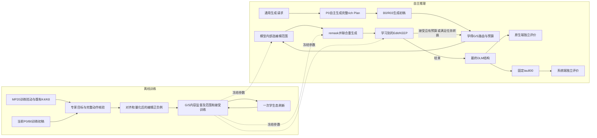

# 专家监督自主晶体编辑：计划审计与完整链路说明

## 2026-09-08 v0.5执行前审计

用户最新授权：审计新方法，若有足够依据提高SUN则直接执行。约束继续为推理无MLIP/外部几何veto、每请求单候选、DLM自主选择范围与内容。下方较早v0.3/v0.4状态为历史记录。

**结论：批准修订后的有界必要条件实验；尚无证据宣称学生SUN提升“大概率成立”，不直接批准大规模训练。** 科学审计与独立代码审计均指出，教师候选的可改善空间、学生可学习性和自主策略的DEV收益必须分别验证。静态审计能排除错误机制，不能凭方法名称估计成功概率。

本次已处理的实施问题：

| 审计发现 | 修订与证据 |
|---|---|
| 冻结离线候选并非当前策略样本；直接使用负优势乘log概率可能无界，也不是无偏策略梯度 | 首个训练先导若获准，采用非负、归一的有限候选权重和参考正则，明确为奖励加权监督代理。学生轨迹刷新和有效行为概率另行实现后才谈策略梯度。 |
| 正式SUN入口拒绝训练来源，而且把确定性bool字段错误地要求为字符串 | 新增显式training_feedback用途，核验原始训练parent、输入哈希、固定组成与MAIN reduced-composition隔离；结果写FEEDBACK_FINAL，不能进入独立评测。确定性运行标记按真实类型校验，保留旧运行身份兼容。 |
| CIF图构造包含Niggli基底变化和原子排序，直接把teacher图坐标写回原槽位会改错结构 | F200离线提案老师使用原OLD坐标基底和原子顺序的明确native-frame图；断言实际模型内部重建FC边、不预测物种，初始float32几何与OLD一致且非退化。最终F800对每个候选和KEEP仍走原materialize_record路径。非Niggli晶胞的零移动回归通过。 |
| 精修导出只检查_SUCCESS与行数，可能混入其他study或种子 | 新增REFINE_FINAL中的study哈希、输出文件哈希、确定性训练用途、800/1000步设置，以及逐作业来源/候选/重复/seed完整匹配检查；错误study和错误seed回归均被拒绝。 |
| teacher_available过滤实际选择了此前成功的量化教师，造成额外的成功条件化 | 已移除该过滤。只按训练来源、原几何分层、公开reference覆盖和固定hash顺序取样；不读取新生成结果进行选择。 |
| 正式SUN将缺失能量的请求保留为0贡献，布尔SUN本身不足以证明标签可用于偏好 | 离线分析在选择候选前检查物理状态和有限终态/hull能量；evaluation_error、能量协议不一致和终态能量一致性未核实会阻断训练偏好分析。明确generation_failure/invalid_raw仍保留0贡献与原分母，不改正式计分；not_converged等有有限能量的状态不额外要求R verified。 |

共同训练反馈/正式评价、标签、候选作用范围与身份绑定的相关CPU测试目前41项通过。只读数据审计不改变原MAIN、旧物理标签或已有证据包。

独立离线汇总分析另有11项回归通过，覆盖跨噪声选取、不偷看另一seed、SUN破坏计数、重复候选一致性、完整来源分母以及未知物理结果不能变成负偏好。汇总同时列出各动作相对KEEP的新增/损失、两类原几何分层、hull距离分布和跨噪声重复性，避免把oracle选择后的保持误当成固定动作本身不会破坏SUN。上述补充均在64来源物理结果产生前完成；候选菜单、种子、SUN定义及进阶数值门槛保持已登记值。

### 先导协议与解释范围

先做2来源工程canary，检查实际教师、精修、物理标签和反馈评分链路。它不用于判断方法收益或调整种子。通过后固定64个训练来源：32个原几何支持无效、32个有效，各来源组成不同；从已完成公开hull缓存覆盖的训练池按hash选取。该选择受参考覆盖限制，不能代表自然生成的整个化学分布。

F200提案老师直接以OLD为t=200输入，不加正向q噪声；这是新声明的native-frame教师，不声称等价于标准约化晶胞F200，也不改变最终F800。每个来源产生KEEP和四个固定候选：

- local1：取第一次去噪后状态的一个XYZ组，按wrapped fractional位移排序选择；该排序是离线启发式，不是已证明的错误位置或力。
- local4：取t=150状态的最多4个XYZ组；它跨50步，不冒称相邻单步。
- all_xyz：取t=0坐标、保持原晶格。
- full_cell：取t=0的完整量化晶格和坐标。

所以首轮名称为**稀疏连续轨迹候选的SUN空间检查**，不是已经完成去噪场蒸馏。所有混合候选都是完整新结构，必须重新做R和F800→R。记录实际scope、零动作、重合候选、量化失败和图构造失败；不将重复候选作为独立监督。small-N的local4可能实际变成all_xyz，按实际范围归因。

每个候选和KEEP用两个独立F800噪声种子，来源内部共享种子、同来源放同GPU、数值执行确定。64来源和640次F800执行不是640个独立样本。每个互斥候选臂单独保持64请求顺序与分母；U使用冻结精确匹配器。由于组成互异，臂内U几乎平凡，此实验不能验证多样性外部效应。

### 预先固定的进阶条件

以下阈值是有限先导的最低监督支持，不是功效分析或成功概率估计：

1. 64个来源保留在各臂分母，必要工程错误全部解决；不可比较标签不制造偏好，正式SUN不额外乘R verified。
2. 至少6个不同来源存在**同一个非KEEP动作**，在两个F800种子下都贡献SUN，而KEEP在两个种子下都不贡献SUN。
3. 只用seed0的SUN选动作，平局优先KEEP、其次更少实际改动token、最后固定候选顺序；用seed1评价固定选择。反方向也做一次。两方向均至少净增4/64个SUN贡献，分别报告新增与损失。此选择仍是离线物理oracle，只检验选择能否跨噪声种子转移。
4. 至少2个重复成立的来源改善来自实际proper-subset局部动作，才允许推进局部机制的训练主张。若仅全局动作通过，可考虑更窄的终点加权全局先导，不能声称局部机制有效。
5. 明确KEEP已贡献SUN的来源数量及其损失。若保持样本不足，须先补充独立、显式训练用途的保持课程，不能用这个面板直接训练可靠接受器。

同时报告按原来源聚类的不确定性和两类几何分层。全部通过也只授权小型训练先导，不授权性能宣传。自主学生随后必须在自然分布的未见来源中选择自己的scope/mask/内容/commit，实测SUN净收益，才能扩大。256请求的两个seed先各自按256完整cohort计算U；若另报告合并512结构指标，明确这是另一个多样性端点，不能混用。

首个先导训练如获准使用非负组内权重 `w>=0, sum(w)=1` 的完整候选轨迹监督，加参考正则与KEEP课程；不使用冻结负优势的裸signed CE。其后对照必须同确定性F/R运行重算H1A2/B0，新指标不能与旧非确定性冻结分数作因果比较。

本阶段先按3 GPU / 18 CPU布置，以保守避开当前账户另一个3卡作业。继续遵守最多6 GPU、最多3个自有Slurm任务、累计16小时梯度训练和2026-09-09 04:00 UTC截止。此次canary/候选空间检查不消耗梯度训练预算；旧已用3.13小时不重置。

---

2026-09-08。审计对象：[当前执行计划与讨论记录](EXPERT_REPAIR_DISCUSSION.md)。初始静态审计基准为`269d7dadc7c62443d89a2ceb0c15bd23fb163bc4`；用户随后授权执行，并允许多智能体审计。现阶段已构造新训练数据，正在验证完整训练与采样链路；审计通过不表示已证明学生收益。

最新修订：用户将训练上限扩展至16小时，并要求明确几何/稳定性编辑如何改变logits。当前计划v0.3采用同一编辑DLM的G/S任务条件、两类直接内容监督和按证据扩训；最多2G＋2S的预算建议替代先前未区分任务的两轮。新增机制尚未实现或验证。

## 1. 结论与是否还需用户澄清

**没有必须再向用户澄清的偏好或资源约束。** 已知自主推理边界、完整rich Planner、父模型保护、数据设计责任、最新最多16小时训练预算、7/6卡及CPU限额、周三中午截止和H1A2比较目标。剩余工作属于方法设计和工程验证，由Codex负责。

**技术结论：APPROVE WITH CONDITIONS。** 认可“离线专家编辑监督＋模型自主选范围、重填和接受/保持”的研究路线及受控实现顺序。几何/物理标签必须直接训练内容分布，不能只训练一个筛选头便宣称获得编辑能力。扩大训练前检查量化后老师目标确有用、B0在明确目标上能学会重填、自主运行在真实初稿上有相应收益且未由oracle替代。

**尚不能批准的结论：** 现有脚本可直接跑这套训练、7 卡一定能在时限内完成全部工作、DLM 必然优于几何编辑器、SUN 一定超过 H1A2。它们目前缺少实测依据。

执行已由用户另行明确授权。新增独立审计要求已进入实现：精确周期接触证书用于训练目标；未知标签不充当拒绝/保持标签；G包含终态几何和收敛可靠性恢复；S必须比较同协议下实际量化动作的两个可信终态；完整B0权重逐块核验；训练与推理的旧态/当前态/预算真实进入内容logits；重载必须保留全部编辑模块。首轮标量回填规避未经证实的并行联合采样假设。旧H1A2物理标签与当前R协议不一致，正式比较须重新标注；SUN采用完整顺序语义，不用代表簇近似U。

## 2. 科学问题及方法的必要性边界

建议将本轮问题表述为：

> 在完整自主生成组成和晶体初稿的链路中，怎样把离线科学专家的改进经验转成模型可执行的离散编辑，使模型不依赖在线物理专家，也能判断修改范围、重写已生成结构并保留有益修改，从而提高几何可用性与低能终态命中率？

核心缺口是：**组成可行、几何可构造和最终低能结构，是不同要求。** 规则可以排除一部分错误，却不能告诉模型哪个允许动作会带来更好的终态；普通 token 重构也未必教会“这份旧结构应如何改变”。

已有 R/I 256 结果中，tau800 的 comp_valid 从 222 提高到 252，Strict/Meta SUN 却从 22/117 变成 17/113。这支持“有效率不能替代最终收益”的判断，但不能单凭该对照证明某个组件是下降的唯一原因。[原始结果](execution/assets/ri_tau800_256/RI_tau800_SUN.md)

**不能论证“只有我们的方法能解决”。** CrysLLMGen 已使用语言模型初稿加连续 diffusion 精修；FlowLLM 使用语言模型与流匹配结合；专门几何模型也有学习晶格/坐标的路线。它们是实际存在的替代方向。[CrysLLMGen](https://arxiv.org/abs/2510.23040)、[FlowLLM](https://arxiv.org/abs/2410.23405)、[DiffCSP](https://arxiv.org/abs/2309.04475)

选择当前路线的具体理由是：已有 B0 晶体表示和生成能力可保留；DLM 的双向重填适合固定组成、保留未编辑上下文并重写早先位置；离线编辑监督能够直接针对当前生成器的错误；学习到的决策可以在推理时独立运行。它是与本项目约束相符、值得验证的设计，不是排除了所有替代方法后的唯一解。

如果论文要主张 DLM 比所有几何编辑器更合适，需要同数据、同预算的额外对照。本轮的 H1A2/父模型/新方法主比较，只能先检验整体方案是否有效，不能证明所有子组件的独立必要性。

## 3. 相对 GPT Pro 原方案的实质修订

| 保留或修订 | 本轮结论 |
|---|---|
| 保留完整 rich Planner | 保留自主组成生成及实际辅助条件；不拿专家终态生成 oracle Plan 输入 |
| B0 warm-start | 保留完整晶体表、tokenizer 和构造；不默认 fresh 初始化或换 LLaDA2.1 权重 |
| 专家监督修订 | 从“候选质量加权重构”改为明确 old→target 的可执行编辑监督 |
| WHERE/HOW/STOP | 明确为局部范围先验、重填、完整提议接受/保持；不把原子级“稳定性”当天然标签 |
| M2T/T2T | 借鉴可见错误纠正训练；选择 remask 的首版执行方式与直接 T2T 区分 |
| 在线工具 | 不用于 DLM 自修订定位、打分或选优；只用于离线标签及事后评价 |
| C3FD | 化学动作空间与内化仍属 Planner 侧，排在本轮修订之后，不宣称本轮提升 comp_valid |
| 科学结果表述 | 原生/精修两端、主 SUN/verified 子集和终态新颖性分别解释，不预填收益 |

LLaDA2.1 为同模型纠正可见 token 提供机制依据，但没有替本项目验证周期几何或物理收益。[LLaDA2.1](https://arxiv.org/abs/2602.08676)

### 3.1 后续 Planner/C3FD 的审计结论

用户已认可的“保守三态化学支持＋弱可实现性修正＋覆盖约束”可保留为下一阶段方向，实施排在专家修订之后。PASS只是给定化学规则内存在见证，不证明有稳定晶体；UNKNOWN保留探索机会；前缀REJECT应有该前缀已无合法完成的依据，不能仅因部分组成尚不电中性就拒绝。混合价覆盖要通过规则/见证表达，不能把旧单价态检查的失败统称化学不可能。

此前的A＝e(x)−e(R(x))、B＝e(R(x))−h(c)描述具体初稿及所用协议，不是“生成策略缺陷”和“组成缺陷”的因果分解。新修订器改变后，旧rollout上的可实现性分数会失配；弱修正应绑定DLM版本、实际rich条件、预算与端点，未知/不兼容来源不能自动受罚。组成偏好改变也会改变覆盖和N/U，不能全部归为DLM能力增益。

若概念上用化学支持S将原分布pR条件化为q＝pR·1S/Zchem，则对支持内p有KL(p∥pR)＝KL(p∥q)−log Zchem。硬过滤本身已有KL成本，须与额外可实现性倾斜分开；逐token屏蔽并局部归一化也不自动等于全序列条件分布q。较小全局KL不保证稀有chemistry family的相对覆盖，因此保留分组覆盖约束与统计是合理的。

本轮修订固定组成，不能承担上述化学支持学习，也不应为获得更好SUN而同期悄悄改Planner分布。完整论文可以串起化学提案与自主物理编辑，但各阶段贡献须由对应对照支撑。

## 4. 首版架构建议：一个双任务编辑分支、范围与接受决策

### 4.1 输入和输出

推理输入仅有模型自身生成的 rich Plan、当前晶体、已训练参数和预算。可以在模型内部编码当前晶格/元素/周期关系；不能接收外部错误位置、力、应力、能量或目标晶体。

建议使用同一 B0 初始化的修订分支，训练 LoRA、内部几何编码及小型决策头。构造权重和完整晶体 embedding/head 保留。独立几何编辑器作为 HOW 学习明确失败后的备选，不同时开展多套大训练。

几何G与稳定性S都通过修改坐标/晶格实现，edit是共同操作。G学习坏几何到可用目标；S学习可用结构到更好物理终态，不能仅用“当前能量降低但最终仍回同一终态”的帧冒充终态改善。共享编辑参数，通过真正进入forward的任务条件区分目标；范围/接受标签分别记录两种任务。固定组成的修订不能解决组成错误。

| 模块 | 定义 | 不能混同的含义 |
|---|---|---|
| DLM 内容预测 | G/S都从旧态和上下文预测修正token，混合M2T/T2T监督，梯度直接更新内容参数 | 只改接受头或重复原B0不提供改善依据 |
| 局部评分 | 一个晶格/XYZ 组应被纳入当前编辑范围的学习先验 | 不叫逐原子稳定性，也不在无反事实标签时叫真实局部能量收益 |
| 整体 Edit/KEEP | 对具体old、任务、M、proposal预测几何恢复/保持和物理收益，据任务接受 | KEEP不表示当前结构已经稳定；不负责生成新值 |

局部标签来自可执行专家 scope。若以后要预测“编辑该局部的物理收益”，必须有该具体动作的结果标签，不能把全局能量平均分给原子。整体判断采用完整事务，不能将局部分数简单相加当作全胞收益。

首版范围模式推荐为局部XYZ组集合、全XYZ、晶格＋全XYZ，以及不编辑；局部模式再由模型选具体组。范围模式与组选择共同学习，支持晶格/坐标耦合。完整旧态与提议的编码长度、任务/预算条件是否实际进入forward，都属于必须核查的接口，现有旧状态模块不能免验证套用。

接受器对几何恢复、终态改善分别保留标签原因和可用损失，防止把不可比对象压成一个混合能量标量。校准既检查错误接受，也检查有益编辑召回和净改善；全KEEP不能靠高分类准确率过关。首版拒绝后保留当前态并结束该任务，接受且有预算时继续；只有学得几何判断允许时进入S。

### 4.2 推理循环和成本

推荐首版保留完整x0后，由模型判断是否进入G或跳过G进入S，按任务选范围、保存旧态、remask并重填，再由对应的学习决策接受或保持。G/S各最多2个提议；不编辑、拒绝或预算结束时提前结束相应任务。全程无无限重抽或在线老师接管。

**“两轮”不等于“两次 forward”。** 现有标量执行器一次全胞重填可涉及 6＋3N 次预测。N=20 时，若再加检视和提议评分，两轮可能达到约 136 次大模型 forward，不能宣称必然比 model494 便宜。

更新后的预算建议是每个任务第一/第二提议的联合重填分别最多8/4步，内容合计最多24次forward，检视/评分最多约8次，总上限约32次。开发阶段同时检查约16次的较小预算，主面板前冻结。分块揭示使后续预测看到已提交的新几何，但不能声称并行token自然满足联合约束。预算、质量、失败与真实成本须共同验证；若仍采用逐标量填充，重新核算，不能沿用该上限。

元素、原子数和 token 家族属于动作执行合同。推理中的几何有效性不能由外部检查器决定编辑位置；最终输出无效时仍计失败。内部评分的错误接受、无修改和预算结束均保留。

### 4.3 怎样真正改变logits

首版路径为“当前画布embedding＋内部旧态/已提交新态/任务/预算残差 → B0兼容LoRA Transformer → 保留的输出矩阵 → 各token logits”。输出矩阵冻结不等于输出分布冻结，隐藏向量仍由新增状态通道与LoRA改变。G和S分别使用实际修正目标的token交叉熵，目标概率低时得到提高其相对logit的梯度；可信好/坏完整动作可增加小权重同视图对比辅助，不将其冒称完整DLM似然或真实能量梯度。

范围、内容、接受是三种不同logits。把同一结构分数等量加给某位置所有候选logits，softmax不变；完整终态评分器也不能未经训练直接评价半mask画布。因此当前先通过真实编辑监督改变生成参数，再由完整提议评分决定接受，不默认每token调用外部专家或对概率均值结构求能量梯度。

旧reference KL若在纠错位置强行保持错误B0分布，会与新目标冲突。父构造本身已冻结，修订保持优先使用clean/identity和未编辑上下文约束。更详细的梯度、任务分工和诊断设计见当前讨论文档的D05最新机制修订。

## 5. 数据合同：排序、重填和决策标签分开

### 5.1 两种物理用途

同组成质量对回答“哪个终态更好”；可执行编辑对回答“怎样从这个旧态变过去”。质量对没有可靠原子对应时，可以训练兼容的质量模块，不能直接训练局部 token 编辑。

固定组成与能量协议时，弛豫终态的相对差满足：

$$
[e(R(y))-h(c)]-[e(R(x))-h(c)]=e(R(y))-e(R(x)).
$$

因此相对改善监督不必等待每个训练组成的新 hull 查询。绝对 Stable 标签仍需参考库。若原态无法安全标注，只监督可确认的几何恢复，不补造相对物理收益。

### 5.2 标签表

| 核验情况 | 可用监督 |
|---|---|
| 可处理的错误旧态→量化后有效目标 | 几何恢复；不能自动称稳定改善 |
| 两态有效且可信共同终态改善 | 物理编辑正例；绝对稳定另计 |
| 合适旧态→破坏几何或已核实物理退化的提议 | 决策负例 |
| 可靠 identity 或已核实无收益的提议 | 保持/不接受该修改 |
| 失败、未知、能量协议不一致 | 对相关物理损失屏蔽，保留台账，不假装负例 |

同组成多个好终态应尽量保留，不把所有初稿都指向唯一“最低能模板”。否则可能提高稳定率却损失多晶型覆盖和 Unique。新模型实际提出的错误修改也要进入一次学生态刷新，防止接受器只认识老师的理想提议。

### 5.3 对齐与量化的硬性数据要求

- 同轨迹检查有序物种和 N；不能逐帧独立排序后当成相同原子。
- 跨候选处理同元素置换、周期平移及晶胞表示；不可靠局部映射退回排序用途或明确的全胞重写用途。
- 用 B0 实际 token 表量化、解码完整目标，再核验。浮点老师标签不能直接贴到新量化对象。
- 局部 M 必须重建完整的“旧未改部分＋新活动部分”后验证。晶格和坐标耦合时扩大动作范围。
- 原始 comp_valid 不是完整化学真理，不据它一个指标删除全部潜在混合价训练对象；表示/计数错误和证据不足分开。

### 5.4 数据规模与输入条件

维持计划中的起步上限：2048 个 MP20 训练来源的扰动/identity、最多约 2048 条可用旧编辑对、最多约 2048 个当前 B0 训练请求，以及 256 个独立开发来源组；一次学生态刷新 256–512 个训练请求。实际产率要报告，旧 K4/K8 的 1942 候选/740 组成不能自动换算成同样数量的编辑对。

MP20 编辑样本不能随意使用从目标结构提取的 oracle SG/VPA 作为“实际 Planner 条件”。可研究用冻结 P0 在给定训练组成后的条件续写得到预测 rich 字段，并明确登记为训练条件生成；若接口不兼容，就先只用于几何辅助任务。当前 B0 真正的自由 rollout 必须保存其原始完整 rich 条件。

主面板及开发组在训练前登记；衍生帧按来源/组成祖先成组划分。优先用 reduced-composition 分组防止不同超胞表示跨组泄漏；对原 B0 预训练已见与本轮新增训练已见分别说明。训练实例不包含测试结构或测试专家终点。

隔离从训练侧实施：先固定完整主请求清单，再按声明规则限制新增训练来源；不能事后删除主面板中的重合请求、补抽并仍称原始自由分布。已有B0预训练暴露无法通过本轮分组撤销，报告其参考范围。本轮新增老师的重合诊断与固定benchmark N/U分别保留。

## 6. 静态审计发现与落地要求

| 编号 | 级别 | 已确认事实及影响 | 落地要求 |
|---|---|---|---|
| A01 | P0 | 现有 repair_scalar_example 以 native 原 token 为目标，不是纠正配对 | 建立显式 old/target 编辑模式，旧模式保留；[源码](../../src/crystal_dlm/r03_physics_transfer.py) |
| A02 | P0 | 旧扰动器拒绝超出完整支持的旧态并可退回 clean | 新任务允许可计算的错误输入；目标仍严格验证；[源码](../../src/crystal_dlm/periodic_v2_corruption.py) |
| A03 | P0 | 原运行器先淘汰 unsupported_predictor，无法直接修该类坏初稿 | 新修订模式明确准入和失败记账，不删除正式评价阈值；[源码](../../src/crystal_dlm/programmed_path_runtime.py) |
| A04 | P0 | 旧 R03 trainer 限单进程、256 更新、LR1e-6、长度382 | 受版本控制的新任务模式，DDP、时限和长度真实核验；[源码](../../src/scripts/train_r03_physics_transfer.py) |
| A05 | P0 | 导出器是 evaluation-only；旧 train label 协议禁止 refined 端点 | 显式 train/evaluation 与 expert-edit 协议，不能给旧 eval 数据换标签；[导出](../../src/scripts/export_r03_evaluation_inputs.py)、[标注](../../scripts/label_programmed_paths.py) |
| A06 | P1 | 角色 R/I/G/P 与 C3FD/repair 开关联动 | 新方法用明确配置，避免同时改变组成分布；[入口](../../operations/r03_c3fd_main_20260907/run_component.py) |
| A07 | P1 | 局部编辑组合可能破坏全局几何，评分器有训练/推理分布差 | 完整提议标签＋学生态刷新；不把逐原子分数当可加的真实能量 |
| A08 | P1 | 全胞标量重填可能需要大量 forward | 冻结 NFE 预算及实际实现，不只报告两轮 |
| A09 | P1 | 旧标注器单实例最多6 GPU | 总7卡可按6＋1分片；不要为并行随手删除资源与协议保护 |
| A10 | P1 | 现有端点虽有组成校验，但明确未证明 refiner 站点映射 | 数据编译前补对应证据，不将“能评价”误作“能监督局部编辑” |
| A11 | P0 | task_ids/noise存入context但未进入现有forward条件 | 将G/S及预算真正接入；用同输入不同任务检查logits及梯度；[源码](../../src/crystal_dlm/state_conditioned_model.py) |
| A12 | P1 | 无效晶格的物理特征被屏蔽，masked后可能丢失异常旧晶格信息 | 保留原始6数值与可计算标记，安全占位不当真实晶格；[编码](../../src/crystal_dlm/periodic_state_conditioning.py) |
| A13 | P1 | 旧几何loss含概率均值坐标和clamp后的连续晶格 | 不把软均值上的几何/能量冒充实际token结果；主监督使用实际量化目标；[源码](../../src/crystal_dlm/periodic_geometry_objective.py) |
| A14 | P1 | 旧reference KL作用在重构视图，直接迁移到纠错位置可能抵消更新 | 新任务独立定义保持项，不为保护已冻结父构造强行约束每个错误logit |

P0 表示会导致训练对象或执行合同不成立，不表示需要用户重新解释需求。这些应作为获准实施后的必要工作，不能略过后直接长训。

## 7. 评测审计：需要修正的解释与固定规则

### 7.1 当前代码的真实口径

当前评测明确：N/U 在传入结构上计算，Stable 使用公共 CHGNet 弛豫后的终态能量；Strict 阈值为 0，Meta 为 0.1 eV/atom。主 SUN 不强制 terminal verified，也不要求comp_valid；verified子集和有效率另列。[评测源码](../../scripts/evaluate_programmed_paths.py)

因此应当区分：

| 端点 | N/U 对象 | 稳定性能量对象 |
|---|---|---|
| native | DLM 最终输出 xr | R(xr) |
| tau800 | F800(xr) | R(F800(xr)) |

主 benchmark 保持这一口径，不能临时改分数。若论文声称发现了新的稳定多晶型，需要另查可信终态的新颖性/重复情况；输入新颖不自动等于弛豫终态新颖。

### 7.2 基线和独立性

主比较建议使用同一新 P0 Plan 队列的三列：H1A2 D1、冻结 R03 D2 初稿、新修订。新修订直接读取该列 R03 初稿。历史成功前缀1000与全请求1200的值不混比，也不把 D2 重命名成 D1。[基线账本](../h1a2_to_current_review_20260907/HISTORICAL_RESULT_LEDGER.csv)

1000 是完整请求数。各方法保留同一请求顺序；当前 Unique 取类别的首个代表，不能先按能量或内部评分排序。不同 seed 的 Unique 不直接相加。

固定 MP20 参考下的 benchmark N/U 继续保留；另做本轮新增训练目标重合检查，避免把记住新教师结构当成新发现。不要暗中扩参考库又继续沿用旧 H1A2 分数。

已知原生 N/U 阻塞必须先解决。隔离/超时用于识别工程未完成，不能把超时当 novel、stable 或简单失败分数；更不能随意过滤改变首代表和唯一性语义。

### 7.3 Promising 与论文结论

按用户要求，预先声明 native/tau800 的 Strict/Meta SUN 读数，任一相应读数超过同口径 H1A2 可以记为 promising。所有读数与下降项同时报告，不根据结果再换指标或队列。

一个额外 SUN/1000 等于 0.1 个百分点，只是初步信号。主 SUN 上升但收益集中于未验证能量、unknown 改变或新颖性口径变化时，不能写成可靠物理能力提升。也不能对具有整批去重依赖的 SUN 直接套独立逐行显著性检验。

## 8. 时间与预期结果审计

### 8.1 16小时上限、分阶段扩训与时间

初始最多约14336条编辑记录、每条每遍抽一个编辑视图时，全局batch24每遍约598更新。16小时按每步12/15/20秒对应纯更新上界4800/3840/2880；验证、刷新采集及其他开销不包含在这些算术上界内。实际视图展开、任务混合与batch需在短吞吐检查后登记。

建议累计梯度时间0–2小时以G及可见错误恢复检查为主，2–6小时混合G/S并看独立真实初稿收益；机制成立后6–12小时扩大真实错误/更好终态及一次学生态刷新；12–16小时仅在开发证据支持时继续。所有梯度诊断和续训计入16小时上限，最佳checkpoint按开发集保留。更多训练先增加有效来源和学生态覆盖，不只循环简单扰动。

起步G/S/identity任务比例建议60/20/20，之后35/45/20；无足够物理正例时不伪装达到该比例。扩展后的编辑池目标约16k–22k，具体按产率与剩余时间决定。SUN主面板不承担扩训决策。

数据与已冻结的 H1A2/R03 基线可以尽早并行准备；相同 Plan 队列的 hull 参考可提前准备。学生最终权重出来后只需补新方法的输出及尚未完成的下游阶段，避免全部串行重跑。

前12小时最多7卡，之后6卡。刷新时没有机动卡，应暂停训练、保存完整续训状态，再在允许资源内采集刷新。周三中午截止未改变；用满16小时训练时，原先20–30小时全链路估算必须重算，不能保证仅延长训练却不挤压其他阶段。实际训练上限取16小时与剩余日历时间扣除必要准备/评测余量后的较小值。

### 8.2 预期结果的可信程度

| 结果 | 审计判断 |
|---|---|
| 受控扰动恢复与部分原生几何改善 | 最直接的学习目标，但仍需自主mask验证 |
| 原生 Stable/SUN 提升 | 取决于可用目标是否真正改善终态或挽回原先不可评价的请求，以及学生能否迁移 |
| 再接tau800仍提升 | 不确定性更大；已有强精修可能吸收或改变前端收益 |
| Novel/Unique 保持 | 存在教师模板塌缩风险，不能由固定组成自动保证 |
| 超过H1A2 | 是目标，当前没有足够证据给出预计点数 |

不接受“老师有收益所以学生必涨”“token CE下降所以终态KL足够小”“局部结构误差界保证全局稳定”这些推断。它们缺少适用条件，SUN 还包含整批 N/U。

## 9. 代码复用与仓库治理

现状盘点：本链路operations目录顶层有57个文件（包含.gitignore和本地.relay_state.json）、43个被Git跟踪，其中7个deploy、12个probe、2个status文件。文件名本身不证明都应删除，但已经显示运维功能分散。后续不得继续用每个提交/问题新增脚本的方式扩展。

| 层次 | 复用或收敛方式 |
|---|---|
| 模型与数值表示 | 复用 B0 加载、token codec、旧状态/周期编码；确实缺失的编辑/评分机制进入通用模块 |
| 数据 | 一个通用编辑数据模块处理对齐、量化、scope 和来源；不按K4、K8、MP20、每个seed各写一套核心逻辑 |
| 训练/推理 | 扩展现有入口的任务模式与配置，支持从保存初稿独立修订；旧模式行为受回归保护 |
| 评测 | 保留指定评价器；只扩展输入适配、用途隔离、完整性检查和必要的运行修复 |
| 编排 | 模型/数据/资源/截止时间放manifest；复用阶段、调度、恢复和状态接口 |
| 部署与诊断 | 一个参数化部署入口、一个状态/诊断入口，历史提交专用文件冻结并按来源归档 |

首版建议新增机制代码集中在最多两个通用核心模块（模型/评分/采样；数据编译）；优先修改现有 CLI，而不是新增日期或方法角色专用执行器。若边界确实需要拆分，再说明职责；文件数量上限不能反过来制造巨型不可维护脚本。

版本库保留源码、测试、配置、数据/模型清单及精选结果；不加入权重、大轨迹、临时 bundle 或整目录运维回执。每次改动显式选文件，不用全仓库 git add 掩盖临时产物。

历史结果和旧脚本先保留证据，不在当前审计中删除或搬迁。后续获准实施时，先确认活动入口，再将重复运维逻辑归并；旧调用保留兼容方式或清楚标记退役。资产主索引仍只有 [REUSABLE_PIPELINE_ASSETS.md](REUSABLE_PIPELINE_ASSETS.md)。

## 10. 完整链路

训练可以使用外部专家，推理中的位置和修改由学得模型决定。物理评价不回流指导该次推理。组成仍由 P0 自主生成，固定组成配对仅用于训练和归因，不把 de novo 任务替换成给定目标化学式的任务。

## 11. 执行前后的决定规则

获准实施后，先检查资产/用途/对齐，再用有限老师数据与小样本学习验证可达性，按证据逐步扩大到最多16小时。若只有几何老师、没有可信终态改进，不把该分支包装成已验证的物理学习；若oracle mask能修但自主mask不能修，继续解决定位，不用外部选点补成“自主”。

在独立开发来源上，固定同一批学生提议比较全部接受和学习接受，可直接检查门控是否减少破坏并保留有益编辑；正确scope只用于诊断HOW。主面板不承担架构/阈值选择。对编辑器替代性的额外主张，需要另外做同数据、同预算控制，不能由上述诊断推出。

若关键前置证据失败，应在预算内修正明确原因或给出否决建议，而不是切换未登记模型、增大搜索预算或改变评测来追赶数字。

本次审计的最终建议是：**采纳上述收敛设计和复用规则，按证据门槛推进；接受它作为值得验证的自主科学编辑方案，不预先宣称它是唯一方案或必然提高 SUN。**
