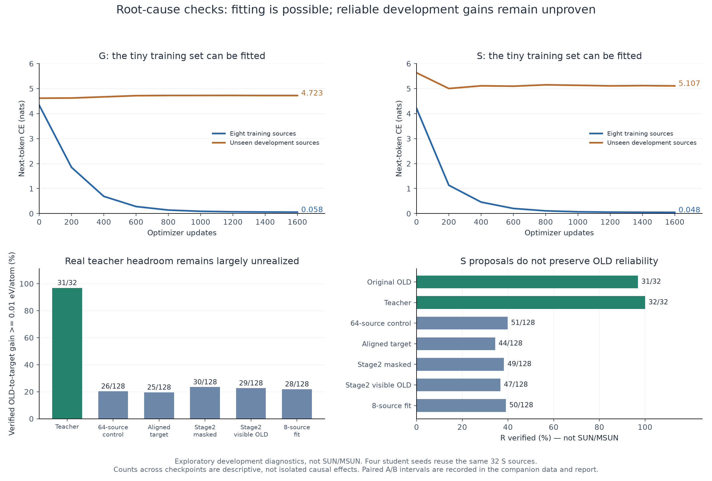

# 根因定位与小数据验证

本目录回答三个问题：旧K4/K8为何更强、当前编辑器是否只是编辑量不足、内容损失为何难以转化为稳定结构。原MAIN保持冻结；这里是后续受控开发实验，不是新的独立MAIN或SUN/MSUN结果。

完整推导、逐项实验和解释边界见 [ROOT_CAUSE_PROGRESS.md](ROOT_CAUSE_PROGRESS.md)。机器可读汇总见 [MECHANISM_RESULT_INDEX.json](MECHANISM_RESULT_INDEX.json)。每组 `*_MANIFEST.json` 保存运行配置，`*_COMPACT.json` 保存逐来源证据，`*_ANALYSIS.json` 保存分析及配对信息。

**本轮判定：实现和数值重复性已有修复，训练来源上能够学出物理效果；未见开发来源上的可靠稳定化仍未解决，不继续扩量。** 所有预定作业已完成并释放GPU资源，保守累计梯度训练3.13小时。

8来源最终模型在固定32个S开发来源×4种子上，可验证降能28/128、恶化17/128；R verified由原始124/128降至50/128。最终接受头提交127/128个完整提案，包括全部17个恶化提案。该HOW诊断强制full-cell内容，未测试自主admission与范围选择。它明确显示内容泛化和接受判断仍有缺口，不能只凭低训练CE或少数成功提案宣布小数据已work。见 [FIT8_ANALYSIS.json](FIT8_ANALYSIS.json)。

## 已经确认的修复与限制

| 因素 | 实际证据 | 当前结论 |
|---|---|---|
| 内容监督位置 | 旧suffix平均损失使66-token动作末/首期望系数达315.1；next-token消除此偏差，共同开发CE改善 | 修复有实现和CE证据，物理收益区间仍跨零 |
| 数值重复性 | 确定性F800的18/18同输入同种子输出逐位一致；确定性R后续256/256跨作业状态、步数、能量一致 | 修复了这些固定案例的重复性，未证明物理模型准确性或SUN提升 |
| 教师有效性 | 实际train/dev各32个S教师，确定性重评后30/32、31/32仍满足降能合同 | 大部分教师收益真实存在，少量原标签已不成立 |
| 充分监督覆盖 | 8来源的1600更新中，G/S位置平均直接监督92/85次；最终训练CE约0.058/0.048 | 当前设置可以拟合这组训练目标 |
| 训练集自由生成 | 同4G/4S来源、两个种子，G几何恢复7/8，S可验证降能7/8；所有16个提案被提交 | 有训练集物理效果，仍有生成和接受判断缺口，不能视为泛化成功 |
| 更多编辑 | 原stage2从1到4轮，几何支持47→49/64；四轮S均无提交，被拒S提案多数不满足合同 | 增加轮数没有建立可靠稳定化能力 |
| 等价目标对齐 | 同64来源四种子，S可验证降能26→25/128，来源聚类差值区间跨零 | 代表更接近OLD，尚未转化为物理收益 |
| 保留OLD的输入画布 | 固定原checkpoint四种子，S可验证降能30→29/128，区间跨零，自主S仍零提交 | 未确认收益，保留为显式实验选项 |
| 增加数据 | 64/256来源同1600更新，更多来源改善开发CE，单种子物理计数未改善 | 不支持直接大幅扩量，也没有证明数据永远无用 |

## 复查入口

- [旧K4/K8参照与重算说明](../../../../h1a2_to_current_review_20260907/README.md)：旧raw差距真实存在，旧执行合同和训练谱系必须一起报告。
- [位置损失对照](LOSS64_ANALYSIS.json)、[表示对齐四种子](GAUGE64_REPEATS_ANALYSIS.json)、[输入画布四种子](T2T64_ANALYSIS.json)。
- [教师重评](TEACHER64_ANALYSIS.json)、[256输入重复检查](RECERTIFY128_REPEAT_CHECK.json)、[监督覆盖回放](FIT8_CONTENT_COVERAGE.json)。
- [8来源运行协议](FIT8_MANIFEST.json)：固定最终1600 checkpoint，train两种子、共同DEV四种子，原训练数据和原MAIN不改写。
- [汇总图PDF](ROOT_CAUSE_RESULTS.pdf)、[可编辑SVG](ROOT_CAUSE_RESULTS.svg)、[绘图数据](ROOT_CAUSE_PLOT_DATA.json)。

## 数据与解释约定

G表示几何或可靠性恢复任务，S表示从可靠OLD出发的稳定化任务。本文的“可验证降能”要求OLD与提案均通过共同R验证，且松弛终态每原子能量降低至少0.01 eV。R未verified不能直接解释为已经证明结构不稳定；它表示未满足当前验证合同。共同R输入几何支持也不是正式Struct_valid的替代统计。

四种子复用相同来源，不能把128次S观察当成128个独立来源。配对区间按原始来源聚类。不同checkpoint间的计数比较为描述性比较；只有明确冻结其它因素的A/B才用于解释该因素。

大模型权重和原始运行目录保留在各manifest记录的远端位置。紧凑证据包包含代码、测试、配置、逐来源capsule和图表，不把未嵌入的权重冒称为包内文件。
