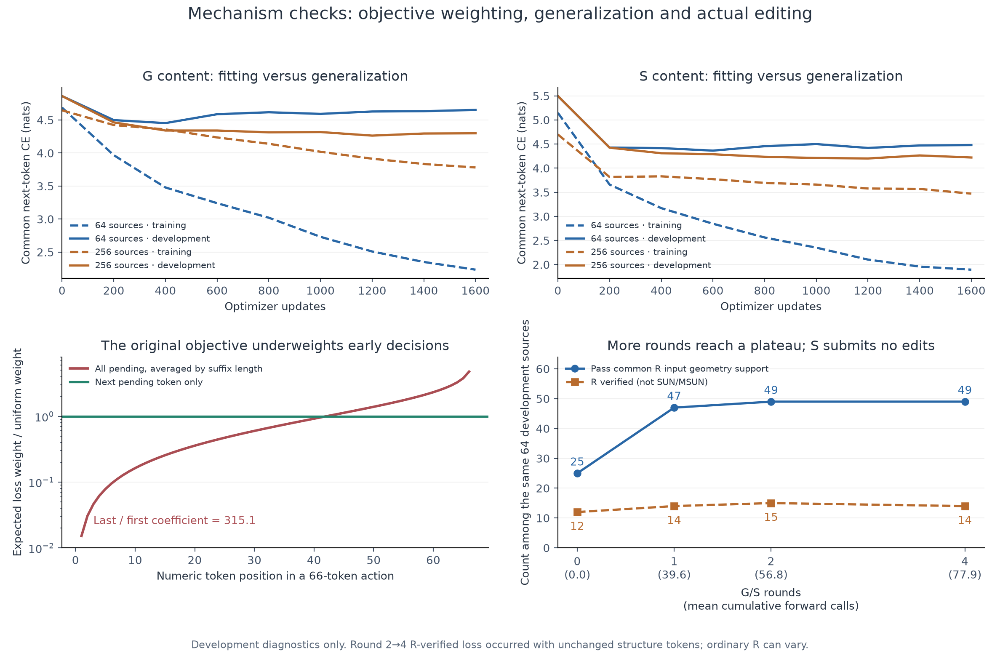

# 根因审查与受控实验

记录日期：2026-09-08。原 MAIN 结果保持冻结；本目录实验均为后续探索和开发集诊断，不能冒充新的独立 MAIN 检验。

## 当前结论

当前编辑器尚未超过项目已有的 K8 强参照。已经确认一个内容监督位置偏差并实现修正；小样本结果显示 CE 改善，但物理收益证据不足。原 stage2 四轮自主编辑中 S 提案没有被提交，被拒提案多数未满足可验证降能合同；这不等于证明所有未验证结构都不稳定。新64来源模型虽大量提交S提案，终态可靠性仍未超过原始输入。F800 和 R 的数值重复性问题已经在单列的小型确定性对照中修复。等价目标表示四种子对照未显示稳定性收益。

图中的 R 相关计数是开发机制诊断，不是正式 SUN/MSUN。完整绘图数据见 `MECHANISM_PLOT_DATA.json`，可编辑图见 `MECHANISM_OVERVIEW.svg`。

## 恢复 K4/K8 参照

历史 SUN/MSUN 来自 `docs/h1a2_to_current_review_20260907/evidence/september7_completed_snapshot.json`。Struct_valid 是本次对保存几何调用冻结原函数的 CPU 重算，完整记录见该目录的 `K4_K8_STRUCT_VALIDITY_RECOVERY.json`；不是把 reconstructed 字段改名。没有恢复的 comp_valid 保持空值。

| 方法与请求集 | 端点 | comp_valid | Struct_valid | SUN | MSUN |
|---|---|---:|---:|---:|---:|
| K4 开发 256 | raw | 未复核 | 254/256 | 7/256 | 57/256 |
| K8 开发 256 | raw | 未复核 | 252/256 | 11/256 | 66/256 |
| K8 全部独立 1200 | raw | 未复核 | 1192/1200 | 47/1200 | 285/1200 |
| K8 全部独立 1200 | refined | 未复核 | 1192/1200 | 79/1200 | 570/1200 |
| 本次编辑器冻结 MAIN 1200 | raw | 1038/1200 | 861/1200 | 38/1200 | 171/1200 |
| 本次编辑器冻结 MAIN 1200 | refined | 1028/1200 | 1165/1200 | 92/1200 | 487/1200 |

K4/K8 的 K 是离线训练候选路径数。部署各为一个候选，未使用在线 MLIP 或按结果择优。旧独立 1200 由 C3FD、fused Llama 和 pointer 生成条件，并非给定真实组成；无效 Planner 请求也补回全请求分母。另一个 parser-only 1000 前缀不能替代这里的全部 1200。

旧完整路径具有周期距离支持、几何事务检查及回滚。它们是有效机制，也是旧 raw 几何有效率接近 99% 的明确实现来源，不能全部归功于模型学习。当前方法采用学习的范围和接受决策，没有外部几何 veto。旧权重还经过 canonical、SPAD、closure、state warmup、K4、K8 的另一条训练谱系。不同条件和执行合同限制因果归因，但不构成忽略强基线的理由。

旧完整循环在 N=20 时上限为 construction 66 + cooperative 36 + closure 60 = 162 个 scalar forward，其中初稿后 96 次。当前两次完整 G/S full-cell 提案上限为 136 次额外 forward。静态次数不能直接判定编辑量是否不足，也不能把一次 LLM scalar reveal 等同于一次连续扩散更新。

## 内容损失的已确认偏差

旧实现均匀选择 teacher-prefix 截断点 c，监督其后全部 m-c 个 token，并按剩余 token 数平均。推理实际只采用当前第一个 pending token。因而第 j 个 token 的期望损失系数为 `(H_m-H_(m-j))/m`；首 token 为 `1/m²`，末 token 为 `H_m/m`。m=66 时，末/首约 315.1。这是损失系数之比，不是实测梯度范数之比。

修正 `content_target_mode=next_token` 仅监督当前第一个 pending token，保留相同 OLD、teacher prefix、MASK 后缀、active scope、预算与随机调用顺序。每个 token 的期望系数都成为 `1/m`。原默认行为保持不变，训练/验证模式显式写入配置和 checkpoint 合同。

64 来源 A/B 两臂均从原 B0 初始化，使用相同 400 更新、3 GPU、有效 batch 24、M2T=1、同数据/初始化/采样种子。共同验证口径为 next-token CE，避免比较不同训练损失的表面数值。

| step400 的共同验证 CE | 旧 all-pending | next-token |
|---|---:|---:|
| G | 4.4689 | 4.3734 |
| S | 4.5750 | 4.3364 |
| 第一晶格字段 | 3.6015 | 3.3865 |
| 坐标字段 | 4.7569 | 4.5866 |

四个配对生成种子复用同一 64 个来源。共 256 次来源-种子观察，不能按 256 个独立来源计算置信区间。共同 R 输入几何支持通过数为 182→194，R verified 为 52→60；它们是机制诊断，分别不等同于正式 Struct_valid、SUN/MSUN。按 64 个原始来源聚类 bootstrap，差值 95% 区间分别为 [-1.95, 11.72] 和 [-2.73, 8.98] 个百分点，均跨零。S 的双方 verified 能量配对仅 18 个，较低/较高超过 0.01 eV/atom 的计数为 6/8，不支持可靠稳定性收益。

所以现在只能确认修正了监督偏差、开发 CE 有改善，不能声称小数据已可靠成功。完整来源和逐对数据见 `LOSS64_COMPACT.json`、`LOSS64_ANALYSIS.json`、`LOSS64_MANIFEST.json` 和 `LOSS64_SEEDCHECK_MANIFEST.json`。

## 更多编辑的实测分解

冻结原 stage2 step800 编辑器，对预先按哈希选择的 64 个原始 B0 开发状态，依次运行四轮学习的 G/S。每轮允许 160 forward；第 1、2、4 轮端点来自同一次连续轨迹，未重新生成前缀。每轮只用自己的固定随机种子，不使用物理结果决定提交或停止。

| 端点 | 共同 R 输入几何支持通过 | R verified | 实际累计 forward 总数 |
|---|---:|---:|---:|
| 原始状态 | 25/64 | 12/64 | 0 |
| 第 1 轮 | 47/64 | 14/64 | 2532 |
| 第 2 轮 | 49/64 | 15/64 | 3632 |
| 第 4 轮 | 49/64 | 14/64 | 4983 |

四轮提交 G 修改的来源数分别为 36、9、2、1，所有 S 提案均未提交。第 1 轮 45 条被 S admission 拒绝，19 条生成后被接受头拒绝；后续各轮分别为 46/18。更多预算确实让少数 G 状态继续变化，但没有变成持续稳定化，R verified 在第 4 轮也没有维持第 2 轮的增加。R verified 不是稳定能量阈值指标。

逐条比对表明，第 2→4 轮只有两个来源的结构最终改变，62 个来源 token 完全相同。少掉的那个 verified 发生在未改变结构的 case29；另一个未改变的 case62 也发生 R 状态变化。因此不能把 verified 15→14 归因于继续编辑。raw 输入的 R 重复性需独立检查。

73 个实际生成且被拒绝的 S 提案来自 19 个来源，已连同各自 OLD 全部离线评估。OLD 计数为 invalid_raw20、verified33、not_converged20；提案为 invalid_raw15、verified15、invalid_terminal12、not_converged31。双方 verified 仅 10 对，其中 2 对改善达到 0.01 eV/atom：case18/round3 改善 0.11430，case57/round3 改善 0.02038。接受分数分别为 0.2142、0.2175，和坏提案的分数交叠。不能把低于 0.5 的阈值简单下调来解决稳定性；内容质量和收益判断都需要改进。详见 `DETERMINISTIC6_SAUDIT_COMPACT.json`。

## F800 组成实验与重复性

固定开发集 16 个来源：6 个原始几何无效、5 个几何有效但 R 不可靠、5 个 R 可靠。每个来源比较原状态 x、实际量化教师目标 t、已保存学生输出 y。每个变量同一 F seed，在同一 GPU 上做两次技术重复，顺序平衡。没有依据本次结果选择 teacher 或种子。

进入 F800 前，teacher 的输入几何有效 16/16、R verified 11/16；OLD 分别为 10/16、5/16。双方 verified 的 5 对中，teacher 的 R 终态能量全部降低超过 0.01 eV/atom，中位改善 0.15110 eV/atom。学生仍有 4 个原始几何失败，只有 5/16 R verified。

进入 F800 后，teacher 相对 OLD 的两次重复均值差分别为 +0.02513、+0.04431 eV/atom，均值受个别来源影响，中位数接近零。双方均 verified 且两次都有数据仅 5 个来源，没有一个在两次都改善超过 0.01 eV/atom。因此 raw teacher 的收益没有稳定传递到 F800 系统终点；这不等于已证明所有来源在 F800 后都会退化。

同输入、同种子重跑 F800，再做 R，OLD 的最大终态差为 0.27807 eV/atom，teacher 为 0.37726。另在预先选定的 6 个来源×3 变量共 18 个固定 F 输出上，分别启动两个新 R 标签进程，两次能量最大差仅 0.000002861 eV/atom，verified 状态没有变化。这定位了此探针中大部分重复差异来自 F 的重新执行，而非同份 F 几何上的 R 重复。

源码中 F800 将输入结构直接作为 t=800 状态，随后做 800 步 predictor/corrector；它没有给当前输入添加对应的正向 q(t) 噪声，也没有保持晶格或坐标的锚定约束。不能把它理解为 800 个小幅局部松弛步骤。其网络的均值聚合调用 CUDA `scatter_add_`。独立的确定性运行对照启用 deterministic algorithms 与 `CUBLAS_WORKSPACE_CONFIG=:4096:8`，并保存随机状态和输出哈希，用于检验归约次序放大的假设；原 F800 分数不改写。

确定性执行使 F800 单次耗时约增至 22.6 秒。初次完整 16 来源尝试在测得吞吐后停止，未取得完整产物、未声称科学结果。随后使用原 STUDY 预先固定的 R-repeat 六来源 `[0,3,6,8,11,14]`（不是根据结果重选），完成 6×3变量×2重复的 36 个 F 输出。**18/18 配对的 CUDA 随机状态和所有输出张量哈希逐位相同。** 这证明该小型实验中的重复性修复有效，不是 SUN/MSUN 已提高的证据。

对 raw R 的独立检查采用同一轮次2的八个保存输入，其中29、62是发现波动后加入的回归案例，其他六个为先前固定的检查案例。普通/确定性分别启动两个独立标签过程，均不跨过程复用标签。普通执行的六个有能量输出的案例最大差 0.763235 eV/atom，并有一次状态翻转；确定性执行的六例能量差全为0，步数和状态一致，另外两个输入两次都因原始几何无效退出。物理模型、优化器、阈值、步数均未改变，数值运行设置写入 runtime identity，并阻止跨设置缓存复用。两例回归案例经过结果选择，不能将此八例冒称为随机泛化样本。数据见 `R_REPEAT8_COMPACT.json`，19 个相关单元测试通过。

原始标签阶段曾因 tau800 端点不属于 expert-edit 标签用途而失败。F 输出已经完整保存，后用 evaluation 用途只恢复了标签阶段，原失败记录和输入哈希保留；未把工程失败当作物理失败。完整数据见 `COMPOSITION16_COMPACT.json`、`COMPOSITION16_ANALYSIS.json` 和相关 manifest。

## 尚未解决的损失含义

当前 CE 只通过 teacher token 间接学习几何。固定正确 token 概率，近邻错误和导致碰撞的远端错误可得到完全相同 CE。固定结构和布尔标签，将 S gain 从 0.02 改为 0.8 eV/atom，当前 content/judge 视图也不变：收益只以超过 0.01 的阈值进入标签。因此 next-token 修正本身不会使损失具备几何严重度或收益幅度意识。

另一个待检验因素是等价结构代表：全局整数坐标 bin 平移和同元素完整 XYZ 重排可以改变大量 token，却保持整个量化目标的物理等价类。若采用对齐，必须保留原 target/物理标签和独立的变换证书，不能把变换后的 body 冒称为已经独立评估；第一轮仅限 full_cell/all_xyz，不允许将变换后的局部片段拼回 OLD 制造未认证混合目标。

真实固定32个训练S正例的 CPU 审计已完成：203原子、609坐标token，OLD→原目标603个坐标token改变，仅同元素重排为596，统一整数平移加同元素重排为397（减少34.16%）。周期分数坐标平方表示距离521383→239103（减少54.14%）；这不是物理位移或能量改善。32/32通过逆变换恢复原目标、完整元素XYZ多重集合、晶格/N/物种保持和动作合同检查，零动作0。原标签未改、未冒充独立物理重评。见 `GAUGE32_AUDIT.json`。

已实现 opt-in 的 `old_aligned_grid`：仅S正例 full_cell/all_xyz内容视图使用同一个完整派生代表，judge仍读取原目标，原记录和标签不变。派生文件保留原OLD/target/新target及哈希、平移、置换证书；等价零动作退出动作训练池，原状态记录保留且不产生STOP标签。训练和独立采样均使用显式共同评价代表配置。27个训练视图、反馈、等价变换测试通过，另完成只读独立审查。

## 数据量与训练步数的控制结果

两臂均 fresh B0、next-token、M2T1、有效batch24、1600更新、相同学习率计划，唯一训练因素为64或256独立来源。第1600步的共同原目标验证 CE：64来源 G4.65309/S4.47966/坐标4.81126；256来源 G4.29921/S4.22139/坐标4.51458。训练 CE 中64来源 G2.23390/S1.89408，256来源 G3.78154/S3.47140。前者拟合训练集更充分，却泛化较差。

两臂使用完全相同的64个train和64个dev完整提案面板。train几何支持/R verified：64来源51/15，256来源48/13；dev分别51/18、50/15（均以64为分母）。因此这一次生成种子下，增加来源改善了 CE，却没有带来物理计数收益；仍不支持大幅扩数据。上述标签按原计算设置运行，不与后续确定性标签混成一张同口径表。详见 `DATAFACTOR_COMPACT.json`。

两臂实际训练时间2494.535和2474.060秒；加上后续表示对齐两臂，累计保守训练时长记账9963.321秒（2.77小时），低于16小时上限。后续重复采样和物理重评不计为梯度训练。

## 等价表示 A/B 的完整结果

两臂相同 fresh B0、64训练来源、400更新、next-token/M2T1。控制臂原始目标，试验臂仅S内容目标做完整等价对齐；共同CE评价用原目标，judge读取原目标，最终checkpoint固定400。实际32个S训练目标的坐标token改变数为543→358，零动作0；这是与前述随机32例表示审计不同的一组样本。

四个配对生成种子复用64个开发来源，其中S有32个来源。OLD与所有候选均采用相同确定性R执行。以下不是正式Struct_valid或SUN/MSUN，重复生成仍按原始来源聚类：

| 完整提案诊断 | 原始代表 | 对齐代表 | 对齐−原始，来源聚类95%区间（百分点） |
|---|---:|---:|---:|
| 全部几何支持 | 197/256 | 187/256 | -3.91，[-8.98, 1.17] |
| 全部R verified | 65/256 | 55/256 | -3.91，[-10.16, 2.34] |
| S双方verified且降能≥0.01 | 26/128 | 25/128 | -0.78，[-9.38, 7.03] |
| S双方verified且恶化≥0.01 | 21/128 | 14/128 | -5.47，[-13.28, 1.56] |

首种子S改善6/32→8/32未在后续种子中延续。不能依据这项变换物理等价、token改动更少，就宣布它提高了生成质量。共同原目标S验证CE为4.41099→5.04208，但该CE依赖代表约定，不能单独作为物理优劣依据。

另以相同种子从原始B0开发状态中按哈希取64个做自主G/S：原始几何支持25、R verified11；控制臂41/7，对齐臂45/10。两臂分别实际提交G46/51次、S40/30次，forward总数3656/3922。原始OLD到最终提交结构的可验证降能为1/0，恶化为3/1；该端到端差值不能单独归因于S，因为之前可能发生G修改。未改变结构的重复R结果没有不一致。相对于控制的局部改善不等于超过原始可靠性；这些新小模型仍未可靠work。见 `GAUGE64_ANALYSIS.json`、`GAUGE64_REPEATS_ANALYSIS.json` 和完整capsule。

## 教师目标与实际监督覆盖

对上述实际train/dev各32G+32S教师目标做确定性重评，逐条确认其OLD/target token与原prepared输入完全一致，原训练标签保持冻结。S目标两边均32/32 R verified；结合共同OLD，原降能正例分别有30/32和31/32重新成立。训练的两个未重现正例中，一个确定性降能为-0.076895 eV/atom，另一个未达0.01；开发有一个OLD未verified。少量标签不一致真实存在，但无法解释学生的多数失败。G教师两边均32/32几何支持，原G恢复合同分别28个几何恢复+4个可靠性恢复、25+7个得到确认。G的原目标本来不要求所有几何恢复同时达到R verified。见 `TEACHER64_ANALYSIS.json`。

按实际训练seed和全局样本游标重放数据选择，400更新×batch24共9600视图，内容6149，其中S有效监督1846个token。32个S正例共有744个目标位置，平均2.48次，83个位置没有被直接监督。64来源1600更新时平均10.00次，已覆盖全部位置；256来源同样1600更新时平均2.36次，有356/3153个位置未覆盖。这个统计只替换无关的prompt分词输出，不改变数据选择、task、cut或RNG调用；它测的是直接目标监督次数，不是这些token通过上下文参与计算的次数。见 `CONTENT_COVERAGE.json`。

## 在运行的受控工作

- 冻结原stage2 step800的输入画布对照：原训练源码明确包含70% M2T和30%可见OLD的T2T视图，部署原来始终遮掉所有active位置。新增opt-in `proposal_input=old_values`，保留尚未改写位置的OLD值，后续位置仍读取之前实际采样的值；门槛、范围、采样顺序和预算不变。9个实际采样/调度测试通过。四个固定配对生成种子和一次自主编辑正在验证其收益，不改写原MAIN。
- 极小集合拟合诊断已冻结配置：先对当前128个train/dev教师配对的全部OLD与target做新的确定性标签、单独编译，再按现有选择器取前4个G和前4个S训练来源。相同fresh B0、next-token/M2T1、batch24、1600更新，使用6GPU，固定最终checkpoint。训练集做两个生成种子，原先共同开发面板做四个种子；训练记忆能力和开发泛化分别报告。它用于检查训练覆盖与自由生成，不能把8与旧64之间的差值全部归因于来源数，因为标签已重新认证，GPU分组也改变。配置为 `RECERTIFY128_MANIFEST.json`、`FIT8_MANIFEST.json`，本条仍是预注册计划，没有结果声明。
- 不能将256/1600直接与旧64/400的差异全部归于数据量；400与1600的学习率计划也不同。已完成的数据因素对照以两臂共同1600更新为准。

仍以 comp_valid、Struct_valid、SUN、MSUN 为正式结果指标。开发机制量只用于解释与验证实现，不能替代正式终点，也不能把已探索 MAIN 面板当作新的独立验证集。
