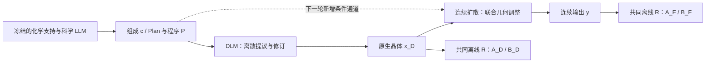

# 连续 diffusion：与科学主线的契合、数学可行性及实现边界

2026-09-06。应用户要求，在K4/K8计算期间进行推导。本文是下一轮方案，
不启动连续模型训练，不改变当前model494、评估端点或本轮排程。
结论来自现有代码、下面的推导及CPU数值例子；不是新增晶体实验结果。

## 1. 结论和论文命题

**连续空间可以定义同一类终态双目标教师，但现有连续模型能否实现、如何训练及是否带来收益尚未证明。**
“有限步路径可评分”不能推出“连续SDE容易实现”。真实训练目标、Girsanov条件、
起点边界以及加权去噪路线见后续的
[训练与SDE审查](24_CONTINUOUS_DIFFUSION_TRAINING_AND_SDE_AUDIT.md)；该文修正本稿早期过强的可行性判断。
适合统一的是
“受科学条件约束的结构分布，如何通过终态反馈改变整条生成路径”，
不是要求离散DLM和连续模型使用相同的token损失或相同的修复模块。

建议命题：冻结的科学LLM给出化学与构造程序，DLM产生精确组成下的离散
晶体提议，连续扩散读取该提议和科学条件，学习联合调整晶格及周期坐标；
两段分别接受同一终态评价原则的监督。原生能力和完整系统能力分别验证。

不能预先把两段描述成严格的“DLM只跨盆地、连续模型只在盆地内微调”：
当前tau800的随机扰动并不小，连续模型也可能换盆地。合理的分工是表示与
可执行操作不同，实际盆地迁移交给数据判断。

[CrysLLMGen](https://github.com/kdmsit/crysllmgen)已经使用离散提议加连续精修。
因此，仅增加连续模型微调不足以形成新的科学命题；需要证明共同终态监督、
提议/程序条件以及两阶段配合带来可归因的增量。分数全部由refiner贡献时，
不能把它写成DLM原生稳定性已经学会。

## 2. 实际代码能支持什么

本地[vendor diffusion.py](../../src/vendor/crysllmgen/models_ddpm/diffusion.py)
与当前远端`/public/home/jiaosz/hengzhang/Code/crysllmgen-main/models_ddpm/diffusion.py`
SHA256一致：`88c38d3fc237001e163c01adeb6296c795497f15a54067a487a9527b3859d208`。

| 代码事实 | 推导含义 |
|---|---|
| forward对GT晶格加Gaussian噪声、fractional坐标加wrapped-normal噪声 | 已有联合连续去噪目标，可加入新条件；不是从零造模型 |
| decoder读取当前晶格、坐标、原子类型、时间 | 连续模型本来就看得到旧数值，不存在DLM的MASK数值丢失问题 |
| sample把未加噪的DLM输出直接作为t=800起点 | 是定义良好的随机精修链，但不能直接声称起点来自训练的正向噪声边缘 |
| 每个t有corrector和predictor，两次decoder调用 | 精确路径评分必须包含两个子步骤及其实际中间状态 |
| corrector中间坐标未立即mod1，predictor输出才mod1 | 只保存整数t的最终wrapped状态，无法恢复完整增广路径似然 |
| t=1的三项随机噪声被强制置零 | 最后一步是参数相关的确定性映射，不能当非退化Gaussian打分 |
| decoder没有独立x_D、soft Plan或program参数 | 原提议只经初始状态传播；新增条件有明确接口位置 |

源码中的`d_log_p_wrapped_normal`实际返回**负的**数学score，采样使用
`x - step * pred_x`，两者符号相配。若新推导使用
`s=grad log p`，实现时必须转换符号，不能因函数名直接照搬。

按现有1000步schedule计算，在t=800：晶格训练输入约为
`0.3066 * L_clean + 0.9518 * epsilon`，坐标正向噪声sigma约0.19887，
首个corrector的坐标噪声标准差约0.17787 fractional。实际部署起点却是
原始DLM晶格/坐标。该分布差异不使当前采样器失去概率定义，也不能据此否认
其已测收益；它意味着标准去噪loss的理论不能不加条件地转成当前精修链的保证。

## 3. 用同一物理泛函，而不是混用两段端点

固定条件`b=(c,P,x_D)`，连续模型生成路径eta，输出`y=G(eta,b)`。
R、能量标尺、验证与hull协议保持固定，定义

\[
A_F(y)=e(y)-e(R(y)),\qquad B_F(y)=e(R(y))-h(c).
\]

DLM仍有独立的`A_D=A(x_D), B_D=B(x_D)`。R是公共评价/离线教师，
不是部署时的连续模型。优化器步数是另一个观测量，不能用A替代步数。
同一b内h(c)为常数，因此`B_F`组内差等于弛豫终态每原子能差。

需要明确区分两类数据：

- 现有DLM K8：固定(c,P)，八个不同x_D；其标签是x_D及R(x_D)。
- 连续后训练：固定同一个(c,P,x_D)，不同连续噪声产生y_j；其标签是
  y_j及R(y_j)。前者不能直接充当后者的已标注候选池。

固定训练分布nu(b)，先对组成等权，再对每个组成的预先选定提议等权；
不能因为某个组成收到了更多提议而改变组成权重。能量标签只进入离线教师，
部署条件不包含R(x_D)、能量、力或测试集答案。

## 4. 分布层目标与有限步路径拟合

### 4.1 有限候选教师与DLM使用同一种凸问题

对每个b保留全部K次请求，在统一验证后得到可用索引集合V_b。
非空V_b上参考权重为`u_bj=1/|V_b|`，未验证候选保留记录但无能量教师权重。
定义组内中心化成本

\[
\tilde A_{bj}=A_F(y_{bj})-\sum_k u_{bk}A_F(y_{bk}),\quad
\tilde B_{bj}=B_F(y_{bj})-\sum_k u_{bk}B_F(y_{bk}).
\]

先求最大共同收益，再以它的一半求最小KL教师：

\[
\begin{aligned}
\delta_{\max}=\max_{w,\delta\ge0}\;&\delta\\
\text{s.t. }&\mathbb E_b\sum_jw_{bj}\tilde A_{bj}\le-\delta,\quad
\mathbb E_b\sum_jw_{bj}\tilde B_{bj}\le-\delta,\\
&\mathbb E_b\mathrm{KL}(w_b\Vert u_b)\le\kappa,\quad w_b\in\Delta(V_b),\\[2pt]
w^*=\arg\min_w\;&\mathbb E_b\mathrm{KL}(w_b\Vert u_b)\quad
\text{s.t. 两项收益均至少 }\delta_{\max}/2.
\end{aligned}
\]

这是有限维凸可行域上的优化；u保证零收益可行。正共同收益是否存在由候选决定，
不是由“连续”二字保证。若满足常规内点条件，KKT给出

\[
w^*_{bj}=\frac{u_{bj}\exp[-\lambda_A\tilde A_{bj}-\lambda_B\tilde B_{bj}]}
{\sum_k u_{bk}\exp[-\lambda_A\tilde A_{bk}-\lambda_B\tilde B_{bk}]},\qquad
\lambda_A,\lambda_B\ge0.
\]

指数里出现两个成本不等于固定调参式A+B：乘子来自分别约束的对偶问题，
可有某个约束不活跃。两个平均收益也不意味着每一个提议或组成都改善。
现有[basin_path_objective.py](../../src/crystal_dlm/basin_path_objective.py)
可以处理这种标签池；仍需新的refiner轨迹采集与评分代码。

**必须限定保证范围：**这是可验证候选的经验分布。验证覆盖率、空组和失败另报；
这里的KL不是整个未筛选部署分布的KL。若人口参考是p0，验证事件为V，
则`KL(Q||p0)=KL(Q||p0(.|V))-log p0(V)`，不能漏掉条件化代价。

### 4.2 人口版本说明它为什么适用于连续空间

若参考连续路径分布p0的相关矩存在、配分函数有限，同样的约束投影给出

\[
q^*(d\eta\mid b)=\frac{\exp[-\lambda_A\tilde A(G\eta)-\lambda_B\tilde B(G\eta)]}
{Z_b}\,p_0(d\eta\mid b).
\]

它不要求y离散，不要求R可微，也不要求弛豫过程可反传。
此处固定b包含同一个x_D，现行采样起点是确定的。若改为随机初始分布rho，
全局终态倾斜会把它改成rho(z)H_0(z)/Z；要求保持rho时，密度比应为
W(Y)/H_0(Z_0)，终点一般不再是全局指数倾斜。不能漏掉这一边界条件。
对非退化Markov子步骤，令终端权重为W(y)，
`H_s(z,b)=E_p0[W(Y)|Z_s=z,b]`，生成时间s向终点递增，则

\[
k^*_s(z'\mid z,b)=k^0_s(z'\mid z,b)
\frac{H_{s+1}(z',b)}{H_s(z,b)}.
\]

由条件期望的塔式法则可直接验证其归一化；各步H比值相乘后只留下终端权重
及起点常数。这就是终态偏好如何改变中间连续动作的明确数学机制。
它对应未来终态质量，不是每一步沿瞬时能量梯度下降。离散路径也有同一形式。
该恒等式没有给出免费可计算的H，也没有证明已有网络可以表达倾斜后的核。
有限步Gaussian核经H倾斜后通常不再是Gaussian。

### 4.3 训练的是实际转移密度

若增广路径为所有实际随机子步骤的状态/动作，且确定性处理不随待训练参数改变，

\[
\mathcal L_{\mathrm{path}}(\phi)
=-\mathbb E_b\sum_j w^*_{bj}\sum_s
\log k_{\phi,s}(z^{(j)}_{s+1}\mid z^{(j)}_s,b).
\]

对于固定正协方差的Euclidean Gaussian转移，单步项恰好为

\[
-\log k_{\phi,s}=\tfrac12
(z'-\mu_\phi)^\top\Sigma_s^{-1}(z'-\mu_\phi)
+\tfrac12\log\det(2\pi\Sigma_s).
\]

因此可以使用加权、按噪声方差缩放的回归训练已有decoder；这个结论来自
**已采集的反向转移**，不是把通常的GT正向加噪MSE改名成路径似然。
子步骤可按已知概率抽样，使用包含概率倒数做HT校正；不能遗漏corrector或
无依据除以路径长度/原子数。固定方差也避免通过学习方差坍塌虚增密度。

连续有限样本有一个容易混淆的问题：离散的经验点质量Q_emp对连续p_phi的
测度KL通常是无穷大。因此上式是对人口交叉熵的有限样本加权估计，
**不是声称精确最小化KL(Q_emp||p_phi)**。可精确计算的是索引权重KL(w||u)
和实际转移log-density；从有限池到新样本仍有估计/泛化误差。

[DDPO](https://arxiv.org/html/2305.13301v3)把扩散子步骤视作可评分的决策，
支持这种可训练接口的方向；本文的双目标教师、周期路径和末步处理仍需独立实现。

### 4.4 连续SDE不能只写成无限多个Gaussian NLL之和

连续路径没有供普通整路径密度使用的有限维Lebesgue测度。若仅改变漂移、
扩散矩阵Sigma和初始分布保持一致，漂移差在噪声范围内，且解存在、随机指数
是真鞅、控制能量可积，则Girsanov给出相对路径测度；非退化情形下

\[
\mathrm{KL}(P_\phi\Vert P_0)
=\frac12\mathbb E_{P_\phi}\int_0^T
\|\Sigma_s^{-1}(b_\phi-b_0)\|^2\,ds.
\]

改变协方差可因二次变差不同使路径测度互相奇异，退化/确定性末步也不能
无条件使用此式。最优漂移需要
\(b^*=b_0+a\nabla\log H\)，其中
\(\partial_sH+\mathcal L_0H=0\)、\(H(T)=W\)；
这是需要学习未来终态概率的后向方程，不是直接添加瞬时能量梯度。
参见[熵正则随机控制的条件](https://arxiv.org/html/2403.06279v2#S3.SS2)及
[独立审查§5](24_CONTINUOUS_DIFFUSION_TRAINING_AND_SDE_AUDIT.md)。

CPU反例显示，固定噪声Euler链的漂移KL可有有限极限，改变噪声的KL随步数增长；
另一个有限KL教师在固定方差Gaussian均值族内投影后完全丢失收益。
后者不否定平滑、小步长极限下的SDE控制，只是否定当前有限步学生必能实现教师。

## 5. 两个必须解决的路径似然问题

### 5.1 周期坐标不能直接拿mod1后的值算普通Gaussian

单坐标在环面上的密度是

\[
k_{\mathbb T}(u'\mid\mu,\sigma)
=\sum_{n\in\mathbb Z}\frac{1}{\sqrt{2\pi}\sigma}
\exp\!\left[-\frac{(u'-\mu+n)^2}{2\sigma^2}\right].
\]

各向同性独立坐标可逐维求积，但均值由整个当前晶体共同决定，不能解释为原子
几何独立。求log密度需要稳定的log-sum-exp及受控的周期像截断。

对当前代码，更直接的办法是保存corrector未包裹中间值和predictor的
pre-wrap输出，把随机动作留在Euclidean覆盖空间上。每个动作有普通Gaussian
密度，mod1是固定确定性状态转换。这样评分的是增广路径，而非偷偷选一条
最短周期位移当作边缘似然；无需对未记录的winding猜测。

CPU例子：mu=0.98、u'=0.02、sigma=0.05，正确wrapped log-density约1.75679，
错误的单Gaussian为-182.24321，相差184。跨周期边界不是小数值误差。

### 5.2 现有最后确定性步骤不能漏掉参数依赖

若最后一步是`y=g_phi(z)`，其条件分布为Dirac点质量。不同均值的Dirac之间KL
是无穷大，不能使用“sigma=0的Gaussian NLL”。也不能只训练前面的随机项、
同时悄悄让共享网络改变g_phi，再宣称完整路径目标仍成立。

有两种明确可行的选择：

1. **先保持现有部署协议：**整个t=1 corrector+predictor用冻结model494分支，
   包括原条件接口；仅t>=2使用可训练适配器。这样最终映射g0对参数独立，
   是共同的固定pushforward，前面增广路径密度可合法评分。
   这是建议的第一版数学验证接口，不是已实施改动。
2. **另注册一个随机末步协议：**给所有可训练随机动作明确正方差，参考和新模型
   都按该协议采样/评分。它改变采样器，不能替代本轮原始model494对照。

共享网络只在loss里忽略t=1、不在执行中切到冻结分支，不满足第一项。
固定验证、几何转换或回滚可以作为参数无关映射，但训练必须保存其输入动作，
否则丢弃拒绝轨迹会改变被评分的分布。

## 6. 从真实去噪训练出发：终点分布选择决定目标

复用训练集中的`(b,z*)=(c,P,x_D,R(x_D))`，对z*构造正向扰动q_t，学习

\[
\mathcal L_{\mathrm{DSM}}
=\mathbb E\left[\omega_t
\|s_\phi(z_t,t\mid b)-\nabla_{z_t}\log q_t(z_t\mid z^*)\|^2\right]
+\lambda_{\rm anchor}\mathcal L_{\rm MP20}.
\]

周期部分使用环面score，晶格使用与参数化一致的噪声目标。目标score在
无限数据/模型容量等理想条件下满足

\[
s^*(z_t,t,b)=\mathbb E[\nabla\log q_t(z_t\mid z^*)\mid z_t,b]
=\nabla\log q_t(z_t\mid b).
\]

所以去噪MSE是在拟合带噪分布的score，**不等价于直接把所有终态坐标平均成
一个晶体**。有限数据和模型、强权重集中仍然可能导致模式丢失。
晶体连续联合扩散与流形score的基础分别可见
[DiffCSP](https://arxiv.org/abs/2309.04475)及
[Riemannian SGM](https://arxiv.org/abs/2202.02763)。

但若R近似幂等且训练达到理想`y=R(x_D)`，则

\[
A_F(y)\approx0,\qquad B_F(y)=B_D(x_D).
\]

这能摊销几何弛豫、改善A，**在固定同一个x_D、唯一R(x_D)的设定下，没有更低B的监督证据**。
若按组成混合多个R(x_D)并重加权，则可以改变盆地概率和B分布；
代价是逐样本DLM提议的角色可能变弱。因此不能把上述结论扩大到所有终点蒸馏。
若希望在同一x_D下
学会选更好的盆地，必须收集实际refiner噪声候选及其终态标签；或另行构造
有对齐依据的跨盆地教师，不能凭组成相同就把不同原子排列硬配成坐标回归对。

此外，标准DSM的采样起点必须与所设计的正向终端分布匹配。可采用有持续b条件
的标准先验生成，或正式推导以提议为条件的扩散桥/残差过程。不能仅更换z*训练
目标，却把“未加噪x_D从t800开始”的旧入口自动当作其精确反演。
上一节的实际路径训练直接对这个旧入口产生的链采样，因此可以研究旧算法的
有限步目标；它不因此获得连续SDE可实现性或学生收益保证。

更一般的终点去噪方案是先定义
\(r_0^*(y\mid b)=W_b(y)r_0(y\mid b)/Z_b\)，再按相同正向核加噪。
在可交换微分与积分等条件下，

\[
\nabla\log r_t^*(z\mid b)
=\nabla\log r_t(z\mid b)
+\nabla\log\mathbb E_{r_0q_t}[W_b(Y)\mid Z_t=z,b].
\]

加权endpoint denoising在无限数据和充分模型容量下直接拟合这个score，
不需要把MSE称为完整实际路径似然。这里的条件期望属于正向加噪后验，
并非旧PC链的future H；只有路径确为匹配时间反演、起点与条件一致时两者才可对应。
若r_0来自实际refiner输出，它重新加噪的score也不能自动替换成MP20预训练score。
这一训练本质及数据选择在[独立审查§6–7](24_CONTINUOUS_DIFFUSION_TRAINING_AND_SDE_AUDIT.md)展开。

[Diffusion-DPO](https://arxiv.org/html/2311.12908v1)通过ELBO代理处理终点似然，
可作另一类近似参考；它不能替代本项目对实际PC链、周期映射与确定性末步的核对。

## 7. 两阶段联合故事的严格版本与边界

令xi为DLM完整路径、eta为连续路径，固定(c,P)分布mu：

\[
J_{\theta,\phi}(d\xi,d\eta,c,P)
=\mu(c,P)p_\theta(d\xi\mid c,P)
q_\phi(d\eta\mid x_D(\xi),c,P).
\]

在共同支持/绝对连续条件成立时，KL链式法则给出

\[
\mathrm{KL}(J_{\theta,\phi}\Vert J_0)
=\mathbb E_\mu\mathrm{KL}(p_\theta\Vert p_0)
+\mathbb E_{\mu p_\theta}\mathrm{KL}(q_\phi\Vert q_0).
\]

若用真正按最终y标签构造的**同一个**固定联合教师Q，则

\[
-\mathbb E_Q\log J_{\theta,\phi}
=-\mathbb E_Q\log p_\theta(\xi\mid c,P)
-\mathbb E_Q\log q_\phi(\eta\mid x_D,c,P)+\mathrm{const}.
\]

这是同一终态教师训练两个不同参数模块的数学依据，不要求穿过离散token或R
反传。然而当前DLM教师在x_D处打标签，未来refiner教师在y处打标签，二者不是
已经存在的同一个Q。模块各自改善，也不自动等于联合全局最优。

若将来只给最终y奖励，还可能鼓励DLM交出更差但易被refiner救回的提议；
要保住原生能力，需明确的原生约束或独立原生目标。第一轮连续扩展建议先固定
最终DLM，只训练q_phi，避免同时改变输入分布和评价归因。

原proposal-only refiner满足条件Markov关系`P -> x_D -> y`（给定c），因此
`I(P;y|c) <= I(P;x_D|c)`。显式给每步decoder接入P，才有保持提议以外程序信息
的接口；这只是信息通路的变化，**不证明program rank一定有物理价值**。
若程序仅代表生成次序，可能不如原提议的几何环境有效，需要后续匹配比较。

条件接口必须同步处理同元素置换、原点平移、原子身份与晶胞表示。
例如置换应满足`F(Pi x, Pi P)=Pi F(x,P)`，不能保留旧slot编号假装等变。
当前矩阵/分数坐标表示也不自动对任意整数晶格基变换等变。
soft Plan作为条件不意味着已严格执行其中的空间群等软偏好。

## 8. 可以证明到哪里，不能保证什么

若人口教师Q在两项成本上各改善delta，且学得路径分布P_phi满足
`KL(Q||P_phi)<=epsilon`，对有界成本f、取值区间宽度W_f，Pinsker给出

\[
\mathbb E_{P_\phi}f-\mathbb E_{P_0}f
\le-\delta+W_f\sqrt{\epsilon/2}.
\]

这说明转移拟合必须足够好，才能把教师的共同收益转成学生收益。
实际有限候选无法认证这里的人口epsilon，真实能量也没有已建立的统一有界范围；
不能为了套不等式而临时截断/隐藏异常能量。固定终点映射还给出端点KL不大于
路径KL，但同样受共同支持与参数无关末步条件限制。

更直接的不可行/失败情形：

- 所有refiner候选经R落入同一盆地且终态能量相同，B为常数：任何权重都无法
  严格降低B，最大共同收益为零。只增加去噪状态数不等于增加盆地对比。
- 候选只存在完全相反的A/B变化，可能没有共同收益；KL投影不能制造不存在的样本。
- A/B均值都降低仍不保证SUN上升。例如A均值从0.02降到0.01，而B从等概率
  `[-0.01,0.30]`变为`[0.14,0.14]`，B均值0.145降到0.14，Strict及0.1阈值
  的稳定率却都从50%变0。即使假设全都有效、新颖、唯一，这个反例仍成立。
- 同一个MLIP同时监督两段，会共同放大势模型的错误。前述-499eV/atom事件
  是实际风险来源；数值一致性不能证明物理真实性。
- 提高稳定率可能降低N/U。不能用更低平均能量替代完整SUN及新颖/唯一计数。

## 9. 下一轮先判别问题，再选择训练路线

1. 先结算本轮K4/K8及固定refiner对照；冻结最终DLM后再建立连续训练输入。
2. 从train-only固定x_D收集连续多噪声输出，重新做共同R和一致性验证；检查B是否
   有足够对比、双目标是否可行、权重及势能异常是否集中，再决定是否值得正式后训练。
3. 若研究目标是条件终点分布，优先把加权去噪的统计目标和匹配采样入口写清；
   若研究目标是保持旧PC算法，则完整保存两子步/pre-wrap动作、冻结末步并验证重放密度，
   只作有限步主张。完整SDE控制还需独立解决连续时钟、噪声、初始分布和H估计。
   当前证据不足以预先指定PC路径拟合作为数学主线。
4. 以现有CSPNet为底座核对proposal条件通道、原子对应和周期对称接口；
   Plan/program是可检验的附加信息，不先承诺其增益。
5. 用相同DLM输入、配对噪声、同一评价协议比较冻结和适配refiner；原生、连续输出、
   公共R后的稳定性及SUN分列。固定输入、最终模型和资源口径，不推理best-of-K。

该顺序是下一轮实施方案，不是此刻新增实验承诺。要把故事写强，应以“共同终态
目标下两种生成路径的适配与各自贡献”为证据主线，而不是以模型数量为主线。

## 10. 可复核材料

[CPU验证脚本](continuous_math_checks.py)及[输出](continuous_math_checks.json)检查了
周期密度归一化/平移、边界错误示例、联合KL链式法则、固定终点映射的KL收缩、
确定性末步极限、均值与稳定率反例以及当前噪声schedule；并补充固定/改变噪声的
SDE极限、Gaussian投影丢失收益、随机起点边界、加权score恒等式和稀有盆地例子。
检查结果以相邻JSON中的实际输出为准。
这些是推导的数值核对，不是新模型性能或晶体物理验证。
