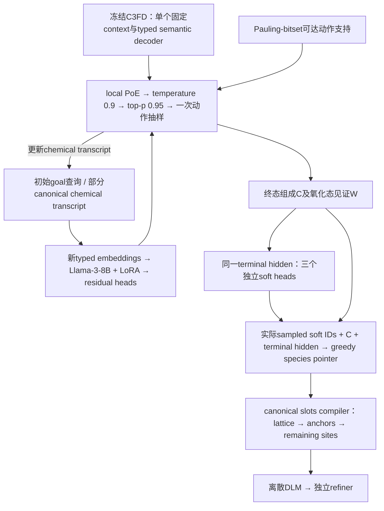

# C³FD → Typed Llama / PoE → soft Plan → species program：独立上游审计

日期：2026-09-06。冻结执行源：`2e904c260bafb6750c9a5dbb0d920c4ff8c3a868`。本报告只审计现有机制、历史证据与可证伪假说，没有选定V3、启动trick、运行模型权重/MLIP、访问SSH/GPU或修改训练文件。

22个关键源码文件已从冻结Git对象保存到 `evidence_upstream/frozen/`。`source_manifest.json` 记录Git SHA、内容SHA256、原始结果JSON的SHA256；`history_summary.json`、`conditioning_summary.json`、`fused_planner_historical_summary.json`保留所用数据。独立概率例子在 `upstream_checks.py` / `mathematical_checks.json`，已在CPU运行，未调用项目训练模块。

## 1. 上游的真实贡献，与目前尚未证实的主张

**有强证据的贡献：** C³FD把有限化学词表上的计数、电荷、family、arity及SMACT见证可达性放进实际解码支持；Typed Llama以新typed输入适配器和残差heads修改同一动作分布；species pointer输出真实执行的元素排列；compiler把它映射到canonical slots。组成/程序并非装饰性文本。

**没有相应保证的主张：** 100% comp-valid不证明所选组成存在低hull结构；PoE归一化正确不证明它更优或具有独立证据融合含义；使用预训练Llama权重不证明语言化学知识贡献；contact-order准确不证明执行顺序提高SUN；原body标签不变不证明新soft条件仍有几何控制语义；全MP20 DLM训练不等于上游Planner/Pointer已使用全MP20。

本轮最重要的新发现有六项：

1. 当前Typed Llama使用新建的goal/stratum/species/count/ledger embeddings，经projector输入Llama；没有把元素名称或自然语言任务文本送入原token embedding，原词表LM head不决定typed动作。它是**预训练Transformer骨干上的typed状态模型**，语言预训练的收益尚需隔离。
2. 当前三个soft字段从同一个terminal hidden的**独立heads**一次输出，抽到前一个字段后没有把它回馈后一个字段。它不是早期Compact ADR描述的三字段autoregressive联合模型。
3. fused Planner行动训练默认使用完整typed词表，部署使用逐状态Pauling-bitset legal mask。builder manifest明确记录这个设计；“训练推理完全相同legal support”不成立。该差异不自动构成错误概率模型。
4. 在线witness支持要求每元素一个氧化态；词表来自训练benchmark可监督节点，proposal只枚举训练见过的family/N/arity。完整性只相对于这套有限语法/词表成立。
5. 当前训练goal全部为`meta_or_better`；teacher chemical transcript由组成的确定性见证编译产生。真实feed-signature复核进一步发现：有实际forward的32,705行、29,249个pooled exact-composition组全部只有一个M signature（其中2,144组有多行）。常量goal无法识别稳定层级控制，当前没有发现“隐藏M携带额外geometry”的现成证据；不外推所有未来C或online W。
6. pointer训练使用clean CIF的接触启发式及teacher soft字段，部署使用sampled soft。当前V2加载的是原始contact-supervised pointer；没有证据把它升级为SUN/energy-optimal程序。

## 2. 实际调用链：三种训练和两个推理接口

### 2.1 当前de novo上游

这是一条有限状态化学生成链。`load_requested_rows()`仅保留请求索引/位置；当前固定`meta_or_better`运行没有逐请求自然语言科学问题输入。其goal支持/条件语义不能从变量名推断。

关键源码：[`sample_single_trajectory`:381](evidence_upstream/frozen/src/scripts/sample_c3fd_llama_typed_planner.py.txt)、[`typed_inputs_embeds`:360](evidence_upstream/frozen/src/crystal_dlm/c3fd_llama_typed_planner.py.txt)、[`spad_program`](evidence_upstream/frozen/src/crystal_dlm/spad_program.py.txt)。

### 2.2 训练对象分工

| 模块 | 训练输入/目标 | 更新哪些权重 | 未直接监督什么 |
|---|---|---|---|
| C³FD semantic model | 固定P0上下文、teacher semantic actions/ledger；N/family/arity、species/count与soft labels | 小型semantic decoder及其适配器 | DLM生成物理结果、SUN、真正的地面态能量 |
| Typed Llama residual | teacher chemical transcript、常量near-stable goal；fused proposal/action/soft CE | Llama LoRA（r=8）及新typed adapters/heads；C³FD冻结 | 不做当前化学动作的独立energy偏好/negative-hull对比 |
| Species pointer | frozen terminal hidden、元素/计数、teacher soft；clean-CIF contact-order | 小型pointer；C³FD、Llama与typed adapter均冻结 | 最优DLM顺序、SUN、force、模型生成后再规划 |
| V2 DLM条件准备 | 原始MP20 exact composition与原chemical metadata；新抽soft+pointer | 全部上游冻结，无训练 | 不重抽组成、氧化态transcript或clean geometry |

C³FD上下文不是每条记录的语言表示：`extract_c3fd_planner_context.py:58–67`对一个固定P0 prompt抽一次最后hidden；训练和部署都把同一行context扩展使用。其值可能影响初始化/优化，但对不同样本不传递变化的信息；可用一个learned constant模拟同类条件通路的函数作用，是否有优化收益需实测。

### 2.3 “接口一致”与“分布一致”不同

V2准备使用与部署相同的soft PoE/temperature/nucleus抽样顺序，是实质改进；但其C、W来自原始teacher记录，部署C、W来自上游抽样。可写成

\[
q_{train}(Y,C,W,S,P)=p_{data}(Y,C)q_{teacher}(W|C)\,
\pi(S|C,W)\,\rho(P|C,W,S),
\]

而de novo输入的`(C,W)`来自生成分布`q_{upstream}(C,W)`。相同函数和dtype/字段协议不意味着两种状态分布相同。full-MP20 DLM包含fallback保留的来源，也没有因此扩大冻结上游的可生成词表/strata。

## 3. C³FD的硬支持：准确，但相对于什么准确

### 3.1 有限可达性问题

令semantic action为`a=(Z,q,n)`，state至少含剩余原子数b、净电荷Q、已选元素、branch、目标arity及family。定义声明语法下的终态集合T。理想viability递推为

\[
H(s)=\mathbf1[\exists\text{suffix }a_{1:k}:T(s,a_{1:k})\in T],
\qquad \mathcal A(s)=\{a:H(T(s,a))=1\}.
\]

若mask计算准确且每次从非空`A(s)`采样，有限预算下降可保证到达声明终态。这是计算机科学意义上的suffix存在性，不是物理能量的存在性。

PaulingBitset把所有可达净电荷编码到一个Python整数：选择`(q,n)`相当于把charge bitset平移qn，备选路径通过bitwise OR合并。它解决的是精确有限集合计算的效率，不增加化学定律。[`family_reachability.py`:656–956](evidence_upstream/frozen/src/crystal_dlm/family_reachability.py.txt)。

### 3.2 声明支持有四层限制

1. **训练词表。** `build_vocabulary()`只收集训练中`composition_supervision=True`记录的`(Z,q)`节点；不是任意元素/氧化态的完整catalog。Aufbau描述符是每个节点的平滑先验，不是正确电子基态/化学价验证器；代码明确没有处理原子构型例外。
2. **proposal strata。** `StratumInteraction.fit`只保留训练见过的`(family,N,arity)`，α平滑也只在这些已见strata上。未见stratum即使物理可行也没有proposal类别。
3. **witness语法。** `PaulingWitnessReachability._state_summary():402`要求`len(tokens)==len(distinct_elements)`；在线是每元素一个氧化态。底层`CCFDv2State`可以容纳同号mixed-valence节点，不代表这个在线oracle也允许它。
4. **benchmark sufficient conditions。** ionic要求确切电中性且全部cation electronegativity低于全部anion；多元素zero-valence分支必须全是metals；unary保留benchmark shortcut。family按元素集合优先级划分。这是一套可构造的SMACT见证规则，不是全部真实固体化学的必要充分条件。

例如在有限字母表`Fe²⁺,Fe³⁺,O²⁻`上，`Fe²⁺₁ Fe³⁺₂ O²⁻₄`严格电中性，而强制3个Fe共享整数氧化态2或3，净电荷分别为−2或+1。这个代数例子说明mixed-valence表达范围的差别；本审计未据此计算任何真实体系hull，也未假定生产词表恰好只有这些节点。

原始数据审计的`reachable weighted mass≈99.76%`是family/N/arity层面的覆盖，不能替代typed composition监督的`24,558/27,136≈90.5%`覆盖。相同stratum里可以既有被该witness支持的组成，也有不支持的组成。V2 val实际出现11条`unsupported_frozen_stratum`，是可观测的上游支持边界。

### 3.3 100% comp-valid不能推出热力学可实现

定义`V(C)`为benchmark化学有效，`Ω(C)`为本方法可表示的几何集合，`Sτ(C)`为共同物理协议下hull≤τ的几何。一般不存在

\[
V(C)=1\quad\Longrightarrow\quad\Omega(C)\cap S_\tau(C)\ne\varnothing.
\]

最好的下游geometry generator也满足

\[
\Pr(SUN_\tau)\leq\Pr(S_\tau)
\leq\sum_C q_{upstream}(C)\,
\mathbf1[\Omega(C)\cap S_\tau(C)\ne\varnothing].
\]

这个上界不是已知数值，但明确指出上游可能仍限制SUN：它可以把质量放到全部charge-valid却难以有低hull单相的组成。反过来，某些真实材料不满足简单价态checker，也不能据`V=0`证明物理不存在。

hard support是方法的一部分，编码公开化学知识可实质改善任务完成率；它不是“作弊”。但报告必须承认baseline是否也获得相同支持、哪些检验已在生成时强制、模型究竟学了哪一部分。hard N/element prefill还把后续DLM的组成生成任务移到了上游，不能把它的100%计数正确全部记作DLM学习能力。

### 3.4 局部viability mask不是全局条件化原始分布

若原始decoder在前两种分支各给`.5`，第一种只有10%的continuations终态合法、第二种全部合法，那么两支都满足`H(s)=1`，局部mask之后第一步仍为`(.5,.5)`。真正把整个原始轨迹分布条件化为“终态合法”时，第一步应为`(1/11,10/11)`。

全局条件化需要continuation probability，而viability只给0/1存在性。C³FD可以是一套完全合法的新生成分布，却不等于“原P0分布仅去掉invalid后的无偏样本”。这也说明支持规则会改变N/arity/family和novelty分布，历史drift不能被当成纯数值异常。

## 4. Local unit-weight PoE：正确归一化，不是自动的独立知识融合

### 4.1 代码的实际概率

在相同legal set`A(s)`上，frozen base logits为b，Llama residual logits为r。两者先各自log-softmax，再相加并重新归一化；代数上恰为

\[
q_\theta(a|s)=\frac{\mathbf1[a\in A(s)]e^{b_a(s)+r_a(s)}}
{\sum_{a'\in A(s)}e^{b_{a'}(s)+r_{a'}(s)}}.
\]

没有漏掉归一化；两次单expert normalizer都是state常数，在最终softmax消去。r=0时回到base的同支持分布，step-0等式在实数算术成立；实际浮点按记录有微小误差。[`unit_weight_poe_log_probs`:168–194](evidence_upstream/frozen/src/crystal_dlm/c3fd_llama_typed_planner.py.txt)。

随后部署还有temperature`.9`和top-p`.95`。因此记录的pre-temperature PoE KL不是最终抽样分布的KL；它可以证明残差非零，不能直接当作实际draw distribution与base的全部差异。当前V2 soft audit同时保留`selected_sampling_probability`与`selected_legal_poe_probability`，这一区分是正确的。

### 4.2 双计数攻击何时成立，何时不成立

若两个独立训练的expert都拟合同一个p，乘积会得到`p²/Z`。例如`p=(.8,.2)`变成`(.9412,.0588)`；把相同证据当独立证据确实会过度集中。

**但当前不只是把两个独立MLE模型相乘。** 训练的loss直接作用于fused q；在完整合法支持和足够表达能力下，残差可以学

\[
r^*(a,s)=\log p_{target}(a|s)-\log q_{base}(a|s)+c(s),
\]

从而精确拟合target。若base已正确，最优残差可以是常数，而不是再学一遍base。因此不能直接宣判unit-weight必然double-count。正确名称更接近**学习base的log-linear correction**；normalized residual可以数学上称expert，但没有独立证据的Bayes融合保证，也不是经过单独验证的LLM化学概率。

系数1是设计选择，不是物理常数。若r不受幅度限制，把非零系数λ改为别的值在函数类上可由r/λ补偿；实际有限LoRA、正则化、优化和采样会使它有影响，须用数据判断。既不能把unit coefficient称最优，也不能仅因固定1而判其无法学习。

### 4.3 另一个被“Llama知识”叙事掩盖的表达能力变化

C³FD原base把real-species/count logits相加：`b(Z,n)=u(Z)+v(n)`；没有mask时是factorized分布。当前部署还明确设置`use_pair_prior=False`。Llama的residual action head却直接输出`num_species×max_count+1`个joint logits，能补充species/count之间的非加性依赖。

所以残差改善可能来自**joint action head更有表达力**、更大的typed状态Transformer或不同优化，而不一定来自自然语言中学到的化学知识。最小对照应至少比较同joint head配小型semantic encoder，而非只把8B Llama和较弱factorized base比较后作知识归因。

### 4.4 Local PoE不等于全轨迹或终态PoE

对一条chemical路径τ：

\[
q(\tau)=p_{base}(\tau)\,
\frac{\exp\{\sum_t r(a_t,s_t)\}}{\prod_t Z(s_t)}.
\]

各path经过的`Z(s_t)`不同。一般不能写成一个全局normalizer下的`p_base(τ)p_Llama(τ)`，也不能进一步不求和就称composition terminal distribution的product。一个组成可能对应多个允许valence witnesses；canonical action order只消除了部分排列冗余，不能消掉所有路径到组成的多对一映射。

独立CPU例子给出local逐步PoE与global path-product不同；这不是local模型不合法，而是不要给它错误的概率解释。

## 5. Fused Planner训练/推理：明确的支持差异与同源条件问题

### 5.1 行动训练全词表，推理才施加可达mask

`build_c3fd_llama_fused_data.py`最终manifest明确写：

> `full_typed_vocabulary; C3FD hard reachability mask is applied during single-trajectory inference`

builder调用`typed_targets_from_semantic_row`时`compile_legal_masks=False`，输出不含逐步legal indices。trainer在字段缺失时为每步设完整typed support，包括不满足当前ledger的actions；proposal使用预编译legal mask，soft排除`<UNKNOWN>`，三个层面不能混为一谈。关键位置：[`builder`:320](evidence_upstream/frozen/scripts/build_c3fd_llama_fused_data.py.txt)、[`collate`:364–366](evidence_upstream/frozen/src/scripts/train_c3fd_llama_typed_planner.py.txt)。历史commit `22d7a46`的目的就是把hard reachability保留在inference。

对真实legal set S和target y∈S，令全词表概率为q，则

\[
-\log q(y)=-\log q(y|S)-\log q(S).
\]

全词表CE额外训练“把质量放进合法集合”。无限容量、全部真实targets合法时，两种目标可以有相同正确解；有限容量下它们分配梯度的方式不同。不能把这称为归一化bug，但也不能声称实际行动CE就是部署masked NLL。诊断应同时报告两项以及`q(S)`，而不是用低full-vocabulary validation loss证明部署条件概率已正确。

### 5.2 校准和row weighting的边界

frozen base对family/N/arity/species/count各有temperature校准；stratum interaction加入训练joint与marginals的log-ratio correction。校准输出在fused模型再训练时作为固定b，它不会自动在加r、hard mask、temperature/nucleus之后继续calibrated。

typed loss是`(proposal CE + per-row mean action CE + mean soft CE)/3`，另尊重source weights。它使高arity样本不因动作数更多而简单得到更大总权重；不是full terminal log-likelihood或energy目标的别名。在固定arity/state的无限容量分析中，正权本身也不必改变Bayes最优，不能机械把“平均而非求和”判错。

### 5.3 常量goal只有一个可观测条件

原始metadata经过`.1 eV/atom`阈值转成`meta_or_better/higher`二元ID；本次fused训练所有合格行都在前一类，`higher`没有训练样本。当前runtime也固定请求`meta_or_better`。不存在本轮已学得的strict/meta/higher控制器，更不是组成到hull能量回归器。

一个constant goal embedding在本数据上可等价为context偏置；改变未训练goal后的输出没有已校准语义。它仍可学习**来源于near-stable MP20数据的组成先验**。这两句话并不矛盾：正数据的生成学习有价值，但不能从一个label值识别label条件效应。

### 5.4 实际上游训练并非全MP20

现有fused Planner训练为24,558/8,158，原pointer还对val unsupported strata另行记账。V2保留27,136/9,047行，只是在DLM准备中对缺上游metadata者明确fallback；没有重训Planner。原ADR也把全数据、非删除的Planner训练列为以后要求，不能把V2 DLM全源覆盖重述为该要求已完成。

## 6. Llama到底读什么，语言预训练的作用证据有多强

### 6.1 实际输入不是audit transcript文本

`TypedSequence`实际包含：goal ID、proposal-state ID、previous species ID、previous count和6个ledger features。ledger是`remaining_atoms/20`、`net_charge/160`、`remaining_species/7`与unset/ionic/alloy的one-hot。各序列位置分别作新embedding/linear projection，拼接、LayerNorm，再project到Llama hidden size。

虽然数据可保留人可读`audit_transcript`，真实forward直接传`inputs_embeds`；它没有被tokenizer编码后喂给Llama。训练加载tokenizer和`AutoModelForCausalLM`不证明tokenizer/原LM词表head实际执行任务。代码取最后hidden，再过typed output heads。C³FD的Aufbau features属于base semantic model，也不是Llama在自由文本中推理出的电子配置。

因此可成立的表述是：**预训练Llama Transformer权重作为typed状态编码骨干，经LoRA适配后影响动作与soft logits。** 尚不成立的是：模型在推理时阅读化学文献、自然语言科学指令，或已经实证证明自然语言预训练知识比同容量/同输入的其他encoder更有贡献。

这不是预训练无用的证明。深层pretrained attention/MLP可能提供通用序列计算、表示与优化优势，新typed projector也可能学会进入其有用表示子空间。只是当前没有隔离这些解释。

### 6.2 “Llama有影响”不等于“Llama带来收益”

历史JSON记录fused sampling中pre-temperature `KL(fused||C3FD)`均值约0.0682，约87%的events非零，selected base rank均值约8.915。这支持残差不是完全no-op。它不支持最终SUN更高，也不能区分“joint head容量”“通用pretraining”“化学语言知识”三者。

主证据为 [`C3FD_LLAMA_DLM_SUN_CHECKLIST_V6.json`](historical/docs/C3FD_LLAMA_DLM_SUN_CHECKLIST_V6.json) 的`post_fm.compact_v2_pivot`，已在本lane摘要保留全SHA。raw body/Direct改善的比较明确跨cohort，原JSON也标`direct_absolute_difference_pp_noncausal`；不能把它转述为matched Planner胜出。

早期ADR还明示comp-valid过线即保留fused Planner以保留主线故事。这是当时的项目选择理由，不是关于Llama必要性或效果的科学证据。当前大审计应允许重新问：用同样hard support、joint head与输入，一个小encoder是否就能达到同样SUN/效率。

## 7. Soft Plan：独立heads、标签语义与M边界

### 7.1 当前三字段在给定terminal transcript时条件独立

令C为exact composition，W为valence/action transcript，h为冻结模型terminal hidden。当前代码一次得到三个residual heads和三个base heads，然后分别进行PoE/抽样；S₁没有进入S₂/S₃的forward。因此

\[
\pi(S|C,W)=\prod_{k=1}^3\pi_k(S_k|h(C,W),C,W).
\]

共享hidden可以产生**跨组成的边际相关性**，但不能表达同一个完整条件下剩余的多模态联合相关。例如同C只有两种标签对00/11各半，两个完美marginal heads独立抽样会产生50%的01/10。这只是联合标签分布的反例，不代表01/10一定违反真实晶体物理。

反过来，也不能把聚合三字段agreement的乘积当joint agreement：难/易C混合下`E[∏p_k(C)]≠∏E[p_k(C)]`。本次all-three相符率train 26.928%、val 23.886%，与各单字段相符率的乘积不同，不因此证明代码存在三字段AR依赖。

### 7.2 metric lattice与conventional SG不是一一映射

[`C3FD_RICH_FIELD_SEMANTICS_AUDIT_V2.md`](reference/component_specs/C3FD_RICH_FIELD_SEMANTICS_AUDIT_V2.md)已追踪：lattice_system来自当前胞的长度/角度，SG bucket来自conventional SG metadata。primitive rhombohedral metric与cubic conventional SG可以同时出现。

旧sampler用lattice lookup强制SG，所谓100%“compatibility”是在验证自己的lookup，不是在验证目标语义。独立SG head的恢复纠正了真实信息丢失。这项修正值得保留；不能因为看到soft lattice/SG不满足旧一一映射，就再次硬化同一错误约束。

该历史审计有明确数据与输出SHA，但本机未保留其完整原始predictability JSON，故此项以代码定义和带SHA历史报告为证，未声称独立重算预测准确率。

### 7.3 M的理论边界，必须落到实际feed字段

一般地，如果Planner读`(C,M)`而DLM只显式读C，那么即使`Y⊥S | (C,M)`，也不能推出`Y⊥S | C`，因为

\[
p(Y,S|C)=\sum_M p(Y,M|C)\pi(S|C,M)
\]

可能不分解。S/P可成为M的压缩通路，不能先在数学中条件化M，又在实际模型输入里删掉M，最后宣布S无信息。

但本项目的teacher M有更具体的限制：

- `compile_plan_actions`先合并并canonicalize元素/计数；只给组成checker `elements,reduced_counts`，不读原CIF、soft fields或能量。
- `classify_smact_validity`按固定catalog枚举氧化态，返回首个charge-neutral/Pauling witness；zero/alloy shortcut同样只依赖组成。
- subsequent ledger由这些actions、N及arity确定；当前goal常量`meta_or_better`。

在固定软件/catalog下，这条teacher路径支持`M=f(C)`；本次真实逐行signature也未发现同exactC的M差异，详见7.5。**不能只拿“存在M字段”当成推翻随机soft独立性分析的现成答案。** 这是当前有限表事实，仍不涵盖其他库版本、异常fallback、未来C或在线抽样W。

在线C³FD则可以抽到多个合法W，而不总是teacher的首witness；即使C相同，这也可能改变Llama hidden、S和P。这是一个潜在train/serve transcript分布差异，不是已观测的SUN损害。

### 7.4 新soft配原样clean：到底训练哪一种条件语义

若在完整C下S独立采样，而Y保持原标签，则population joint为

\[
p_{train}(Y,S|C)=p_{data}(Y|C)\pi(S|C),
\quad p^*(Y|C,S)=p_{data}(Y|C).
\]

最优模型可以合理忽略soft的几何含义。P还能改变有限模型的因子分解、mask pattern和计算难度；信息冗余不等于程序无用。若旧U也只是由Y独立corrupt而来，则加入U本身也不把独立S变成真实几何控制标签。

这仍是population随机机制的结论。一份只按source-seeded抽样一次的有限表，可有偶然或可被记忆的S/Y相关；M同C唯一也不证明实际有限模型已忽略S。源记录中的多晶型、fallback和样本权重需分别记录，不能从输入signature直接跳到性能或因果结论。

当前应分别声明：

- **提示**：允许忽略不相符soft，学习`Y|C,U`；用SUN验证它是否有有限模型帮助。
- **requested condition**：训练Y必须与请求S有可核语义关系；不能只抽一个预测标签然后假定该Y服从它。
- **latent polymorph plan**：需要学习能把Y与S耦合的联合或后验结构，避免latent collapse；几何必须能实现该latent。

低agreement不等于伤害：GT有规范/容差误差、同C可能多晶型、soft可以是统计先验，且真正终态遵从性还未测。当前不能据此给V2定败因。

### 7.5 本次逐行冻结证据与待运行的stdlib复核

`FROZEN_CONDITIONING_AUDIT.json`证实全部clean answer和exact composition不变；train直接预测24,558、fallback2,578；val8,147直接、900 fallback（其中11为unsupported strata）。train/val有1004个exact composition重合、无exact answer-string重合。字符串不同不是晶体结构不同的充分判据，随机原始split也不等于组成独立泛化测试。

为主审纯读取复核M，已提供 [`audit_teacher_metadata_signatures.py`](evidence_upstream/audit_teacher_metadata_signatures.py)。它按实际collator构建unpadded chemical input signature：含previous species/count、C³FD previous-N、float32 normalized ledger、soft-position和attention；goal/stratum以固定injective ID等价的语义值表示。排除source index/split、soft labels、contact targets、clean answer、sampling seed及审计字段，**不使用含source identity的typed_input_sha当作M非确定性证据**。

分别汇报teacher M、prepared实际forward使用的M、以及单列含actual sampled soft IDs的pointer输入。group keys区分reduced formula、exact formula、DLM hard context（N/计数/family，无goal）、完整Planner condition（再加goal）。fallback没有真实Planner forward，不混进已forward签名分母。该脚本只依赖stdlib，合成输入自检通过后，主审完成了纯CPU真实运行，0模型调用、无错误stderr。

prepared实际M结果如下；exact-formula、DLM-hard和加goal的Planner-condition三个键得到相同分组结果：

| Split | 实际forward行 | exact-C组 | 有多行的组 | 同exact-C多M-signature组 |
|---|---:|---:|---:|---:|
| Train | 24,558 | 22,367 | 1,396 | 0 |
| Val | 8,147 | 7,830 | 242 | 0 |
| Train+Val | 32,705 | 29,249 | 2,144 | 0 |

若只按reduced formula分组，则train有1055/21146组多signature、val180/7634、pooled1642/27358；这包含不同N/精确计数等已经显式可见的差异，不能把它冒充DLM不知道的hidden metadata信息。完整源输出为 [`V2_FINAL_TRAIN_AND_METADATA.json`](evidence/V2_FINAL_TRAIN_AND_METADATA.json) 的`metadata_audit`，本lane保存了来源SHA与摘要 [`observed_metadata_signatures.json`](evidence_upstream/observed_metadata_signatures.json)。

因此当前实证支持的是：**在观测exact-C内，teacher/prepared M唯一；没有找到额外source-dependent几何输入。** 它不证明未来组成的确定性，不约束在线C³FD可采的其他W，也不证明S/P无计算效用或实际模型忽略S。

## 8. Species pointer：学习了哪种“结构程序”

### 8.1 Contact teacher的精确定义

`build_spad_species_pointer_data._teacher_target`解析clean CIF，取`structure.distance_matrix`。对不同site对i<j，令

\[
w_{ij}=\exp\!\left[-\left(\frac{d_{ij}^{PBC}}{r_{Z_i}+r_{Z_j}}\right)^2\right],
\quad D_e=\sum_{i:Z_i=e}\sum_{j\ne i}w_{ij}.
\]

root选`D_e/n_e`最大元素；之后对未选元素e，按其与已选species的总affinity、除以`√(n_e Σ_{s∈selected}n_s)`扩展，ties按degree及原子序数。它是确定性的contact-affinity增长启发式；没有拟合能量、hull或DLM的实际conditional难度，名称中的“maximum contact tree”也不构成全局spanning-tree或物理最优性定理。

该目标还只是不同site之间的最短周期距离聚合，不是包含所有periodic images/self-image neighbors的完整配位多图，也没有角度或多体能量。可以作为结构相关教学信号，但不是实际bond网络的完整监督。

### 8.2 Pointer如何决定排列

候选元素向量为`e(Z_i)+e(n_i)`，context为`W_h h_terminal + Σ_k e_k(S_k)`。每步query再加已选候选平均的projection与step embedding；以additive attention打分未选元素。training使用teacher-forced prefix CE，decode逐步argmax。它保证输出是给定候选集的排列；不改变组成，不逐token重跑Llama，也不读取正在生成的DLM几何。

当前pointer训练只有一epoch，冻结全部Planner参数；实际V2 manifest仍指向`spad_species_pointer_39511/train_seed86017/pointer_state.pt`，SHA256 `934e1eef3cad885f8818c268d7552624b9fb81671cebcd66dc3b72c4fdbc9722`。不能把历史“以后做program-value训练”的提案当成当前checkpoint已有energy监督。

### 8.3 Teacher soft与sampled soft的接口差异

pointer训练collator明确使用`row['soft_targets'][field]['label']`。deployment和V2准备给的是实际sampled soft IDs。原pointer的validation准确率主要回答**teacher conditions下是否拟合contact-order**，不是在生成条件下是否知道最佳程序。

V2修正了以前准备阶段用MAP soft、部署却sampled soft的差异；这不等于重训了pointer使其适应不相符soft。需要独立比较同一source在teacher soft、sampled soft和soft-dropout等条件下的teacher-order accuracy/最终SUN，不能从三字段all-match低直接计算pointer损失。

### 8.4 Compiler程序的自由度与不可归于Llama的规则

`program_from_element_order`把unique-element permutation映射到canonical native slots；每物种anchor固定为该物种第一个slot。predictor先六个lattice scalars，再各物种anchor，再remaining sites；site内部固定X→Y→Z。这些是compiler设计。

因此Llama/pointer决定**物种之间的访问顺序**，没有学习六晶格参数的排列、XYZ内部顺序、同物种每个site的独立排序或最优anchor位置。旧reverse closure及cooperative region的几何规则也不能全部归因于Llama；当前V2实际是construction→full-cell repair，不能沿用旧closure解释。

## 9. 历史成功/失败：哪些有原始JSON支持

下表只用于审计，不将旧composition/Direct代理指标当作当前最终SUN结果。原始JSON优先；缺原始细表时明确降为历史文档证据。

| 阶段 | 原始证据/发生了什么 | 合理机制结论 | 不能扩大为 |
|---|---|---|---|
| countvalence文本方案 | `PLANNER_COUNTVALENCE_FACTORIAL_FINAL.json`：charge-known输出中只有约一半neutral；all-metal比例上升；未过下游门槛 | 把氧化态标签写成文本并没有可靠执行守恒 | 所有语言表示都不可能学化学，或训练数据本身无效 |
| 原C³FD-v2 | `C3FD_PLANNER_FINAL.json`：composition有效显著提高，但N/arity/family漂移与uniqueness门槛失败 | 从free-form改typed约束有真实收益，也改变生成分布 | comp-valid高就表示不需要继续审上游 |
| v2.1 proposal校准 | `STEP1/3/4`审计有393 supported strata；proposal分布更贴近train；pilot仍52/512失败 | 多个必要条件各自可达不等于存在共同suffix；proposal通过不保证在线执行 | 99%以上stratum覆盖就是99%以上化学/物理覆盖 |
| v2.2–v2.4 | 独立ENGINEERING_FAILURE JSON记录DFS/DP运行时间/内存失败，未产生科学结果 | 数据结构和存在性搜索的复杂度需要改进 | 已证明witness科学思想无效或模型SUN失败 |
| v2.5 bitset/witness | 原requested1000结果为两个seed各1000，pooled 2000/2000 benchmark comp-valid、零semantic dead-end；ionic也通过 | 在声明支持内的构造见证与在线可达机制成功 | 2000个组成均能生成低hull结构；所有真实化学均在支持内 |
| rich-field语义修正 | 代码与带SHA审计指出metric lattice与conventional SG标签独立；旧lookup丢弃SG head | 纠正了真实字段语义和RNG接口 | 新SG head必然提高SUN |
| fused Typed Planner | V6 JSON记录training、step0与sampling影响；仅一个seed/epoch、下游比较跨cohort | residual确实重加权化学动作，typed接口可运行 | Llama优于C³FD、其语言知识必要、已学hull分类器 |
| BP程序 | 历史模块审计记录73.50% contact permutation准确、229/256非canonical；BC→BP raw Direct 99.22→98.05 | 学会非平凡、可执行的contact程序；规则顺序有效进入解码 | 学到比canonical更好的程序，更不是SUN最优程序 |
| BP/BR/BS后续 | BC/BP晶格前缀同；BR backfill、BS schedule-matched训练提高执行有效性 | DLM能吸收这些访问/修订状态；可执行性和有用性需分开 | BP本身贡献了全部增益，或新训练已消除上游条件分布问题 |
| 最近K4/K8与raw-v1/V2 | 修正hull覆盖后的结果有有效SUN，V2条件完整保留来源 | 没有“上游全部失败”的证据；也没有单独isolated上游效用评估 | 下游teacher负结果等于C³FD/Planner/Pointer均已被排除为原因 |

`C3FD_V25_REQUESTED1000_FINAL.json`的counts/cells是pooled2000，但`claim_boundary`残留“requested256”字符串；本审计使用实际计数并标注这项历史metadata不一致，不据残留说明把2000改成256。原始C³FD结果是composition/formula screen，和现在的crystal-levelN/U不是同一个对象。

pointer validation及BC/BP细节在本机仅找到有明确描述/路径的历史文档，没有独立复算raw per-row JSON。即便接受这些文档，结果也没有支持“learned order优于canonical”的强结论。旧`05_DECISION_LOG`本身已经承认这一点；后续文档不能通过重复引用把它升级成正结果。

## 10. 最小因果诊断：当前只列设计，不执行

| 要区分的假说 | 最小可审实验/数据检查 | 必须保持的比较对象 | 否证标准 |
|---|---|---|---|
| chemical support保留了相关物理区域 | 统计full-MP20组成/strata/witness覆盖，按excluded原因分层；单独诊断生成C的可实现几何成功率 | 原始全部请求/来源，不删unsupported | 高compvalid但大量C在固定geometry实现预算下不达SUN；不能再说上游已无问题 |
| fused Llama帮助组成选择 | C³FD-only与fused composer在同hard support、sampling policy、固定下游实现器下做全链路比较 | 同资源/请求预算；composition变化是处理效应的一部分 | 重加权非零但SUN无增量或退化 |
| Llama提供语言预训练优势 | 同typed接口/joint action head下比较pretrained骨干与适当的small semantic encoder/初始化对照 | 数据、支持、训练目标、测量预算可比；不能只比不同joint-head容量 | 小encoder等效或更好，或收益仅来自joint head而非pretraining |
| action训练支持差异重要 | 固定teacher states计算full-NLL、legal-NLL及q(S)；必要时才比较训练版本 | 同source/state，不把相互不同的支持loss直接排名 | q(S)已经足够高、masked条件误差小，支持差异不能当首因 |
| S有几何语义效用 | 同C固定/正交改变S和P，分别测target风险、realized标签与SUN | 明确teacher/requested/predicted三语义；oracle不冒充de novo | S改变token却不改善对应几何或SUN，或去掉S更好 |
| M传递了C以外信息 | 去source identity的实际feed signatures；分exactC、family、goal；对重复组成审查 | 不用含sourceidx的hash；不把固定goal当变化信号 | 同C下M唯一且代码为确定性编译；“额外metadata信息”解释应降级 |
| pointer的terminal Llama必要 | retrain同预算C/S-only pointer与完整pointer；另作frozen-hidden使用诊断 | teacher-soft/sampled-soft分别比较 | C/S-only达到相同SUN，terminal隐藏不构成必要性证据 |
| contact heuristic对应好程序 | canonical、learned、teacher-contact程序在同C/S/weights与request/site-keyed随机数下比较 | 不重排存储，不改变lattice/XYZ固定规则 | oracle contact-order也不优于canonical，不能靠提高teacher accuracy期待SUN |
| greedy程序选择限制结果 | 若另获授权，固定程序policy比较greedy/一次sample的分布效应 | 单程序单轨迹，不能偷换best-of-N | sampling只增多样性而不改善SUN；不据此恢复能量搜索 |
| compiler顺序才是主要贡献 | canonical合法事务与learned物种程序分别比较，保留旧B0/BC/BP分离 | 同DLM初始化与支持；避免把所有变化都归到Llama | canonical事务解释大部分收益而learned程序无增量 |

针对上游的因果拆分至少需要两种问题：**固定C**的条件实现对照可检验S/P；**让C改变**的全链路对照才检验composition policy。不能要求所有上游比较都固定C，又声称已经测了组成选择的收益。

## 11. 主线可以怎样重述，而不是维护既定故事

目前有证据的主线可写为：

> 用声明的化学可达支持构造离散组成；在同一typed动作空间学习对frozen先验的残差修正；以composition与可执行物种程序条件化DLM的离散几何实现；用独立refiner保留系统端点。上游控制的可达性、统计预测、计算顺序与下游SUN收益分别验证。

需要从更强措辞中撤回的内容包括：

- “100% chemical validity证明上游不是物理瓶颈”；
- “unit-weight PoE把两份独立科学知识作严格Bayes融合”；
- “Llama每次读自然语言化学状态并推理”；
- “三个soft fields由当前Typed Llama自回归联合生成”；
- “meta_or_better训练证明可调严格/亚稳层级”；
- “contact-tree permutation准确率证明最优结构生成顺序”；
- “程序不同于canonical就证明比canonical更有用”；
- “DLM全数据训练已经补全frozen Planner的训练覆盖”；
- “无teacher几何直接输入就排除了所有相关性，或M存在就证明有额外几何信息”。

这些边界不否定现有实现价值。它们把价值放回可复核对象：合法支持、概率修正、统计/计算表示、程序执行和真实SUN。若简化后的上游或直接geometry decoder更有效，审计应接受该结果，而不是先保证某个组件必须留下。

## 12. 当前未决事项与证据强度

**A：已核代码/代数。** typed输入与独立soft heads、local PoE归一化、training full-support与inference viability mask、有限词表/strata、单元素单valence oracle、contact teacher和greedy编译、M的teacher构造路径、原pointer SHA。

**B：有原始JSON但未重新跑模型。** C³FD各版本composition结果、工程失败、fused训练/采样摘要、正式V2冻结条件完整性。历史结果的旧阈值/库/候选支持不用于现在的SUN排名。

**C：待实际诊断。** Language pretraining的增量、hard支持遗漏对SUN的影响、S/P的净效用、M在未见条件的性质、online W偏移、pointer在sampled-soft下的质量。当前有限表M唯一性已完成CPU实证，不再列为未测；现有支持/统计仍不够把其他假说定为唯一败因。

本报告没有新增上游训练或模型输出，也没有把尚未完成的因果对照包装成结论。stdout/JSON与所有来源SHA均保留，便于主审和另一审稿者逐项挑战。

## 13. 正式V2结果补记：校准结论强度

主审提供的正式final已完成4,524 updates，各source-view覆盖2次，训练记录的support-conflicts文件为0；这排除已观测训练中的该类冲突，不证明所有未来状态都可达。固定256请求的两端已各自完成SUN评估，construction attribution等总体诊断当时仍在继续：

| 版本 | Native Strict/Meta SUN | Refined Strict/Meta SUN |
|---|---:|---:|
| 参考 | 6 / 55 | 19 / 121 |
| raw-v1 | 3 / 45 | 16 / 113 |
| V2 | 8 / 50 | 16 / 113 |

来源：[`V2_EVALUATION_SUMMARIES_39998.json`](evidence/V2_EVALUATION_SUMMARIES_39998.json)，以及主审已保存的相同开发条件比较。V2未达到同端26/128；组合改动没有使refined SUN高于raw-v1，且仍低于参考。aggregate相同不表示逐结构相同，native相对raw-v1的变化也不能归给某一个上游或几何模块。

该结果要求维持本报告的条件性结论：soft-pairing、有限化学支持、语言预训练、pointer和GNN均值得检验，但目前不能宣判其中任何一个是唯一根因，也不能为了维护主线直接扩模型。当前仍是大审计阶段，没有因这些数字选定V3或启动新trick。
